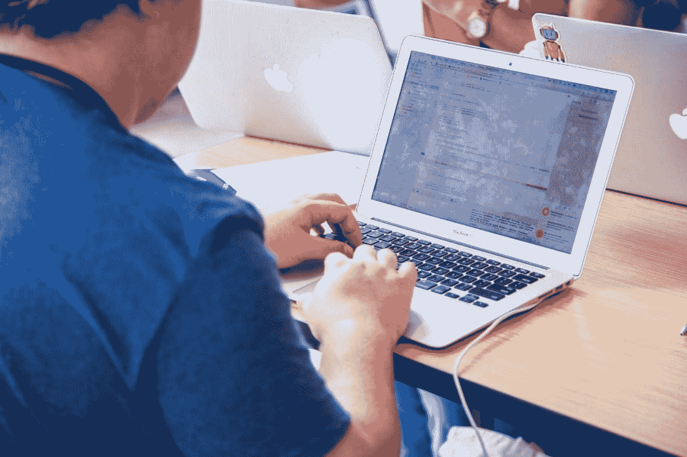

# 从黑客马拉松中获得最大收益的 5 种方法

> 原文：<https://medium.com/capital-one-tech/5-ways-to-get-the-most-out-of-a-hackathon-8b6c27c16eb5?source=collection_archive---------0----------------------->

运行学生黑客马拉松的经验教训

在[职业黑客联盟](https://mlh.io/)——正式的学生黑客马拉松联盟——我们每年在全球的大学校园里支持数百次黑客马拉松。说我们投资于黑客马拉松可以激发创新、培养社区和教授技术技能的方式是一种保守的说法。事实上，我们非常确定[黑客马拉松是神奇的](https://schedule.sxsw.com/2018/events/PP80740)。

一路上，我们学到了很多关于如何从参加黑客马拉松中获得最大收益的知识。今天，我将分享我的五大专业建议，告诉你如何充分利用这段经历，即使这是你的第一次！

## 1.不要想太多

承诺整个周末和陌生人一起做一个假想的项目听起来令人生畏。但是黑客马拉松旨在迫使你站着思考，伸展你的创造性肌肉——无论是在社交上还是技术上。当你有一段明确的时间来开发一个原型时，你会很快学会如何协作、区分优先次序和改进一个项目，直到它以一种易于理解的方式传达了你的核心思想。如果事情没有按计划进行，不要有压力。你仍然会遇到一些有趣的人，学到一些新东西，从而结束你的周末。

## 2.为演示而设计

当你构建一个黑客马拉松项目时，我建议从你的理想演示开始逆向工作。在别人打开你的应用的前 30 秒内，最重要的概念和功能是什么？

从这个角度思考这个问题有助于你和你的团队确定在一个紧凑的时间框架内你能完成什么。如果你的用户登录系统不是你的应用程序解决的独特问题的核心，它可能不值得你花时间去包含它。专注于你开发的特定技术和它解决的问题，想想一个完全陌生的人会如何发现它。

## 3.关注人

我最有意义的黑客马拉松经历围绕着我遇到的人，而不是我们建立的东西。我们经常从成千上万参加我们活动的开发人员那里听到，他们遇到的人定义了他们的体验，并让他们继续回来。你的队友可以变成未来的同事、合作者和朋友。当你必须在有限的时间和地点内一起解决问题时，你会很快了解一个人。

黑客马拉松是最终的破冰船！

## 4.照顾好你自己

黑客马拉松可能被定型为通宵垃圾食品节，但它们不应该是这样。如果你一路照顾好自己，你会有一个更快乐、更有成效的经历。

每个人的需求都是不同的，没有哪种特定的自我保健方式会对你的黑客马拉松体验造成损害。所以，尽你所能让你的黑客马拉松成为一次有趣和快乐的经历，无论这意味着回家睡觉还是休息一下呼吸点空气和吃点沙拉。

## 5.建造一些令人敬畏的东西

黑客马拉松应该是令人愉快和有趣的。当你头脑风暴项目想法时，试着想想什么会让你说“哇！”如果你看到别人演示。不要担心商业生存能力，不要担心你是否有建立类似东西的经验。这是一个绝佳的机会，让你走出自己的技术舒适区，做一些让你印象深刻和愉快的事情。解决问题和构建应用程序的过程与最终结果一样重要。一些最有创造力和创造力的黑客是“自动的”——这意味着他们的工作就是它自己的目的。

有了这五个技巧，你就可以在下一次的黑客马拉松中创造一些伟大的东西了！所以，找一些新朋友，发挥你的创造力，走出你的技术舒适区。

**今年要去 SXSW？和 Jason Valentino 和林雪伦一起来参加我的小组讨论为什么学生黑客马拉松会有******。2018 年 3 月 12 日，下午 2 点，安东尼的首都一号屋。****

***披露声明:这些观点是作者的观点。Capital One 是美国黑客大联盟的赞助商。使用或展示的所有商标和其他知识产权都是其各自所有者的所有权。本文为 2018 首都一。***