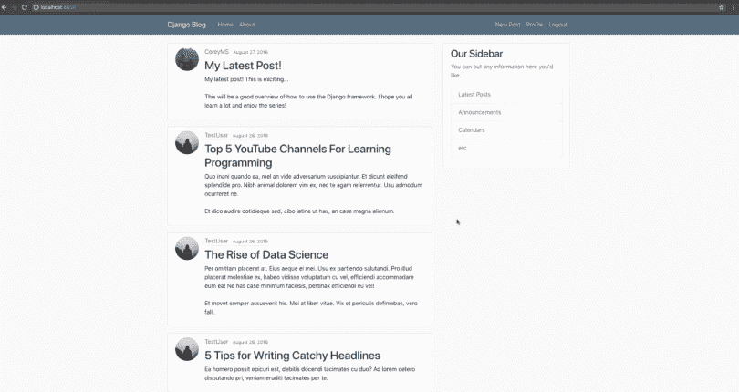
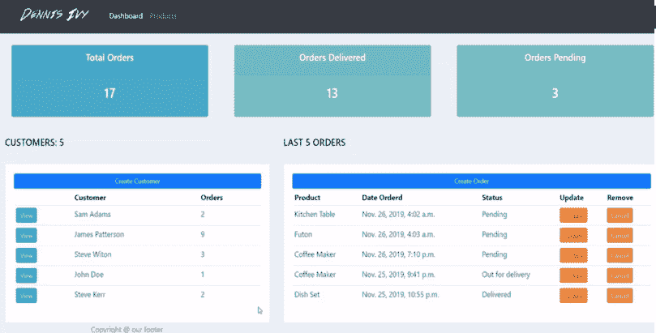
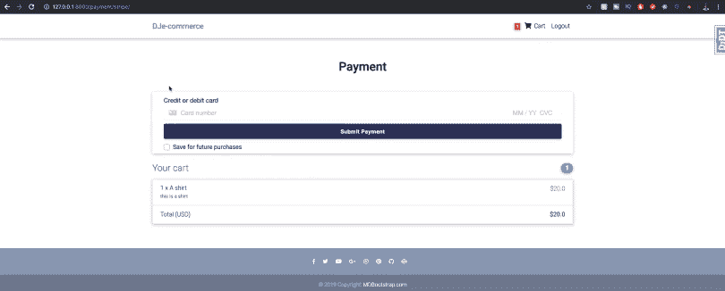
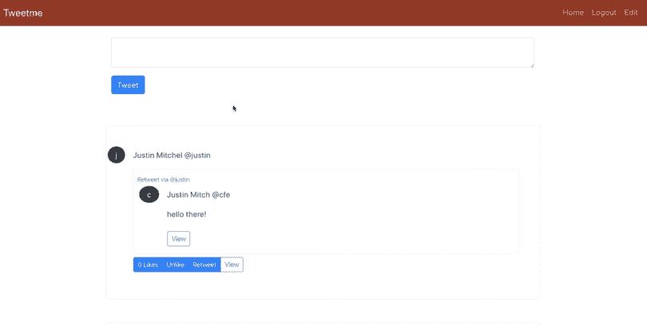
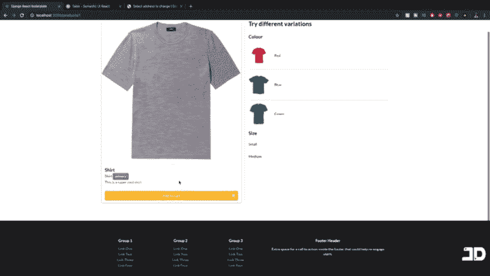
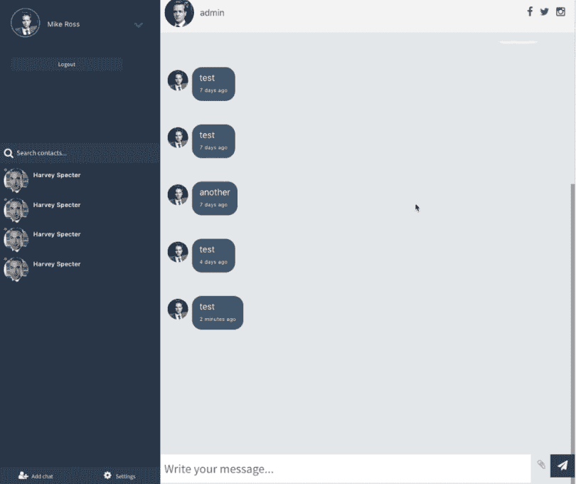

# 面向初学者的 6 + 1 免费 Django 教程——让我们了解一下

> 原文：<https://medium.com/quick-code/6-1-free-django-tutorials-for-beginners-lets-learn-about-8d9f50cce19b?source=collection_archive---------0----------------------->

你刚刚看完 [Django 民调教程](https://docs.djangoproject.com/en/3.0/intro/tutorial01/)，不知道你的下一步应该是什么？或者你正在寻找灵感来提高你最近获得的 Django 技能？

不要担心，我已经列出了我在学习期间发现的最好的 Django 教程。他们在这里:

# 科里·斯查费的博客

是的，我们知道有很多专注于博客的 Django 教程。但是这个很专业。部署、AWS、启用 SSL 认证、用户管理等。

从这里开始:

# 客户管理应用，由[丹尼斯·艾维](https://www.youtube.com/channel/UCTZRcDjjkVajGL6wd76UnGg)

从头开始构建客户管理应用程序。管理客户信息、订单、多参数过滤、认证、密码重置、角色权限等。相当整洁。

# 与 Django 和 Stripe 合作的电子商务网站，由 [JustDjango](https://www.youtube.com/channel/UCRM1gWNTDx0SHIqUJygD-kQ)

有了 Django，我们可以做一些既酷又有利可图的事情。查看本教程，了解如何使用 Django 创建一个电子商务网站，使用 Stripe 作为支付平台。

退款、折扣代码、创建和删除项目。一切！

# 类似 Twitter 的应用程序 Django 和 React，由 CodingEntrepreneurs

如果只是使用 Django(甚至 Bootstrap！)感觉有点短或笨重，你可以提升一个档次，将 Django 和 React 合并，创建一个很棒的类似 Twitter 的应用程序。

# Django 和 React 的电子商务网站，由 [JustDjango](https://www.youtube.com/channel/UCRM1gWNTDx0SHIqUJygD-kQ)

对以前的电子商务网站的改进，现在也使用 React。

# Django 聊天应用程序，由 [JustDjango](https://www.youtube.com/channel/UCRM1gWNTDx0SHIqUJygD-kQ)

这个更高级一点。这里，我们使用 Django 通道为您的 Django 项目提供 WebSockets 来实时更新我们的网站。

看到这些项目，你是否感到兴奋，但你不知道姜戈，想开始？对于初学者，我有一个(几乎)4 小时的速成课程，所以你现在就可以开始:

[我的 Youtube 教程视频](https://www.youtube.com/channel/UC9OLm6YFRzr4yjlw4xNWYvg?sub_confirmation=1)

[在 Twitter 上联系我](https://twitter.com/DavidMM1707)

联系我:DavidMM1707@gmail.com

*原载于 2020 年 7 月 6 日*[*【https://letslearnabout.net】*](https://t.co/WlV5tPieWX?amp=1)*。*