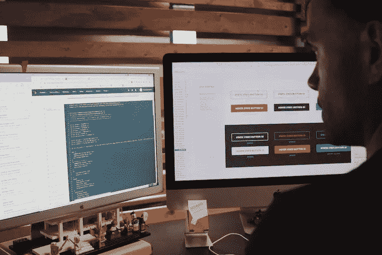
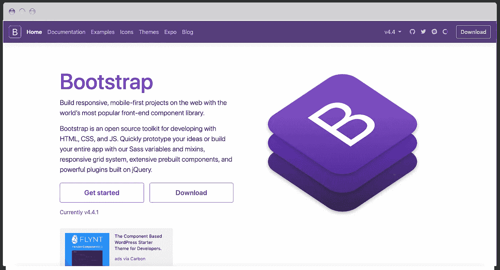
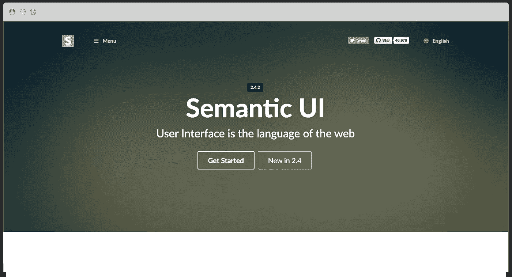
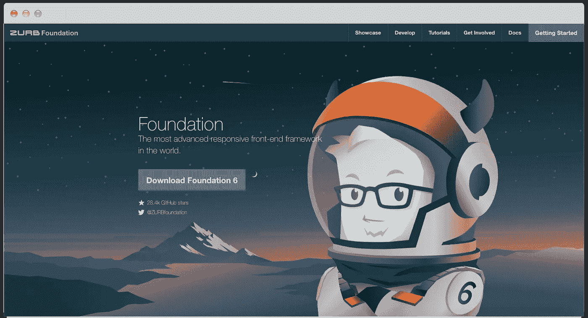
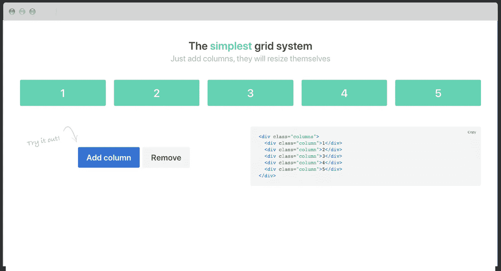
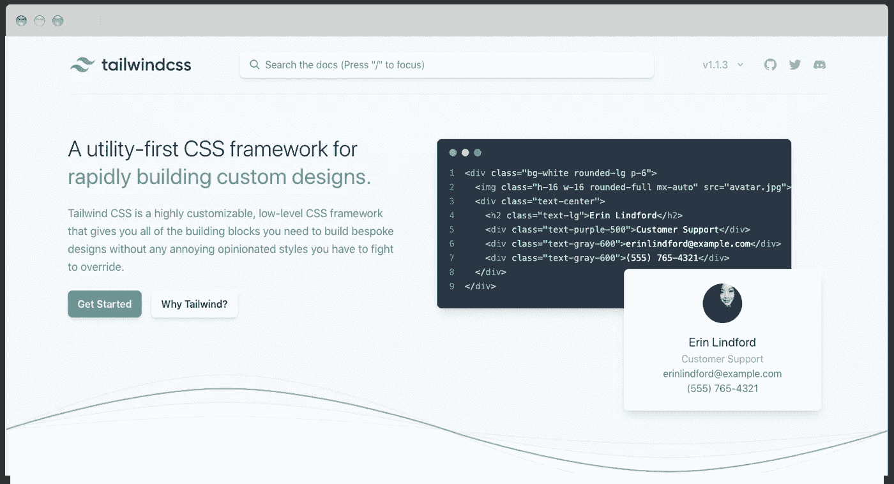
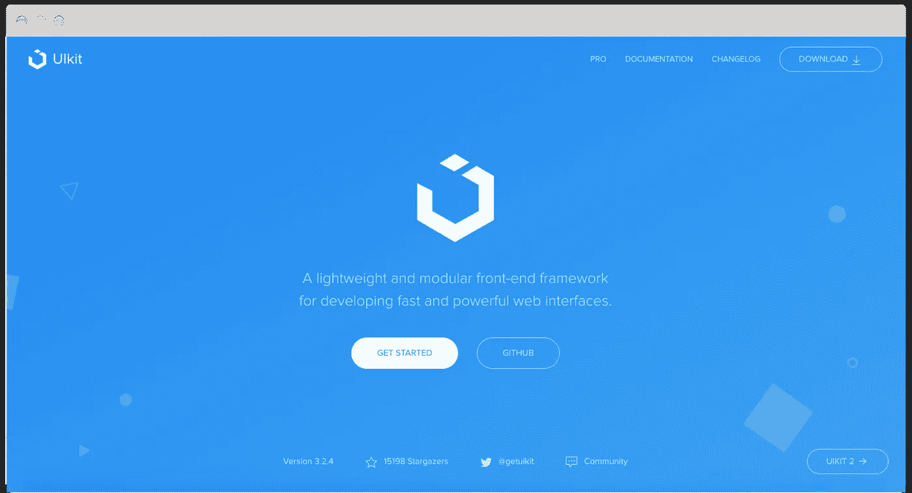

# 6 个牛逼的 CSS 框架，作为前端开发者应该知道的

> 原文：<https://medium.com/duomly-blockchain-online-courses/6-awesome-css-frameworks-which-you-should-know-as-a-front-end-developer-d7718c417400?source=collection_archive---------0----------------------->

[Duomly — Programming Online Courses](https://www.duomly.com)

这篇文章最初发表在 [CSS 框架](https://www.blog.duomly.com/css-frameworks/)

作为一名前端程序员，我经常谈论前端框架，但是我经常忘记 CSS 框架有多重要，以及它们可以节省多少时间。

当构建 UI 时，我们需要一个一致且有效的 CSS，这可能是一个很难实现的挑战。这就是为什么许多前端开发人员在流行的 CSS 框架(如 Bootstrap)中寻找解决方案的原因。

CSS 框架允许我们构建一个漂亮的前端，除了漂亮的颜色和表格，大多数还附带了响应式设计，这使我们的工作更加舒适，因为我们不必为移动版本创建另一个 CSS 代码，一切都已经存在了。

在选择适合特定项目的 CSS 框架时，我们必须考虑以下几个方面:

*   **性能**，因为没人想得到一个慢的应用，
*   **易用性**，因为其他开发者使用它应该不会有问题，
*   **图标**，因为我们想避免仅仅为了图标而使用另一个库，
*   **组件** **和特性**，我们希望框架为尽可能多的布局元素提供解决方案，
*   **Sass 或更少**，因为我们可能要使用其中一个，
*   **响应性**，因为我们要避免编写额外的代码，
*   **设计**，因为长得好看就好。

在这篇文章中，我想让这个选择变得简单一点，这就是为什么我要浏览六个 CSS 框架，已知的和不太为人所知的，并介绍它们的优缺点。

本文的 Youtube 版本可从以下网址获得:

# 1.引导程序

Bootstrap

Bootstrap 是开发人员中最流行的 CSS 框架之一；它是由 Twitter 创建的。Bootstrap 是第一个开始推广移动优先理念的人。今天，为了实现网站或应用程序的移动视图，你必须添加某些引导类，仅此而已。

Bootstrap 框架的一大优势，也可能是成功和受欢迎的重要因素之一，是易于使用和学习。Bootstrap 对初学者非常友好；每一个组件和特性都是以一种清晰易懂的方式创建的，即使是对各个层次的开发人员来说也是如此。

这可能源于 Bootstrap 拥有的大量文档。有了代码示例、描述和效果的可视化表示，一切都很简单。

有很多资源可以学习 Bootstrap，甚至是使用这个框架构建项目的整个过程。此外，有许多现成的布局示例，您可以随时查看。关于 Bootstrap，值得一提的另一点是，自 2011 年推出以来，它仍然得到支持和更新。不久前，新的 4.0 版本发布了诸如 flexbox、Sass 和 Less 支持之类的改进，或者新的响应类。

有时如果我们使用太多的类，会变得混乱和复杂。还有，我们可能会有一种感觉，很多基于 Bootstrap 的网站，没有任何视觉上的改变，看起来都是一样的，很难让它与众不同。

有了大量的利弊，Bootstrap 可能会被认为是寻找一个稳定的 CSS 框架的最佳选择之一。

# 2.语义用户界面

Semantic UI

在其他 CSS 框架中，语义 UI 是另一个竞争者。它随着他们独特的方法而成长，专注于对人类友好的 HTML，这正是我在使用语义 UI 时得到的感觉。

对人友好的 HTML 方法使得语义 UI 成为一个简单易学的框架，即使对于初学者也很容易理解。当使用语义 UI 时，图像有一个简单的“ui image”类，如果你想改变尺寸，没什么复杂的。添加一个“小”类就足够了。

可用组件的设计和数量使语义 UI 成为其他框架的有力竞争者。这个设计允许我们不用做太多的改动就能构建一个漂亮的 UI 或网站，但这仍然不是一个出色的效果。

语义 UI 也支持响应式设计，这让它变得很好。此外，文档非常详细，易于理解。虽然关于使用语义 UI 的课程不是很多，但我觉得没必要。

语义 UI 易于使用，并且包含丰富的不同组件，是在选择 CSS 框架时要考虑的另一个好的解决方案。

# 3.基础

Foundation

提到 Bootstrap，不说一个关于 Foundation 的字将是一个严重的错误。基金会框架的网站称它是“世界上最先进的响应前端框架”。为了实现这个座右铭，Foundation 提供了响应性、可访问性、移动优先的方法，并且它还是可读和可定制的。

创建者称自己为更专业的框架，他们决定提供关于基础使用的课程和教程，这对用户来说是一笔大交易。还有就是有可能拿到认证。

基础框架的文档非常好，所以没有人会迷失其中。
更牛逼的是，Foundation 分别准备了创建邮件模板和网站的文档。

Foundation 是一个庞大的工具集，允许我们解决许多 UI 任务，并且它还针对电子邮件和应用程序进行了优化。开发者真正能体会到的是，基础是 CLI 自带的，所以很容易和模块捆绑器一起使用。

这个设计也非常好，允许我们创建一个非常好看的用户界面。

对于初级开发人员来说，基础可能有点让人不知所措；它提供了定制和控制框架的强大可能性。

我个人认为，如果你知道你想要达到的目标，基础是一个很好的框架，你需要一个合适的工具。

# 4.布尔玛

Bulma

布尔玛是一个相当新的开源 CSS 框架，它与上面提到的那些框架的不同之处在于它是纯粹的 CSS。布尔玛根本不需要使用 Javascript。

随着 Bootstrap 第四版的开发，布尔玛越来越受欢迎，程序员们也开始喜欢它。也许是因为简单，也许是因为它非常优雅，给人非常美丽的结果。它在短时间内变得比粉底更受欢迎。

布尔玛关心的要点是响应性，布尔玛在这方面并不比其他框架差，它也遵循移动优先的规则。

布尔玛的另一个伟大之处是它的模块化，允许我们只进口必要的零件，节省一些空间。

作为 Bootstrap，布尔玛基于 flexbox，构建网格是我见过的最简单的方法之一。真的！

布尔玛得到了一个规模虽小但非常热情的社区的支持，这让我认为这个框架将会发展得更好。

# 5.顺风 CSS

Tailwindcss

Tailwind CSS 与其他框架略有不同，因为它不太关注交付即用组件，而是更多地关注实用程序类，帮助开发人员构建他们需要的东西。这更像是为组件提供现成的构建模块。

当我们添加太多的类时，有时看起来可能很难看，但是目标已经达到了。虽然这不是 Tailwind CSS 框架的主要目标，但是这些元素有着非常漂亮的设计。

此外，像所有提出的 CSS 框架一样，Tailwind CSS 是完全响应的。

在我看来，这是一个很好的框架，适合那些不想有强加的设计，喜欢有广泛的定制可能性的开发人员。虽然这是一个不太为人所知的框架，但它有很大的发展潜力。

# 6.UIkit

UIkit

我列表中的最后一个 CSS 框架是 UIkit。该框架的网站上说它是一个轻量级和模块化的框架，而且更深入一点，我能够看到一个干净和现代的设计，这使该框架成为一个坚实的竞争对手。

当然，除了它的设计之外，这个框架的最大优势是它有各种各样的组件，这可以帮助我们构建更高级的 ui。

此外，和列表中的其他框架一样，它也是完全响应的，并且包含了一组可以在我们的 ui 中使用的图标。除此之外，它还支持 Less 和 Sass。

框架的文档很短，但是它简单明了地给出了所有需要的信息，所以即使初学者也可以使用这个框架。

我个人非常喜欢干净、现代和宽敞的设计，我肯定会在我未来的任何项目中尝试这个框架。

# 结论

有许多不同的 CSS 框架，但在大多数情况下，它们以不同的方式和不同的设计为我们提供相似的功能。作为一名开发人员，在选择框架时，我们必须考虑更多的因素，而不仅仅是视觉方面。尽管如此，我相信每个人都能为特定的项目找到合适的解决方案。

写这篇文章的时候，我发现了一些以前不知道的框架，迫不及待的想尝试一下。他们中的一些人用简单吸引了我，他们中的一些人展示了如此可爱的设计，这真的让我想尝试一下。

我希望您在为下一个项目选择 CSS 框架时会发现这个清单很有用。如果我没有提到吸引你眼球的东西，请在评论中告诉我们，并与我们分享你对你喜欢并经常使用的 CSS 框架的看法。

感谢您的阅读，

Duomly 的安娜

[Duomly — Programming Online Courses](https://www.duomly.com)