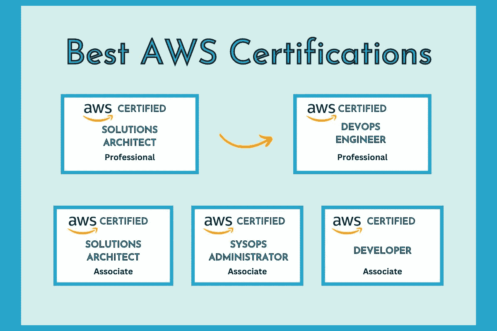

# 6 个最佳 AWS 初学者和专家认证[2022 年 10 月]

> 原文：<https://medium.com/quick-code/6-best-aws-certifications-for-beginners-experts-32231028f38f?source=collection_archive---------0----------------------->

## 根据您的技能、经验和职业目标，以下是我最喜欢的为您的 AWS 云认证做准备的资源。

近年来，AWS 认证考试受到了极大的关注。亚马逊认证受到高度尊重，直接来自亚马逊。此外，这些是基于角色的认证，因此您可以获得开发人员、开发人员、系统管理员、软件架构师、数据库管理员、安全专家、网络专家、大数据和数据分析师证书。你可以根据你的技能和经验来决定你想要哪一个。

学习 AWS 对开发者来说是必不可少的，因为亚马逊的网络服务占据了网络托管 5.8%的市场份额。AWS 开发者需求量很大。因此，我创建了这些最受欢迎的 AWS 认证课程来学习如何准备 AWS 认证。

除非你想成为 AWS 英雄，否则你不必通过所有这些 AWS 认证。你应该选择一个最适合你的个人资料，职业抱负和经验。所以，事不宜迟，让我们继续关注你在 2022 年可以瞄准的顶级 AWS 和云认证。

## 1.[终极 AWS 认证解决方案架构师助理 SAA-C03](https://click.linksynergy.com/deeplink?id=0F1O0otUXQc&mid=47901&u1=csMedium&murl=https%3A%2F%2Fwww.udemy.com%2Fcourse%2Faws-certified-solutions-architect-associate-saa-c03%2F)

其中最具挑战性的认证考试是 AWS 认证解决方案架构师助理 SAA-C03。该认证有助于评估你对亚马逊网络服务的理解程度。此外，它帮助您在不同的情况下做出最佳的架构决策，因此拥有并传递它是非常有价值的。

在此 AWS 认证解决方案架构师助理认证中，您将:

*   SAA-C03[更新]:通过 AWS 认证解决方案架构师助理认证。
*   在 AWS 上执行真实世界的解决方案架构。
*   了解 AWS 基础知识(EC2、ELB、ASG、RDS、ElastiCache、S3。
*   学习无服务器基础知识(Lambda、DynamoDB、Cognito、API Gateway)。
*   分析 10 多种解决方案架构(传统和无服务器)。
*   了解架构良好的框架，灾难恢复。
*   掌握 AWS 上所有数据库的差异。
*   使用 KMS、IAM 策略和 SSM 保护您的整个 AWS 云。

这是一门面向初学者的优秀课程，将极大地帮助您学习和理解 AWS 解决方案架构师助理的内容。本课程包括开发人员和系统操作员的内容。此外，课程材料将对你有益。

本课程包含超过 27.1 小时的精彩内容，课程评分为 4.7 分(满分为 5 分)，是学习云计算和通过 AWS 认证解决方案架构师助理认证 SAA-C03 的绝佳课程。它包括一份结业证书。

## 2. [AWS 认证 DevOps 工程师专业 202](https://click.linksynergy.com/deeplink?id=0F1O0otUXQc&mid=47901&u1=csMedium&murl=https%3A%2F%2Fwww.udemy.com%2Fcourse%2Faws-certified-devops-engineer-professional-hands-on%2F) 2

本课程为您提供实践经验，帮助您理解、分析和解决 AWS 认证 DevOps 工程师专业考试中的问题。因此，它不会涵盖基础知识，并通过你已经知道的概念快速移动。

在此 AWS DevOps 认证中，您将:

*   通过 AWS 认证 DevOps 工程师专业认证(DOP-C01)。
*   在所有不同的 AWS 服务之间创建自动化。
*   学习通过考试所需的经验。
*   执行将教你现实世界技能的操作。
*   [边做边学 AWS 上的 DevOps](https://coursesity.com/blog/best-aws-devops-enginner-tutorials/) 。

本课程将为您准备 AWS 认证 DevOps 工程师专业考试和现实世界。它涵盖了 AWS 认证 DevOps 工程师专业考试 DOP-C01 的所有全新主题。此外，您将学习如何作为开发人员从里到外使用 AWS。

这是 DevOps 工程师通过 AWS 认证 DevOps 工程师专业认证(DOP-C01)的最佳 AWS 云认证，内容超过 20.5 小时，课程评分为 4.7 分(满分为 5 分)。它包括一份结业证书。

## 3.【2022 年终极 AWS 认证开发人员助理

AWS 认证开发人员助理认证也是最具挑战性的考试之一。因此，拥有并通过该认证是非常有价值的，因为它会评估您对 AWS 和新云模式(如无服务器)的理解。

在此 AWS 开发人员助理认证中，您将:

*   通过 AWS 认证开发人员助理认证(DVA-C01)
*   为您未来的实际 AWS 项目应用正确的 AWS 服务。
*   使用完全自动化的弹性 Beanstalk 和 AWS CICD 工具部署应用程序。
*   使用 AWS Lambda、API Gateway、DynamoDB & Cognito 了解无服务器 API。
*   使用 AWS CloudFormation 将基础架构编写为代码。
*   使用 AWS SQS、SNS 和 Kinesis 实现消息传递和集成模式。
*   掌握 EC2 中的 CLI、SDK 和 IAM 安全最佳实践。
*   使用 CloudWatch、X-Ray 和 CloudTrail 监控、跟踪和审计您的微服务。
*   使用 KMS、加密 SDK、IAM 策略和 SSM 保护您的整个 AWS 云。

本课程深入涵盖了 AWS 认证开发人员助理 DVA-C01 考试的所有全新主题。作为一名开发人员，这里有很多关于使用 AWS 的实用信息。此外，它将帮助您准备 AWS 考试和现实世界。

该课程包含超过 32 小时的精彩内容，课程评分为 4.7 分(满分为 5 分)，是通过 AWS 认证开发者认证 DVA-C01 的优秀 AWS 认证。它包括一份结业证书。

## 4. [AWS 认证解决方案架构师助理培训 SAA-C03](https://click.linksynergy.com/deeplink?id=0F1O0otUXQc&mid=47901&u1=csMedium&murl=https%3A%2F%2Fwww.udemy.com%2Fcourse%2Faws-certified-solutions-architect-associate-hands-on%2F)

本课程将帮助您通过 SAA-C03 版本的 AWS 认证解决方案架构师助理考试。它涵盖了最新的 SAA-C03 考试主题，并包括使用新的 AWS 管理控制台的最新实践技术。

在此 AWS 认证解决方案架构师助理认证中，您将:

*   了解如何在 Amazon Web Services 上设计和构建应用程序。
*   通过这一计时计分的模拟考试，熟悉真正的 AWS 考试形式、风格和难度。
*   用测验问题来检查你的知识，测试你的理解和衡量你的进步。
*   了解您需要知道的一切，以便通过考试并掌握现实世界中的云。

AWS 培训涵盖了通过 AWS 认证系统管理员助理和 AWS 认证开发人员助理考试所需的 70%的材料。学完本课程后，您还将为 AWS 认证解决方案架构师专业考试做好 60%的准备。

这是一项针对 AWS 认证解决方案架构师助理的优秀 AWS 认证，包含超过 24 小时的精彩内容，课程评分为 4.7 分(满分为 5 分)。它包括一份结业证书。

## 5.【2022 年终极 AWS 认证 SysOps 管理员助理

这是获得 AWS 认证系统管理员助理认证最具挑战性的考试之一。该认证有助于评估您对 AWS 的理解，并对其进行管理和故障排除，从而使获得和通过该认证变得非常有价值。

在此 AWS SysOps 管理员助理认证中，您将:

*   为您未来的实际 AWS 项目应用正确的 AWS 服务。
*   从系统运营的角度来看，你所知道的主要话题有:EC2、ELB、ASG、RDS 等等。
*   使用 Systems Manager 执行自动化和修补。
*   弹性豆茎和云形成疑难解答。
*   使用 EBS 和 EFS 以最佳性能正确存储数据。
*   S3 大师及其生态系统:冰川，雪球，存储网关，云锋。
*   实施监控、安全性、合规性和 AWS 帐户管理。
*   AWS 中的主网络:53 号公路和深入 VPC。

本课程教导学生如何准备 AWS 认证系统管理员助理考试，并在现实世界中应用。它详细涵盖了 AWS 认证系统管理员助理 SOA-C02 考试中的所有主题。此外，您将学习如何作为系统操作专家使用 AWS。

本课程包含超过 25 小时的精彩内容，课程评分为 4.7 分(满分为 5 分)，是初学者和专家通过 AWS 认证 SysOps 管理员助理 SOA-C02 考试的绝佳课程。它包括一份结业证书。

## 6.【2022 年终极 AWS 认证云从业者

就 AWS 认证而言，AWS 认证云从业者认证是一项值得参加的入门级计划。该认证有助于确定您对 AWS 及其服务和生态系统的了解程度。此外，这一 AWS 认证云从业者课程为您提供了大量学以致用的机会。

在此 AWS 云认证中，您将:

*   CLF-C01:通过 AWS 认证云从业者认证。
*   了解 AWS 基础知识(EC2、ELB、ASG、RDS、ElastiCache、S3)。

在本课程中，您将学习 AWS 认证云从业人员考试 CLF-C01 的所有新主题。通过这本书，你将从里到外学习如何使用 AWS。该课程还教你如何准备 AWS 认证考试。

本课程包含超过 14.5 小时的精彩内容，课程评分为 4.7 分(满分为 5 分)，是初学者学习云计算并通过 AWS 云从业者 CLF-C01 考试的绝佳课程。它包括一份结业证书。

> 感谢您阅读这篇关于最佳 AWS 认证的文章。以下是一些你可能会觉得有用的帖子:

 [## 学习围棋编程的 10 个最佳 Golang 教程

### 各位开发者好！您对最佳 Golang 球场的搜索到此结束。下面的文章将向你展示一些…

medium.com](/quick-code/10-best-golang-tutorials-to-learn-go-programming-46fbd4b81d2c)  [## 五大热门 Web3 开发技能

### 遵循这五个技巧来学习如何成为一名 Web3 开发者

medium.com](/geekculture/5-web3-developer-skills-you-should-learn-a210b9f30604)  [## 2022 年的 5 种基本网络开发工具

### 随着 web 开发每年的发展，它变得越来越有创新性。五年或十年前，似乎不可能…

medium.com](/quick-code/5-essential-web-development-tools-in-2022-7cda5c23dd9e)  [## 10 门免费 Django 课程，学习 Python 中的 Django

### 众所周知，Python 是当今最流行的编程语言之一，Django 使 web 开发…

medium.com](/quick-code/10-free-django-courses-for-beginners-to-learn-django-ce2d598957a)