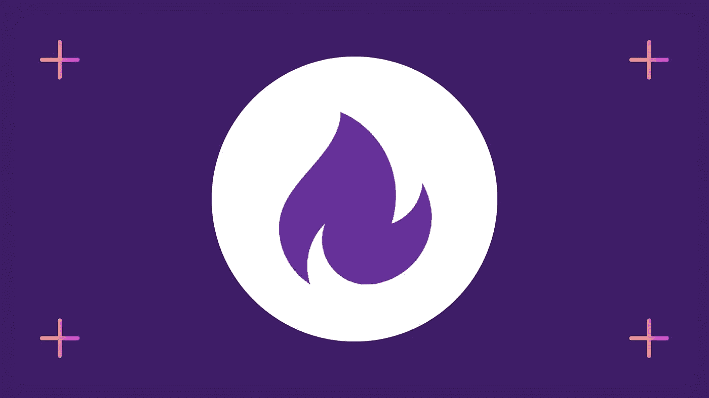
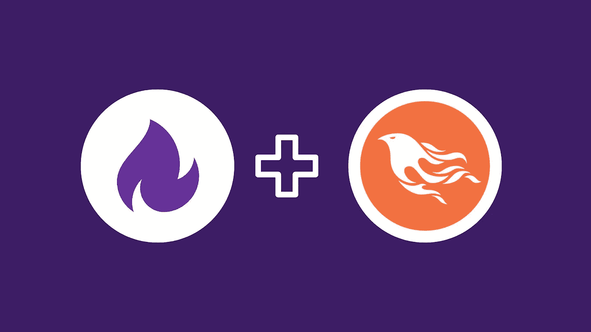

# 6 个最适合初学者的灵丹妙药课程——在线学习灵丹妙药

> 原文：<https://medium.com/quick-code/6-best-elixir-courses-for-beginners-learn-elixir-online-f966872ef7da?source=collection_archive---------2----------------------->

Learn Elixir

熟悉 JavaScript、Erlang、Python、Golang 和 C++的人可能已经听说过 Elixir。由于各种原因，包括其“有趣的语言”的声誉，Elixir 编程在程序员中变得流行起来。它类似于 Erlang 和 Ruby，因为它们都有清晰的语法和灵活性。尽管存在差异，但它们都易于学习、高度可伸缩且可读性强。

Ruby 开发人员和 Rails 核心团队成员 José Valim 在 2011 年引入了 Elixir，作为一种低延迟、高并发的编程语言。自从酏剂发布以来，对酏剂开发者的需求急剧增加。基于 Elixir 的应用程序的一个例子是需要承受高流量负载的消息应用程序和网络站点。

因此，我根据评级、评论和质量创建了这个最佳灵丹妙药课程列表。希望这个课程策展对你学习仙丹有所帮助。所以，事不宜迟，我们开始吧。

还有，我已经为 [Golang](/quick-code/10-best-golang-tutorials-to-learn-go-programming-46fbd4b81d2c) 、 [React](/quick-code/10-best-react-courses-to-learn-reactjs-online-36dd0e3d3b68) 和 [Spring](/quick-code/10-best-spring-courses-to-learn-spring-framework-6edfb92d40bc) 报道了最佳课程策划。换句话说，如果你对学习这些编程语言或框架感兴趣，我可以帮你搞定。现在，让我们来看看最好的灵丹妙药。

## 1.完整的仙丹和凤凰训练营

Elixir and Phoenix Bootcamp

这里有一个灵丹妙药的课程，适合那些对灵丹妙药还是一窍不通的人，或者在学了一段时间后仍然感觉不太懂的人。在本课程中，您将学习如何快速使用 Elixir 和 Phoenix，并使用您需要的核心知识开发速度惊人的 web 应用程序。

在本课程中，您将学习以下内容:

*   用函数式编程的思维方式思考
*   使用 Phoenix 构建引人注目的快速 web 应用程序
*   了解常用的 Elixir 语法和设计模式
*   用 Phoenix 掌握 OAuth 流进行认证
*   了解凤凰城隐藏的秘密

首先，您将学习 Elixir 中函数式编程的基础，包括函数、模块和管道操作符。除了学习 FP 和传统的面向对象编程有什么不同，你还能找到 FP 有什么不同的实际例子。

当您学习 Elixir 时，我们将构建一个深入的应用程序来演示 Phoenix Framework 如何构建速度惊人的应用程序。在整个课程中，你可以随时获得每堂课的源代码。

这是乌德米岛顶级的长生不老药课程。这个完整的酏剂和凤凰城训练营的课程评分为 5.0 分中的 4.4 分，持续时间为 17 小时 21 分钟。您也将在完成后获得认证。

## 2.[仙丹入门](https://linkedin-learning.pxf.io/c/1137078/646189/8005?u=https%3A%2F%2Fwww.linkedin.com%2Flearning%2Fintroduction-to-elixir%3Ftrk%3Dlearning-serp_learning-search-card_search-card&subId1=csMedium) —【领英学习】

有几家公司已经采用了酏作为一种高度可扩展、高性能和容错的函数式编程语言。作为本课程的一部分，您将学习如何使用经验丰富的软件工程师李泽雅教授的函数式编程基础来编写酏剂代码。

此长生不老药课程包括:

*   函数编程与长生不老药
*   满足长生不老药数据类型
*   数据法案
*   模式匹配的力量
*   管理数据收集
*   在酏剂中迭代
*   如果不是循环，那是什么？
*   没有函数，您就不能正常工作
*   处理递归
*   混合

此外，她还介绍了数据类型、变量和函数，并介绍了函数式编程的特定主题，如不变性、递归、参与者模型和模式匹配，以及实际的挑战和练习。完成本课程后，您将了解如何编写酏剂应用程序以及在何处查找更深入的信息。

这是领英学习上的顶级长生不老药课程。本课程的评分为 4.6 分(满分为 5.0 分)，时长 3 小时 4 分钟。您也将在完成后获得认证。

## 3.[初学仙丹](https://click.linksynergy.com/deeplink?id=0F1O0otUXQc&mid=47901&u1=csMedium&murl=https%3A%2F%2Fwww.udemy.com%2Fcourse%2Felixir-for-beginners%2F) —【乌德美】

这是一个介绍酏编程初学者。本课程包括读取和写入酏剂代码、递归、数据不变性和模式匹配。参加本课程的结果是，您将具备在功能语言知识基础上再接再厉的知识和信心。

在本课程中，您将学习以下内容:

*   了解如何读写酏剂代码。
*   理解函数式编程、不可变数据、模式匹配和递归的关键原则。
*   创建您自己的长生不老药计划。
*   构建酏剂计划时，请使用适当的工具。
*   在酏剂中自信地思考，并对最重要的语言原语有详细的了解。

有一些编程经验的学生如果想学习一门函数语言，可以从这门课程中受益。本课程将向您介绍所有酏剂基础知识，并帮助您掌握函数式编程背后的概念。

这是一个很好的酏剂课程为初学者在乌代米。本课程的评分为 4.3 分(满分为 5.0 分)，时长 2 小时 37 分钟。您也将在完成后获得认证。

## 4.用仙丹学习函数式编程——【教育性】

Elixir 是一种运行在 Erlang 虚拟机上的函数式编程语言，Erlang 虚拟机是运行分布式应用程序的强大平台。尽管它有现代的语法和活跃的社区，但 Elixir 是一种有趣且非常适合本课程的语言。当您学习函数式编程时，Elixir 语法让您关注最重要的事情。

在本课程中，您将学习以下内容:

*   如何用函数创建条件代码？
*   学习仙丹中的高阶函数。
*   如何使用 Elixir 建模数据、创建契约和实现多态性。
*   了解如何在 Elixir 中制作应用程序。

当您开始学习 Elixir 时，您将学习表达式、模块、条件语句和递归。课程的最后部分集中在更高级的材料上，例如高阶函数、不纯函数和使用 Elixir 的应用程序设计。因此，您将能够编写基本的函数式 Elixir 程序。

这是学习函数式编程最好的灵丹妙药之一。本课程时长为 11 小时 10 分钟。完成后，您还将获得一份证书。

## 5.[遇见仙丹](https://pluralsight.pxf.io/c/1137078/424552/7490?u=https%3A%2F%2Fwww.pluralsight.com%2Fcourses%2Fmeet-elixir&subId1=csMedium)——【幻视】

作为构建在工业级 Erlang VM 上的结果，Elixir 结合了 Ruby 和 Python 的最佳部分。多核、分布式的未来就在眼前，而 Elixir 将会帮助你实现它。

在本课程中，Elixir 创建者 Jose Valim——广受欢迎的 Devise gem 的作者和前 Rails 提交者——将带您了解他的语言，同时创建一个真实的 HTTP 流元数据解析库。

本课程包括:

*   句法
*   投入
*   并发和宏

这是一个很好的入门课程。本课程的评分为 4.2 分(满分为 5.0 分)，持续时间为 2 小时 5 分钟。完成后，您还将获得一份证书。

## 6.[用 Ecto 在 Elixir 中构建数据库应用](https://www.educative.io/courses/building-database-applications-in-elixir-with-ecto?affiliate_id=5088579051061248)——【教育性】

本课程介绍了 Ecto 的功能，并提供了其功能指南。作为第一步，您将学习关系数据库的基础知识，如存储库、查询、模式、变更集和事务。使用这些概念，您将通过解决日益复杂的挑战来构建一个示例应用程序。

在本课程中，您将学习以下内容:

*   学习使用 Ecto 将您的 Elixir 应用程序与关系数据库连接起来。
*   掌握 Ecto 的核心模块。
*   学习通过编写并发测试来加速你的测试套件。
*   学习使用嵌套关联来处理复杂的表关系。
*   学习添加流来轻松处理大型结果集。

之后，您将为您的数据库应用程序构建嵌入式模式，并测试其性能。本课程将帮助您在 Elixir 团队(以及 Ecto 的共同创建者)的实际协助下，使用 Elixir 创建高效的数据库应用程序。

这是一个很好的教育课程，用于在 Elixir 中构建数据库应用程序。本课程持续时间为 60 小时，完成后将颁发证书。

> 感谢您阅读本文。我希望这个课程能帮助你选择正确的课程来学习长生不老药。如果你想探索更多，你可以查看这些文章:

 [## 学习函数式编程的 7 门免费 Scala 课程和教程

### 以下是我在 Udemy、Coursera 和 YouTube 上的顶级免费 Scala 课程和教程，可以帮助你学习…

medium.com](/quick-code/7-free-scala-courses-tutorials-to-learn-functional-programming-db0a4a1579a3)  [## 10 门免费 Django 课程，学习 Python 中的 Django

### 众所周知，Python 是当今最流行的编程语言之一，Django 使 web 开发…

medium.com](/quick-code/10-free-django-courses-for-beginners-to-learn-django-ce2d598957a)  [## 学习 Spring 框架的 10 门最佳 Spring 课程

### 通过最好的 spring 课程学习用于 web 应用程序开发的 Spring 框架。

medium.com](/quick-code/10-best-spring-courses-to-learn-spring-framework-6edfb92d40bc) 

***披露:*** *如果您通过本页面的链接购买课程，我们可能会获得一小笔附属佣金。谢谢你。*