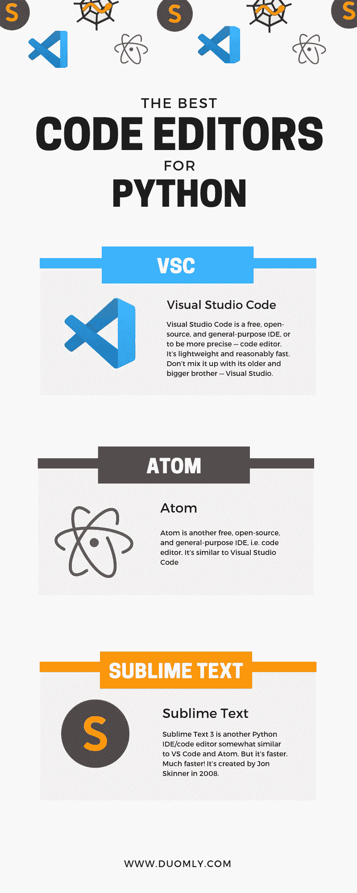
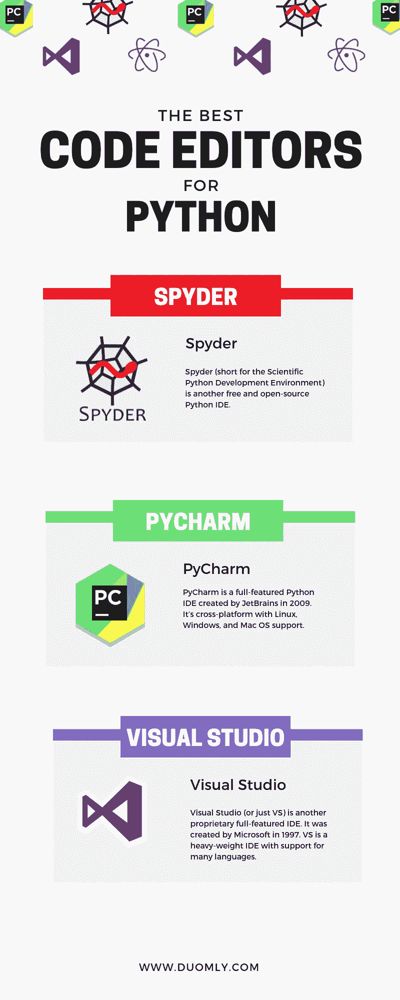

# 机器学习、数据科学和 web 开发的 6 个最佳 Python IDEs

> 原文：<https://medium.com/duomly-blockchain-online-courses/6-best-python-ides-for-machine-learning-data-science-and-web-development-bc0063ef01fe?source=collection_archive---------0----------------------->

[Duomly — programming online courses](https://www.duomly.com)

本文最初发表于:[https://www . blog . duomly . com/the-best-python-code-editors-for-data-science-web-development-and-machine-learning/](https://www.blog.duomly.com/the-best-python-code-editors-for-data-science-web-development-and-machine-learning/)

选择适合您需求的集成开发环境(IDE)通常是一项重要的任务。有许多可用的选项。有许多有趣的 ide，有各种各样的工具可以帮助你更快地编码并避免一些错误。其中一些是免费和开源的。

大多数知名的 ide 都支持 Python，Python 是最流行的编程语言之一。他们通常支持林挺、自动完成，并为每个项目选择 Python 环境。

本文描述了几种广泛使用的 Python IDEs，适用于数据科学、机器学习、web 开发等等。我们将涵盖:

*   Visual Studio 代码
*   原子
*   崇高文本 3
*   Spyder
*   皮查姆
*   可视化工作室

# Visual Studio 代码

**Visual Studio Code** (或 **VS Code** )是一个免费、开源、通用的 IDE，或者更准确地说——代码编辑器。它很轻，速度也相当快。不要把它和它的老兄弟 Visual Studio 混为一谈。VS 代码的主要特征是:

*   VS 代码是微软在 2015 年创建的。
*   VS 代码可用于 Linux、Windows 和 Mac OS。
*   VS Code 是一个通用的 IDE，支持 Python、C/C++、C#、JavaScript、HTML、CSS、Markdown with previews 以及许多其他语言。
*   VS 代码是成熟的，有着广泛而专注的社区。
*   VS 代码集成了终端、源代码控制和调试支持。
*   VS 代码是免费和开源的，即使是用于商业目的。它得到了麻省理工学院的许可。

如果你想在 VS 代码中使用 Python，你可能需要安装微软的 Python 扩展。简单的叫 Python。转到文件/首选项/扩展(或点击左上角的方形图标或只需点击 Ctrl+Shift+X)。键入 python，您将获得可供安装的扩展。

微软的 Python 扩展提供了林挺、自动完成和使用交互式 Python。它甚至可以处理和预览。ipynb 文件。

当然，您可能希望安装与 Markdown、web 开发或 C/C++等相关的其他扩展。

如果您单击文件/首选项/设置(或只按 Ctrl+逗号)，您将能够调整一般环境以及 Python 的设置。您可以通过添加文件夹来自定义特定项目的设置。项目文件夹中的文件 settings.json 的 vscode。

# 原子

**Atom** 是另一个免费、开源、通用的 IDE，即代码编辑器。类似于 Visual Studio 代码。它的一些最重要的特征是:

*   Atom 是 GitHub 在 2014 年创建的。
*   Atom 可用于 Linux、Windows 和 Mac OS。
*   Atom 适合用 Python、C/C++、JavaScript 和许多其他语言进行编程。你也可以用它来制作 HTML，CSS，带预览的 Markdown 等等。
*   Atom 很成熟，有一个广泛而专注的社区。
*   Atom 集成了 GIT 和 GitHub 支持。
*   Atom 是免费和开源的，即使是用于商业目的。它得到了麻省理工学院的许可。

专门的社区已经为 Atom 开发了许多扩展，这可能会使编码成为一种真正的乐趣。如果没有扩展，Atom 不会走得太远。

如果你想用 Python 编码，去 Edit/Preferences(或者按 Ctrl+逗号)选择 Packages。您将看到一些软件包已经默认安装。你可能需要安装一些包，比如 simple-drag-drop-text，highlight-selected，linter，linter-python-pep8，linter-flake8，linter-pylint，autocomplete-python，hydrogen，python-tools，ide-python，platformio-ide-terminal 等等。

对于林挺和 ide-python 的包，您需要单击 settings 并设置 python 可执行路径。对于包 python-tools，您应该设置 python 目录的路径。

与 VS 代码不同，Atom 没有集成终端。然而，platform-ide-terminal 软件包将为您提供在终端中工作的良好体验，如果您使用 Windows 并且本机控制台不是一个好的选择，这将非常有用。

数据科学家最喜欢的原子特性之一是氢。如果您安装了 hydrogen 包，您将获得在。py 文件。

Atom 的主要缺点是速度慢，尤其是启动时。目前，它明显比 VS 代码慢。

# 崇高文本 3

**Sublime Text 3** 是另一个 Python IDE/代码编辑器，有点类似于 VS Code 和 Atom。但是更快。快多了！它是由乔恩·斯金纳在 2008 年创造的。有趣的是它有 Python 应用编程接口(API)。

与 VS Code 和 Atom 类似，Sublime Text 3 是一个支持多种语言的通用编辑器。它可以在 Linux、Windows 和 Mac OS 上使用。它有一个专门的社区，有许多可用的扩展，使您能够进行科学计算、数据科学、web 开发等等。

不幸的是，崇高文本 3 不是开源的。这是专有软件，售价 80 美元。您可以在评估模式下无限制地使用它——使用所有功能，但偶尔也会收到购买通知。一旦你购买了它，你就可以在你所有的设备上使用它。

Sublime Text 3 的另一个缺点是它的设置更加困难。我们不打算在这里解释。但是有许多文章、博客文章和视频涉及到这一点。

[Duomly — programming online courses](https://www.duomly.com)

# Spyder

**Spyder** (简称**科学 Python 开发环境**)是另一个免费开源的 Python IDE。其主要特点是:

*   Spyder 由 Pierre Raybaut 于 2009 年创建。
*   Spyder 可用于 Linux、Windows 和 Mac OS。
*   Spyder 随 Anaconda 一起发布。因此，当您安装 Anaconda 时，您也有 Spyder。
*   Spyder 适用于 Python 中的科学编程，也适用于数据科学和机器学习。事实上，它是实现这一目的的最佳工具之一。对于 web 开发来说并不是一个好的选择。
*   Spyder 成熟了。
*   Spyder 集成了 IPython 控制台、分析器、调试器、文档查看器、变量浏览器等等。
*   Spyder 完全是用 Python 写的。
*   Spyder 是免费和开源的，即使是用于商业目的。它得到了麻省理工学院的许可。

Spyder 相对于其他 Python IDEs 的主要优势是:

*   IPython 控制台使测试小代码部分变得非常舒适
*   到目前为止，Python 世界中最好的变量浏览器
*   舒适的文档查看器

# 皮查姆

PyCharm 是 JetBrains 在 2009 年创建的一个全功能 Python IDE。它是跨平台的，支持 Linux、Windows 和 Mac OS。它提供了编码帮助、重构、集成调试器、linters、对 web 开发的支持、Python 控制台、IPython、对 Anaconda 和科学包的出色支持等等。

PyCharm 是专有软件。不是免费的。

# 可视化工作室

**Visual Studio** (或者只是 **VS** )是另一个专有的全功能 IDE。它是由微软在 1997 年创建的。VS 是一个支持多种语言的重量级 IDE。它提供了智能感知、代码重构、调试、分析和其他工具。它完全支持 Python，包括科学计算、数据科学和 web 开发。

VS 有 Python 控制台，对 Django、Flask、Bottle 等 web 项目的优秀支持。VS 真正擅长的是所谓的混合模式调试，也就是你需要并排调试 Python 和 C/C++的时候。

对于大多数 Python 开发者来说，VS 是不必要的沉重。它可以在 Windows 和 Mac OS 上使用，但缺乏 Linux 支持。

VS 有三个版本:社区版(免费，但限于小团队、开源项目等。)、专业版(不免费)、企业版(也不免费)。

[Duomly — programming online courses](https://www.duomly.com)

# 结论

这些只是目前市场上可用的 Python IDEs 的一部分。本文没有涉及 Vim、Emacs、Geany、Eclipse、Kdevelop、Thonny 等等。

这篇文章也没有涵盖一个神奇的软件——Jupyter。这不是一个经典的 Python IDE。它甚至不能和。py 文件。但它非常有用、受欢迎，绝对值得探索，尤其是对科学计算、数据科学和机器学习感兴趣的人来说。

如果你是一个 Python 初学者，你可能会对 VS 代码或 Atom 很满意，特别是对于 web 开发。它们是免费的，易于安装、设置和使用。如果你对科学计算、数据科学、机器学习或类似领域感兴趣，VS Code 和 Atom(含氢)也不错。但是你也应该检查 Spyder 和 Jupyter。

[Duomly — programming online courses](https://www.duomly.com)

感谢您的阅读。

这篇文章是由我们的队友米尔科准备的。