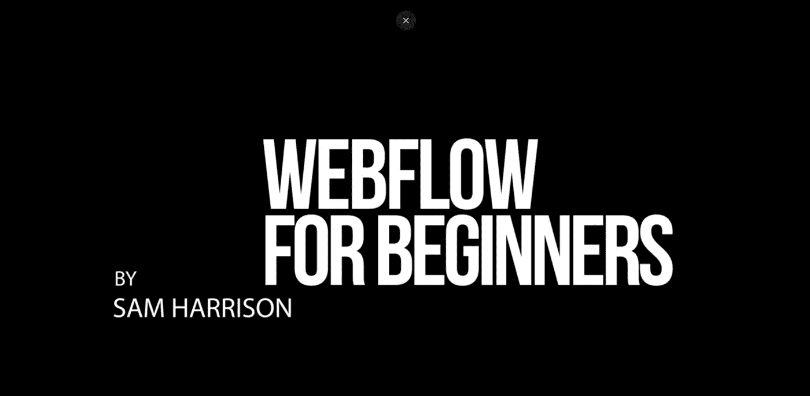

# 在线学习 Web 开发的 6 门最佳 Webflow 课程

> 原文：<https://medium.com/quick-code/6-best-webflow-courses-to-learn-web-development-online-5cd01a70720d?source=collection_archive---------2----------------------->

Webflow 对于在网站和内部网工作的网页设计者、UX 设计者和内容发布者来说是一个优秀的工具。它让你不用知道一行代码就可以使用一个完整的可视画布来创建专业的、反应灵敏的、定制的网站！

出于这些原因，我为想学习 web 开发和 web 设计的开发人员整理了一份最佳 Webflow 课程列表。还有，我已经为 [Golang](/quick-code/10-best-golang-tutorials-to-learn-go-programming-46fbd4b81d2c) 、 [React](/quick-code/10-best-react-courses-to-learn-reactjs-online-36dd0e3d3b68) 、 [Vue.js](/quick-code/7-best-vuejs-courses-for-beginners-learn-vuejs-online-d33a65f11222) 、[仙丹](/quick-code/6-best-elixir-courses-for-beginners-learn-elixir-online-f966872ef7da)、 [Svelte.js](/quick-code/5-best-svelte-js-courses-for-beginners-in-2022-856ce3e3b002) 、[春天](/quick-code/10-best-spring-courses-to-learn-spring-framework-6edfb92d40bc)做了最佳疗程的养护。换句话说，如果你对学习这些编程语言或框架感兴趣，我可以帮你搞定。现在，让我们转到最佳 Webflow 课程。

## 1. [Webflow 初学者:如何使用 Webflow](https://click.linksynergy.com/deeplink?id=0F1O0otUXQc&mid=47901&u1=csMedium&murl=https%3A%2F%2Fwww.udemy.com%2Fcourse%2Fwebflow-masterclass-a-tutorial-for-webflow-beginners%2F)—【Udemy】

Webflow for Beginners

这个大师班课程是为刚接触 Webflow 的人设计的。Webflow 的学习曲线比 Wix 或 Elementor 稍陡，但是一旦你掌握了它，你就不会想使用其他任何东西了。

在本 Webflow 课程中，您将学习:

*   如何入门 Webflow？
*   如何使用 Webflow 的 UI？
*   如何在 Webflow 中使用 div 块、容器和节。
*   如何设计 Webflow 导航和页脚的样式。
*   如何在 Webflow 中做一个响应式网站？
*   如何在 Webflow 中创建登陆页面？
*   如何做一个 webflow 网站？
*   如何使用 webflow？

在本课程中，您将学习如何使用 Webflow 创建令人惊叹的网站。首先，您将学习使用 Web flow UI 和所有不同的元素。此外，我们将讨论什么是 div 块、容器、部分、网格和 flexboxes，以及如何使用它们来正确构建网站。

这是 Udemy 上最好的 Webflow 课程。本课程的评分为 4.6 分(满分为 5.0 分)，持续时间为 5 小时。完成后，您还将获得一份证书。

## 2.[学习 Webflow](https://linkedin-learning.pxf.io/c/1137078/646189/8005?u=https%3A%2F%2Fwww.linkedin.com%2Flearning%2Flearning-webflow-14332778&subId1=csMedium)——【Linkedin Learning】

该课程由 Jen Kramer(网页设计和开发讲师)讲授 Webflow 的基础知识以及如何使用它。在本课程中，Jen 解释了如何为 Webflow 网站创建初始主页并在其中填充图像和内容。

您将在本课程中学到什么:

*   设置 Webflow 项目
*   设计网站内容的样式
*   样式化导航栏和页脚
*   构建“关于”页面
*   启动和维护您的网站

此外，本课程还将向您展示如何设计网站内容、导航条和页脚的样式，然后介绍如何构建一个“关于”页面并将导航条链接到现有页面。

这是 Linkedin 上排名最高的 Webflow 课程。本课程的评分为 4.8 分(满分为 5.0 分)，时长为 2 小时 13 分钟。完成后，您还将获得一份证书。

## 3. [Webflow 基础课程](https://click.linksynergy.com/deeplink?id=0F1O0otUXQc&mid=47901&u1=csMedium&murl=https%3A%2F%2Fwww.udemy.com%2Fcourse%2Fwebflow-essentials-course%2F)——【Udemy】

本课程将教你如何在不学习复杂编码的情况下，使用 Webflow 创建响应迅速、易于访问的网站。刚接触 Webflow 和网页设计的人可以选修这门课程。

在本 Webflow 课程中，您将学到以下内容:

*   使用 Webflow 创建响应网站。
*   无需编码的直观设计技术。
*   基本的布局技巧和简单的动画。
*   桌面、平板电脑和手机视图的一致设计。
*   建立自己的作品集网站。
*   在你的网站中创建和设计表单。
*   转换 Adobe XD 和 Figma 文件以便在 Webflow 中使用。
*   粘性 nav、符号、rem、浮动、渐变和字体。
*   如何为 SEO 优化你的网站？
*   创建一个 CMS 网站的能力，给客户的责任。
*   将您的网站移交给具有登录能力的管理员和经理。
*   创建一个包含数字和实体产品和服务的购物网站。

首先，您将创建一个简单的单页网站，学习基本的布局技术，并加入一些动画。第二，你将学习如何将令人兴奋的动画整合到你的作品集网站中。让我们来学习如何创建、设计和整合表单到你的网站中。

这是 Udemy 上的顶级 Webflow 课程。这门课程的评分为 4.8 分(满分为 5.0 分)，时长 17 小时 11 分钟。完成后，您还将获得一份证书。

## 4.使用 Webflow 创建网站:创建一个没有代码的网站

了解如何使用 Webflow 构建一个功能齐全的网站，并了解无代码开发的基础知识。Webflow 可以轻松创建外观专业、功能齐全的网站，而无需编写任何代码。

在本课程中，您将学习以下内容:

*   Webflow、无代码概述和样式指南创建
*   开发桌面版本
*   开发响应式网站
*   最终细节、上线和未来维护

在探索 Webflow 的主要功能之前，了解无代码开发以及在哪里可以找到免版税的图像。接下来，创建一个包含所有主要设计元素的样式指南，包括颜色、字体、按钮和版式。

Web Development with Webflow

该课程适合任何对不用编码就能创建网站感兴趣的人。它包括希望提高自己技能的设计师和希望提高自己在线形象的企业主。

这是国内最好的 Webflow 课程。本课程时长为 5 小时 17 分钟。完成后，您还将获得一份证书。

## 5.[完整的 Webflow 训练营:从 Figma 设计到开发](https://click.linksynergy.com/deeplink?id=0F1O0otUXQc&mid=47901&u1=csMedium&murl=https%3A%2F%2Fwww.udemy.com%2Fcourse%2Fcomplete-webflow-bootcamp-from-figma-design-to-development%2F)——【Udemy】

想不用写一行代码就能创建自定义网站吗？本课程将允许你发展你的网页设计和开发技能，你将能够把网页开发人员添加到你的简历中，让客户雇佣你。

在本 Webflow 课程中，您将学习:

*   如何不用编码用 Webflow 搭建现代网站？
*   从头开始建立一个完整的现代网站。
*   如何将你的 Figma 设计转换成一个完全响应的网站？
*   如何处理复杂的动画和交互？
*   如何成为一名成功的自由职业者？
*   如何获得客户？
*   如何给自己的作品定价？
*   如何准备令人惊叹的提案？
*   如何会见你的客户？

首先，您将学习 web 开发的基础知识，并在 Webflow Academy 部分探索 Webflow 的功能。第二，你将为一家设计机构从零开始建立一个完整的网站，将你学到的一切付诸实践。

在下一节中，您将了解高级主题，如响应、动画和交互。此外，你还将学习如何为搜索引擎优化网站。本课程将以网页设计商业方面的讨论作为结束

此外，你将学习如何获得你的第一个客户，如何为你的作品定价，以及如何准备完美的提案。因此，你将学会如何经营自己的网站开发业务，成为世界级的自由网站开发者。

这是 Udemy 上最好的 Webflow 课程。本课程的评分为 4.9 分(满分为 5.0 分)，时长为 11 小时 35 分钟。完成后，您还将获得一份证书。

## 6.[终极网页设计课程](https://www.youtube.com/watch?v=O5TdnuUhIgs&list=PLPmnoMVpkxfiYN2cE4qY9G9gIkz8YDY-u)——【Webflow】

Webflow 的这一终极网页设计课程将帮助您在 Designer(Webflow 的可视化网页设计平台)上设计您的网站，这是一个用于创建响应迅速、美观的网站的画布。此外，在进入细节之前，它将为您提供设计者的关键特征和部分的快速概述。

此外，您将学习 HTML 和 CSS，使用原生浏览器工具检查和编辑网站，并了解 Webflow 如何帮助您在没有编程的情况下创建专业网站。

> 感谢您阅读本文。我希望这次课程策划能帮助你选择正确的课程来学习 Webflow。如果你想探索更多，你可以查看这些文章:

 [## 面向初学者的 5 门免费 Figma 课程—在线学习 Figma

### 以下是我列出的 5 个免费 Figma 课程&来自 Udemy、Coursera、YouTube 等顶级平台的初学者教程。

medium.com](/quick-code/5-free-figma-courses-for-beginners-learn-figma-online-326b997bb793)  [## 学习围棋编程的 10 个最佳 Golang 教程

### 各位开发者好！您对最佳 Golang 球场的搜索到此结束。下面的文章将向你展示一些…

medium.com](/quick-code/10-best-golang-tutorials-to-learn-go-programming-46fbd4b81d2c)  [## 初学者学习 React 的 10 个最佳 React 课程

### 在最知名的 Javascript 库中，React 是最受欢迎的一个。它是一个开源的前端…

medium.com](/quick-code/10-best-react-courses-to-learn-reactjs-online-36dd0e3d3b68)  [## 学习 Spring 框架的 10 门最佳 Spring 课程

### 通过最好的 spring 课程学习用于 web 应用程序开发的 Spring 框架。

medium.com](/quick-code/10-best-spring-courses-to-learn-spring-framework-6edfb92d40bc)