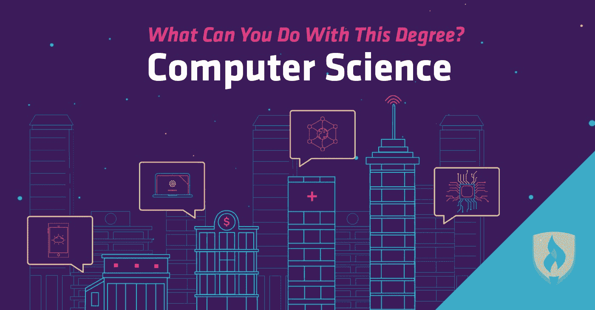

# 在 Coursera 上学习计算机科学的 60 门免费在线课程

> 原文：<https://medium.com/quick-code/60-free-online-courses-to-learn-computer-science-on-coursera-a127be91bb9a?source=collection_archive---------0----------------------->

Coursera 上的很多课程仍然是免费的。要获得这些免费课程，当你点击注册按钮，你会看到两个选项。选择*“全课程，无证书”*选项，免费获取课程。你不需要做任何审计。

在这个系列中，我们收集了所有有这个选项的计算机科学免费课程，因此任何人都可以免费访问它们。该列表如下:

# 1.[算法，第一部分](https://click.linksynergy.com/deeplink?id=BuGceriufQM&mid=40328&u1=quickcode&murl=https%3A%2F%2Fwww.coursera.org%2Flearn%2Falgorithms-part1)

本课程涵盖了每个严肃的程序员需要了解的关于算法和数据结构的基本信息，重点是 Java 实现的应用和科学性能分析。第一部分介绍了基本的数据结构、排序和搜索算法。第二部分着重于图形和字符串处理算法。

# 2.[算法，第二部分](https://click.linksynergy.com/deeplink?id=BuGceriufQM&mid=40328&u1=quickcode&murl=https%3A%2F%2Fwww.coursera.org%2Flearn%2Falgorithms-part2)

本课程涵盖了每个严肃的程序员需要了解的关于算法和数据结构的基本信息，重点是 Java 实现的应用和科学性能分析。第一部分介绍了基本的数据结构、排序和搜索算法。第二部分着重于图形和字符串处理算法。

# 3.[机器学习](https://click.linksynergy.com/deeplink?id=BuGceriufQM&mid=40328&u1=quickcode&murl=https%3A%2F%2Fwww.coursera.org%2Flearn%2Fmachine-learning)

机器学习是让计算机在没有明确编程的情况下行动的科学。在过去十年中，机器学习给了我们无人驾驶汽车、实用的语音识别、有效的网络搜索，以及对人类基因组的极大了解。机器学习在今天如此普遍，以至于你可能一天用几十次都不知道。许多研究人员也认为这是朝着人类级别的人工智能前进的最佳方式。在本课程中，您将学习最有效的机器学习技术，并获得实践它们并让它们为自己服务的机会。更重要的是，你不仅会学到学习的理论基础，还会获得快速有效地将这些技术应用于新问题所需的实际知识。最后，你将了解硅谷在创新方面的一些最佳实践，因为它与机器学习和人工智能有关。

本课程提供了机器学习、数据挖掘和统计模式识别的广泛介绍。主题包括:(一)监督学习(参数/非参数算法，支持向量机，核，神经网络)。㈡无监督学习(聚类、降维、推荐系统、深度学习)。㈢机器学习的最佳做法(偏差/差异理论；机器学习和 AI 中的创新过程)。本课程还将借鉴大量的案例研究和应用，因此您还将学习如何将学习算法应用于构建智能机器人(感知、控制)、文本理解(网络搜索、反垃圾邮件)、计算机视觉、医疗信息学、音频、数据库挖掘和其他领域。

# 4.[密码学 I](https://click.linksynergy.com/deeplink?id=BuGceriufQM&mid=40328&u1=quickcode&murl=https%3A%2F%2Fwww.coursera.org%2Flearn%2Fcrypto)

密码术是保护计算机系统中的信息的不可缺少的工具。在本课程中，您将学习加密系统的内部工作原理，以及如何在实际应用中正确使用它们。本课程首先详细讨论当强大的对手窃听和篡改流量时，拥有共享密钥的双方如何安全地通信。我们将检查许多已部署的协议，并分析现有系统中的错误。课程的后半部分讨论了让双方生成共享密钥的公钥技术。在整个课程中，参与者将接触到该领域中许多令人兴奋的开放性问题，并从事有趣的(可选的)编程项目。在第二门课程(Crypto II)中，我们将涵盖更高级的加密任务，如零知识、隐私机制和其他形式的加密。

# 5.[密码学 II](https://click.linksynergy.com/deeplink?id=BuGceriufQM&mid=40328&u1=quickcode&murl=https%3A%2F%2Fwww.coursera.org%2Flearn%2Fcrypto2)

了解加密原语和协议的内部工作原理，以及如何在现实应用中应用这些知识。涵盖该课程内容的免费教材可在 [http://cryptobook.us](http://cryptobook.us) 获得。本课程将在教材完成后推出。

# 6.[比特币和加密货币技术](https://click.linksynergy.com/deeplink?id=BuGceriufQM&mid=40328&u1=quickcode&murl=https%3A%2F%2Fwww.coursera.org%2Flearn%2Fcryptocurrency)

要真正理解比特币的特别之处，我们需要理解它在技术层面上是如何工作的。我们将解决关于比特币的重要问题，例如:

比特币是如何运作的？比特币的与众不同之处在哪里？你的比特币有多安全？比特币用户匿名程度如何？比特币的价格是由什么决定的？加密货币可以监管吗？未来会怎样？

学完本课程后，你将了解在阅读关于比特币和其他加密货币的声明时，区分事实和虚构所需的一切。你将具备设计与比特币网络互动的安全软件所需的概念基础。你将能够在自己的项目中融入比特币的想法。

# 7.[互联网历史、技术和安全](https://click.linksynergy.com/deeplink?id=BuGceriufQM&mid=40328&u1=quickcode&murl=https%3A%2F%2Fwww.coursera.org%2Flearn%2Finternet-history)

技术和网络对我们的生活、文化和社会的影响不断增加。事实上，你可以在世界任何地方学习这门课程，这需要一个在过去六十年中设计、制造和建造的技术基础设施。为了在以信息为中心的世界中发挥作用，我们需要了解网络技术的工作原理。这门课程将打开互联网，向你展示它是如何被创造的，谁创造了它，它是如何工作的。在这个过程中，我们会遇到许多创新者，他们开发了我们今天使用的互联网和网络技术。

学完本课程后，你将不再认为互联网和网络是理所当然的。你将更好地了解当前社会面临的重要技术问题。你会意识到互联网和网络是创新的空间，你会更好地理解你如何适应这种创新。如果你对本课程的内容感兴趣，这将是学习网页设计、网页开发、编程甚至网络管理课程的绝佳入门。至少，你会成为一个更明智的网络公民。

# 8.[用于机器学习的神经网络](https://click.linksynergy.com/deeplink?id=BuGceriufQM&mid=40328&u1=quickcode&murl=https%3A%2F%2Fwww.coursera.org%2Flearn%2Fneural-networks)

了解人工神经网络以及它们如何用于机器学习，如应用于语音和对象识别、图像分割、建模语言和人类运动等。我们将强调基本算法和让它们正常工作所需的实用技巧。

本课程包含 2013 年开始在 Coursera 上展示的相同内容。它不是原有课程的延续或更新。它已被改编成新的平台。

请注意，本课程适合中级水平的学习者——熟悉微积分和经验编程(Python)。

# 9.[离散优化](https://click.linksynergy.com/deeplink?id=BuGceriufQM&mid=40328&u1=quickcode&murl=https%3A%2F%2Fwww.coursera.org%2Flearn%2Fdiscrete-optimization)

厌倦了手工解数独？这门课教你如何用离散优化概念和算法解决复杂的搜索问题，包括约束规划、局部搜索和混合整数规划。

优化技术在我们的社会中无处不在。它安排飞机和机组人员，协调钢铁生产，组织铁矿石从矿山到港口的运输。优化清除了日前和实时市场，为数百万人提供电力。它组织肾脏交换和癌症治疗，帮助科学家了解生命的基本结构，控制复杂的化学反应，并设计可能惠及数十亿人的药物。

这门课是离散最优化的介绍，让学生接触到该领域中一些最基本的概念和算法。它涵盖了约束规划，局部搜索和混合整数规划，从他们的基础到他们在复杂的实际问题中的应用，如调度，车辆路线，供应链优化和资源分配。

# 10.[图像和视频处理:从火星到好莱坞，中途在医院停留](https://click.linksynergy.com/deeplink?id=BuGceriufQM&mid=40328&u1=quickcode&murl=https%3A%2F%2Fwww.coursera.org%2Flearn%2Fimage-processing)

在本课程中，你将学习如何制作、修改、存储和使用数字图像和视频背后的科学。我们将着眼于数字成像的广阔世界，从计算机和数码相机如何形成图像，到好莱坞电影中如何使用数字特效，到火星探测器如何能够跨越数百万英里的空间发送照片。

该课程从观察人类视觉系统如何工作开始，然后向你传授使数字图像工作的工程学、数学和计算机科学。您将学习用于调整图像的基本算法，探索用于编码和压缩视频图像的 JPEG 和 MPEG 标准，并继续学习图像分割、噪声消除和过滤。最后，我们将以医学中使用的图像处理技术结束。

本课程由 7 个基础模块和 2 个加分模块(未评分)组成。有可选的 MATLAB 习题；在课程期间，学员将可以在线访问 MATLAB。每个模块都是独立的，可以跟着兴趣走。

# 11.[计算神经科学](https://click.linksynergy.com/deeplink?id=BuGceriufQM&mid=40328&u1=quickcode&murl=https%3A%2F%2Fwww.coursera.org%2Flearn%2Fcomputational-neuroscience)

本课程提供基本计算方法的介绍，以了解神经系统做什么，并决定它们如何运作。我们将探索控制视觉、感觉运动控制、学习和记忆各个方面的计算原理。将涵盖的具体主题包括通过脉冲神经元表达信息，神经网络中的信息处理，以及适应和学习的算法。我们将利用 Matlab/Octave/Python 演示和练习来加深对课程中介绍的概念和方法的理解。该课程主要面向三年级或四年级本科生和刚开始的研究生，以及对学习大脑如何处理信息感兴趣的专业人士和远程学习者。

# 12.[软件定义的网络](https://click.linksynergy.com/deeplink?id=BuGceriufQM&mid=40328&u1=quickcode&murl=https%3A%2F%2Fwww.coursera.org%2Flearn%2Fsdn)

在本课程中，您将了解软件定义的网络，以及它如何改变通信网络的管理、维护和保护方式。

# 13.[计算机架构](https://click.linksynergy.com/deeplink?id=BuGceriufQM&mid=40328&u1=quickcode&murl=https%3A%2F%2Fwww.coursera.org%2Flearn%2Fcomparch)

在本课程中，你将学习设计复杂的现代微处理器的计算机体系结构。

# 14.[恶意软件及其地下经济:每个故事都有两面性](https://click.linksynergy.com/deeplink?id=BuGceriufQM&mid=40328&u1=quickcode&murl=https%3A%2F%2Fwww.coursera.org%2Flearn%2Fmalsoftware)

了解传统和移动恶意软件，它们所代表的安全威胁，最先进的分析和检测技术，以及推动这种有利可图但非法的业务的地下生态系统。

恶意软件及其地下经济:每个故事的两个方面是一个简短的，介绍性的，实验性的(即试点)课程，包括 6 次讲座。每堂课大约持续 1 小时到 1.5 小时，逻辑上分为 15 分钟的独立单元。虽然已经做出了不可忽视的努力来完成这个故障，但有些设备持续的时间肯定更长，需要更多的努力。

# 15.[算法分析](https://click.linksynergy.com/deeplink?id=BuGceriufQM&mid=40328&u1=quickcode&murl=https%3A%2F%2Fwww.coursera.org%2Flearn%2Fanalysis-of-algorithms)

本课程教授一种能够精确定量预测大型组合结构的微积分。此外，本课程涵盖了生成函数和实渐近性，然后介绍了符号方法在算法和基本结构(如排列、树、字符串、单词和映射)分析中的应用。

# 16.[网络图解:没有微积分的原理](https://click.linksynergy.com/deeplink?id=BuGceriufQM&mid=40328&u1=quickcode&murl=https%3A%2F%2Fwww.coursera.org%2Flearn%2Fnetworks-illustrated)

是什么让家里的 WiFi 比咖啡店的快？谷歌是如何从互联网上的数万亿网页中排序其搜索结果的？为什么威瑞森对我们使用的每 GB 数据收费 15 美元？我们真的在六个或更少的社交步骤中联系在一起吗？

这些只是我们可以问的关于社交和技术网络的许多有趣问题中的几个，它们构成了我们日常生活不可或缺的一部分。这门课程是关于探索答案，使用任何人都能理解的语言。我们将重点关注指导当今网络设计和可持续性的基本原则，如“分享是困难的”、“群体是明智的”和“网络的网络”，并总结一切背后的理论，从我们在脸书等平台上建立的社会联系到这些网站运行的技术。

与其他网络课程不同，这里包含的数学并不比数字的加法和乘法更复杂。虽然数学细节是完全指定我们研究的算法和系统所必需的，但它们不是理解主要思想所必需的。我们使用插图、类比和关于网络的轶事作为教学工具来代替详细的方程式。

请注意，根据普林斯顿大学的政策，本课程不授予任何证书、凭证或报告。

# [17。定量形式建模和最坏情况性能分析](https://click.linksynergy.com/deeplink?id=BuGceriufQM&mid=40328&u1=quickcode&murl=https%3A%2F%2Fwww.coursera.org%2Flearn%2Fquantitative-formal-modeling-1)

欢迎学习定量形式建模和最坏情况性能分析。在本课程中，您将学习以理论计算机科学中流行的方式建模和解决性能问题，并总体上训练您的抽象思维技能。

学完本课程后，您已经学会了从令牌生产和消费的角度来思考系统的行为，并且能够从前缀顺序和计数函数的角度对这种想法进行数学形式化。您已经了解了 Petri 网、计时和令牌消耗/生产系统的调度，对于称为单速率数据流图的特殊 Petri 网类，您将了解如何对基本性能指标(如吞吐量、延迟和缓冲)进行最坏情况分析。

正如你会注意到的，本课程中有大量的小例子，但乍一看，讨论的工业规模系统并不多。原因有两个。首先，我无意教你达到你在行业中所需要的水平的绩效分析技能。相反，我想教你用一般和抽象的术语来思考建模和性能分析，因为这是你在将来遇到任何性能分析问题时需要做的事情。毕竟，抽象思维是任何工程学科中任何学术水平工作所要求的最受尊敬的技能，如果你能够用数学的方式表达你的问题，你会更容易发现错误，与他人交流你的想法，并且你已经朝着实际解决问题迈出了一大步。其次，尽管数据流技术在工业中是适用和使用的，但是单速率数据流的子类限制太多，在大型建模示例中没有实际用途。然而，其他数据流技术的分析原理都是基于单速率数据流。因此，本课程是该主题更高级课程的良好入门。

本课程是 EIT-Digital 大学嵌入式系统硕士课程中嵌入式系统定量评估大学课程的一部分，也是由 TU/e(埃因霍温)、TUD(代尔夫特)和 UT(特温特)组成的荷兰 3TU 联盟课程的一部分。课程材料与量化宽松教育的前三周完全相同，但量化宽松教育的考试难度稍高，这在网上课程中还无法获得。

# 18.[编程语言，B 部分](https://click.linksynergy.com/deeplink?id=BuGceriufQM&mid=40328&u1=quickcode&murl=https%3A%2F%2Fwww.coursera.org%2Flearn%2Fprogramming-languages-part-b)

[如下所述，这是 3 部分课程的 B 部分。参与者应首先完成 A 部分——B 部分“直接进入”，并经常参考 A 部分的材料。]

本课程介绍编程语言的基本概念，重点强调函数式编程。本课程使用 ML、Racket 和 Ruby 语言作为讲授概念的工具，但真正的目的是教授足够多的关于任何语言如何“组合在一起”的知识，以使您在任何语言中以及在学习新语言时更有效地编程。

这门课程既不是特别理论化，也不仅仅是关于编程细节——它将为你理解如何有效地使用语言结构以及如何设计正确优雅的程序提供一个框架。通过使用不同的语言，你将学会比用一种语言的特定语法进行更深入的思考。强调函数式编程对于学习如何编写健壮的、可重用的、可组合的、优雅的程序是必不可少的。事实上，现代语言中许多最重要的思想都源于函数式编程。准备好学习一种全新的、漂亮的看待软件的方式，以及如何享受构建软件的乐趣。

本课程假设学生有一定的编程经验，详见 a 部分的第一个模块。B 部分假设学生成功完成 a 部分。

本课程分为三个 Coursera 课程:A 部分、B 部分和 c 部分。正如 A 部分的第一个模块中更详细地解释的那样，整个课程包含大量具有挑战性的材料，因此三部分的形式提供了两个中间里程碑和继续之前暂停的机会。这三个部分被设计成按顺序完成，并激励你继续完成 c 部分。

A 部分的第 1 周有一个更详细的课程三个部分的主题列表，但预计大多数课程参与者不会(还没有！)知道这些题目都是什么意思。

# 19.[近似算法第一部分](https://click.linksynergy.com/deeplink?id=BuGceriufQM&mid=40328&u1=quickcode&murl=https%3A%2F%2Fwww.coursera.org%2Flearn%2Fapproximation-algorithms-part-1)

你能多有效地把物品装进最少数量的盒子里？你能在多大程度上集群节点，以便便宜地将网络分成围绕几个中心的组件？这些都是 NP-hard 组合优化问题的例子。有效地解决这样的问题很可能是不可能的，所以我们的目标是给出一个近似的解决方案，它可以在多项式时间内计算，同时相对于最优方案，它的成本有可证明的保证。

本课程假设学生对标准的本科算法课程有所了解，并特别强调可以使用线性规划设计的算法，线性规划是该领域中最受欢迎且非常成功的技术。通过学习这门课程，你将接触到理论计算机科学基础上的一系列问题，以及强大的设计和分析技术。完成后，当面对一个新的组合优化问题时，你将能够识别它是否接近于几个已知的基本问题之一，并将能够设计线性规划松弛和使用随机舍入来尝试解决你自己的问题。课程内容，尤其是家庭作业是理论性的，没有任何编程作业。

这是近似算法两部分课程的第一部分。

# 20.[网络:朋友、金钱和字节](https://click.linksynergy.com/deeplink?id=BuGceriufQM&mid=40328&u1=quickcode&murl=https%3A%2F%2Fwww.coursera.org%2Flearn%2Ffriends-money-bytes)

你在咖啡店排队的时候拿起你的 iPhone。你用谷歌搜索一个不太出名的演员，会链接到一个维基百科条目，上面列出了他最近的电影以及其中几部电影的 YouTube 热门片段。你在亚马逊上查看用户评论，选择一个，在 BitTorrent 上下载电影，或者在网飞播放。但是突然你手机上的 WiFi 标志不见了，你上了 3G。视频质量开始下降，但你不知道这是服务器变得拥挤还是互联网在某个地方拥塞。无论如何，每千兆字节的费用是 10 美元，你决定不再看电影，而是在发送推文和给 Skype 上的朋友打电话之间进行多任务处理，同时歌曲从 iCloud 流到你的手机上。您对通话质量很满意，但是当您看到 Twitter 上没有新的关注者时，您会有点不耐烦。你可能想知道它们都是如何工作的，以及为什么有时它们不工作。看看下面的 20 个问题列表。每个问题的选择不仅是因为它与我们日常生活的相关性，还因为它的答案说明了网络领域的核心概念。本课程是关于阐述和回答这 20 个问题。

# 21.[编程语言，C 部分](https://click.linksynergy.com/deeplink?id=BuGceriufQM&mid=40328&u1=quickcode&murl=https%3A%2F%2Fwww.coursera.org%2Flearn%2Fprogramming-languages-part-c)

[如下所述，这是 3 部分课程的 C 部分。参与者应首先完成 A 部分和 B 部分——C 部分“深入浅出”,通常参考 A 部分和 B 部分的材料。]

本课程介绍编程语言的基本概念，重点强调函数式编程。本课程使用 ML、Racket 和 Ruby 语言作为讲授概念的工具，但真正的目的是教授足够多的关于任何语言如何“组合在一起”的知识，以使您在任何语言中以及在学习新语言时更有效地编程。

这门课程既不是特别理论化，也不仅仅是关于编程细节——它将为你理解如何有效地使用语言结构以及如何设计正确优雅的程序提供一个框架。通过使用不同的语言，你将学会比用一种语言的特定语法进行更深入的思考。强调函数式编程对于学习如何编写健壮的、可重用的、可组合的、优雅的程序是必不可少的。事实上，现代语言中许多最重要的思想都源于函数式编程。准备好学习一种全新的、漂亮的看待软件的方式，以及如何享受构建软件的乐趣。

本课程假设学生有一定的编程经验，详见 a 部分的第一个模块。B 部分假设学生成功完成 a 部分。

本课程分为三个 Coursera 课程:A 部分、B 部分和 c 部分。正如 A 部分的第一个模块中更详细地解释的那样，整个课程包含大量具有挑战性的材料，因此三部分的形式提供了两个中间里程碑和继续之前暂停的机会。这三个部分被设计成按顺序完成，并激励你继续完成 c 部分。

A 部分的第 1 周有一个更详细的课程三个部分的主题列表，但预计大多数课程参与者不会(还没有！)知道这些题目都是什么意思。

# 22.[嵌入式硬件和操作系统](https://click.linksynergy.com/deeplink?id=BuGceriufQM&mid=40328&u1=quickcode&murl=https%3A%2F%2Fwww.coursera.org%2Flearn%2Fembedded-operating-system)

本课程面向喜欢实用编程和制作 IoTs 应用程序的本科生和硕士生。

在本课程中，我们将讨论网络物理系统的两个组成部分，即硬件和操作系统。

完成本课程后，您将掌握硬件组件和操作系统的知识。您能够在资源受限的设备中为物联网(网络物理系统)应用规划和使用嵌入式操作系统。此外，您可以使用 Cooja simulation 来设计和模拟无线传感器网络应用。

我们有 4 个模块，每个模块最后都有一个评分测验，最后我们有一个同行评审的编程作业

当你在为 IoTs 应用程序玩 Cooja simulation 的时候，这个课程实际上非常有趣。因此，您可以为传感器网络应用创建和模拟自己的设计。通过作业可以探究 Contiki 和 Cooja 的许多特性和例子。有一些无线传感器网络应用的可选作业，供想要探索更多关于物联网应用中嵌入式操作系统的学生使用。

# 23.[物联网软件架构](https://click.linksynergy.com/deeplink?id=BuGceriufQM&mid=40328&u1=quickcode&murl=https%3A%2F%2Fwww.coursera.org%2Flearn%2Fiot-software-architecture)

本课程将教你如何设计满足物联网系统要求的面向未来的系统:安全、可互操作、可修改和可扩展的系统。此外，您将学会应用一流的软件架构方法来帮助您设计复杂的物联网和其他应用。最后，您将了解作为物联网系统架构师所做的技术决策的业务影响。

在接下来的 5 周里，你将会学到所有关于软件架构的知识！在第一周，您将发现为什么拥有一个设计良好的架构是重要的，以及在开发您的架构时您可能会遇到哪些挑战。到第二周结束时，你已经能够编写自己的需求了！在第三和第四周，你将学习如何正确地为一个具体的案例编写质量属性和质量属性场景。在最后一周，你将学习描述你自己的模式和策略，并了解它们是如何在 Android 框架中使用的。

# 24.[Unix 工作台](https://click.linksynergy.com/deeplink?id=BuGceriufQM&mid=40328&u1=quickcode&murl=https%3A%2F%2Fwww.coursera.org%2Flearn%2Funix)

Unix 为您和您的计算机实现其他目标奠定了基础，无论这些目标是经营企业、写书、治疗疾病还是开发下一个优秀的应用程序。实现这些目标的方法有时是通过编写软件来实现的。软件不能从地下开采出来，也不能春天种下软件种子到秋天收获。软件不是在工厂的流水线上生产的。软件是手工制作的，通常是定制的商品。如果软件开发人员是工匠，那么 Unix 就是他们的工作台。Unix 在一个不受干扰的环境中提供了一套基本而简单的工具。即使您不是软件开发人员，学习 Unix 也可以让您接触到新的思维方式和扩展您的想法的新方法。

本课程是为那些刚接触编程和 Unix 类操作系统(如 macOS)和 Linux 发行版(如 Ubuntu)的人设计的。本课程中讨论的大多数技术都将通过命令行界面进行访问。命令行界面乍一看似乎有些陌生，因此本课程试图将命令行的使用与使用鼠标和键盘时通常会采取的操作进行比较。您还将学习如何用一种叫做 Bash 的编程语言编写小软件，它允许您将我们将要讨论的工具连接在一起。我希望在本课程结束时，你能够使用不同的 Unix 工具，就好像它们在互连乐高积木一样。

# 25.[信息安全:背景和介绍](https://click.linksynergy.com/deeplink?id=BuGceriufQM&mid=40328&u1=quickcode&murl=https%3A%2F%2Fwww.coursera.org%2Flearn%2Finformation-security-data)

在本课程中，您将通过一些介绍性材料探索信息安全，并对该主题的范围和背景有所了解。这包括对密码学、安全管理以及网络和计算机安全的简要介绍，使您能够开始学习信息安全，并培养您对一些关键信息安全概念的理解。

本课程以围绕信息安全行业简单模型的讨论结束，并探究技能、知识和角色，以便您能够确定和分析这一发展中行业的潜在职业机会，并考虑您可能需要如何发展个人才能实现您的职业目标。

学完本课程后，您将了解有关信息、机密性、完整性和可用性的关键信息安全原则。你将能够解释信息风险和安全管理的一些关键方面，此外，总结计算机和网络安全的一些关键方面，包括对威胁、攻击、利用和漏洞的一些认识。您还将了解信息安全行业内的一些技能、知识和角色/职业机会。

# 26.[离散优化的基本建模](https://click.linksynergy.com/deeplink?id=BuGceriufQM&mid=40328&u1=quickcode&murl=https%3A%2F%2Fwww.coursera.org%2Flearn%2Fbasic-modeling)

优化是一种常见的决策形式，在我们的社会中无处不在。它的应用范围从解决数独谜题到安排婚宴座位。同样的技术可以安排飞机和机组人员，协调钢铁生产，组织铁矿石从矿山到港口的运输。人力和物力资源管理方面的良好决策也能让公司增加数百万美元的利润。类似的问题也支撑着我们的日常生活，并且是确定包裹的日常递送路线、制定学校时间表以及为我们的家庭供电的一部分。尽管这些问题非常重要，但使用传统的本科计算机科学方法解决所有这些问题都是一场噩梦。

本课程面向对处理最优化应用的所有方面感兴趣的学生。您将学习一种全新的方式来思考解决这些具有挑战性的问题，方法是用最先进的高级建模语言来陈述问题，并让库约束解决软件来完成剩下的工作。这将让你释放工业解决技术的力量，这些技术已经被数百名博士研究人员完善了几十年。有了这种先进技术，以前被认为不可思议的问题会突然变得容易解决。

# 27.[离散优化的高级建模](https://click.linksynergy.com/deeplink?id=BuGceriufQM&mid=40328&u1=quickcode&murl=https%3A%2F%2Fwww.coursera.org%2Flearn%2Fadvanced-modeling)

优化是一种常见的决策形式，在我们的社会中无处不在。它的应用范围从解决数独谜题到安排婚宴座位。同样的技术可以安排飞机和机组人员，协调钢铁生产，组织铁矿石从矿山到港口的运输。人力和物力资源管理方面的良好决策也能让公司增加数百万美元的利润。类似的问题也支撑着我们的日常生活，并且是确定包裹的日常递送路线、制定学校时间表以及为我们的家庭供电的一部分。尽管这些问题非常重要，但使用传统的本科计算机科学方法解决所有这些问题都是一场噩梦。

本课程面向已经完成离散优化基本建模的学生。在本课程中，您将学到更多关于解决具有挑战性的离散优化问题的知识，方法是用最先进的高级建模语言来描述问题，并让库约束求解软件来完成剩下的工作。本课程将着重于调试和改进模型，将部分模型封装在谓词中，以及处理高级调度和打包问题。随着你掌握这项先进技术，你将能够解决以前难以想象的问题。

# 28.[迁移到云](https://click.linksynergy.com/deeplink?id=BuGceriufQM&mid=40328&u1=quickcode&murl=https%3A%2F%2Fwww.coursera.org%2Flearn%2Fcloud-computing-adoption)

云正在席卷业务。事实上，由于云的非凡增长，它已经被描述为龙卷风，而不是蓬松的白色漂浮物！

商业研究分析师认为云是最重要的趋势之一，有可能改变整个全球 IT 行业。包括美国、英国和澳大利亚在内的各国政府现在都制定了云优先的政策，强制要求在 ICT 采购中使用非云服务。但是，首席信息官和其他高级管理人员，虽然它在他们的大多数议程上，但不确定它对他们的组织真正意味着什么——如何利用利益，控制商业广告，管理商业风险，并调整他们的组织。

虽然设定要求、协商商业(条款、服务水平协议和定价)和签署合同很重要，但我们制定一个明确的“向云迁移”计划也很重要，该计划将重新调整我们的业务架构、组织，最重要的是我们的员工。
本课程为管理层提供了取得成功和实现收益所必须知道的答案:

我应该何去何从？
有哪些商业广告？
我的筹码在哪里？
·我如何调整我的业务实践和架构？
我如何装备我的员工并构建我的组织？

# 29.[形式概念分析简介](https://click.linksynergy.com/deeplink?id=BuGceriufQM&mid=40328&u1=quickcode&murl=https%3A%2F%2Fwww.coursera.org%2Flearn%2Fformal-concept-analysis)

本课程是对形式概念分析(FCA)的介绍，FCA 是一种面向知识表示、知识获取、数据分析和可视化应用的数学理论。它通过将数据表示为概念的层次结构，或者更确切地说，概念格，来提供理解数据的工具。FCA 可以帮助处理多种数据类型，提供一个框架，在这个框架中可以制定各种数据分析和知识获取技术。在本课程中，我们将重点关注其中的一些技术，并涵盖 FCA 的理论基础和算法问题。完成本课程后，学生将能够在他们自己的涉及数据处理的研究项目中使用形式概念分析的数学技术和计算工具。此外，学生将学习基于 FCA 的聚类和依赖挖掘方法。虽然初等集合论、命题逻辑和概率论的基础知识会有所帮助，但这门课程是独立的。
周末测验包括简单的问题，旨在检查对主题的基本理解，以及可能需要努力解决的更高级的问题。

# 30.[打造 Arduino 机器人和设备](https://click.linksynergy.com/deeplink?id=BuGceriufQM&mid=40328&u1=quickcode&murl=https%3A%2F%2Fwww.coursera.org%2Flearn%2Farduino)

多年来，人们一直在改进他们的工具，研究自然的力量并加以控制，利用自然的能量来操作他们的机器。上个世纪以制造能操作其他机器的机器而闻名。如今，任何人都可以创造与物理世界互动的设备。我们的课程由一系列关于让事物独立工作的实际问题组成:它们自己做决定，行动，移动，相互之间和周围的人交流，以及控制其他设备。我们将演示如何组装此类设备，并以 Arduino 平台为基础对其进行编程。
学完本课程后，您将能够创建通过各种传感器读取外部世界数据的设备，接收这些数据并将其转发到 PC、互联网和移动设备，以及控制索引和移动。这种设备的制造将涉及设计、部件研究、电路板装配、编码和诊断。随着设备本身的创建，您将在 PC 上进行可视化，创建一个网页来演示您的设备，并弄清楚 FDM 3D 打印机是如何配置和如何工作的。
除了那些热衷于机器人或希望拓宽视野和发展技能的人，该课程还将对任何面临家庭和工业自动化任务的人以及任何从事工业设计、广告和艺术的人有用。
该课程不要求参与者具备任何特殊知识，甚至对高中学生开放。编程技能和英语水平允许阅读技术文件将是一个优势，但这不是强制性的。
整个课程都致力于实践，所以对你来说最好的方法就是掌握一些电子学知识，跟着图示的例子，自己动手做实验。

# 31.[深度学习应用人工智能](https://click.linksynergy.com/deeplink?id=BuGceriufQM&mid=40328&u1=quickcode&murl=https%3A%2F%2Fwww.coursera.org%2Flearn%2Fai)

这门课程“应用人工智能与深度学习”是 IBM 高级数据科学证书的一部分，该证书是 IBM 目前正在创建的，让您可以轻松获得自然语言处理、计算机视觉、时间序列分析和许多其他学科专家使用的深度学习模型的宝贵见解。我们将学习线性代数和神经网络的基础知识。然后介绍现在最流行的深度学习框架像 Keras，TensorFlow，PyTorch，DeepLearning4J，Apache SystemML。Keras 和 TensorFlow 是本课程的最大组成部分。我们通过使用 Keras one 来自物联网(Internet of Things)、金融标记数据、文献或图像数据库的真实实例来建立模型，从而了解异常检测、时间序列预测、图像识别和自然语言处理。最后，我们学习如何使用 Kubernetes、Apache Spark 和 GPU 来扩展这些人工大脑。

重要提示:仅凭本课程不足以获得“IBM Watson 物联网认证数据科学家证书”。你需要选修其他三门课程，其中两门是目前正在建设的。专业化认证将于 2018 年春末夏初完成

使用这些方法，无论你在你想掌握的主题方面的技能水平如何，你都可以改变你的思维，改变你的生活。如果你已经是一名专家，这种精神罩下的窥视将为涡轮增压成功创建和部署深度学习模型提供你的想法。如果你在挣扎，你会看到一个实用技术的结构化宝库，它会带你完成你需要做的事情，让你步入正轨。如果你曾经想在某方面变得更好，这门课程将会成为你的向导。

先决条件:一些编码技巧是必须的。最好是 python，但是任何其他编程语言都可以。此外，对数学(线性代数)有一些基本的了解是有利的，但我们也会在第一周讨论这部分。

如果您选择参加本课程并获得 Coursera 课程证书，您还将获得一枚 IBM 数字徽章。

# 32.[离散数学](https://click.linksynergy.com/deeplink?id=BuGceriufQM&mid=40328&u1=quickcode&murl=https%3A%2F%2Fwww.coursera.org%2Flearn%2Fdiscrete-mathematics)

离散数学构成了计算机和信息科学的数学基础。这本身也是一个迷人的主题。

学习者将熟悉广泛的数学对象，如集合、函数、关系、图形，它们在计算机科学中无所不在。或许更重要的是，他们将达到一定的数学成熟度——能够理解形式陈述及其证明；自己提出严格的证明；得出有趣的结果。

本课程力求严谨而不过分正式。这意味着，对于我们引入的每个概念，我们将展示至少一个有趣且重要的结果，并给出完整的证明。然而，我们将这样做，没有太多的正式符号，尽可能使用例子和数字。

本课程的主要主题是(1)集合、函数、关系，(2)枚举组合学，(3)图论，(4)网络流和匹配。它不包括模算术、代数和逻辑，因为这些主题有一点不同的味道，因为 Coursera 上已经有几门专门关于这些主题的课程。

# 33.[TCP/IP 简介](https://click.linksynergy.com/deeplink?id=BuGceriufQM&mid=40328&u1=quickcode&murl=https%3A%2F%2Fwww.coursera.org%2Flearn%2Ftcpip)

您每天在做任何事情时都会通过 PC(个人电脑)、笔记本电脑、平板电脑、smartpad 和智能手机使用互联网。通过你自己的个人电脑/笔记本电脑，你可以很容易地了解互联网的一切，这就是本课程的重点。在本课程“TCP/IP 简介”中，您将学习互联网技术的运行功能(包括 IPv4、IPv6、TCP、UDP、寻址、路由、域名等。)以及您的 PC/笔记本电脑的安全和网关互联网设置和基本原则。此外，通过一个简单的 Wireshark 实验，您将看到 TCP/IP 数据包和安全系统在为您的 PC/笔记本电脑服务。

# 34.[商业深度学习](https://click.linksynergy.com/deeplink?id=BuGceriufQM&mid=40328&u1=quickcode&murl=https%3A%2F%2Fwww.coursera.org%2Flearn%2Fdeep-learning-business)

你的智能手机、智能手表和汽车(如果是更新的型号)每天都有 AI(人工智能)在为你服务。在不久的将来，更先进的具有“自学”能力的 DL(深度学习)和 ML(机器学习)技术将用于您的业务和行业的几乎每个方面。因此，现在是学习什么是 DL 和 ML，以及如何在你的公司中使用它的时候了。本课程有三个部分，其中第一部分侧重于基于 DL 和 ML 技术的未来业务战略，包括最新产品/服务和开源 DL 软件的详细信息，这些都是未来的推动者。第二部分着重于 DL 和 ML 系统的核心技术，包括 NN(神经网络)、CNN(卷积 NN)和 RNN(递归 NN)系统。第三部分重点介绍四个 TensorFlow Playground 项目，在这些项目中，可以使用一个简单有趣但功能非常强大的应用程序 TensorFlow Playground 获得设计 DL NNs 的经验。本课程旨在帮助您建立业务战略，并使您能够对新的 DL 和 ML 服务和产品进行技术规划。

# 35.[设计智能物联网设备](https://click.linksynergy.com/deeplink?id=BuGceriufQM&mid=40328&u1=quickcode&murl=https%3A%2F%2Fwww.coursera.org%2Flearn%2Fiot-architecture)

本课程将教你如何开发嵌入式系统设备。为了缩短上市时间，现在有许多预制的硬件和软件组件。您将发现所有可用的硬件和软件组件，如处理器系列、操作系统、主板和网络。您还将学习如何实际使用和集成这些组件。

在课程结束时，您将能够开始设计和实现您自己的嵌入式设备！您将了解如何调试和微调您的设备，以及如何使其在低电源下运行。

# 36.[嵌入式系统中的网络连接和安全](https://click.linksynergy.com/deeplink?id=BuGceriufQM&mid=40328&u1=quickcode&murl=https%3A%2F%2Fwww.coursera.org%2Flearn%2Fiot-connectivity-security)

关于本课程:欢迎学习网络物理系统中的网络连接和安全！

在本课程中，我们将探索几种将现代设备结合在一起的技术，以促进物联网，并使设备具备互联网功能。我们将讨论这些设备在网络中相互通信的规则、协议和标准。我们还将讨论网络物理系统(CPS)中的安全和隐私问题及挑战。我们将从不同的角度探讨保护系统的措施和技术。介绍了可能的攻击模型，并讨论了应对这些攻击的解决方案。此外，还介绍了信息物理系统中与隐私相关的一些基本概念。

这门课程总共包括五个单元，分为两个主要部分。第一部分包含三个模块，集中于网络物理系统中的网络连接问题。第二部分由两个模块组成，侧重于此类系统中的安全措施。每个模块都以评分测验结束，在课程结束时还有一个涵盖课程两个主要部分的期末同行评议考试。

完成本课程后，您将具备设计网络物理系统网络架构的基本知识和能力。这包括将不同的组件放在一起，选择合适的通信协议，并在您的系统中使用这些协议。您还将能够为您的系统定义安全要求，并选择和实施适当的安全和隐私技术来保护它。

# 37.[系统验证(4):建模软件、协议和其他行为](https://click.linksynergy.com/deeplink?id=BuGceriufQM&mid=40328&u1=quickcode&murl=https%3A%2F%2Fwww.coursera.org%2Flearn%2Fsystem-validation-software-protocols)

关于本课程:系统验证是研究系统通信和信息处理基础的领域。它允许基于系统的行为模型进行自动分析，以查看系统是否正常工作。我们想保证系统确实做了它应该做的事情。系统验证中提出的技术允许证明不存在错误。它允许设计结构合理的嵌入式系统行为，其副作用是迫使你使行为变得简单而有洞察力。这意味着系统不仅运行正常，而且更易于维护和适应。“软件协议建模和其他行为”展示了软件建模、通信协议和其他例子中的正式方法的力量。阅读材料。J.F .格罗特和 M.R .穆萨维。通信系统的建模与分析。麻省理工学院出版社，2014 年。

# 38.[智能物联网设备架构简介](https://click.linksynergy.com/deeplink?id=BuGceriufQM&mid=40328&u1=quickcode&murl=https%3A%2F%2Fwww.coursera.org%2Flearn%2Fiot-devices)

嵌入式系统无处不在，以至于我们中的一些人认为它们是理所当然的:我们在智能手机、GPS 系统、飞机等等中发现了它们。但是你有没有想过这些设备实际上是如何工作的？如果是这样，你来对地方了！

在本课程中，您将了解嵌入式系统的特点:可能性、危险、复杂性和成功秘诀。我们将在一个蓬勃发展的嵌入式系统领域的框架内讨论所有这些:物联网，其中数十亿个互通设备可以实现前所未有的创新产品和服务。如果你想学习如何创造类似的创新产品，那么这是你的课程！

在课程结束时，您将能够:
-在目标市场、并行执行、时间和系统生命周期方面为自己的项目做出正确的选择
-破解、避免失败并促进成功
-决定是购买还是构建组件
-如何组建一个优秀的团队
-安装 case 工具
-学习如何使用 SysML

这是一门入门课程。如果您想超越基础知识，请尽快查看我们更高级的课程智能物联网设备架构！

# 39.[系统验证(3):模态公式要求](https://click.linksynergy.com/deeplink?id=BuGceriufQM&mid=40328&u1=quickcode&murl=https%3A%2F%2Fwww.coursera.org%2Flearn%2Fsystem-validation-modal-formulas)

系统验证是研究系统通信和信息处理基础的领域。它允许基于系统的行为模型进行自动分析，以查看系统是否正常工作。我们想保证系统确实做了它应该做的事情。系统验证中提出的技术允许证明不存在错误。它允许设计结构合理的嵌入式系统行为，其副作用是迫使你使行为变得简单而有洞察力。这意味着系统不仅运行正常，而且更易于维护和适应。“模态公式要求”是第三个课程，它向你展示了如何为自动机指定要求，以便在要求和系统行为之间建立正确的关系。阅读材料。J.F .格罗特和 M.R .穆萨维。通信系统的建模与分析。麻省理工学院出版社，2014 年。

# 40.[系统验证(2):模型过程行为](https://click.linksynergy.com/deeplink?id=BuGceriufQM&mid=40328&u1=quickcode&murl=https%3A%2F%2Fwww.coursera.org%2Flearn%2Fsystem-validation-behavior)

关于本课程:系统验证是研究系统通信和信息处理基础的领域。这是计算机科学和改进软件开发的下一个合乎逻辑的步骤。它允许基于系统的行为模型进行自动分析，以查看系统是否正常工作。我们想保证系统确实做了它应该做的事情。系统验证中提出的技术允许证明不存在错误。它允许设计结构合理的嵌入式系统行为，其副作用是迫使你使行为变得简单而有洞察力。这意味着系统不仅运行正常，而且更易于维护和适应。“过程行为模型”是“自动机和行为等价物”的后续 MOOC。这个 MOOC 向你展示了如何对进程行为建模，特别是协议和分布式算法，更深入地探究系统行为的属性，并保持事情简单以避免状态空间爆炸。阅读材料。J.F .格罗特和 M.R .穆萨维。通信系统的建模与分析。麻省理工学院出版社，2014 年。

本课程是系统验证系列课程的第二部分。作为一套课程，系统验证是一个更大的 EIT 数字在线项目“通过嵌入式系统的物联网”的一部分。

# 41。系统验证:自动机和行为等价物

你经历过软件系统失败吗？网站崩溃，日历不同步，甚至停电。你当然有！但是，您是否知道这些错误中有许多是系统内部或系统之间的通信错误造成的？根据系统的不同，软件故障的影响可能是巨大的，甚至会导致巨大的经济损失或生命损失。软件，尤其是软件密集型系统之间的通信，非常复杂，很难处理好。然而，在日常生活中，我们需要直接或间接支持我们的系统的可靠性。

系统验证帮助您设计结构合理的嵌入式系统行为。它也强迫你让行为变得简单和有洞察力；为良好行为而设计的系统也更容易维护和适应。系统验证是研究系统通信和信息处理基础的领域。系统验证中提出的技术允许证明不存在错误。

第一门课程“自动机和行为等效性”为后续课程奠定了基础，向您展示了如何将系统行为视为状态机。它讨论了行为等效性，并在一些例子和测验中加以说明。本课程解释了标签转换系统或自动机，以模拟特别是软件控制系统的行为。一个重要的问题是，这种自动机表示的两个行为何时相等。这个问题的答案一点也不简单，但是由此产生的等价关系被用作简化复杂行为的强大工具。这使得我们能够精确地研究和理解这种系统的行为特性。特别是，在与行为隐藏的结合中，等价约简是一种获得系统行为洞察力的独特技术，远比模拟或测试更有效。利用这种洞察力，我们可以使模型正确。这样的模型为简洁、可靠和可维护的软件产品提供了一个很好的基础。

本课程是系统验证系列课程的第一部分。作为一套课程，系统验证是一个更大的 EIT 数字在线项目“通过嵌入式系统的物联网”的一部分。

# 42.[近似算法第二部分](https://click.linksynergy.com/deeplink?id=BuGceriufQM&mid=40328&u1=quickcode&murl=https%3A%2F%2Fwww.coursera.org%2Flearn%2Fapproximation-algorithms-part-2)

这是近似算法的延续，第 1 部分。在这里你将学习线性规划对偶应用于一些近似算法的设计，以及半定规划应用于最大割。

通过本课程的两个部分，你将接触到理论计算机科学基础的一系列问题，以及强大的设计和分析技术。完成后，当面对一个新的组合优化问题时，你将能够识别它是否接近于几个已知的基本问题之一，并将能够设计线性规划松弛和使用随机舍入来尝试解决你自己的问题。课程内容，尤其是家庭作业是理论性的，没有任何编程作业。

这是近似算法两部分课程的第二部分。

# 43.[Node-RED 开发人员指南](https://click.linksynergy.com/deeplink?id=BuGceriufQM&mid=40328&u1=quickcode&murl=https%3A%2F%2Fwww.coursera.org%2Flearn%2Fdeveloper-nodered)

参加本课程即表示您同意常见问题中列出的最终用户许可协议。注册后，您可以访问资源中的许可证。

在开发应用程序时，越来越多地使用敏捷方法和过程进行快速应用程序开发。开发团队面临着减少将想法转化为工作解决方案所需时间的压力，无论是作为创新研讨会或黑客马拉松的一部分，还是新解决方案想法的原型或主流开发。

开发人员正在寻找新的方法，以允许他们进行更多的生产和创新，例如来自 JS 基金会的 Node-RED 是一种允许开发人员快速创建应用程序的技术，只需花费编码所需时间的一小部分来编写代码。

Node-RED 构建于 Node.js 之上，因此可以在任何能够托管 node.js 应用程序的地方运行，例如小型单板计算机，如 Raspberry Pi 或 Beaglebone，在您的笔记本电脑或工作站上，或者在云环境中，如 IBM Cloud。

Node red 允许开发人员使用一组节点组成流，其中每个节点都提供预构建的功能，可以连接到其他节点以快速构建应用程序。

该课程将提高您对 Node-RED 的使用。它将介绍一些关键节点中可用的更高级的功能，向您展示如何使用仪表板节点来可视化数据。它向您展示了如何使用 Node-RED 创建 web APIs，如何使用 web 服务，以及如何在 Node-RED 流中利用不同的存储技术。本课程的最后一部分将展示如何通过创建自己的节点来扩展 Node-RED。

完成课程需要什么技术？
该课程要求你拥有一个 IBM Cloud 账户，因为一些作业确实使用了指定的云服务。您可以在 IBM Cloud 上创建一个免费帐户，在课程的第 2 周，我们会提供一个促销代码，它可以释放 IBM Cloud 上的一些额外资源，这样您就可以完成课程，而无需提供信用卡信息或支付云服务费用。

如果您选择参加本课程并获得 Coursera 课程证书，您还将获得一枚 IBM 数字徽章。要了解 IBM 数字徽章的更多信息，请点击链接[https://ibm.biz/badging](https://ibm.biz/badging)。

# 44.[信息物理系统:建模与仿真](https://click.linksynergy.com/deeplink?id=BuGceriufQM&mid=40328&u1=quickcode&murl=https%3A%2F%2Fwww.coursera.org%2Flearn%2Fcyber-physical-systems-1)

信息物理系统(简称 CPS)将数字和模拟设备、接口、网络、计算机系统等与自然和人造的物理世界结合起来。这些系统中固有的相互联系和不同种类的行为组合使得对它们的分析和设计成为一项激动人心和富有挑战性的任务。

CPS:建模和仿真为你提供了一个信息物理系统建模和仿真的介绍。主要重点是物理过程模型、有限状态机、计算、物理变量和网络变量之间的转换以及数字网络。这门课的讲师是加州大学圣克鲁斯分校计算机工程系的副教授里卡多·桑菲利斯([https://hybrid.soe.ucsc.edu](https://hybrid.soe.ucsc.edu))。

## [西班牙语课程]

# 45.[检测对象](https://click.linksynergy.com/deeplink?id=BuGceriufQM&mid=40328&u1=quickcode&murl=https%3A%2F%2Fwww.coursera.org%2Flearn%2Fdeteccion-objetos)

你对计算机视觉感兴趣吗？你喜欢用探测器在图像中识别物体吗？

在本课程中,您将了解任何自动图像中物体检测和识别系统的基本原理。在整个课程中,我们将分析不同的表示和分类方法,使您能够处理日益复杂的应用案例。

该课程的内容是从基本的对象检测和识别方案构建的,该方案作为指导,介绍了特征提取和图像表示的不同方法以及对图像进行分类和定位图像中对象的所有实例的不同替代方法。主题包括图像形成的基本概念,卷积及其应用于轮廓检测,区域特征,图像描述符(局部二进制模式,面向梯度的直方图,Haar 特征)和各种分类方法(线性分类器,支持向量机,Adaboost,随机森林,卷积神经网络)。

完成本课程将使您能够:
•设计,从一个共同的基本方案,适应于图像中不同物体检测和识别问题的解决方案,
•了解图像描述和分类的主要技术,
•了解允许开发物体检测和识别的实际应用的工具,以便您能够在多个应用程序中开发自己的物体检测和识别系统。

该课程面向具有计算机科学,工程学或数学相关学位的大学生,以及其他具有编程技能的学生,他们有兴趣学习如何使用计算机视觉技术从图像中提取信息。

# [语义网:在网路上有效发布和提取资讯的工具](https://click.linksynergy.com/deeplink?id=BuGceriufQM&mid=40328&u1=quickcode&murl=https%3A%2F%2Fwww.coursera.org%2Flearn%2Fweb-semantica)

想象一下,你可以让谷歌和你的专科医生一起花一个小时。想象一下,Google 会自动预订最适合您的时间。这就是语义网的目标,即你的计算机能够理解你所请求的内容,并执行必要的操作(自动与其他计算机交互)以获得你所请求的内容。为了实现这一目标,计算机必须能够理解在这个过程中交互的人和机器,这需要共同的语义。这就是语义网研究领域的终结。为了使人与计算机之间的通信在语义层面上工作,需要三种关键技术:用同一种语言读写的通用数据模型(RDF)。该数据模型的查询语言(SPARQL),用于提取信息;以及对相同数据(OWL)运行的逻辑,以便能够推理它们。本课程将介绍理解这些关键技术所需的概念。完成课程后,参与者将能够理解语义 Web 的基本概念及其核心技术,并使用语义 Web 技术开发自己的应用程序。最后,学生将看到语义网的目标离实现还很遥远。

# 47. [电子在行动:电子和 Arduino 为你自己的发明](https://click.linksynergy.com/deeplink?id=BuGceriufQM&mid=40328&u1=quickcode&murl=https%3A%2F%2Fwww.coursera.org%2Flearn%2Felectrones-en-accion)

本课程向学生介绍电子和 Arduino,从最基本的电路开始,最后使用可编程电子设备设计低复杂度的电路。在课程中,学生将学习电气和电子学的基础知识,了解电子电路设计中使用的不同模块,学习模拟和数字电路设计的基础知识,并使用 Arduino 平台介绍后者的编程。

该课程的目标是学校教育的最后一年和大学教育的第一年,或任何其他学生有足够的动机进行自己的实验,并在未来继续学习。

虽然这不是必不可少的要求,但具有微积分和积分概念的学生将能够更好地理解某些特定主题,这些主题并不是完成课程所必需的。

该课程包括使用 Arduino 控制的简单机电设备的演示。每个演示电路都附带连接图和程序,两者都经过适当解释,以便学生使用 Arduino 平台轻松复制。

# 48.[图像分类:如何识别图像的内容?(T1 )](https://click.linksynergy.com/deeplink?id=BuGceriufQM&mid=40328&u1=quickcode&murl=https%3A%2F%2Fwww.coursera.org%2Flearn%2Fclasificacion-imagenes)

你对计算机视觉感兴趣吗?您想知道如何识别图像的视觉内容并根据其内容对其进行分类吗?

在本课程中,您将学习不同的图像表示和分类方法。课程主题将让您了解基本的图像分类方案,称为 Bag of Visual Words。从这个基本方案开始,您将学习如何使用各种局部图像描述符以及最常见的分类方法。我们还将描述基本方案的不同扩展,允许您组合不同的描述符,包括空间信息或改进图像的最终表示。

完成本课程将使您能够:
•设计适合不同图像分类和识别问题的解决方案
•了解用于描述和分类图像的主要技术
•访问允许开发实际图像分类应用的工具。

该课程面向具有计算机科学,工程学或数学相关学位的大学生,以及其他具有编程技能的学生,他们有兴趣学习如何使用计算机视觉技术从图像中提取信息。

# 49. [Introduction to Science da Computing with Python 第 1 部分](https://click.linksynergy.com/deeplink?id=BuGceriufQM&mid=40328&u1=quickcode&murl=https%3A%2F%2Fwww.coursera.org%2Flearn%2Fciencia-computacao-python-conceitos)

欢迎来到 计算机科学入门课程 针对普通学生 da 圣保罗大学和所有其他有兴趣学习的不仅是 Python 编程,而且还学习计算机科学的基础知识!

在这里,您将学习计算机科学的主要入门概念,并学习如何用 Python 语言开发小程序。

本课程没有先决条件。您不应该有任何编程经验,但是,假设您或学生掌握基础数学概念。

主要目标是发展应用于制定和解决计算问题的推理。编程的行为是一个有用的工具,可以用来进行这种推理,并使计算机科学中的其他常见概念更加具体。

课程结束后,学生将能够编写小型 Python 程序并继续学习课程的第二部分。

好学习!

===
本课程是在教授的支持下编写的。José Coelho de Pina 和 Carlos Hitoshi Morimoto 来自 IME-USP 计算机科学系。

CCSL-IME-USP 技术经理 Nelson Posse Lago,Athos Ribeiro 和 Yorah Bosse 一直是优秀的教学助理,帮助保持课程质量。

# 50.感性的复杂性:电子游戏与艺术的平行性(T4)

本课程为有兴趣在游戏领域担任开发人员,研究人员和教师的人员提供支持,重点是了解他们作为当代文化和当前艺术环境的组成部分。

将介绍视频游戏作为文化和艺术表现形式的讨论的基本概念。通过视频课程,推荐阅读,专家访谈,反思练习和小组讨论,知识将被传递,以启动对该主题感兴趣的人,甚至丰富那些已经在该领域工作的人的曲目。

虽然本课程基本上是理论性的,但我们的目标是在学术和市场领域之间架起一座桥梁。为此,我们通过提出同行评审来鼓励务实的应用。学生将被带到一个视频游戏的草案,并与同学分享,有机会反思收到的反馈。

该产品的主要目的是为有兴趣探索视频游戏与艺术之间关系的学生提供足够的基础。

# 5、数字人文学科中的语言技术(T6)

您想知道文本的数字化意味着什么吗?您是否一直想知道如何使语料库中的文本具有最佳可搜索性?您想知道如何用语言信息丰富文本吗?
那么你在这门课程中是正确的!它概述了书面文本数字化和注释的主要概念和问题。在六周的六个主题模块中,您将学习相关技术和工具。每个模块包括两到三个视频(10-20 分钟),一个测验或同行评审,以及简短的背景文本和选定主题的后续链接。

对谁感兴趣:
本课程面向语料库学者、人文科学家和对语言感兴趣的人士,他们从纯粹的语言科学的角度出发,冒险进入文本数字化的世界,并了解其背后的技术。
本课程不需要任何编程知识。对文本的数字化和注释感兴趣,您将为本课程做好充分准备。

我们很高兴与您一起踏上这些在人文科学中变得越来越重要的数字化道路。

## [ 俄语课程 ]

# [机器学习导论(T4)](https://click.linksynergy.com/deeplink?id=BuGceriufQM&mid=40328&u1=quickcode&murl=https%3A%2F%2Fwww.coursera.org%2Flearn%2Fvvedenie-mashinnoe-obuchenie)

关于这门课程: 不久前,“大数据”一词开始流行,它代表了一个新的应用领域 - 寻找自动快速分析大量不同信息的方法。大数据科学仍处于起步阶段,但现在需求量很大,将来需求量会更大。
有了它,你可以解决令人难以置信的任务:评估心电图肝脏的状态,预测职位空缺的工资,提供音乐的用户的基础上,在互联网上的问卷。

大数据可以是任何东西:科学实验的结果,银行交易的逻辑,天气观测,社交媒体资料 - 简而言之,任何可以分析有用的东西。最有前途的大数据分析方法被认为是使用机器学习 - 一套方法,使计算机能够在数组中找到最初未知的相互关系和规律。

На факультете компьютерных наук ВШЭ и в Школе анализа данных есть люди, активно использующие машинное обучение и разрабатывающие новые подходы к нему. Именно они — преподаватели этого курса.

Вы изучите основные типы задач, решаемых с помощью машинного обучения — в основном речь пойдёт о классификации, регрессии и кластеризации. Узнаете об основных методах машинного обучения и их особенностях, научитесь оценивать качество моделей — и решать, подходит ли модель для решения конкретной задачи. Наконец, познакомитесь с современными библиотеками, в которых реализованы обсуждаемые модели и методы оценки их качества. Для работы мы будем использовать реальные данные из реальных задач.

短期课程:
第 1 周。导言。任务的例子。逻辑方法:决定树木和决定森林。
第二周度量分类方法。线性方法,随机梯度。
第三周支持向量方法(SVM)。逻辑回归分类质量指标。
第 4 周线性回归减小尺寸,主要成分的方法。
第五周算法组成,渐变提升。神经网络。
第六周聚类和可视化。部分学习。
第七周数据分析的应用任务:实施和解决方法。

听众需要了解数学的基本概念:函数,导数,向量,矩阵。执行实际任务需要基本的编程技能。很想了解 Python。这些任务旨在使用该语言及其 numpy、pandas 和 scikit-learn 库。

Чтобы успешно завершить курс, нужно набрать проходную сумму баллов за тесты и практические задания, а также выполнить финальный проект, посвящённый решению прикладной задачи анализа данных.

Мы уверены, что этот курс будет полезен каждому, кто хочет постичь искусство предсказательного моделирования и освоить интеллектуальный анализ данных.

# 53.T7:算法计算(Algorithmic Computing)

Курс «Алгоритмизация вычислений» будет вам интересен и просто необходим, если вы хотели бы изучить программирование с нуля и выйти на хороший базовый уровень, научиться составлять, понимать и анализировать алгоритмы.

通过学习课程,您将能够:
• 记录数学作业;
运用标准算法来解决问题;
评估算法的最优性,并选择最能解决问题的算法;
通过跟踪方法检查算法的正确性;
使用结构化编程技术编码算法;
调试和测试程序。

该学科的研究基于学生对高中课程中数学,计算机科学和算法基础知识的了解,以及在选择解决问题的方法时应用数学设备的能力。
为了掌握教学纪律,学生必须掌握在上述课程学习过程中获得的学校知识。

Этот курс лежит в основе всего программирования. Можно сказать, что это фундамент, на котором будет строиться все дальнейшее обучение программированию. Мы будем решать задачи, постепенно переходя от простых к более сложным. В конечном итоге вы научитесь решать задачи обработки динамических списков, т.е. работать на хорошем базовом уровне.

# 54.在 Arduino 上构建机器人和其他设备。从交通灯到 3D 打印机(T17)

На протяжении тысячелетий люди усовершенствовали орудия труда, изучали силы природы и подчиняли их себе, использовали их энергию для работы машин, а в прошлом веке создали машины, которые могут управлять другими машинами. Теперь создание устройств, которые взаимодействуют с физическим миром, доступно даже школьнику.

我们的课程包括一系列实践任务,旨在创造能够自我运作的东西:探索世界,做出决策,并采取行动 - 移动,彼此和人类交换数据,控制其他设备。我们将展示如何组装这些设备并使用 Arduino 平台作为基础对其进行编程。

通过本课程,您将能够创建从各种传感器读取外部世界数据的设备,处理信息,接收和发送数据到 PC,互联网,移动设备,控制指示和运动。创建设备将包括设计,研究组件,组装电路,编写程序,诊断。在创建设备本身的同时,您将在 PC 上进行可视化,创建一个显示其中一个设备的网页,并了解设备和 FDM 3D 打印机的工作原理。

Помимо тех, кто увлекается робототехникой или стремится расширить кругозор и свои навыки, курс будет полезен всем, кто сталкивается с задачами бытовой и производственной автоматизации, а также занимается промышленным дизайном, рекламой и искусством.

Курс не требует специальных знаний у слушателей, доступен даже ученикам старших классов средней школы. Плюсом будут навыки программирования и владение английским языком на уровне чтения технической документации, однако обязательным это не является.

Весь курс посвящен практике и самым лучшим решением для вас будет раздобыть электронику, повторять показанные примеры и экспериментировать самостоятельно.

# 55.[网络管理:从理论到实践](https://click.linksynergy.com/deeplink?id=BuGceriufQM&mid=40328&u1=quickcode&murl=https%3A%2F%2Fwww.coursera.org%2Flearn%2Fnetwork-administration)

В настоящее время без сети не может обойтись ни кондитер, ни водитель. И даже дети, которые еще не ходят в школу, а то и в детский сад, уже пользуются сетями. Поэтому сейчас специалистов в этой области требуется всё больше. Наш курс поможет желающим разобраться во всех премудростях этого интереснейшей области.

在本课程中,学员:
将形成本地和全球计算机网络运作的整体图景;
- 将看到信息是如何传输的,
- 将了解网络协议和基本服务的逻辑和原理,
- 将学习诊断网络连接的健康状况,检测和排除故障,使用网络分析仪,
- 掌握硬件虚拟化技术
- 并能够在其上创建和托管自己的网络服务器和网络资源。

Слушатель получит представление и о самых низкоуровневых процессах в сети, и о высокоуровневых.

完成课程后,学员将能够:
- 设计和部署自己的网络,
- 配置网络设备,
- 配置服务器并创建 Web 资源,将它们放置在远程和本地的第三方设备上。

该课程包括直接在学习者的计算机上使用硬件虚拟化工具
进行的实践部分。

# 56. [使用 OpenMP 和 MPI 并行编程的介绍](https://click.linksynergy.com/deeplink?id=BuGceriufQM&mid=40328&u1=quickcode&murl=https%3A%2F%2Fwww.coursera.org%2Flearn%2Fparallelnoye-programmirovaniye)

About this course: 解决复杂的计算密集型应用问题的需求,以及传统的冯·尼曼(von Neumann)计算机的最大速度的原则限制,导致了多处理器计算系统(MCU)或超级计算机的出现。
随着计算机行业向具有矢量扩展的多核处理器的大规模生产的转变,并行计算获得了广泛的应用。如今,几乎所有设备,从袖珍设备到最强大的超级计算机,都配备了多核处理器。如果你编写一个顺序的程序,而没有在不同的 CPU 内核之间分配工作,也没有进行时间序列化,那么你只使用了 CPU 的一部分计算能力。

пройдяэтот、вы познакомитесь、основными、позволяющимиписатьпараллельныепрограммыдляНа простых примерах будут разобраны основные конструкции и способы распределения работы.Выполнение практических заданий позволит вам приобрести практические навыки создания параллельных программ.Курс будет интересен всем, кто занимается программированием.

Для участия в курсе слушателю необходимо иметь базовые знания по программированию с использованием С/С++.

Курс состоит из 9 недель.Каждая неделя курса содержит видеолекции, а также проверочные задания.Сертификат получают слушатели, набравшие более 80 % от максимально возможного количества баллов.этом итоговый результат，представленный，100 %，складывается，следующих составляющих: тесты，дают，4 %，тесты，дают，5 %，практические задания дают，10 %

## [中文课程]

# 57\. [機器學習基石上 (Machine Learning Foundations)---Mathematical Foundations](https://click.linksynergy.com/deeplink?id=BuGceriufQM&mid=40328&u1=quickcode&murl=https%3A%2F%2Fwww.coursera.org%2Flearn%2Fntumlone-mathematicalfoundations)

About this course: Machine learning is the study that allows computers to adaptively improve their performance with experience accumulated from the data observed. Our two sister courses teach the most fundamental algorithmic, theoretical and practical tools that any user of machine learning needs to know. This first course of the two would focus more on mathematical tools, and the other course would focus more on algorithmic tools. [機器學習旨在讓電腦能由資料中累積的經驗來自我進步。我們的兩項姊妹課程將介紹各領域中的機器學習使用者都應該知道的基礎演算法、理論及實務工具。本課程將較為著重數學類的工具，而另一課程將較為著重方法類的工具。]

# 58\. [操作系统与虚拟化安全](https://click.linksynergy.com/deeplink?id=BuGceriufQM&mid=40328&u1=quickcode&murl=https%3A%2F%2Fwww.coursera.org%2Flearn%2Fos-virtsecurity)

操作系统是计算机系统的基础软件，而系统虚拟化已成为云计算平台的核心技术，没有它们提供的安全性，这些计算机系统及其上数据的安全性都将无法保障。本课程将从理论与工程实践相结合的角度，介绍操作系统(Linux)与系统虚拟化(Xen)安全相关理论、技术和方法，包括：安全概念、安全机制、安全模型、安全体系结构、安全开发方法、安全标准与评测方法等，帮助你深入学习和理解该领域的知识体系、实践技术和方法。

# 59\. [计算机组成 Computer Organization](https://click.linksynergy.com/deeplink?id=BuGceriufQM&mid=40328&u1=quickcode&murl=https%3A%2F%2Fwww.coursera.org%2Flearn%2Fjisuanji-zucheng)

本课程重点讲述计算机的内部结构和工作原理，着眼于软件和硬件的衔接互动，注重基本概念和真实系统的对应。

# 60\. [计算机辅助翻译原理与实践 Principles and Practice of Computer-Aided Translation](https://click.linksynergy.com/deeplink?id=BuGceriufQM&mid=40328&u1=quickcode&murl=https%3A%2F%2Fwww.coursera.org%2Flearn%2Ffanyi-ruanjian)

现代语言服务行业要求从业人员必须具有利用计算机及网络来使用各类技术辅助工具帮助其工作的能力，而不是仅仅学会几款狭义的计算机辅助翻译软件。

本课程主要讲授计算机辅助翻译技术的基础概念，学习多种计算机辅助翻译工具的使用方法，锻炼学生在技术环境下从事翻译工作等各类语言服务工作的能力，帮助学生理解信息化时代的语言服务工作。

课程完整涵盖现代语言服务的基本情况介绍、翻译技术基本概念、语言服务项目执行过程的信息环境与信息技术、如何利用电子辞典、网络资源及语料库工具辅助翻译工作、狭义和广义的计算机辅助翻译工具原理及实战演练、翻译内容质量评定、多人协同翻译项目、翻译管理等多方面的内容。作为翻译类专业学生的必修课程，本课程适合语言类专业学生学习。通过课程的学习，有助于学习者了解现代语言服务行业，增强各类计算机辅助翻译工具的使用技能，提高包括翻译工作在内的各类语言服务工作的效率。

该课程是“北大-德稻网络公开课程”中的一门，由北京大学与德稻教育联合提供。

本课程同时受到“语言能力协同创新计划”资助和支持。

从事现代语言服务行业的人需要能够使用计算机和互联网，通过采用各种有效的工具来辅助他们的翻译工作，而不仅仅是使用文字处理工具和几个基本的计算机辅助翻译软件。

本课程教授计算机辅助翻译技术的基本概念，帮助学生学习使用各种计算机辅助翻译工具，增强他们在这样的技术环境中从事各种语言服务的能力，并帮助他们了解现代语言服务行业是什么样子的。

本课程内容涵盖现代语言服务业概论、翻译技术的基本原理和概念、语言翻译过程中使用的信息技术、如何使用电子词典、互联网资源和语料库工具、不同计算机辅助翻译工具的实践、翻译质量评估、机器翻译的基本概念、全球化、本地化等。本课程作为笔译和口译专业学生的必修课，同样适用于有无语言专业背景的学生。通过学习本课程，学生可以更好地了解现代语言服务行业，提高工作效率，以便更好地提供翻译服务。

该课程是由北京大学和陶德大师学院合作的北大-陶德网络公开课之一。

# 61\. [操作系统原理（Operating Systems）](https://click.linksynergy.com/deeplink?id=BuGceriufQM&mid=40328&u1=quickcode&murl=https%3A%2F%2Fwww.coursera.org%2Flearn%2Fos-pku)

《操作系统原理》是针对计算机科学技术专业三年级本科生开设的一门专业基础课程。本课程着重学生系统观的培养，通过重点讲述操作系统的内部结构、工作原理及典型技术的实现，使学生建立起对操作系统的整体及各个功能模块的认识，从而系统掌握计算机的专业知识，进一步提升学生的软件开发能力乃至系统软件开发能力。

任何计算机都必须在加载相应的操作系统之后，才能构成一个可以运转的、完整的计算机系统。操作系统的功能是否强大，决定了计算机系统的综合能力；操作系统的性能高低，决定了整个计算机系统的性能；操作系统本身的安全可靠程度，决定了整个计算机系统的安全性和可靠性。操作系统是软件技术的核心和基础运行平台。因此，计算机科学技术专业的学生需要学习和掌握操作系统的基本原理和专业知识。

本课程的教学目标是：

1．掌握操作系统的基本概念、功能组成、系统结构及运行环境；

2．熟悉并运用操作系统工作原理、设计方法和实现技术，理解有代表性、典型的操作系统实例（如 UNIX、Linux 和 Windows）；

3．了解操作系统的演化过程、发展研究动向、新技术以及新思想，为后续相关课程的学习打下良好基础，为后续职业发展奠定基石。

# 62\. [算法设计与分析 Design and Analysis of Algorithms](https://click.linksynergy.com/deeplink?id=BuGceriufQM&mid=40328&u1=quickcode&murl=https%3A%2F%2Fwww.coursera.org%2Flearn%2Falgorithms)

课程教学目标

针对实际问题需求，进行数学建模并选择高效求解算法的训练，为提高学生的素质和创新能力打下必要的基础。主要内容涉及：面对实际问题建立数学模型、设计正确的求解算法、算法的效率估计、改进算法的途径、问题计算复杂度的估计、难解问题的确定和应对策略等等。本课程是算法课程的基础部分，主要涉及算法的设计、分析与改进途径，其他有关计算复杂性的内容将在后续课程中加以介绍。

课程内容安排

本课程的内容分成两大部分：算法的基础知识、通用算法设计技术与分析方法。

第一部分是算法基础知识，约占 20%，主要介绍算法相关的基本概念和数学基础。比如，什么是算法的伪码描述？什么是算法最坏情况下和平均情况下的时间复杂度？算法时间复杂度函数的主要性质，算法复杂度估计中常用的数学方法，如序列求和及递推方程求解。

第二部分是通用的算法设计技术与分析方法，主要介绍分治策略、动态规划、贪心法、回溯与分支限界。主要介绍这些设计技术的使用条件、分析方法、改进途径，并给出一些重要的应用。

# 63\. [离散优化建模高阶篇 Advanced Modeling for Discrete Optimization](https://click.linksynergy.com/deeplink?id=BuGceriufQM&mid=40328&u1=quickcode&murl=https%3A%2F%2Fwww.coursera.org%2Flearn%2Flisan-youhua-jianmo-gaojiepian)

优化问题是一种常见的决策问题，它在我们的社会中很常见。它的应用可以从数独问题的解决涵盖到婚礼的座次安排。同样的技术可以用于航班与机组成员的安排，钢铁生产的调节，和钢铁从矿区到港口的调度问题。在生产中，人力资源与生产材料的合理决策可以使企业获得成千上万的利润提升。类似的问题也存在于我们的日常生活中，它们包括决定包裹的运输路径，调整学校课程时间，和传输能源到千家万户。尽管这些问题很基础，不过以一般本科教育的知识来解决这些问题都会十分困难。

这个课程是设计给已完成离散优化建模基础篇的同学。你将学习到更多关于如何使用先进的高级建模语言表述清楚具有挑战性的离散优化问题，并让约束求解器完成其余工作。本课程将重点介绍模型调试与改良，如何把一个复杂的约束定义封装到一个谓词里面，及如何着手各种复杂的项目调度和打包问题。当你掌握这种先进的技术，你将能够解决以前难以想象的问题。

# 64\. [离散优化建模基础篇 Basic Modeling for Discrete Optimization](https://click.linksynergy.com/deeplink?id=BuGceriufQM&mid=40328&u1=quickcode&murl=https%3A%2F%2Fwww.coursera.org%2Flearn%2Flisan-youhua-jianmo-jichupian)

优化问题是一种常见的决策问题，它在我们的社会中很常见。它的应用可以从数独问题的解决涵盖到婚礼的座次安排。同样的技术可以用于航班与机组成员的安排，钢铁生产的调节，和钢铁从矿区到港口的调度问题。在生产中，人力资源与生产材料的合理决策可以使企业获得成千上万的利润提升。类似的问题也存在于我们的日常生活中，它们包括决定包裹的运输路径，调整学校课程时间，和传输能源到千家万户。尽管这些问题很基础，不过以一般本科教育的知识来解决这些问题都会十分困难。

这个课程是设计给所有对优化问题应用的各个方面感兴趣的同学。你将学习到一种全新的方法来思考如何解决这些有挑战性的问题。这种方法只需用先进的高级建模语言把问题在表述清楚，然后让约束求解器完成剩下的工作。它可以让你接触到业界问题求解的技术，而这在过去几十年中有上百个博士研究者不断将其完善优化。通过利用这种前沿的科技，在过去看起来不可思议的问题突然间变得易如反掌。

# 65\. [离散优化建模高阶篇 Advanced Modeling for Discrete Optimization](https://click.linksynergy.com/deeplink?id=BuGceriufQM&mid=40328&u1=quickcode&murl=https%3A%2F%2Fwww.coursera.org%2Flearn%2Flisan-youhua-jianmo-gaojiepian)

优化问题是一种常见的决策问题，它在我们的社会中很常见。它的应用可以从数独问题的解决涵盖到婚礼的座次安排。同样的技术可以用于航班与机组成员的安排，钢铁生产的调节，和钢铁从矿区到港口的调度问题。在生产中，人力资源与生产材料的合理决策可以使企业获得成千上万的利润提升。类似的问题也存在于我们的日常生活中，它们包括决定包裹的运输路径，调整学校课程时间，和传输能源到千家万户。尽管这些问题很基础，不过以一般本科教育的知识来解决这些问题都会十分困难。

这个课程是设计给已完成离散优化建模基础篇的同学。你将学习到更多关于如何使用先进的高级建模语言表述清楚具有挑战性的离散优化问题，并让约束求解器完成其余工作。本课程将重点介绍模型调试与改良，如何把一个复杂的约束定义封装到一个谓词里面，及如何着手各种复杂的项目调度和打包问题。当你掌握这种先进的技术，你将能够解决以前难以想象的问题。

# 66\. [离散优化建模基础篇 Basic Modeling for Discrete Optimization](https://click.linksynergy.com/deeplink?id=BuGceriufQM&mid=40328&u1=quickcode&murl=https%3A%2F%2Fwww.coursera.org%2Flearn%2Flisan-youhua-jianmo-jichupian)

优化问题是一种常见的决策问题，它在我们的社会中很常见。它的应用可以从数独问题的解决涵盖到婚礼的座次安排。同样的技术可以用于航班与机组成员的安排，钢铁生产的调节，和钢铁从矿区到港口的调度问题。在生产中，人力资源与生产材料的合理决策可以使企业获得成千上万的利润提升。类似的问题也存在于我们的日常生活中，它们包括决定包裹的运输路径，调整学校课程时间，和传输能源到千家万户。尽管这些问题很基础，不过以一般本科教育的知识来解决这些问题都会十分困难。

这个课程是设计给所有对优化问题应用的各个方面感兴趣的同学。你将学习到一种全新的方法来思考如何解决这些有挑战性的问题。这种方法只需用先进的高级建模语言把问题在表述清楚，然后让约束求解器完成剩下的工作。它可以让你接触到业界问题求解的技术，而这在过去几十年中有上百个博士研究者不断将其完善优化。通过利用这种前沿的科技，在过去看起来不可思议的问题突然间变得易如反掌。

# 67\. [機器學習基石下 (Machine Learning Foundations)---Algorithmic Foundations](https://click.linksynergy.com/deeplink?id=BuGceriufQM&mid=40328&u1=quickcode&murl=https%3A%2F%2Fwww.coursera.org%2Flearn%2Fntumlone-algorithmicfoundations)

Machine learning is the study that allows computers to adaptively improve their performance with experience accumulated from the data observed. Our two sister courses teach the most fundamental algorithmic, theoretical and practical tools that any user of machine learning needs to know. This second course of the two would focus more on algorithmic tools, and the other course would focus more on mathematical tools. [機器學習旨在讓電腦能由資料中累積的經驗來自我進步。我們的兩項姊妹課程將介紹各領域中的機器學習使用者都應該知道的基礎演算法、理論及實務工具。本課程將較為著重方法類的工具，而另一課程將較為著重數學類的工具。

# 68\. [计算机操作系统](https://click.linksynergy.com/deeplink?id=BuGceriufQM&mid=40328&u1=quickcode&murl=https%3A%2F%2Fwww.coursera.org%2Flearn%2Fjisuanji-caozuo-xitong)

1946 年第一台计算机面世之后，科学家与工程师们一直致力于让计算机更好地为人类工作，一代又一代操作系统因此应运而生。操作系统是计算机系统的灵魂，它管理计算机系统的资源，提供友善的人机互动，对于每一位计算机用户来说，认知和理解操作系统非常重要。
南京大学是中国最早从事，操作系统研发与教学的单位，1980 年在中国首先出版了操作系统教程教材，至 2014 年该教材已更新至第五版。
本课程的教学组织为六个部分：计算机操作系统概述、处理器管理、存储管理、设备管理、文件管理、并发程序设计。学习者能够认知操作系统的基本概念与实现原理，并深入理解操作系统的设计方法与实现技术。
如果您是计算机科学、软件工程、电子、通信、控制、信息系统、电子商务、计算与信息科学等信息技术相关专业的学生，可以系统地学习本课程基本部分的内容，如果您想致力于操作系统的研发工作，可以进一步学习高级部分的内容；此外 如果您是计算机爱好者，
可以根据自己的需要，按需学习本课程相关部分的内容，建立对计算机操作系统整体或部分的认知。
本课程有三个特点：第一，强调计算机软硬件协同设计技术，讲授操作系统各个模块的实现方法、策略与算法；第二，从大型软件系统构造的角度看待操作系统的实现，训练学生以折中的方法和方案，综合解决宏观问题的能力；第三，采用工程师的立场，强调操作系统的构造特征，即概念大于理论、技术大于算法、整体先于局部，培养学生综合解决实际问题的能力。欢迎大家修读本课程！

披露:我们与本文中提到的一些资源有关联。如果你通过本页的链接购买课程，我们可能会得到一小笔佣金。谢谢你。