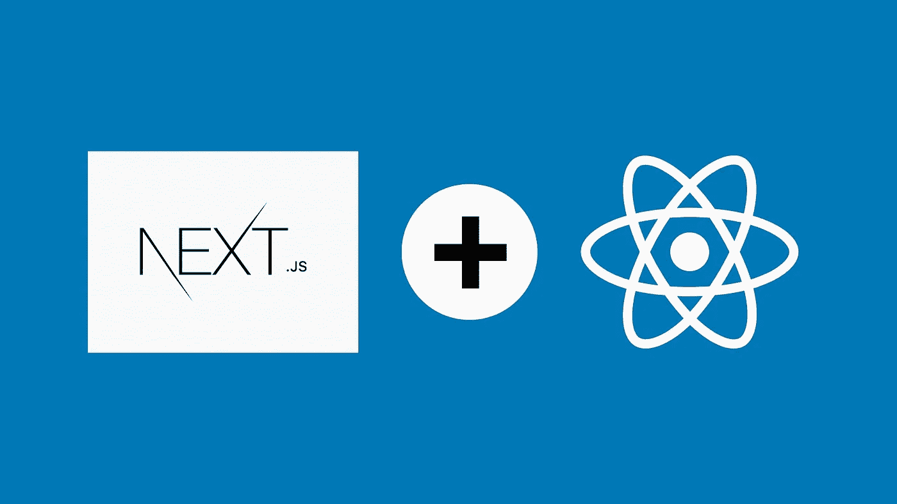

# 2022 年 React 开发者的 7 门最佳 Next.js 课程

> 原文：<https://medium.com/quick-code/7-best-next-js-courses-for-react-developers-2b5c9ad86ff6?source=collection_archive---------1----------------------->

Best Next.js courses

Next.js 是一个越来越受欢迎的框架，它允许 React 开发人员使用 TypeScript 在类似 React 的环境中创建服务器端呈现的应用程序。它是构建单页面应用程序的最新前端框架之一。

由于 NextJS 的快速增长，其需求量很大。您可以轻松创建出色的用户体验和 SEO 友好的 React 应用程序。React 开发者应该考虑让 NextJS 成长为 React 开发者，让他们的 React 应用更上一层楼。

## 1. [Next.js & React —完全指南](https://click.linksynergy.com/deeplink?id=0F1O0otUXQc&mid=47901&u1=csMedium&murl=https%3A%2F%2Fwww.udemy.com%2Fcourse%2Fnextjs-react-the-complete-guide%2F) —【最佳 Udemy 课程】

本课程将帮助您从头开始学习 NextJS，并使用 NextJS 框架构建生产就绪的全栈 ReactJS 应用。很快，你就能从 NextJS 初学者变成高级水平。

在本 Next.js 课程中，您将学习:

*   NextJS 的特性包括预渲染、SSR、数据提取、基于文件的路由和认证。
*   如何用 NextJS 构建客户端和全栈 ReactJS 应用？
*   构建真实的项目，并通过动手项目和示例应用您所学的内容。

该课程从一开始就涵盖了 NextJS 的所有核心特性，因此不需要预先了解 NextJS。您将从理论和多个真实项目中学习所有概念。一旦你完成了这个课程，你就可以从头开始创建你的 NextJS 项目，并申请 NextJS 的工作。

本课程假设您具备一些 [React 知识](/quick-code/10-best-react-courses-to-learn-reactjs-online-36dd0e3d3b68)，但是如果您自上次以来没有使用过 React，它还提供了一个“React 复习”模块。

对于想从头开始学习 NextJS 的初学者来说，本课程包含 25 个小时的引人入胜的内容。它包括一份结业证书。

## 2.next . js——构建 React 应用的终极方式

通过本课程，您将创建一个使用 giphy.com API 搜索 giphy 图像的应用程序。首先，您将使用静态优化的代码创建一个超快速加载的 Next.js 页面。之后，我们将深入探讨如何构建自己的 Giphy 搜索应用程序。

本 NextJS 课程包括:

*   介绍
*   开发工具和预渲染
*   应用开发
*   搜索引擎优化
*   部署和 CI/CD

在本课程的稍后部分，您将学习如何针对搜索引擎优化您的站点以及部署应用程序。完成课程后，你将拥有一个很棒的新框架和一个可以添加到简历中的应用程序。

对于希望学习 NextJS 来构建 React 应用的初学者来说，本课程包含 5 个小时的引人入胜的内容。它包括一份结业证书。

## 3.[2023 年完成 Next.js 开发者:零到精通](https://click.linksynergy.com/deeplink?id=0F1O0otUXQc&mid=47901&u1=csMedium&murl=https%3A%2F%2Fwww.udemy.com%2Fcourse%2Fcomplete-nextjs-developer-zero-to-mastery%2F)——【Udemy】

本课程将帮助您学习 NextJS，构建企业级全栈 ReactJS 应用。作为 2022 年的 Next.js 开发者，你将在这个基于项目的课程中学习到你需要的所有现代工具。此外，为了反应钩子，我们将使用 Hasura (GraphQL)、Context API、[、Airtable](https://coursesity.com/blog/best-airtable-courses/) 、无服务器函数、Framer Motion、Vercel 等等来构建一个巨大的网飞模仿应用程序。

在本课程中，您将:

*   构建真正的企业级 NextJS 应用程序，并将其部署到生产中。
*   像高级开发人员一样学习构建反应式、高性能、大规模的应用程序。
*   了解 NextJS 生态系统中的最新特性和工具，包括，SWR (React Hooks)，Hasura，无服务器函数，Vercel，Framer Motion 等。
*   使用 GraphQL 作为 NextJS 开发人员。
*   了解 SEO 以及如何使用 NextJS 让你的应用程序在 Google 上排名。
*   使用 Airtable 构建全栈应用。
*   学习不同的渲染技术:静态站点生成、服务器端渲染、增量静态再生、水合等。

本课程将全程指导您如何发布专业的 Next.js 应用程序。从最开始，它将向您介绍 Next.js 基础知识，然后是高级主题，这样您就可以为将来可能从事的任何项目做出关于架构和工具的良好决策。

对于希望掌握 NextJS 来构建全栈 ReactJS 应用的初学者来说，本课程包含 36.5 小时的精彩内容。它包括一份结业证书。

## 4.[Learning next . js](https://linkedin-learning.pxf.io/c/1137078/646189/8005?u=https%3A%2F%2Fwww.linkedin.com%2Flearning%2Flearning-next-js&subId1=csMedium)——【领英学习】

在本课程中，讲师 Sandy Ludosky 将向您展示如何从您的 Next.js 项目中获得最佳开发人员体验，无需任何配置，用户不会感到沮丧，并且速度快如闪电。

本 NextJS 课程包括:

*   为什么选择 Next.js
*   入门和学习基础知识
*   预渲染和数据提取
*   设计 Next.js 应用程序的样式

本课程将帮助您学习如何使用 Next.js 实现服务器端渲染。讲师将讲述一些主题，包括页面、数据获取、布局选项、动态路由、API 路由，以及如何使用 Next.js 从头构建 React 项目。

对于想学习 NextJS 的初学者来说，本课程有 2.5 小时的引人入胜的内容。它包括一份结业证书。

## 5.[实用 Next.js & React —用 next . js](https://click.linksynergy.com/deeplink?id=0F1O0otUXQc&mid=47901&u1=csMedium&murl=https%3A%2F%2Fwww.udemy.com%2Fcourse%2Fpractical-nextjs%2F)—【Udemy】构建一个真正的 WebApp

本课程教你如何使用 Next.js、React 和 Strapi 构建一个全栈的 web 应用。此外，您将学习如何使用 React & Next.js 和 [TypeScript](/quick-code/7-free-typescript-courses-for-beginners-da0423ab5943) 构建一个真正的 Fullstack web 应用程序。

在本课程中，您将:

*   了解核心 NextJS 预渲染、SSR、数据提取和路由。
*   使用独特的组件库、样式组件和故事书创建真实的项目。
*   了解如何使用 NextJS 构建全栈 ReactJS 应用。
*   来自地面的最新生态系统。
*   用 Strapi 创建后端，用 NextJS 学习全栈开发。

在课程中，我们将涵盖最重要的主题，如测试工具:Jest 和 React 测试库。您将在编码课程中使用 TDD/TLD 方法进行练习。此外，您将使用强大的工具包，如 CSS-IN-JS、EmotionJS 和 Styled-Components 来构建 UI 组件。

对于想要学习 React 和 NextJS 来构建 web 应用程序的初学者来说，本课程包含 11 个小时的引人入胜的内容。它包括一份结业证书。

## 6.[为初学者构建服务器端渲染的 React 应用](https://pluralsight.pxf.io/c/1137078/424552/7490?u=https%3A%2F%2Fwww.pluralsight.com%2Fcourses%2Fbuilding-server-side-rendered-react-apps-beginners&subId1=csMedium)—【plural sight】

spa 有一个首页下载问题，使用 React 很容易解决。因此，在本课程中，您将学习如何使用 React 解决该问题。本课程将向您展示如何轻松构建在每个登录页面上使用服务器端渲染的高性能 web 应用程序。

本课程包括:

*   为什么服务器端渲染很重要？
*   使用 React 和服务器端渲染构建的基础
*   服务器端呈现和 getInitialProps 中的 REST 数据
*   将您的服务器端渲染应用扩展到现实世界
*   将您的应用部署到节点服务器和生产环境
*   确保您的服务器端应用执行

您将首先学习 React 的基础知识。在下一节中，您将看到如何构建一个 React 应用程序，它将在每个登录页面上呈现来自服务器的完整 HTML，然后在此之后运行 100%的客户端。

接下来，您将学习如何在服务器端呈现的 HTML 中包含 REST 数据。最后但同样重要的是，你将使用 Docker 将你的应用程序部署到 Digital Ocean，这是最好的 web 主机之一，可以将你的应用程序从小规模扩展到大规模。

完成本课程后，您将构建高性能的 React web 应用程序，下载所有必要的 HTML 以进行即时显示。

对于希望学习 NextJS 来构建服务器端 React 应用程序的开发人员来说，本课程包含两个小时的引人入胜的内容。它包括一份结业证书。

## 7.[用 React &节点完成 Next.js 漂亮的作品集 App](https://click.linksynergy.com/deeplink?id=0F1O0otUXQc&mid=47901&u1=csMedium&murl=https%3A%2F%2Fwww.udemy.com%2Fcourse%2Fawesome-nextjs-with-react-and-node-amazing-portfolio-app%2F)—【Udemy】

这个课程非常适合那些想以开发人员开始职业生涯或提高编程技能的人。您将学习如何构建一个创意组合网站，与同事或未来的雇主分享。这个项目涵盖了基本概念。您将了解 React 和 Next JS 如何工作。

在本课程中，您将:

*   使用最新的 Next JS & React 开发无服务器和传统的 web 应用程序。
*   通过创建真实世界的应用程序来清楚地理解 web 概念。
*   创建 SEO(搜索引擎优化)和同构友好的应用程序。
*   在激动人心的 Next 和 React web 开发环境领域确立自己的地位。

在本课程中，您将学习如何使用 Next.js、React 和 [Node.js](/quick-code/8-free-online-courses-to-learn-node-js-6dc7b63543c7) 开发 web 应用程序。本课程将给予你创建项目的信心和技能。因此，您将了解如何申请开发人员工作，以及如何改进 Next.js、React.js 和 Node.js 等现代框架。

对于希望学习 NextJS 和 React & Node 来构建一个令人惊叹的投资组合的初学者来说，本课程包含 69.5 小时的精彩内容。它包括一份结业证书。

> 感谢您阅读本文。我希望这个课程策展能帮助你选择正确的课程来学习 Next.js。如果你想探索更多，你可以查看这些文章:

 [## 学习 React.js 的十大免费课程

### 下面列出了 Udemy、Coursera、edX 等领先提供商提供的顶级免费 React 课程！

medium.com](/quick-code/top-10-free-courses-to-learn-react-cc6a40b9835)  [## 7 个最适合初学者的 VueJS 课程——在线学习 VueJS

### 下面是我列出的初学 app 开发最好的 Vue.js 课程。

medium.com](/quick-code/7-best-vuejs-courses-for-beginners-learn-vuejs-online-d33a65f11222)  [## 学习 React Native 的五大免费在线课程

### 下面列出了 Udemy、Coursera、edX 等领先提供商提供的顶级免费 React 本地课程！

medium.com](/quick-code/top-5-free-online-courses-to-learn-react-native-7a643df06dd7)