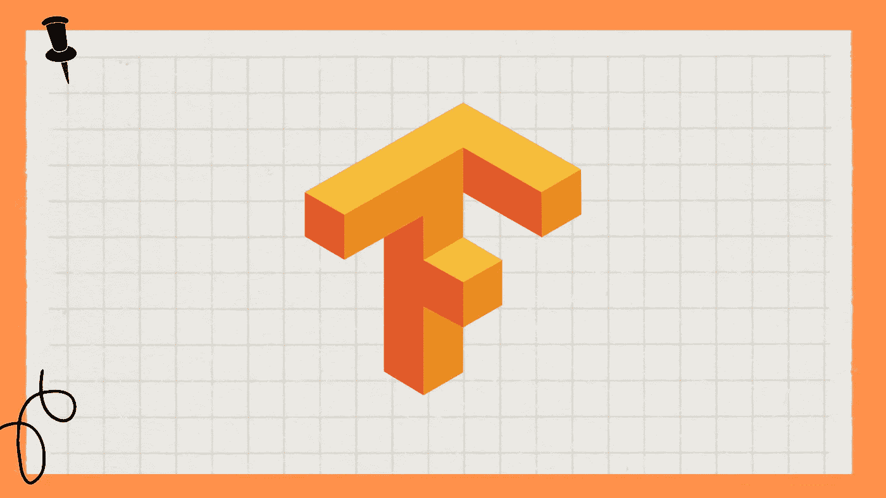

# 在线学习 7 门最佳 TensorFlow 课程[2022 年 11 月]

> 原文：<https://medium.com/quick-code/7-best-tensorflow-courses-to-learn-online-8917c92db86d?source=collection_archive---------3----------------------->

## 以下是我列出的从最好的在线平台学习 Tensorflow 的顶级课程。

Best TensorFlow Courses

对于深度学习和人工智能，Tensorflow 是谷歌建立的最受欢迎的库。许多人工智能和机器学习公司选择它而不是其他库来实现他们的目标。简单来说，如果你想做深度学习，你需要 Tensorflow。

因此，我为想要学习这个机器学习库和深度学习框架的开发者创建了这个最佳 TensorFlow 课程列表。我还创建了 TensorFlow 和 Keras 之间的详细比较，如果你想查看，可以在这里查看。

## 1.[2023 年 TensorFlow 开发者证书:零到精通](https://click.linksynergy.com/deeplink?id=0F1O0otUXQc&mid=47901&u1=csMedium&murl=https%3A%2F%2Fwww.udemy.com%2Fcourse%2Ftensorflow-developer-certificate-machine-learning-zero-to-mastery%2F)——【畅销书 Udemy 课程】

本课程旨在教你通过 TensorFlow 考试并获得谷歌认证 TensorFlow 开发者证书所需的所有技能，以便你可以在简历、LinkedIn、GitHub 和其他社交媒体平台上炫耀。

在本 TensorFlow 课程中，您将学到以下内容:

*   应用深度学习进行时间序列预测。
*   获得成为 TensorFlow 认证开发人员所需的技能。
*   被公认为招聘 TensorFlow 开发者的首选候选人。
*   学习通过 Google 官方的 TensorFlow 开发者证书考试(并添加到简历中)。
*   使用计算机视觉、卷积神经网络和自然语言处理构建张量流模型。
*   通过 TensorFlow 评估考试测试您的能力，以增加您的机器学习和深度学习技能。
*   了解如何将机器学习集成到工具和应用程序中。
*   学习使用最新的 TensorFlow 2 建立所有类型的机器学习模型。
*   用深度神经网络和卷积神经网络构建图像识别和文本识别算法。
*   分析真实世界的图像，以可视化计算机如何“看到”信息，绘图损失，并通过卷积计算准确性。

**主题:**

*   张量流基础
*   张量流神经网络回归
*   张量流神经网络分类
*   具有张量流的计算机视觉和卷积神经网络
*   张量流迁移学习第一部分:特征提取
*   TensorFlow 迁移学习第 2 部分:微调
*   里程碑项目 1:食物愿景
*   TensorFlow 中的 NLP 基础
*   里程碑项目 2: SkimLit
*   TensorFlow 中的时间序列基础
*   里程碑项目 3:(惊喜)

这是一门通过谷歌 TensorFlow 开发者认证考试的优秀课程，内容精彩，时长超过 63.4 小时，课程评分为 4.7 分(满分为 5 分)。它包括一份结业证书。

## 2.[人工智能、机器学习和深度学习 TensorFlow 简介](https://coursera.pxf.io/c/1137078/1213622/14726?u=https%3A%2F%2Fwww.coursera.org%2Flearn%2Fintroduction-tensorflow&subId1=csMedium)——【Coursera】

对于软件开发人员来说，了解如何使用他们的工具来构建可扩展和可维护的人工智能算法至关重要。因此，本课程将帮助您学习如何使用 TensorFlow，这是一个流行的开源机器学习框架。

在本 TensorFlow 课程中，您将:

*   了解使用 TensorFlow 的最佳实践，tensor flow 是一个流行的开源机器学习框架。
*   在 TensorFlow 中构建初级神经网络。
*   为计算机视觉应用训练神经网络。
*   了解如何使用卷积来改善您的神经网络。

在本课程中，您将学习机器学习和深度学习的最基本原理。作为这一新的 deeplearning.ai TensorFlow 专业化的结果，你将能够通过学习如何使用 TensorFlow 来实现这些原则，从而将这些原则应用于现实世界的问题。

这是一门学习用于人工智能、机器学习和深度学习的 TensorFlow 的优秀课程，具有超过 18 小时的引人入胜的内容，课程评分为 4.7 分(满分为 5 分)。它包括一份结业证书。

## 3. [Tensorflow 2.0:深度学习和人工智能](https://click.linksynergy.com/deeplink?id=0F1O0otUXQc&mid=47901&u1=csMedium&murl=https%3A%2F%2Fwww.udemy.com%2Fcourse%2Fdeep-learning-tensorflow-2%2F)——【Udemy】

从一些基本模型开始，到最先进的，这门课程将探索机器学习的几乎每一个方面。你还将学习所有主要的深度学习架构，包括深度神经网络(图像处理)和卷积神经网络(序列数据)。

在本 TensorFlow 课程中，您将学到以下内容:

*   人工神经网络/深度神经网络。
*   预测股票收益
*   时间数列预测法
*   计算机视觉
*   如何构建深度强化学习炒股机器人？
*   生成对抗网络。
*   推荐系统
*   图像识别
*   卷积神经网络(CNN)。
*   递归神经网络。
*   使用 Tensorflow Serving 通过 RESTful API 为您的模型提供服务。
*   使用 Tensorflow Lite 为移动(Android、iOS)和嵌入式设备导出您的模型。
*   使用 Tensorflow 的分布策略来并行学习。
*   低级 Tensorflow，渐变带，以及如何建立自己的自定义模型。
*   具有深度学习的自然语言处理(NLP)。
*   用代码演示摩尔定律。
*   迁移学习创建最先进的图像分类器。

**高级 TensorFlow 主题包括:**

*   急切的执行
*   梯度带
*   部署具有 Tensorflow 服务的模型(云中的 Tensorflow)。
*   使用 Tensorflow Lite(移动和嵌入式应用程序)部署模型。
*   具有分布策略的分布式张量流训练。
*   编写您自己的自定义张量流模型。
*   将 Tensorflow 1.x 代码转换为 Tensorflow 2.0。
*   常数、变量和张量。

**要求:**Python 和 Numpy 的知识。

这是一门学习 TensorFlow 2.0、人工智能和深度学习的优秀课程，内容超过 22.5 小时，课程评分为 4.6 分(满分为 5 分)。它包括一份结业证书。

## 4.[tensor flow 2](https://coursera.pxf.io/c/1137078/1213622/14726?u=https%3A%2F%2Fwww.coursera.org%2Flearn%2Fgetting-started-with-tensor-flow2&subId1=csMedium)入门——【Coursera】

Tensorflow 是一个开源的机器库，是深度学习中使用最广泛的框架之一。此外，Tensorflow 2 具有流线型的界面，可以方便所有技能水平的用户，从初学者到高级用户。该课程是为 Tensorflow 新手和有 Tensorflow 1.x 经验的用户设计的。

**你将从这个 TensorFlow 课程中学到什么:**

*   张量流简介
*   顺序模型 API
*   验证、规范和召回
*   保存和加载模型
*   顶点工程

在本课程中，您将学习如何使用 Tensorflow 使用顺序 API 构建、训练、评估和预测深度学习模型，验证模型并包括正则化，实现回调，以及使用顺序 API 保存和加载模型。

这是一门学习 TensorFlow 2 的优秀 Coursera 课程，包含超过 26 小时的精彩内容，课程评分为 4.9 分(满分为 5 分)。它包括一份结业证书。

## 5.[完成 Tensorflow 2 和 Keras 深度学习训练营](https://click.linksynergy.com/deeplink?id=0F1O0otUXQc&mid=47901&u1=csMedium&murl=https%3A%2F%2Fwww.udemy.com%2Fcourse%2Fcomplete-tensorflow-2-and-keras-deep-learning-bootcamp%2F)——【Udemy】

本课程将帮助你学习如何用谷歌的 TensorFlow 2 框架创建深度学习人工神经网络。你将学习使用 Tensorflow 2 和 Keras 与 Python 进行深度学习。在整个课程中，你将学会如何以一种简单易懂的方式理解 Google 的 TensorFlow 2 框架。

在本 TensorFlow 课程中，您将:

*   学会使用 TensorFlow 2.0 进行深度学习。
*   利用 Keras API 快速构建 Tensorflow 2 模型
*   用卷积神经网络进行图像分类。
*   将深度学习用于医学成像。
*   用递归神经网络预测时间序列数据。
*   使用生成性对抗网络(GANs)生成图像。
*   利用深度学习进行风格转移。
*   用 RNNs 和自然语言处理生成文本。
*   通过 API 提供 Tensorflow 模型。
*   使用 GPU 加速深度学习。

本课程将涵盖预测未来房价、医学图像分类、预测未来销售和创建人工文本。学生将会发现本课程很好地平衡了理论和实践，包括 jupyter 笔记本指南和易于理解的笔记和幻灯片。

这是一门学习 TensorFlow 2 的优秀 Coursera 课程，包含超过 19 小时的精彩内容，课程评分为 4.6 分(满分为 5 分)。它包括一份结业证书。

## 6. [TensorFlow:处理图像](https://linkedin-learning.pxf.io/c/1137078/646189/8005?u=https%3A%2F%2Fwww.linkedin.com%2Flearning%2Ftensorflow-working-with-images&subId1=csMedium)——【Linkedin Learning】

在这个实践课程中，机器学习和人工智能模型专家乔纳森·费尔南德斯(Jonathan Fernandes)教你如何使用 TensorFlow 处理灰度和彩色图像，以及转移学习、提前停止和 TensorBoard 训练增强。

您将从本 TensorFlow 课程中学到什么:

*   神经网络和图像
*   迁移学习
*   监控培训过程

如果你想掌握深度学习，你的工具包中需要 TensorFlow 2.0。它正迅速成为最受欢迎的深度学习框架之一。

这是一门学习 TensorFlow 的绝佳课程，包含超过 40 分钟的精彩内容。它包括一份结业证书。

## 7.[使用 TensorFlow 2](https://pluralsight.pxf.io/c/1137078/424552/7490?u=https%3A%2F%2Fwww.pluralsight.com%2Fcourses%2Fbuild-train-deploy-first-neural-network-tensorflow&subId1=csMedium) 构建、训练和部署您的第一个神经网络

本课程教授从零开始构建神经网络的基础知识。首先，您将研究如何使用机器学习来创建数据驱动的模型。接下来，您将学习如何将这些原则应用于神经网络，并开发一个从图像预测服装类别的模型。

您将从本 TensorFlow 课程中学到什么:

*   为什么要学 TensorFlow？
*   设置 TensorFlow 环境
*   人工智能和机器学习概念
*   使用 TensorFlow 应用机器学习工作流
*   理解神经网络
*   建立和训练你的第一个神经网络
*   监控和改善神经网络性能
*   部署你的神经网络

之后，您将了解 TensorFlow 如何提供内置工具，如 TensorBoard，用于简单地评估和改进神经网络。最后，您将学习如何部署您的神经网络，并为客户提供其预测能力。

完成本课程后，您将掌握使用机器学习和 TensorFlow 构建、训练和部署预测神经网络所需的知识和技能。

这是一门用 TensorFlow 构建您的第一个神经网络的极好课程，包含超过 3 小时的精彩内容。它包括一份结业证书。

> 感谢您阅读这篇关于最佳 TensorFlow 课程的文章。我希望这次课程策划能帮助你选择正确的课程来学习 TensorFlow。如果你想探索更多，你可以查看这些文章:

 [## 10 门免费 Django 课程，学习 Python 中的 Django

### 众所周知，Python 是当今最流行的编程语言之一，Django 使 web 开发…

medium.com](/quick-code/10-free-django-courses-for-beginners-to-learn-django-ce2d598957a)  [## 2022 年对 Python 开发者有用的 10 个 Python 工具

### Python 作为开发人员和数据社区中最受欢迎的语言之一已经不足为奇了…

medium.com](/quick-code/10-useful-python-tools-for-python-developers-in-2022-4c26de31b358)  [## 6 个最佳 AWS 初学者和专家认证[2022 年 10 月]

### 根据您的技能、经验和职业，以下是我最喜欢的为您的 AWS 云认证做准备的资源…

medium.com](/quick-code/6-best-aws-certifications-for-beginners-experts-32231028f38f)