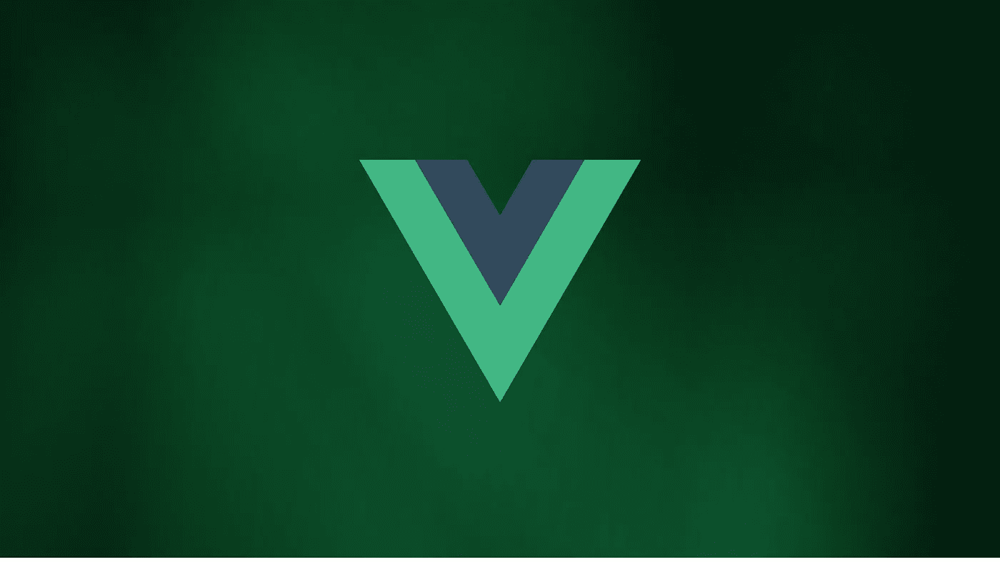
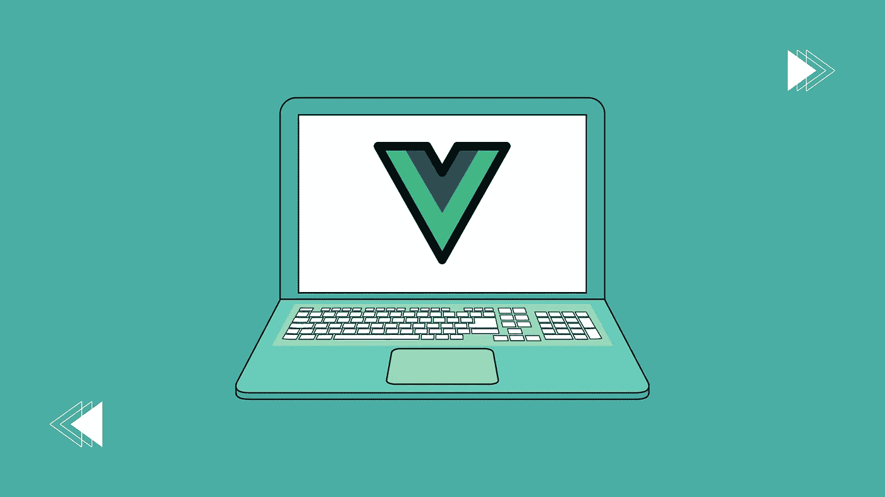
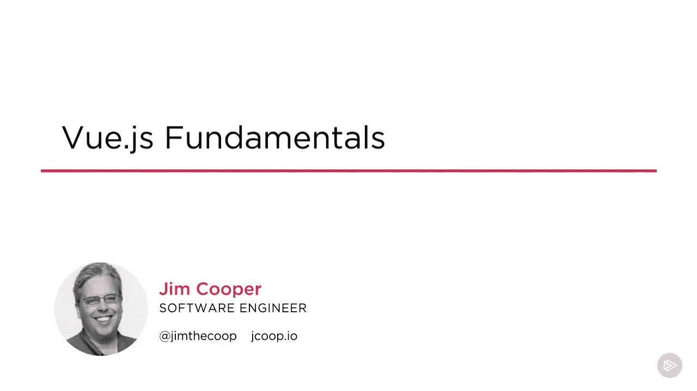

# 7 个最适合初学者的 VueJS 课程——在线学习 VueJS

> 原文：<https://medium.com/quick-code/7-best-vuejs-courses-for-beginners-learn-vuejs-online-d33a65f11222?source=collection_archive---------4----------------------->

## 下面是我列出的初学 app 开发最好的 Vue.js 课程。

VueJS 是开发人员社区中流行的 JavaScript 框架。它提供了许多现成的特性，主要是无缝数据绑定、反应性和可组合性。此外，对于初学者来说，它是一个非常好的库，因为它允许开发人员快速创建轻量级的、高性能的 web 界面，并具有令人惊叹的感觉。

如果你熟悉 Angular 2+和 [ReactJS](/quick-code/10-best-react-courses-to-learn-reactjs-online-36dd0e3d3b68) ，你会喜欢 VueJS 的强大和灵活性，它使构建从小部件到大的企业级应用变得轻而易举。

## 1. [Vue —完整指南(包括路由器&组成 API)](https://click.linksynergy.com/deeplink?id=0F1O0otUXQc&mid=39197&u1=csMedium&murl=https%3A%2F%2Fwww.udemy.com%2Fcourse%2Fvuejs-2-the-complete-guide%2F)—【Udemy】

从基础开始，本课程详细介绍了 Vue.js 3 的最新版本。本课程将涵盖所有核心基础知识，但我们不会止步于此，我们还将讨论高级概念，包括 Vue 3 中引入的复合 API。

**在本课程中，您将学习:**

*   创建令人惊叹的 Vue.js 应用程序——从小而简单的应用程序到大型企业级应用程序。
*   了解 Vue.js 背后的理论，并运用到真实项目中。
*   将 Vue.js 用于多页和单页应用程序。
*   介绍 Vue 3 及其新的组合 API。

在本课程中，我们将从头开始，学习什么是 Vue.js 以及它是如何工作的，然后再进入更高级的主题。随着课程的进行，它将涵盖更复杂和更高级的主题，例如如何输出反应数据&监听事件，设置开发环境和工作流，等等。

这是一门非常适合初学者和中级开发人员学习 Vue.js 的课程，包含超过 31.5 小时的引人入胜的内容，课程评分为 4.7 分(满分为 5 分)。

## 2. [Vue.js 3 必备培训](https://linkedin-learning.pxf.io/c/1137078/646189/8005?u=https%3A%2F%2Fwww.linkedin.com%2Flearning%2Fvue-js-3-essential-training&subId1=csMedium)——【领英学习】

本课程由 Ray Villalobos 教授，将向您深入传授 Vue.js 3 的原理，包括渲染、计算值和创建组件。首先，您将学习如何安装和配置 Vue.js 3。之后，您将学习如何使用模板，然后深入研究增强库函数的属性。此外，它还讨论了数组、对象以及如何使用表达式创建动态类。

**你将学到什么:**

*   管理反应
*   样式和动画
*   使用组件
*   了解 CLI
*   创建一个真实的项目
*   重构代码笔
*   添加功能

接下来，Ray 将带您创建过渡和组件。通过 Vue CLI，您将了解如何安装 Vue 路由器，以及在安装项目时会收到什么内容。最初，他向您展示了如何设置和构建一个真实的项目。然后，他会带你完成增强你的应用程序的过程，这样你就会对应用程序 API 感到舒服了。最后，Ray 描述了如何给你的应用添加新功能。

这是一门非常适合初学者学习 Vue.js 的课程，内容精彩，时长超过 5 个小时，课程评分为 4.7 分(满分为 5 分)。课程包括结业证书。

## 3.[学习 VueJS](https://www.pjatr.com/t/TUJGR0lLR0JHR0pMSUtCR0ZISk1N?sid=csMedium&url=https%3A%2F%2Fwww.codecademy.com%2Flearn%2Flearn-vue-js)——【代码学院】

本课程将教你如何创建和设计处理真实世界动态数据的数据处理表单。在本课程中，您将学习如何配置 Vue.js，以及如何使用 Vue 的基本功能来应对复杂的前端挑战。

**你将学到什么:**

*   Vue 简介
*   Vue 数据
*   Vue 表单
*   使用 Vue 的样式元素

本课程面向已经通过 JavaScript 课程学习了 JavaScript 入门课程的学员。此外，本课程将经常引用 HTML 和 CSS 代码。所以建议学习者先上 HTML 入门，[学 CSS](https://coursesity.com/blog/best-css-courses-for-beginner/) 再学 Vue.js。

以超过 3 小时的有用内容为特色，这是初学者学习 Vue.js 的一个很好的课程。它包括一个完成证书。

## 4.使用 Vue JS 3 & Firebase 构建 Web 应用程序

本课程面向那些对使用 Vue 3(或 Vue 2)和 Firebase 构建全栈应用感兴趣的人。从最基础的开始，然后使用 Vue JS 3 创建全功能的应用程序，这个课程带你从新手到忍者。

**在本课程中，您将学习:**

*   成为一名 Vue 3 忍者，学习如何从头开始创建 Vue 3 应用程序。
*   使用 Vue 和 Firebase 构建和部署 4 个真实世界的 web 应用。
*   了解 Vue 路由器、Vue CLI、Options API、Composition API、Teleport 等。
*   近距离亲身体验 Vue 3 的最新功能(如 Composition API)。
*   了解如何使用 Firebase 作为 Vue 应用程序(如数据库、认证服务或托管服务)的后端。

此外，我们将深入了解 Vue 3 提供了什么，包括组合 API 和可组合函数。本课程还将教您如何使用 Firebase——这是一项由 Google 提供的免费在线服务，将作为我们 Vue 应用程序的后端。

这是一门非常适合初学者和中级开发人员学习 Vue.js 的课程，包含超过 31.5 小时的引人入胜的内容，课程评分为 4.8 分(满分为 5 分)。

## 5.[Learning vue . js](https://linkedin-learning.pxf.io/c/1137078/646189/8005?u=https%3A%2F%2Fwww.linkedin.com%2Flearning%2Flearning-vue-js-8602681&subId1=csMedium)——【领英学习】

迈克尔·苏立文教授的这门课程解释了 Vue 框架，并演示了如何开始将它添加到网页中。此外，他还告诉您如何处理数据绑定和控制逻辑。

**你将学到什么:**

*   管理动态内容和行为
*   表单控件绑定
*   渲染和样式逻辑
*   使用 Vue 组件

在介绍了动态内容、表单控件绑定、呈现和样式逻辑之后，Michael 深入研究了 Vue 的组件系统，包括 CLI 工具。使用组件系统，您可以创建模块化的、可重用的代码，帮助您简化和清理前端代码。

这是一门非常适合初学者和中级开发人员学习 Vue.js 的课程，内容引人入胜，时长超过 2 小时，课程评分为 4.7 分(满分为 5 分)。

## 6.[完成 Vue 掌握 2022(皮尼亚，作曲 API，Vitest)](https://click.linksynergy.com/deeplink?id=0F1O0otUXQc&mid=39197&u1=csMedium&murl=https%3A%2F%2Fwww.udemy.com%2Fcourse%2Fcomplete-vue-js-developer-zero-to-mastery-vuex%2F)——【Udemy】

Vue 上最全面的资源侧重于效率。基于项目的课程向学生介绍了 2022 年成为 Vue JS 开发人员所需的所有现代工具链。在这个项目中，您还将使用 Vue、Pinia、Vue Router、Composition API、Firebase、Vitest、Sass 和许多其他工具构建一个类似 Spotify 的大型音乐播放器应用程序。Firebase 将为这款全栈应用提供支持。

**在本课程中，您将学习:**

*   掌握 Vue 设计模式。
*   使用 Vue 路由器路由。
*   将应用程序转换为渐进式 Web 应用程序构建企业级 Vue 应用程序，并将其部署到生产环境中。
*   从零开始掌握一个 Vue 开发者的最新生态系统。
*   学习使用 TailwindCSS、Sass、CSS 动画和转场来构建漂亮的应用程序。
*   设置身份验证和用户帐户。
*   使用 Firebase 构建全栈应用。
*   像高级开发人员一样学习构建反应式、高性能、大规模的应用程序。
*   使用最新的 ES6/ES7/ES8/ES9/ES10/ES11 JavaScript 编写干净的代码。

在整个课程中，我们将指导您完成发布专业 Vue 项目的各个步骤，您将亲自动手。从一开始，您将学习 VueJS 框架的基础知识。然后，我们将继续讨论高级主题，这样您就可以在未来对架构和工具做出明智的决定。

这是一门非常适合初学者和中级开发人员学习 Vue.js 的课程，包含超过 28 小时的引人入胜的内容，课程评分为 4.6 分(满分为 5 分)。

## 7. [Vue.js 基础知识](https://pluralsight.pxf.io/c/1137078/424552/7490?u=https%3A%2F%2Fwww.pluralsight.com%2Fcourses%2Fvuejs-fundamentals&subId1=csMedium)—【plural sight】

Vue.js Fundamentals

本课程为使用 Vue 构建强大的生产就绪型应用奠定了坚实的基础。在第一步中，您将使用 Vue CLI 创建您的项目，包括组件，并与它们进行交互。

接下来，您将学习如何创建路由、从一个页面导航到另一个页面、使用 Vuex 管理状态以及创建定制指令。最后，您将应用程序部署到生产环境中。完成本课程后，您将掌握创建专业可靠的 Vue 应用程序所需的基本技能。

**你将学到什么:**

*   Vue.js CLI 入门
*   创建 Vue.js 组件和使用模板语法
*   启用组件间通信
*   逐页传送
*   使用 Vuex 管理状态和服务器通信
*   创建自定义指令和过滤器
*   将 Vue 应用部署到生产中

这是一门非常适合初学者和中级开发人员学习 Vue.js 的课程，有超过 6 个小时的精彩内容。它包括一个结业证书。

> 感谢您阅读本文。我希望这个课程策展帮助你选择正确的课程来学习 Vue.js。如果你想探索更多，你可以查看这些文章:

 [## 学习 React.js 的十大免费课程

### 下面列出了 Udemy、Coursera、edX 等领先提供商提供的顶级免费 React 课程！

medium.com](/quick-code/top-10-free-courses-to-learn-react-cc6a40b9835)  [## 在线学习 Node.js 的 8 门免费课程

### 下面是我列出的供初学者学习 Node.js 的顶级免费 Node.js 课程

medium.com](/quick-code/8-free-online-courses-to-learn-node-js-6dc7b63543c7)  [## 7 门免费在线颤振课程，学习 App 开发

### 这是我从 Udemy，Educative，Alison 等顶级平台为初学者提供的免费课程列表。

medium.com](/quick-code/7-free-online-flutter-courses-to-learn-app-development-a7cf7e6b7ca4)