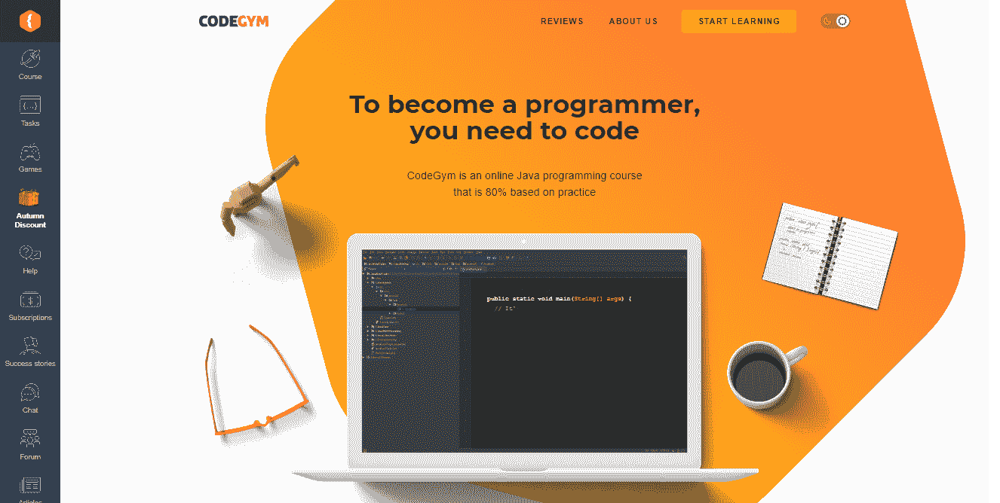

# 从 Java 初学者到专业 Java 开发人员的 7 个初步步骤

> 原文：<https://medium.com/quick-code/7-first-steps-from-java-beginner-to-a-professional-java-dev-7332f8c5f928?source=collection_archive---------0----------------------->

Photo by [Glenn Carstens-Peters](https://unsplash.com/@glenncarstenspeters?utm_source=unsplash&utm_medium=referral&utm_content=creditCopyText) on [Unsplash](https://unsplash.com/s/photos/computer?utm_source=unsplash&utm_medium=referral&utm_content=creditCopyText)

不久前，人们发现编程是一件高不可攀的事情，一件很少有人能学会的事情。但是那些时代已经一去不复返了。如今，越来越多的人希望掌握编程技能。幸运的是，有许多初学者友好的语言可供新手开发者开始他们的道路，Java 就是其中之一。网上有很多有用的资源，可以帮助你轻松地学习 Java，并更顺利地进入编程。

在这篇文章中，我将向你展示编程中从零到英雄的道路是真实的——你只需要有正确的方法和一些技巧就可以做到。所以，不要再拖延了，让我们开始吧。

# 如何从 Java 初学者升级为专业的 Java 开发人员？

遵循这些步骤将有助于你提高自己的水平，并使自己与从事 Java 开发多年的专业开发人员平起平坐。

# 1.对 OOP 原则有一个坚实的基础和清晰的概念

Java 是一种面向对象的语言，如果没有对 OOP 原理的清晰认识，你很难意识到 Java 能给你带来的所有机会。它们实际上是无穷无尽的。所以对 Java 有很好的洞察是很有必要的。即使 Java 强迫您在一个类中编写所有代码，如果您的所有代码都在同一个“主”类中，而没有分析您的域并将其表示为具有对应关系的类的层次结构，那么您并没有真正偏离过程化风格。

相反，你应该知道如何遵循 OO 原则来设计一个项目。为此，获取坚实的原理、对象建模、继承、设计模式和一些必读书籍中涵盖的许多其他概念的知识。在后者中，我建议熟悉:

*   “设计模式:可重用的面向对象软件的元素”“四人帮”
*   [“鲍勃大叔”罗伯特·马丁的《干净的代码](https://www.amazon.com/Clean-Code-Handbook-Software-Craftsmanship/dp/0132350882)
*   [“鲍勃叔叔”罗伯特·马丁的《干净的建筑》](https://www.amazon.com/Clean-Architecture-Craftsmans-Software-Structure/dp/0134494164)
*   马丁·福勒和肯特·贝克的《重构》(第二版)
*   肯特·贝克的《极限编程讲解》
*   Kent Beck 的“测试驱动开发:举例说明”

# 2.掌握基本 API

你可能已经获得了很强的理论知识，但是如果你不知道语言结构和主要的 API，比如 java.lang.*、I/O、集合、线程、JDBC 等等，你很难将它们付诸实践。而构建 web 应用程序需要您精通 servlets 和 JSP 概念，尽管一些现代框架在这些基础上为您提供了良好的抽象水平。

# 3.定期坚持编码

在学习编码理论时，你可能会认为事情比大家谈论的要简单得多。但只是到你开始练习的那一刻。理论是必要的，然而，如果你不能把你的知识付诸实践，那就没什么区别了。所以你需要在看书、看 YouTube 上的教程、听播客的同时完成动手任务。

为了对自己的编程技能有信心，你需要编写大量的代码，这在我进一步列出的平台中是可能的。只有重复的实践才能扩展你的经验，让你能够从事高级的现实项目。

然而，为了避免采用不好的实践和陷入已知的反模式(如果你是自学的话，这是很容易做到的)，你可能需要有一个经验丰富的导师，他会检查你的代码，并指导你完成自我改进的旅程。

## CodeGym

如果你只想专注于学习 Java，可以考虑 CodeGym。这是一门独特的编程课程，它将迫使你编写大量的代码。尽管如此，它还是用户友好的，并提供讲座和 1200 个实践任务，从 Java 基础到并发性和框架。该课程使用最新技术创建，包括可视化、游戏化和讲故事，旨在使学习过程无障碍。

除此之外，分配给你的虚拟导师会在瞬间检查你的解决方案，所以你不必永远等待验证。另一个资源是 CodeGym 论坛，你可以在那里寻求作业的帮助。在这里，学生们回答彼此的问题，并讨论他们如何应对每一项任务。

## 极客论坛

这是另一个学习平台，在这里你可以自学用 Python、C、C++和 Java 语言编写代码。有了这些资源，你可以准备面试问题，在科技巨头中找到一份程序员的工作，对你的代码进行细微的调整和测试，并有机会在交互式 IDE 中学习。

[GeeksforGeeks](https://www.geeksforgeeks.org) 的创建是为了让你完全了解，无论你是想学习算法、数据结构还是编程本身。所以，如果你想得到你的问题的写得好的，考虑得好的，解释得好的解决方案，这是正确的地方。

## 代码集

Codecademy 是一家致力于打造卓越学习体验的独特教育公司。这里编程语言的选择几乎是无穷无尽的。无论你想知道如何学习 Java、Python、Kotlin、Swift、Ruby 或任何其他语言，这个网站都能满足你。如果你不确定从哪里开始，这个平台会提供一个小测验来给你指出正确的方向。

在学习过程中，您还将编写真实的、可工作的代码，并在提交后立即获得反馈。得益于所获得的知识，你很快就能在现实世界的项目中创建自己的交互式网页。除此之外，该网站还提供致力于后端开发的课程，因此你可以在未来成为一名全栈开发人员。

# 4.加入论坛

在编程世界里，我们都在同一条船上。每天都有人开始我们已经开始的编程之旅。有人选择使用和我们一样的技术。有人已经知道我们在现实项目中所面临的特定问题的解决方案。

虽然一个框架的简单测试可能不会给你带来真正的问题，但是当你开始使用这个框架时，奇怪的错误会时不时地出现。但是，在这种情况下，最糟糕的事情是，您很难在官方文档中找到问题的解决方案。这就是订阅相关论坛可以帮助你的地方。可能有人已经面临同样的问题并找到了解决方案。所以，你可以寻求帮助，让你的问题都得到解答。

这里是我最喜欢的论坛，我建议把它们放在列表中。

*   [StackOverflow](https://stackoverflow.com) 是一个开放的社区，面向寻求帮助解决最棘手的编码问题、渴望与其他专家分享知识并寻找工作的程序员。

[**Reddit**](https://www.reddit.com) **频道，如:**

*   r/编程
*   学习编程
*   r/代码在一起
*   r/编程工具
*   r/游戏开发
*   r/Prog articles
*   r/webdev
*   r/每日程序

[**松弛**](https://slack.com/intl/en-ua/) **通道，包括:**

*   Hashtag Developers，Slack 上最大的开发者社区。
*   European Dev Explorer，这是一个对即将移居欧洲或在欧洲内部工作的程序员很有帮助的资源。在这里，您可以了解更多关于欧洲最佳城市的信息，并询问有关搬迁和相关事宜的问题，包括生活成本、税收和市场上最受欢迎的工作。
*   DevOps Chat 是另一个由热爱技术的开发人员组成的松散社区，他们可以夸耀自己在行业中的丰富工作经验。在这里，您可以找到 DevOps 的工作、活动和文章，或者与其他社区成员建立交流。
*   SitePoint 是一个网站设计者和开发者的社区，他们希望提高自己的开发技能，更好地了解相关领域的专家，如 UI/UX 等。
*   [黑客新闻](https://news.ycombinator.com)是一个排名第一的论坛，在这里所有的黑客聚集在一起了解软件开发世界的最新消息，获得编码问题的答案，并分享工作经验。

# 5.阅读并理解源代码

一个好的开发人员不仅应该知道如何使用框架，还应该能够阅读各种库和类的代码以及其他专家编写的代码。后者有助于你更好地理解内部的工作机制，了解和比较别人解决问题的方式，以及你是怎么做的。

注册到 [GitHub](https://github.com) 代码托管平台，并在那里找到一个源代码库。确保你理解你阅读的每一行代码。

# 6.跟踪新的技术趋势

关注编码的趋势。因为它们变化很快，你迟早会发现你现在使用的框架已经过时了。然而，新的框架和技术开始发挥作用，增加了一组扩展的特性来帮助您更容易地解决问题。最后，全新的框架取代了过时的框架，所以你应该关注编程中正在发生的事情。

# 7.获得一种以上的开发方法

如果你想从事有趣的高薪项目，熟悉不同的方法论是有意义的，比如敏捷、SCRUM、XP、瀑布等等。有时候，不同的公司使用不同的开发方法——一些公司喜欢敏捷，而另一些公司选择瀑布模型。因此，了解不同的方法可以让你成为市场上灵活且极具竞争力的专家。

# 结束语

这些是我在多年的指导和编程工作中发现的步骤。在经历了一些错误之后，我开始了这些实践，并从我自己、我的学生和其他开发人员那里吸取了教训。你可以把它们作为参考点，或者找到你个人的方法，这也可以。唯一应该保持不变的是一个常规的实践，继续写代码以在你未来的职业生涯中取得成功。

至于现在，如果你对这些做法有什么要补充的，欢迎在评论中分享你的想法。