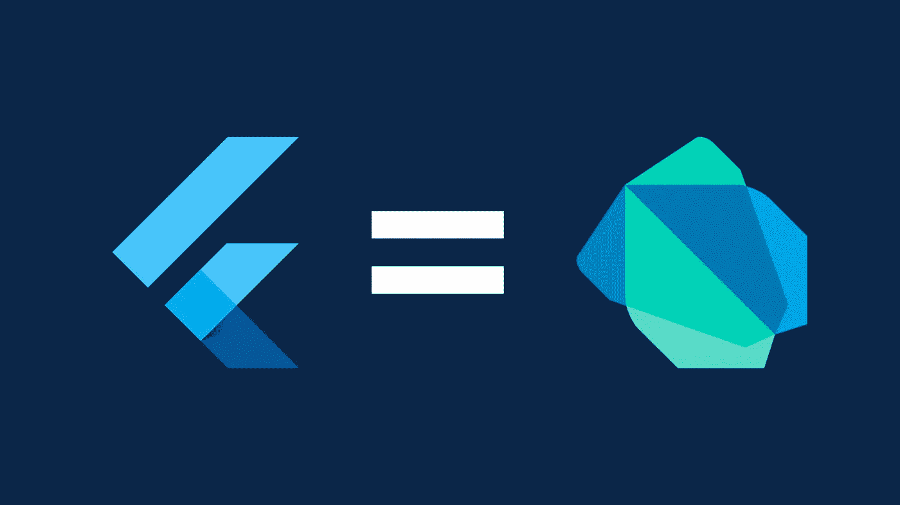

# 7 门免费在线颤振课程，学习 App 开发

> 原文：<https://medium.com/quick-code/7-free-online-flutter-courses-to-learn-app-development-a7cf7e6b7ca4?source=collection_archive---------0----------------------->

## 这是我从 Udemy，Educative，Alison 等顶级平台为初学者提供的免费课程列表。

Free Flutter Courses

大家好。我希望你一切都好。我回来是为了结束你对其他免费编程课程的追求。这次我整理了一份来自顶级平台的最佳免费 flutter 课程列表，帮助你立即学习应用程序开发。但在此之前，我们先了解一下什么是 Flutter，为什么要学习 Flutter。

Flutter 是 Google 创建的跨平台软件开发工具包。它使用 Dart 作为其用于 [Android](https://coursesity.com/free-tutorials-learn/android) 和 [iOS 应用开发](https://coursesity.com/blog/best-ios-development-tutorials/)的编程语言。要使用 Flutter 创建应用程序，您需要 Dart。然而，如果你熟悉 OOP 概念和编程语言，如 Java、 [Python](https://coursesity.com/free-tutorials-learn/python) 、C++或 JavaScript，你可以跳过学习 Dart。

此外，Flutter 非常灵活，允许您将应用程序部署到任何设备上(如移动设备、平板电脑和桌面设备)，还提供了热重新加载等功能，让您可以非常快速地创建和迭代。通过支持快速的应用程序开发过程，它可以节省您完成应用程序的时间。

即使 Dart 是一门不太出名的编程语言，但还是值得学习 Flutter。近年来，它的受欢迎程度急剧上升。除了它允许多平台应用程序开发的事实之外，还有其他几个原因让你应该学习 Flutter。使用 Flutter 开发移动应用程序的成本更低，因为不需要构建和维护两个移动应用程序(一个用于 iOS，一个用于 Android)。

## 1.[飞镖&初学者用](https://click.linksynergy.com/deeplink?id=0F1O0otUXQc&mid=47901&u1=csMedium&murl=https%3A%2F%2Fwww.udemy.com%2Fcourse%2Fflutter-latest-course%2F)s—【Udemy】

Dart Flutter

Udemy 的这个免费的 Flutter 课程将帮助你学习跨平台应用程序开发，从而开始你的 Flutter 开发者生涯。您还将通过 Dart 编程的一个单独部分来学习有价值的组件。更多的概念将包括 HTTP 请求、JSON 解析、导航等。

在本颤振课程中，您将:

*   为 Android、iOS、Web 和桌面构建应用程序。
*   了解 Dart 和 Flutter 跨平台框架。
*   根据说明完成一个项目组合就绪的项目。
*   在 Dart & Flutter 中处理网络请求、UI 构建等。
*   了解小部件的基本知识，并打下坚实的基础。

完成后，你将对 Flutter 的基本概念有很深的了解，比如有状态和无状态的窗口小部件、窗口小部件树等等。以及列表、地图等 Dart 基本概念。

这是 Udemy 上的顶级免费颤振课程，5 门课程中有 4.5 门，时长 1 小时 40 分钟。此外，请记住，由于这是一门免费的 Udemy 课程，所以完成后您不会获得证书。

## 2.[学飞镖:舞动的第一步](https://www.educative.io/courses/learn-dart-first-step-to-flutter?affiliate_id=5088579051061248)——【教育性】

Flutter 由 Google 开发，是一个面向 iOS 和 Android 的移动 UI 框架。由于用 Dart 编写的 Flutter 应用程序，Dart 在开发人员中广受欢迎。使用 Flutter 开发应用之前需要学习 Dart。

这个教育性的课程将帮助你学习飞镖。然而，你不能在关于 Dart 的对话中不提到 Flutter。在本课程中，您将学习 Dart 的基础知识，并开始您的颤振学习之旅。

本颤振课程的主题包括:

*   Dart 入门
*   数据类型和变量
*   经营者
*   达特的收藏
*   控制流语句
*   探索功能
*   班级

这是一门顶级的免费舞蹈教育课程，时长 9 小时。此外，完成本课程后，您将获得一份证书。

## 3.[预扑&飞镖:开始之前要知道的一切](https://click.linksynergy.com/deeplink?id=0F1O0otUXQc&mid=47901&u1=csMedium&murl=https%3A%2F%2Fwww.udemy.com%2Fcourse%2Fpre-google-flutter-and-dart-everything-you-need-to-know%2F)——【Udemy】

顾名思义，这是一门 Google Flutter 的预备课程，旨在给你一个关于 Google Flutter 你需要知道的基础和要点的概述。它将帮助你更多地了解谷歌 Flutter 和 Dart，以确定它是否是你可以作为职业追求的东西。

本免费颤振课程的主题包括:

*   移动应用开发的历史
*   为什么使用 Flutter
*   如何安装颤振
*   颤振的好处
*   Dart 知识
*   为什么 Flutter 使用 Dart
*   谷歌颤动

关于 Flutter，你首先要了解的是为什么它是一个软件开发工具包(SDK)。接下来，您将了解 Dart，一种面向对象和类定义的语言。本课程将涵盖这两种优势(Flutter & Dart)，帮助您了解[移动应用开发](https://coursesity.com/blog/best-mobile-development-languages/)的历史。最后，我们将研究了解 Google Flutter 和 Dart 的应用程序开发人员可以获得的职业机会。

这是 Udemy 上的顶级免费颤振课程，5 门课程中有 4.2 分，持续时间为 1 小时。此外，请记住，由于这是一门免费的 Udemy 课程，所以完成后您不会获得证书。

## 4.[使用 Flutter 开发移动应用程序简介](https://alison.pxf.io/c/1137078/892251/12026?u=https%3A%2F%2Falison.com%2Fcourse%2Fintroduction-to-mobile-app-development-with-flutter&subId1=csMedium)—【Alison】

使用 Alison 提供的免费 Flutter 课程，全面了解 Flutter 并像专业人士一样构建应用程序。该课程将向您介绍 Flutter，这是一个用于从头构建 Android 和 iOS 应用程序的高性能、直观的框架。在整个课程中，您将学习 Flutter 背后的理论，并将其应用到现实世界中。

Mobile App Development with Flutter

本课程将从学习如何在 Windows 和 macOS 上安装 Flutter SDK 开始。您还将学习在几个编辑器中编写应用程序。此外，您将发现 Flutter 如何依赖 Android Studio 来满足其 Android 平台依赖性需求。本课程将提高你的颤振知识和技能。

本颤振课程的主题包括:

*   Flutter 入门。
*   状态管理
*   创建便笺应用程序
*   SEMBAST 数据库和联系人

这是 Alison 上的顶级免费颤振课程，持续时间为 5-6 小时。此外，您需要在每门课程评估中达到 80%或更高，才能获得正式的结业证书。

## 5.[学扑](https://click.linksynergy.com/deeplink?id=0F1O0otUXQc&mid=47901&u1=csMedium&murl=https%3A%2F%2Fwww.udemy.com%2Fcourse%2Flearn-flutter-beginners-course%2F)——【Udemy】

在本课程中，您将学习如何轻松、实用地创建 Flutter 应用程序，因为每个讲座都包括完整的编码截屏和笔记本中的相应代码。

在本颤振课程中，您将:

*   高效地理解 flutter 及其基本部件。
*   为 Android 和 iOS 开发基本的 flutter 应用。

本课程非常适合希望学习如何使用单一代码库创建移动应用程序的开发人员。此外，本课程将有助于对开发 Android 和 iOS 移动应用感兴趣的初学 Flutter 开发者。

这是 Udemy 上的顶级免费颤振课程，5 门课程中有 4.0 分，时长 1 小时 41 分钟。此外，请记住，由于这是一门免费的 Udemy 课程，所以完成后您不会获得证书。

## 6.[从初级到专家级的颤振教程](https://www.bitdegree.org/course/flutter-tutorial-from-beginner-level-to-expert-level?ref=coursesity.com)——【bit degree】

作为本课程的学生，你将学习如何设计复杂的用户界面、使用数据库和部署应用程序。你将从头开始学习关于 Flutter 的知识，在这个课程之后，你将能够在 Flutter 中从事实际的项目。此外，你会收到每堂课的笔记和源代码。

在本颤振课程中，您将学习:

*   关于颤振的用户界面设计
*   如何成为跨平台 App 开发者？

这是 BitDegree 上的顶级免费颤振课程，5 门课程中的 5.0 分，时长 2 小时 22 分钟。此外，完成后你将获得 NFT 证书。

## 7. [Flutter 初学者课程——跨平台 App 开发教程](https://www.youtube.com/watch?v=VPvVD8t02U8?ref=csMedium)——【freeCodeCamp】

Flutter course for beginners

这个由来自 freeCodeCamp 的 Vandad Nahavandipoor 开发的课程将会教你所有你需要知道的关于使用 Flutter 的知识。有了 Flutter，你可以为 iOS、Android、Windows、Mac 等构建跨平台的应用。

感谢阅读这篇关于免费颤振课程的文章！如果我错过了你最喜欢的课程，请在评论中告诉我。