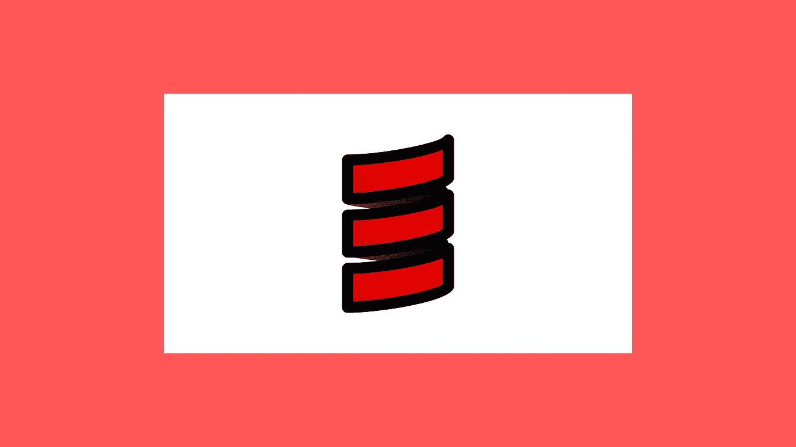
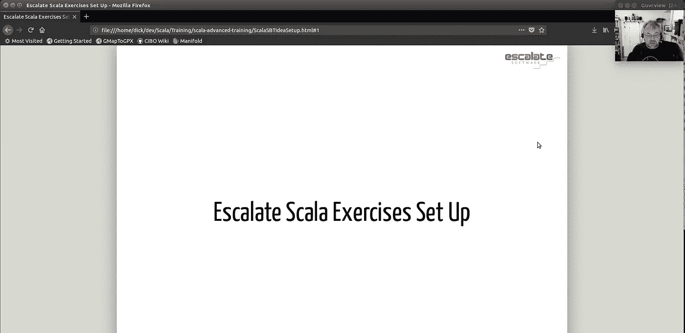
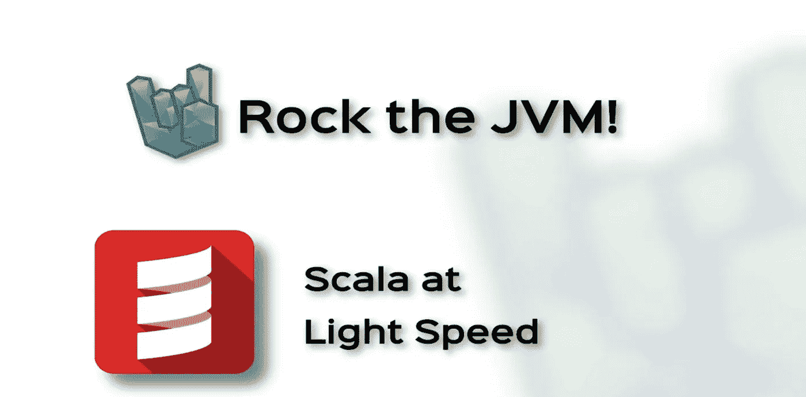
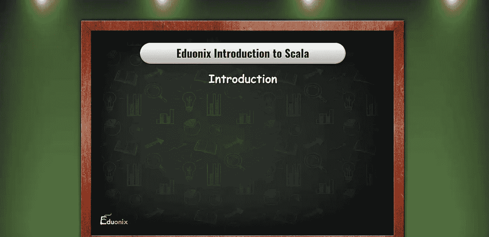

# 学习函数式编程的 7 门免费 Scala 课程和教程

> 原文：<https://medium.com/quick-code/7-free-scala-courses-tutorials-to-learn-functional-programming-db0a4a1579a3?source=collection_archive---------0----------------------->

## 以下是我在 Udemy、Coursera、YouTube 上的免费顶级 Scala 课程和教程，帮助你学习函数式编程。

Learn Scala

大家都知道像 Java，Python，C sharp 等最强大的编程语言。然而，它们都伴随着开发人员随着时间的推移已经熟悉的特定问题。例如，Java 是最强大的编程语言之一，它允许您构建从移动到 web 开发的令人惊叹的应用程序。

然而，Java 有一个问题。Java 开发人员知道 Java 需要编写大量样板代码。现在你可能会说，没关系，我们可以多写几行。你写的行数越多，出错的可能性就越大。那么，有什么解决办法呢？

这就是 Scala 的用武之地。Scala 是最强大但被低估的编程语言之一，类似于 Java。它需要的代码更少，你也不用写锅炉代码，不用担心 bug。它最令人印象深刻的特性是它运行在 JVM 上，与 Java 共享相同的概念。此外，它还提供了功能性样式。

因此，我为 Java 开发人员或任何想探索和学习 Scala 的人编制了这个免费的 Scala 课程和教程列表。此外，如果你希望投资于[付费的 Scala 教程](https://coursesity.com/best-tutorials-learn/scala)，你也可以这样做。

# 顶级免费 Scala 教程列表

请记住，这些免费的 Scala 课程可能会在未来再次变成付费课程，所以将它们放在您的列表中，以避免以后为它们付费。事不宜迟，我们走吧！

## 1.[升级 Scala 培训—设置说明](https://click.linksynergy.com/deeplink?id=0F1O0otUXQc&mid=47901&u1=csMedium&murl=https%3A%2F%2Fwww.udemy.com%2Fcourse%2Fstairway-to-scala-setup-instructions%2F)—【Udemy】

Scala Training

如果你对建立一个 Scala 开发环境感兴趣，或者正在学习 Scala 应用或高级课程，这个课程是为你准备的。

在本 Scala 教程中，您将:

*   设置您的开发机器来使用 Scala。
*   使用 IDE 创建和编辑 Scala 语言项目。

本教程将为您学习升级软件的 Scala 应用和高级课程做好准备，包括运行激活工具、学习 Scala 以及 IntelliJ IDEA 等 Scala IDE。

这是 Udemy 上最好的免费 Scala 课程，5 门课程中有 4.3 分，时长 14 分钟。请记住，由于这是一门免费的 Udemy 课程，完成后您不会获得证书。

## 2.[Scala 中的函数式编程原理](https://coursera.pxf.io/c/1137078/1213622/14726?u=https%3A%2F%2Fwww.coursera.org%2Flearn%2Fscala-functional-programming&subId1=csMedium)——【Coursera】

业界越来越依赖函数式编程。Scala 已经成为许多应用程序的主要编程语言，推动了这一趋势。

*   理解函数式编程的原理。
*   设计不可变的数据结构。
*   将函数式编程与对象和类集成。
*   编写纯函数式程序，使用递归、模式匹配和高阶函数。

Scala 在一个方便的包中结合了函数式编程和面向对象编程。除了与 Java 无缝协作之外，它还支持 Javascript。Apache Spark、T2、Kafka 和 Akka 都是使用 Scala 作为实现语言的框架。Twitter、网飞、Zalando 和 Coursera 等网站都依赖于它。

本课程介绍函数式编程风格，并教你如何在日常编程任务中使用它，例如实现业务逻辑或建模业务领域。此外，您将了解不变量的证明以及如何用符号来跟踪执行。

需要至少一年的编程经验。理想情况下，你应该有 Java 或 C#的经验，但是其他语言如 C/C++、Python、[、Javascript](https://coursesity.com/blog/free-javascript-courses/) 或 Ruby 也足够了。建议您对命令行有所了解。

这是 Coursera 上排名第一的免费 Scala 课程，5 门课程中有 4.8 分，时长 56 小时。旁听这个课程是免费的，但是付费会给你更多的好处。

## 3.光速下的 Scala—【Udemy】

Scala Overview

从《摇滚 JVM》的这个免费课程中了解 Scala 语言能做什么。本课程将帮助你在几个小时内熟悉 Scala 的基础。

在本 Scala 教程中，您将学习:

*   Scala 基础
*   Scala 中的面向对象原则
*   Scala 中的函数式编程原理。
*   管理线程
*   含蓄的基础。

在本课程中，您将学习如何编写基本代码、思考和处理问题、处理线程以及使用一些在这门语言的其他地方找不到的“神奇”结构。此外，您将与现有的编程语言进行类比，以更好地理解如何编写基本代码、思考和处理问题以及使用线程。

这是 Udemy 上最好的免费 Scala 课程，5 门课程中有 4.7 分，时长 2 小时。请记住，由于这是一门免费的 Udemy 课程，完成后您不会获得证书。

## 4.Scala 中的有效编程——【Coursera】

这个信息丰富的实践课程将函数式编程与面向对象编程相结合，帮助您提高编程技能。此外，您将了解标准库和通用代码模式。

在本 Scala 教程中，您将:

*   使用 Scala 习惯用法来建模业务领域和实现业务逻辑。
*   加深对这门语言的理解，让你能够阅读和理解用 Scala 编写的代码库。
*   获取现实世界中使用的最佳实践和标准模式。
*   使用异步计算，处理故障，轻松操作递归数据结构。

本课程教你如何使用 Scala 解决常见的编程挑战，如业务领域建模、简化复杂问题、操作数据和运行并行程序。

此外，在编写可扩展到大型应用程序的高质量代码时，您将学习如何处理错误、编写测试以及利用高效的开发环境。

这是 Coursera 上排名第一的免费 Scala 课程，5 门课程中有 4.7 分，时长 49 小时。旁听这个课程是免费的，但是付费会给你更多的好处。

## 5.[从零开始学习 Scala 编程语言](https://www.eduonix.com/courses/Software-Development/Learn-Scala-Programming-Language-from-Scratch/UHJvZHVjdC0zMjMyMDA=)——【Eduonix】

Introduction to Scala

在这个关于 Scala 的综合课程中，学习 Scala 以及它如何与 Java 协同工作。本 Scala 教程的范围不仅仅是解释 Scala 为什么如此受欢迎以及它的好处，还包括解释它的基本原理以及它如何在 Java 虚拟机中工作。

本 Scala 教程的主题包括:

*   JVM 语言
*   Scala 开发环境
*   Scala 语法和语义
*   带集合的 Scala 函数
*   并发标量
*   Scala 应用示例用例

此外，它将涵盖 Scala 语法、Scala 并发性、Akka 框架和面向对象的语法。此外，在课程接近尾声时，还将讨论 Scala 在设计应用程序时的最佳实践。

这是 Eduonix 上最好的免费 Scala 课程，5 门课程中有 4.6 门，时长 6 小时。

## 6.[用 Scala 和 Spark 进行大数据分析](https://coursera.pxf.io/c/1137078/1213622/14726?u=https%3A%2F%2Fwww.coursera.org%2Flearn%2Fscala-spark-big-data&subId1=csMedium)——【Coursera】

本课程旨在展示如何使用 Spark 将数据并行扩展到分布式情况。当我们详细讨论 Spark 的编程模型时，我们将仔细关注它与常见编程模型的不同之处，例如共享内存并行集合或顺序 Scala 集合。

本 Scala 教程的主题包括:

*   入门+ Spark 基础知识
*   归约运算和分布式键值对
*   分割和洗牌
*   结构化数据:SQL、数据帧和数据集

作为 Spark 和 Scala 实践的结果，我们将发现何时应该考虑延迟和网络通信，以及如何有效地解决它们以提高性能。

这是 Coursera 上排名第一的免费 Scala 课程，5 门课程中有 4.7 分，时长 28 小时。旁听这个课程是免费的，但是付费会给你更多的好处。

## 7. [Scala 教程全教程](https://www.youtube.com/watch?v=i9o70PMqMGY)——【YouTube】

Scala Tutorial

这个来自 [Telusko](https://www.youtube.com/c/Telusko) 的 Scala 教程将帮助你轻松学习 Scala。你将从编程语言的介绍开始。然后，你会学到 Scala 和 Java 的相似之处，以及为什么开发者更喜欢 Scala。YouTube 上有一个很详细的学习 Scala 的课程。

本 Scala 教程的主题包括:

*   什么是 Scala，为什么要学习 Scala？
*   Scala 设置
*   Scala 第一代码
*   Scala 使用 Var & Val 定义变量
*   Scala 中的类和对象
*   在 Scala 中创建方法
*   在 Scala 中列出& Lambda 表达式
*   列表反转，降&取
*   Scala 类型层次结构
*   Scala 中复杂对象的列表
*   Scala 中的元组

感谢您阅读这篇关于免费 Scala 课程的文章！如果你觉得这篇文章有帮助，请在评论中告诉我。此外，这里还有一些你可能会觉得有用的帖子:

 [## 面向初学者的 10 门免费 Java 课程[2022 年 8 月]——在线学习 Java

### 这里有一些免费的 java 课程，可以帮助你开始成为 Java 开发人员的旅程。

medium.com](/quick-code/10-free-java-courses-for-beginners-2022-aug-learn-java-online-e8bd09f923eb)  [## 学习围棋编程的 5 门免费 Golang 课程

### 各位程序员和开发者好！您对免费 Golang 课程的搜索到此结束。在这篇文章中，我将分享…

medium.com](/quick-code/5-free-golang-courses-to-learn-go-programming-5dd95c4baddb)  [## 10 门免费 Django 课程，学习 Python 中的 Django

### 众所周知，Python 是当今最流行的编程语言之一，Django 使 web 开发…

medium.com](/quick-code/10-free-django-courses-for-beginners-to-learn-django-ce2d598957a)