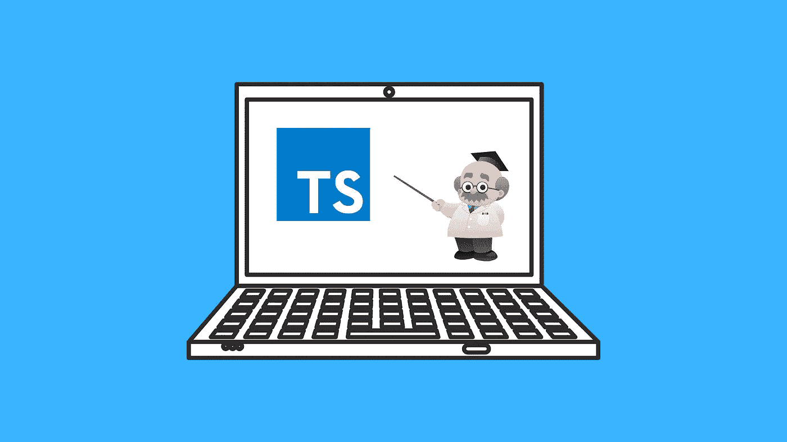

# 7 门面向初学者的免费打字课程

> 原文：<https://medium.com/quick-code/7-free-typescript-courses-for-beginners-da0423ab5943?source=collection_archive---------0----------------------->

## 以下是我在 Udemy、Codecademy、Pluralsight 等网站上的免费打字稿课程的首选。

Free TypeScript Courses

开发人员们，我为你们准备了另一份免费课程清单。这一次，我将分享一些顶级的免费 TypeScript 课程，供初学者学习 Javascript 的超集。但是，我们先来说说什么是 Typescript。

TypeScript 是 JavaScript 的强类型编程超集，它为已经定义好的语言增加了更多的功能。它是由微软创建的，旨在克服为复杂项目编写大型代码的困难。请记住，它不是一个 Javascript 框架。它是一个包含所有 JavaScript 成分的 Javascript 超集。

由于 JavaScript 的流行，许多开发人员可以毫无困难地实现 TypeScript 命名的解决方案。因此，我们可以将 TypeScript 描述为添加了静态类型和对象等特性的 JavaScript。因此，我们可以说 TypeScript 是 JavaScript 的未来，因为它增加了接口、枚举、抽象类等特性。，这在其他面向对象编程语言中很常见，但在 JavaScript 中却没有。

# 初学者最佳免费打字课程列表

不能保证这些课程会永远免费。因此，我建议你先把它们保存在你的清单上。另外，如果你想投资付费课程，我已经策划了一份[最佳打字课程](https://coursesity.com/best-tutorials-learn/type-script)的清单。那么，事不宜迟，让我们开始吧。

## 1.[打字稿介绍](https://click.linksynergy.com/deeplink?id=0F1O0otUXQc&mid=47901&u1=csMedium&murl=https%3A%2F%2Fwww.udemy.com%2Fcourse%2Ftypescript%2F)——【Udemy】

本课程将向您介绍 TypeScript，这是一种由微软开发的受 JavaScript 启发的语言。在打字稿入门课程中，学生将学习与初级工作技能相关的打字稿基础知识。

在本打字稿课程中，您将:

*   在您的工作站上编译、测试和运行 TypeScript。
*   使用 TypeScript 类和类型批注。
*   使用 TypeScript 构建并运行一个简单的应用程序。

作为第一步，我们将学习 TypeScript 适用于什么项目以及 TypeScript 基础知识。接下来，我们将学习如何使用节点和 NPM 安装 TypeScript，以及如何使用命令行将 TypeScript 编译成 JavaScript。另外，我们还将额外探索 TypeScript 编译器错误。最后但同样重要的是，我们将研究 TypeScript 的许多特性。

这是 Udemy 上的顶级免费打字课程，5 门课程中有 4.1 分，时长 1 小时。此外，请记住，由于这是一门免费的 Udemy 课程，所以完成后您不会获得证书。

## 2.[学习打字稿](https://www.pjatr.com/t/TUJGR0lLR0JHR0pMSUtCR0ZISk1N?sid=csMedium&url=https%3A%2F%2Fwww.codecademy.com%2Flearn%2Flearn-typescript)——【Codecademy】

本课程将教你如何将 JavaScript 语法应用于 TypeScript 的类型系统。拥有一个结构化的代码将有助于你建立自己的编程体验。此外，您将使用 TypeScript linter 来减少编译错误。

本打字稿课程包括:

*   类型
*   功能
*   复杂类型
*   工会类型
*   类型缩小

这是 Codecademy 上的顶级免费打字课程，持续时间为 10 小时。此外，请记住，除非您拥有 Codecademy 的专业会员资格，否则您不会获得结业证书。

**先决条件:**学习 JavaScript

## 3.[绝对初学者的打字稿](https://click.linksynergy.com/deeplink?id=0F1O0otUXQc&mid=47901&u1=csMedium&murl=https%3A%2F%2Fwww.udemy.com%2Fcourse%2Ftypescript-beginners%2F)——【Udemy】

该课程涵盖了 TypeScript 的绝对基础，适用于所有的 TypeScript 项目，并适合任何语言新手。在本课程中，您将学习将来创建和继续 TypeScript 项目所需的最常见的 TypeScript 基础知识。

在本 TypeScript 课程中，您将学习:

*   打字稿基础
*   如何设置开发环境？
*   安装 TypeScript 并检查其版本。
*   比较 JavaScript 和 TypeScript 文件。
*   将 TypeScript 编译成不同的 EcmaScript 格式
*   观察具有基本类型和联合的类型注释
*   发现接口和类型

这是 Udemy 上的顶级免费打字课程，5 门课程中有 4.0 分，时长 30 分钟。此外，请记住，由于这是一门免费的 Udemy 课程，所以完成后您不会获得证书。

## 4.打字稿:大图——【复数视线】

本课程提供了打字稿的快速、实用和技术性概述。首先，您将了解为什么应该使用 TypeScript。课程的下一部分包括工具、语法，以及 TypeScript 如何单独使用和与其他框架一起使用。

本打字稿课程包括:

*   TypeScript 如何有所帮助
*   设置类型脚本开发环境
*   编写类型脚本应用程序

在最后一节中，您将发现如何使用 TypeScript 通过 JavaScript 创建企业级应用程序。本课程结束时，您将知道如何编写 TypeScript，如何将它与其他技术进行比较，以及如何与使用它的其他人和项目一起工作。

这是 Pluralsight 上的顶级免费打字课程，5 门课程中有 4.7 分，时长 44 分钟。此外，完成后您将获得证书。

## 5.[学习 TypeScript —初学者的全部课程](https://www.youtube.com/watch?v=gp5H0Vw39yw?ref=coursesity.com)—【freeCodeCamp—YouTube】

来自 freeCodeCamp 的 Alexander Kochergin 的速成课程将帮助你立刻学会 TypeScript 编程语言。此外，本课程将为您提供所有您需要了解的现代 TypeScript 功能。

本 TypeScript 教程涵盖的主题:

*   我需要学习 Typescript 吗？
*   如何安装 Typescript 工具？
*   类型脚本类型定义简介
*   Typescript 中的接口简介
*   Typescript 中的联合和类型别名
*   Typescript 中任何未知的永不作废
*   使用多姆·⌨️的打字稿
*   在 Typescript 中创建类
*   Typescript 中的泛型接口和函数
*   如何在 Typescript 中使用枚举

## 6.[初学者完整打字稿](https://click.linksynergy.com/deeplink?id=0F1O0otUXQc&mid=47901&u1=csMedium&murl=https%3A%2F%2Fwww.udemy.com%2Fcourse%2Ftypescript-fundamentals%2F)——【Udemy】

JavaScript 代码对于创建优秀的 web 应用程序至关重要。使用 TypeScript，您可以创建优秀的 JavaScript 代码。本课程将帮助您学习如何使用一种强大而有趣的编程语言快速而轻松地创建 web 应用程序。

在本 TypeScript 课程中，您将学习:

*   如何自信地使用 Typescript？
*   如何用 Angular 7+使用 typescript？

您将学习的第一件事是如何配置 TypeScript 项目。接下来，您将学习如何创建您的类型。最后，您将了解如何获得对大多数 JavaScript 库的强类型支持。完成本课程后，您将能够使用 TypeScript 构建客户端 web 应用程序和 NodeJS 应用程序，并对 TypeScript 最重要的功能有了基本的了解。

这是 Udemy 上的顶级免费打字课程，5 门课程中有 4.5 门，时长 5 小时 27 分钟。此外，请记住，由于这是一门免费的 Udemy 课程，所以完成后您不会获得证书。

## 7.[初学者打字教程](https://www.youtube.com/watch?v=d56mG7DezGs?ref=coursesity.com)——【YouTube】

这门来自《用 Mosh 编程》的课程将帮助你学习 TypeScript，从而写出更好的大型 JavaScript 应用。

本 TypeScript 教程涵盖的主题:

*   介绍
*   先决条件
*   如何学习这门课程
*   什么是 TypeScript？
*   设置开发环境
*   你的第一个打字稿程序
*   配置 TypeScript 编译器
*   调试 TypeScript 应用程序
*   基本原则
*   内置类型
*   任何类型
*   数组
*   元组
*   枚举
*   功能
*   目标
*   高级类型
*   键入别名
*   工会类型
*   交叉点类型
*   文字类型
*   可空类型
*   可选链接

感谢您阅读这篇关于免费 TypeScript 课程的文章！如果你觉得这篇文章有帮助，请在评论中告诉我。另外，如果我错过了你最喜欢的，请告诉我。

 [## 学习 React.js 的十大免费课程

### 下面列出了 Udemy、Coursera、edX 等领先提供商提供的顶级免费 React 课程！

medium.com](/quick-code/top-10-free-courses-to-learn-react-cc6a40b9835)  [## 5 门免费在线课程，供初学者学习 Vue JS

### 众所周知，谈到 JavaScript 框架，有两个名字一直排在最前面——node . js 和 React…

medium.com](/quick-code/5-free-online-courses-for-beginners-to-learn-vue-js-86103aaeb2b)  [## 在线学习 Node.js 的 8 门免费课程

### 下面是我列出的供初学者学习 Node.js 的顶级免费 Node.js 课程

medium.com](/quick-code/8-free-online-courses-to-learn-node-js-6dc7b63543c7)