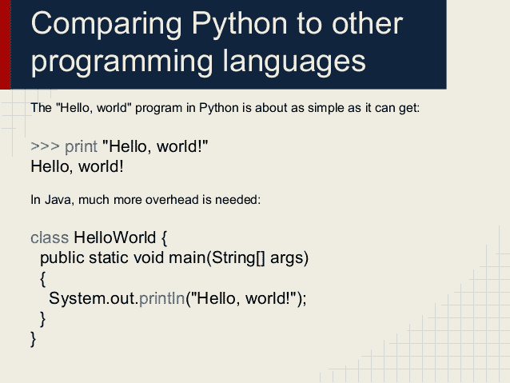
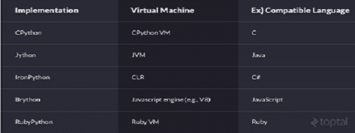

# 你现在应该学习 Python 的 7 个理由

> 原文：<https://medium.com/quick-code/7-reasons-you-should-learn-python-now-d298ef91fd68?source=collection_archive---------1----------------------->

[**Python**](https://www.mytectra.com/python-training-in-bangalore.html) 是许多开发人员的最爱，因为它非常强调可读性和效率，尤其是与其他语言如 Java、PHP 或 C++相比。

当然，它是旧的，但它是 80 年代的，而不是 Cobol 或 Fortran 旧的。此外，如果一件事情有效，为什么要改变它，尤其是在有这么多方法可以改善它的时候。

实际上，取决于你如何看待它，长寿本身就是一件好事——稳定和可靠的标志。

如果您像许多第一次接触 Java、C 或 Perl 的人一样，Python 的学习曲线实际上是不存在的。但是它简单易学的事实也是一些人不认为 Python 是一项必要的编程技能的原因。

老实说，我对 [Python](https://www.mytectra.com/python-training-in-bangalore.html) 的热爱直到几年前才真正发展起来。人们经历了漫长的职业生涯，经历了痛苦的教训，才体会到这种语言和平台所提供的一切。我这篇短文的目的是让你免受同样的痛苦，并说服你为什么 Python 是你需要了解的东西。

**Python 简单易学**

好吧，至少与你可以使用的许多其他编程语言相比，它“更容易”。Python 的语法没有太多的仪式，这使得即使你不是 Python 专家，它也是可读的。我的经验是，通过例子学习和教授 Python 要比接近更容易，比如说， [**Ruby**](https://www.mytectra.com/ruby-training-in-bangalore.html) 或 [**Perl**](https://www.mytectra.com/perl-scripting-training-in-bangalore.html) **，**同样的方式，因为 Python 的语法有很少的规则和特例。重点不是语言的复杂性，而是你想用代码完成什么。

**Python 是首选语言**

Python 是一种通用解释型、交互式、面向对象的高级编程语言。目前，Python 是 IT 界最流行的语言。Python 被几乎所有的 IT 领域采用为首选语言，包括 Web 开发、云计算(AWS、OpenStack、VMware、Google Cloud 等)..)、基础设施自动化、软件测试、移动测试、大数据，以及 Hadoop、数据科学等。

Python 让你用更少的代码行构建更多的功能。

Python 对任何人来说都是一门很快的学问。通过练习，你最多可以在两天内轻松构建一个基本的游戏(这来自于对编程一无所知)。

使 Python 成为对新手有吸引力的编程语言的另一个因素是它的可读性和效率。

**Python 是一种通用的语言和平台**

2017 年 Python 就 28 岁了。尽管这比我的许多读者都要老，但它仍然具有很高的相关性，因为它可以应用于你今天能找到的几乎任何软件开发或操作场景。管理本地或云基础架构？Python 适用。开发网站？是的，它也适用于那里。需要使用 SQL 数据库吗？确实如此。需要一个 Hive 或者 Pig 的自定义函数？已覆盖。只是给自己造一个小工具？Python 的简单性使它成为一个很好的选择。需要一门支持面向对象设计严谨性的语言？Python 的特性也使它与此相关。简而言之，花一点功夫学习 Python 将会让你获得适用于各种工作角色的技能。

**Python 拥有最成熟的包库之一，大约在**

一旦你掌握了这门语言，你就可以利用这个平台。Python 由 PyPI(发音为 Pie-Pie，可在线阅读[这里是](https://pypi.python.org/))支持，这是一个超过 85，000 个 Python 模块和脚本的仓库，您可以立即使用。这些模块为您的本地 Python 环境提供预打包的功能，并解决各种问题，如使用数据库、实现计算机视觉、执行高级数据分析(如情感分析)或构建 RESTful web 服务。

**Python 是数据科学中常用的语言**

无论你想从事什么工作，数据都是其中的一部分。IT 运营、软件开发、市场营销等等……他们都淹没在数据中，渴望智慧。很快，数据分析技能将和编码技能一样重要，Python 在这两个领域都有很强的影响力。仅次于语言 [R](https://www.mytectra.com/r-programming-training-in-bangalore.html) ，Python 是现代数据科学中使用最多的语言；事实上，在数据科学领域，Python 职位的数量超过了 R 职位。您在学习 Python 时开发的技能将直接转移到构建这些分析技能上。

**Python 是跨平台开源的**

Python 已经跨平台运行了 20 多年，并作为开源开发。如果您需要在 Linux、Windows 和 MacOS 上运行的代码，Python 可以提供。此外，它有几十年的 bug 挤压和扭结矫正的支持，以确保您的代码无论在哪里运行都能按预期工作。

**PYTHON 是灵活的。**

有几个健壮的 Python 实现与其他编程语言集成在一起。

* CPython，用 C 语言编写的版本

* Jython 或 Python 与 Java 集成

* IronPython，旨在与兼容。NET 和 C#

* PyObjc，或用 Objective-C 工具包编写的 Python

* RubyPython，或者 Python 结合 Ruby。

**为什么你应该了解 Python**

没有多少语言可以提供 Python 的多功能性和简单性；除了 Python 几十年的思考、努力和社区，能做到这一点的就更少了。无论您是代码新手还是脚本专家，Python 都是您需要了解的。

*最初发表于*[T5【www.mytectra.com】](https://www.mytectra.com/blog/7-reasons-you-should-learn-python-now/)*。*