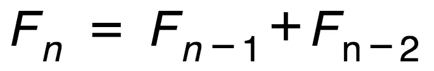
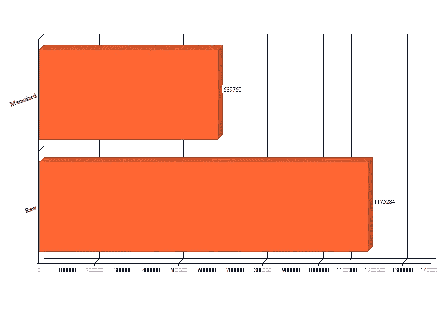

# 用 JavaScript 写斐波那契生成器时我学到的 7 件令人惊讶的事情

> 原文：<https://medium.com/javascript-scene/7-surprising-things-i-learned-writing-a-fibonacci-generator-4886a5c87710?source=collection_archive---------2----------------------->


Nautilus Shell — Dave Spindle (CC-BY-NC-2.0)

生成器函数是 ES6 中引入的 JavaScript 的新特性。为了更深入地探索它们，我决定写一个斐波那契生成器函数。

以下是我学到的。

## 采用新功能

有时候一个新的语言特性出现了，我会跳过它，开始一直使用它。ES6 的其他几个功能也是如此。我列出了我最喜欢的 ES6 功能，并将其命名为[路线图](https://ericelliottjs.com/product/es6-the-road-map-2-hour-webcast-recording/):

*   **居**息&散
*   **O** 对象文字快捷键(compact literals)
*   **A** 箭头功能
*   **D** 析构&默认参数
*   —
*   **M** 模块
*   **A** 异步 **P** 编程(承诺&发电机)

当我列出清单时，我认为这些是我最常用的 ES6 功能。最初，我对生成器非常感兴趣，但是现在我已经和它们一起生活了一段时间，在我真正的应用程序代码中，我还没有发现很多好的生成器用例。对于我可能使用生成器的大多数用例，我选择了 RxJS，因为它有更丰富的 API。

这并不意味着生成器没有很多好的用例。我告诉自己，在我真的疯狂使用 JS 引擎之前，我一直在等待更好的 JS 引擎支持，但这可能是因为我的大脑还没有考虑到生成器。解决这个问题的最好方法就是多练习。

当我听说生成器时，立即跳入我脑海的一个用例是，我们可能使用它们从任何无穷级数中获取值。这可能有许多应用，如图形生成算法、电脑游戏关卡、音乐序列等…

## 什么是斐波那契数列？

斐波那契是一个简单、规范的例子，你们大多数人可能已经很熟悉了。以下是基本情况:

斐波那契数列是一系列数字:

*0，1，1，2，3，5，8，13，21，34…*

在种子号码 *0* 和 *1* 之后，每一个后续号码都是前两个号码的总和。该序列的一个有趣的性质是，序列中当前数字与前一个数字的比率向黄金分割比率收敛， *1.61803398875…*

你可以使用斐波那契数列来生成各种有趣的东西，比如自然界中出现的黄金螺旋。

## 什么是生成器函数？

生成器函数是 ES6 中的一个新特性，它允许一个函数通过返回一个对象来*随时间生成许多值*，该对象可以被迭代以从函数中一次提取一个值。

当调用生成器函数时，它不是直接返回值，而是返回一个迭代器对象。

**迭代器协议**

迭代器对象有一个 *`.next()`* 方法。当调用 *`.next()`* 方法时，函数体在最后一次调用 *`.next()`* 时执行的行之后恢复。它继续执行，直到达到一个 *`yield`* ，此时，它返回一个对象，如下所示:

```
{
  value: Any,
  done: Boolean
}
```

*`value`* 属性包含生成的值， *`done`* 表示生成器是否生成了最后一个值。

JavaScript 中的很多东西都使用迭代器协议，包括新的 *`for…of`* 循环、数组 rest/spread 操作符等等。

# 1.生成器不喜欢递归

我习惯于担心 JavaScript 中的递归。当一个函数调用另一个函数时，会分配一个新的堆栈帧来存储该函数的数据状态。无限递归会导致内存问题，因为可以分配多少堆栈帧是有限制的。当达到这些限制时，会导致堆栈溢出。

堆栈溢出就像警察突袭你的聚会，并告诉你所有的朋友回家。完全扫兴。

当 ES6 引入尾部调用优化时，我非常兴奋，它让递归函数在每次迭代中重用相同的堆栈帧——但它只有在递归调用位于尾部时才有效。尾部位置的调用意味着函数返回递归调用的结果，而无需任何进一步的计算。

太好了！我的第一个天真的实现使用了一个非常简单的数学斐波那契定义:



使用种子值 *0* 和 *1* 来启动序列，并将加法运算移入函数调用签名中，如下所示:

我喜欢这看起来有多干净。种子值在函数签名中很明显，公式在递归调用中表达得非常清楚。

*`if`* 条件允许当 *`n`* 达到 *0 时，使用 *`return`* 而不是 *`yield`* 终止循环。*如果不通过 *`n`* ，当我们试图从中减去 *`1`* 时，它将` *undefined`* 并求值为 *`NaN`* ，因此函数将永远不会终止。

这个实现非常简单…也很幼稚。当我测试大值时，它爆炸了。

(ಥ﹏ಥ)

可悲的是，**尾调用优化不适用于生成器**。在规范中函数调用[下运行时语义:求值](https://tc39.github.io/ecma262/#sec-function-calls):

**7。**设 *tailCall* 为*is tail position(this call)*。

**8。**返回 *EvaluateDirectCall(func，thisValue，Arguments，tailCall)* 。

***is indail position***为发电机返回 false(参见 [14.6.1](https://tc39.github.io/ecma262/#sec-tail-position-calls) ):

**5。**如果*体*是*发生器体*的*功能体*，则返回*假*。

换句话说，**避免无限生成器**的递归。如果你想避免堆栈溢出，你需要使用迭代的形式。

> 几个月来，我一直在享受 Babel 中的尾部调用优化，但它已经被移除了。据我所知，在撰写本文时，[由于引擎实现者提出的](https://kangax.github.io/compat-table/es6/)[争议/困难](https://github.com/kangax/compat-table/issues/819)，只有 Webkit (Safari，Mobile Safari)支持新的 ES6 适当尾调用。

稍加修改，我们可以去掉递归，而使用迭代形式:

正如您所看到的，我们仍然在进行与原始函数调用签名中相同的变量交换，但是这次我们使用析构赋值来在 while 循环中完成它。我们需要` *isInfinite`* 在生成器中，以防我们没有超过一个限制。

# 2.让参数限制迭代

可以结合使用析构赋值和…rest 语法从生成器中提取数组:

但是如果你的生成器是一个无穷级数，并且没有办法通过传递一个参数来描述一个极限，那么得到的数组将永远不会停止填充。

┻━┻ ︵ヽ(`Д´)ﾉ︵ ┻━┻

在上面的两个斐波那契实现中，我们允许调用者传递 *`n`* ，这将序列限制为第一个 *`n`* 数字。一切都好！

┬─┬ ノ( ゜-゜ノ)

# 3.小心记忆的函数

很容易记住像斐波那契数列这样的东西，因为这样做可以极大地减少所需的迭代次数。换句话说，它使*快了很多。*

## *什么是记忆功能？*

*对于给定相同参数时总是产生相同输出的函数，您可以将结果记录在备忘录中以备将来调用，这样就不必重复计算结果。相反，结果会在备忘录中查找并返回，而不会重复计算。斐波那契算法重复大量的计算来得出结果，这意味着如果我们记住这个函数，我们可以节省很多时间。*

*让我们看看如何记忆斐波那契生成器的迭代形式:*

*因为 *`n`* 本质上表示一个数字数组的索引，所以我们可以把它作为一个文字数组索引。后续调用将只查找该索引并返回相应的结果值。*

## *编辑:*

*这段代码的原始版本有一个错误。第一次运行这个函数时，一切都很好，但是备忘录写得不正确，因为当你发现一个备忘录命中时，你不能只产生一个值——不像 *`return`, `yield`* 不会停止函数的其余部分的运行。它只是暂停执行，直到再次调用 *`.next()`* 。*

*这是我最难理解的一点。 *`yield`* 不仅仅是发电机的 *`return`* 。您还必须仔细考虑用 *`next()`* 恢复函数会如何影响您编写逻辑的方式。*

*在这种情况下，我能够使用 *`yield`,* 让逻辑工作，但这使得控制流难以阅读。*

*我突然想到，对于可以用这种方式记忆的东西，当我把生成器函数和计算逻辑分开时，阅读起来会容易得多。*

*正如您所看到的，新的生成器函数非常简单——它只是通过调用 memoized *`fib()`* 来计算 memo 数组，然后使用 *`yield*`* 将生成器委托给结果数组 iterable。*

**`yield*`* 是 *`yield`* 的特殊形式，将委托给另一个生成器或 iterable。例如:*

## *基准*

*每当我使用竞争算法实现时，我通常会编写一个简单的基准脚本来比较性能。*

*在这个测试中，我生成了 79 个数字，每个数字。我使用 Node 的 *`process.hrtime()`* 来记录两个实现的纳秒级精确计时，运行测试三次，并对结果取平均值:*

**

*如您所见，这是一个非常显著的差异。如果你正在生成大量的数字，并且你希望它很快，那么记忆化的解决方案显然是一个明智的选择。*

*只有一个问题:对于无限序列，memo 数组将会无限增长。最终，您将遇到堆大小限制，这将使 JS 引擎崩溃。*

*不过不用担心。使用 Fibonacci，您将首先遇到最大精确 JavaScript 整数大小，即 *9007199254740991。超过了 **9 万亿次**，这是一个很大的数字，但斐波那契并不以为然。斐波那契增长**快*。仅生成 79 个数字后，你就能突破这个障碍。*****

# *4.JavaScript 需要一个内置的 API 来精确计时*

*每当我编写一个简单的基准测试脚本时，我都希望有一个能在浏览器和节点上工作的精确计时 API，但是没有。我们能得到的最接近的是一个库，它提供了包装浏览器的 *`performance.now()`* API 和节点的 *`process.hrtime()`* API 的外观，以呈现一个统一的 API。不过，实际上，仅节点基准测试对于这个测试来说已经足够了。*

*我唯一的不满是 Node 的 *`process.hrtime()`* 返回一个数组，而不是一个以纳秒为单位的直接值。不过，这很容易补救:*

*只需将从 *`process.hrtime()`* 返回的数组传递给这个函数，就可以得到人性化的纳秒。让我们来看看我用来比较迭代斐波那契生成器和记忆化版本的基准脚本:*

*我最喜欢的 *`hrtime()`* 的特性是，您可以将开始时间传递到函数中，以获得从开始时间起经过的时间——这正是您进行分析所需要的。*

*有时候，操作系统任务调度程序会让进程遇到一些糟糕的运气，所以我喜欢多次运行这样的脚本，并平均结果。*

*我确信您可以想出更准确的方法来对您的代码进行基准测试，但是这种方法对于大多数情况来说应该足够好了——尤其是当有像 memoized Fibonacci 实现这样明显的赢家时。*

# *5.当心浮点精度错误*

*我不想用太多疯狂的数学来烦你，但你知道吗，有一种不用迭代或递归就能非常有效地计算斐波那契数列的方法？看起来是这样的:*

*唯一的问题是浮点精度的限制。实际公式不包括任何舍入。我添加它是因为浮点误差在 *`n = 11 `之后开始导致结果漂移。没什么印象。**

*好消息是，通过添加舍入，我们可以将精度提高到 *`n = 75`。* *好多了。*这离使用 JavaScript 的本地 *`Number`* 类型的最大精确值还差几个数字，我们之前发现的是 *`n = 79`* 。*

*所以，只要我们不需要比 *`n = 75`* 更高的值，这个更快的公式就很好用！让我们把它变成一个发电机:*

*看起来不错。让我们来看一次基准测试:*

```
*Profile with 79 numbers
    original: 901643ns
    memoized: 544423ns
    formula:  311068ns*
```

*是的，更快了，但是我们失去了最后几个准确的数字。值得权衡吗？*

*\( _o)/*

# *6.了解你的极限*

*在我开始之前:*

*   *我不知道在这个系列中使用标准的 JavaScript *`Number`* 类型能产生多少精确的值。*
*   *我不知道我可以用公式版本产生多少精确的值。*
*   *我不知道要进行多少次递归调用才能产生这些精确的值。*

*但是现在我知道了所有这些限制，到目前为止最好的实现是我还没有向您展示的:*

*我在实际应用中使用无穷级数的大多数时候，我实际上需要有限数量的值用于特定目的(通常是生成图形)。大多数时候，从**查找表**中获取值比计算值要快。事实上，这是在 80 年代和 90 年代的电脑游戏中经常使用的优化方法，可能现在仍然如此。*

*由于数组在 ES6 中是可迭代的，并且默认情况下已经表现得像生成器一样，我们可以简单地使用 *`yield*`* 委托给查找表。*

*不足为奇的是，这是该系列中速度最快的实现，远远领先于其他产品:*

```
*Profile with 79 numbers
    original: 890088ns
    memoized: 366415ns
    formula:  309792ns
    lookup:   191683ns*
```

*回过头来看，我很确定，只要我们将序列限制为精确的值，调用堆栈就不会有问题…稍微修改一下递归版本可能就可以了:*

*这是我最喜欢的一个。种子值可以放在备忘录中，让实际计算尽可能接近数学递归关系: *Fn = Fn-1 + Fn-2**

*对于生成器，我们只是再次委托给 memo 数组。*

## *要注意的限制*

*   *如果您使用一个利用浮点数学的公式，您应该明确地测试它的准确性限制。*
*   *如果您使用的是指数增长的序列，您应该在遇到 JS *`Number`* 类型的限制之前，计算出可以生成多少序列。*
*   *如果您的限制足够小，可以考虑预先生成一个查找表来加速您的生产应用程序。*

*如果您决定需要比 JavaScript 本身能够表示的更大的精确数字，那么您还没有完全失去运气。有任意大小的整数库可用，比如 [BigInteger](https://github.com/peterolson/BigInteger.js) 。*

# *7.很多东西都像发电机一样运转*

*当在 ES6 中引入生成器函数时，许多其他内置的东西也实现了**迭代器** **协议**(从生成器返回的可以被迭代的东西)。*

*更准确地说，他们实现了**可迭代协议**。 *`String `、` Array `、` TypedArray `、` Map`* 和 *`Set`* 都是内置的可迭代对象，也就是说它们都有一个*`【symbol . iterator】`*属性是不可枚举的。*

*换句话说，现在可以使用迭代器 *`.next()`* 方法迭代任何类似数组的内置对象。*

*下面是你如何访问一个数组迭代器。这种技术对于实现 iterable 协议的任何东西都是一样的:*

*您甚至可以构建自己的自定义 iterables:*

*甚至重新定义内置的可迭代行为，但是要小心——我看到了 Babel 和 V8 之间不一致的行为:*

*我想写一个基本上是*` arr[symbol . iterator]()`,*的快捷方式的函数可能会很方便，所以我做了一个，并给了它一个有趣的切片 API，这样你就可以很容易地抓取数组的块并将它们转换成迭代器。我称之为 arraygen。你可以[在 GitHub](https://github.com/ericelliott/arraygen) 上浏览 arraygen。*

# *结论*

*希望我发现了一些你可能不知道的关于发电机的东西。我也偏离了一些有趣的话题:*

1.  ***避免递归。**发电机得不到优化尾调用。*
2.  ***允许参数限制你的生成器的长度**，你可以使用…rest 操作符来析构它们。*
3.  ***内存无限生成器可以突破堆大小限制。***
4.  ***JavaScript 有两个竞争的 API 用于精确计时。**为什么我们不能一起努力？(ಥ﹏ಥ)*
5.  ***浮点精度误差可能会导致基于公式的无限生成器出错。**小心。*
6.  ***了解自己的极限。**您的发电机是否有足够的跑道来满足您的应用需求？它在跑道的跨度上足够精确吗？你会遇到你所使用的数据类型的限制吗？JS 引擎有足够的内存让你的生成器运行你想要的时间吗？*
7.  *大多数内置的行为有点像带有 iterable 协议的生成器，你可以定义你自己的定制 iterable。*

*如果你想玩斐波那契数列的例子，你可以从 GitHub 克隆完整的源代码。*

# *[了解更多关于 ES6 的信息:
路线图(会员免费)](https://ericelliottjs.com/product/es6-the-road-map-2-hour-webcast-recording/)*

****埃里克·艾略特*** *著有* [*【编程 JavaScript 应用】*](http://pjabook.com) *(奥赖利)，以及* [*【跟埃里克·艾略特学 JavaScript】*](http://ericelliottjs.com/product/lifetime-access-pass/)*。他为 Adobe Systems******尊巴健身*******华尔街日报*******【ESPN*******BBC****等顶级录音师贡献了软件经验*******

**他大部分时间都在旧金山湾区和世界上最美丽的女人在一起。**