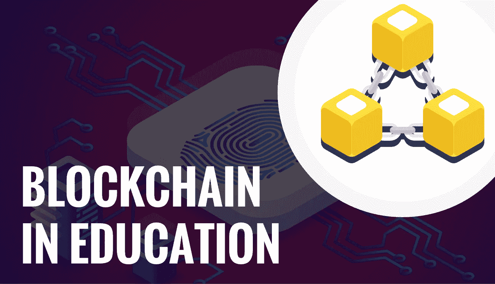

# 区块链如何帮助教育行业的 7 种方式

> 原文：<https://medium.com/duomly-blockchain-online-courses/7-ways-how-blockchain-can-help-the-education-industry-5df3d200ce0e?source=collection_archive---------0----------------------->

[Duomly — Programming Online Courses](https://www.blog.duomly.com)

本文原载:
[https://www . blog . duomly . com/区块链-教育用例](https://www.blog.duomly.com/blockchain-use-cases-in-education)

# 教育中的区块链用例介绍

今天我们将讨论教育中的区块链用例。