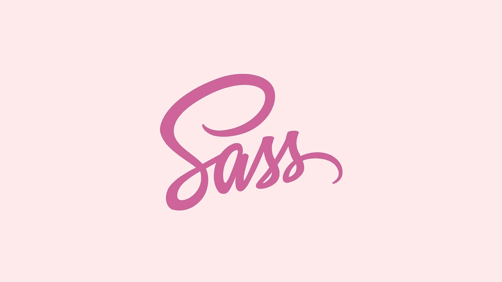
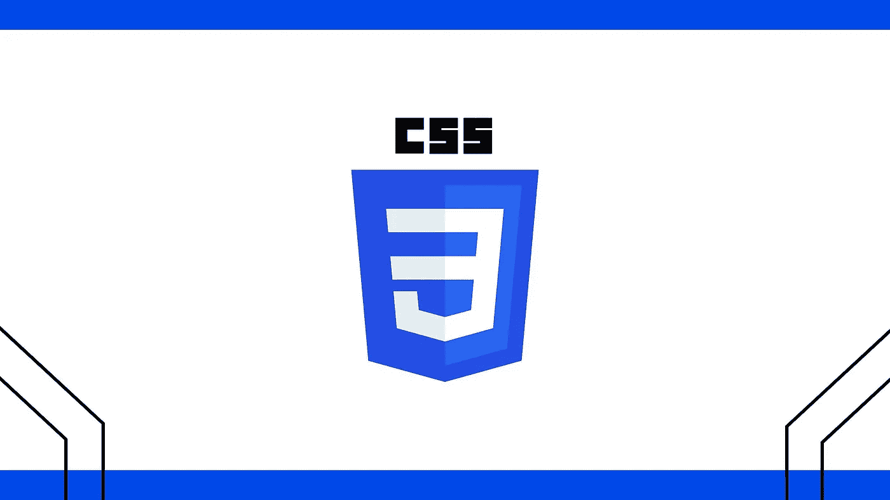
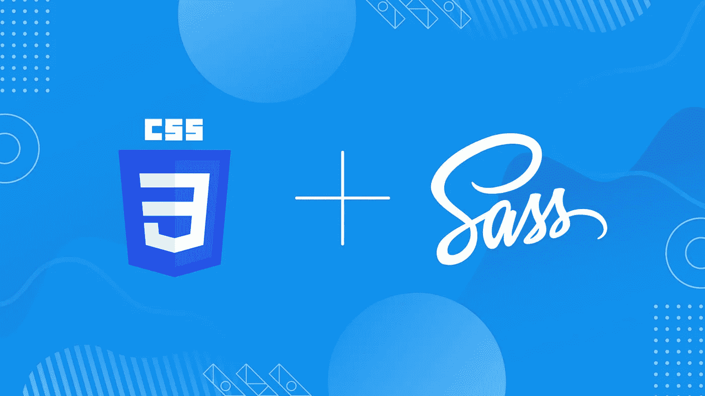
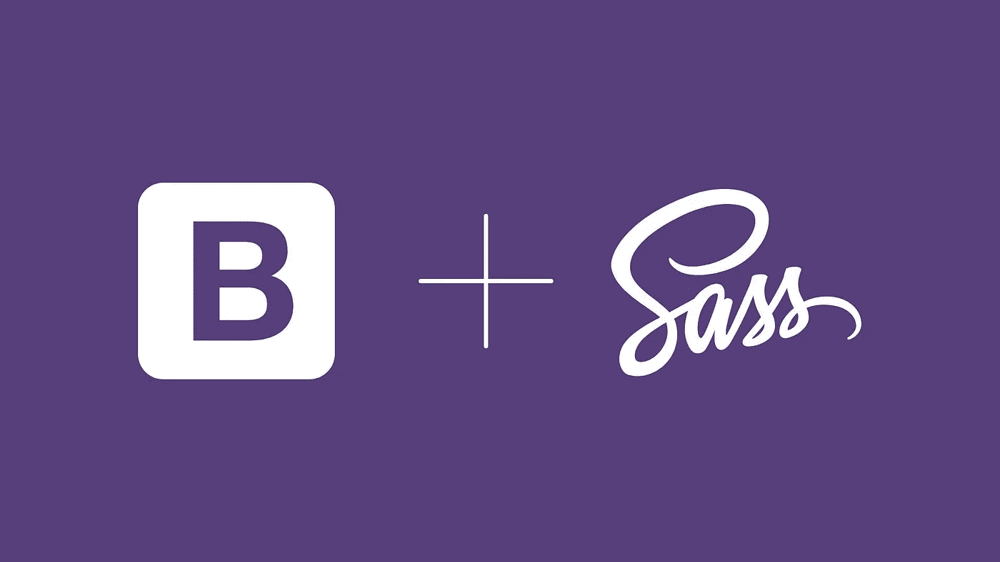

# 面向初学者和专家的 8 门最佳 SASS 课程——在线学习 CSS

> 原文：<https://medium.com/quick-code/8-best-sass-courses-for-beginners-experts-learn-css-online-c9c6e5bec298?source=collection_archive---------6----------------------->

在 web 开发的世界里，SASS，或者说语法上很棒的样式表，已经成为一个很流行的词。人们都在谈论它，每个人都想了解它。但是为什么呢？这是什么？

SASS 是一种 CSS 扩展语言，它有助于使 CSS 编程更容易、更易维护、更高效。它允许您使用 CSS 中没有的特性，如变量、嵌套规则、混合、导入、继承和内置函数。

如果你想在网页设计和网页开发方面建立自己的职业生涯，并增加你的简历对雇主和客户的吸引力，学习这些技能(Grid、Flexbox、CSS)是有益的。所以，事不宜迟，这里有最好的在线 SASS 课程。

## 1.[CSS—2023 年完整指南(包括 Flexbox，Grid & Sass)](https://click.linksynergy.com/deeplink?id=0F1O0otUXQc&mid=47901&u1=csMedium&murl=https%3A%2F%2Fwww.udemy.com%2Fcourse%2Fcss-the-complete-guide-incl-flexbox-grid-sass%2F) —【畅销书 Udemy 教程】

CSS 是每个 web 开发人员的必备知识。无论你是第一次学习 CSS，还是在温习 CSS 技能，这个课程都会对你有所帮助。该课程涵盖了从基础到深度的所有内容，结合了实际例子和理论解释。

在本 Sass 课程中，您将学到以下内容:

*   了解 CSS 为何神奇。
*   使用基本和高级 CSS 功能。
*   Flexbox、网格、动画、过渡、字体、媒体查询等等。
*   理解 CSS 背后的概念和理论以及某些 CSS 特性。
*   建立美丽的网站，不仅包含伟大的内容，而且看起来很好。

如果你有先进的 CSS 知识，你将学习 CSS 变量，CSS 网格和 Flexbox。除了理论之外，你还将在整个课程中建立一个真实的课程项目，通过作业、测验和挑战来练习每个概念。

这是 Udemy 上最畅销的萨斯课程，作者是**马克西米利安·施瓦兹米勒**。这门课程的评分为 4.8 分(满分为 5.0 分)，持续时间为 22 小时 47 分钟。完成后，您还将获得一份证书。

## 2.[学萨斯](https://www.pjatr.com/t/TUJGR0lLR0JHR0pMSUtCR0ZISk1N?sid=csMedium&url=https%3A%2F%2Fwww.codecademy.com%2Flearn%2Flearn-sass)——【代码学院】

通过学习 SCSS 语法、嵌套、函数等等，充分利用你的 CSS 知识。本课程将教你如何通过嵌套、使用变量、混合、占位符和函数来创建更具表现力和可重用的样式。完成后，你将学会如何将 CSS 代码库转换到 SCSS，并设计多个网站。

本 Sass 课程的主题包括:

*   创建 Sass 样式表
*   混合和选择器
*   功能和操作
*   可持续的 SCSS

**要求:**如果你有兴趣上这门课，你应该学习 CSS，尤其是使用 CSS 选择器和可视化规则的基础知识。(不用担心，可以从上面的课程中学习 CSS。)

这是 Codecademy 上的顶级 Sass 课程，持续时间为 7 小时。请记住，您需要 Codecademy 的专业会员资格才能参加本课程。

## 3.[SASS——完整的 SASS 课程(CSS 预处理器)](https://click.linksynergy.com/deeplink?id=0F1O0otUXQc&mid=47901&u1=csMedium&murl=https%3A%2F%2Fwww.udemy.com%2Fcourse%2Fsass-the-complete-sass-course-css-preprocessor%2F)——【畅销书 Udemy 课程】

你有兴趣了解最流行的 CSS 扩展，以及如何建立一个现代的，美丽的，真实的网站吗？那你来对地方了。本课程涵盖了你需要了解的关于这项神奇技术的一切。

在本 Sass 课程中，您将:

*   了解什么是 SASS 以及如何编写它。
*   安装 SASS 编译器。
*   了解 SASS 的基础知识:变量、嵌套、混合、扩展、函数、占位符选择器等。
*   使用 SASS 的基础知识建立和设计一个网站。
*   了解高级 SASS 主题:数据类型、插值、循环、If 指令等。
*   建立和设计一个基于高级 SASS 的网站。

为了编写更简洁和灵活的代码，您将从 SASS 基础知识开始，比如安装 SASS 编译器。此外，您将了解扩展、占位符选择器、函数、导入、部分等等。接下来，您将讨论 SASS 中的一些高级内容。完成后，您将创建一个基于先进的 Saas 材料的项目。

这是 Udemy 上最畅销的 Sass 课程。本课程的评分为 4.4 分(满分为 5.0 分)，时长 6 小时。完成后，您还将获得一份证书。

## 4.[萨斯基础培训](https://linkedin-learning.pxf.io/c/1137078/646189/8005?u=https%3A%2F%2Fwww.linkedin.com%2Flearning%2Fsass-essential-training-15630917&subId1=csMedium)——【领英学习】

在本课程中，您将学习如何使用语法上非常棒的样式表(Sass )(一种现代 web 开发语言)更高效、更快地编写具有高级功能的 CSS。

本 Sass 课程的主题包括:

*   理解 Sass
*   Sass 基础知识
*   使用 SassScript

本课程解释了如何安装 Sass 以及如何使用它最重要的特性:变量、嵌套、部分和混合。此外，您将学习如何使用 SassScript 创建复杂的函数。

这是 Linkedin 上排名最高的 Sass 课程。本课程的评分为 4.7 分(满分为 5.0 分)，时长 1 小时 19 分钟。完成后，您还将获得一份证书。

## 5.高级 CSS 和 Sass: Flexbox、网格、动画等等

Udemy 上的这个 CSS 课程是互联网上最先进的:它涵盖了 flexbox、CSS 网格、响应式设计等等。在这些技能中，你将学习 CSS 动画、高级响应设计技术、flexbox 布局、Sass、CSS 架构和基本的 CSS 概念。

在本 Sass 课程中，您将学到以下内容:

*   大量现代 CSS 技术创造出令人惊叹的设计和效果。
*   带有@关键帧、动画和过渡的高级 CSS 动画。
*   CSS 如何在幕后工作:级联、特异性、继承等。
*   CSS 架构:基于组件的设计、BEM、编写可重用代码等。
*   Flexbox 布局:用 flexbox 构建一个巨大的真实项目
*   CSS 网格布局:用 CSS 网格构建一个巨大的现实世界项目
*   在现实世界的项目中使用 Sass:全局变量、构建 CSS、管理媒体查询等。
*   先进的响应设计:媒体查询、移动优先与桌面优先、em 与 rem 单元等。
*   HTML 和 CSS 中的响应图像可加快页面加载速度。
*   NPM 生态系统:开发工作流程和建设过程。

完成本课程后，您将能够掌握前沿的布局技术 Flexbox 和 CSS Grid 您将了解 CSS 如何在幕后工作，为各种设备和情况构建响应性布局，等等。

这是另一个在 Udemy 上最畅销的 Sass 课程，作者是**乔纳斯·施梅德曼**。本课程的评分为 4.8 分(满分为 5.0 分)，持续时间为 28 小时。完成后，您还将获得一份证书。

## 6.[CSS:高级前端开发](https://www.educative.io/courses/sass-for-css?affiliate_id=5088579051061248)——【教育性】

本课程将教你如何使用嵌套、变量、混合、部分和函数来编写动态的和可重用的代码。此外，您将学习如何构建项目和组织样式表。

本 Sass 课程的主题包括:

*   从 SASS 开始
*   SASS 功能
*   构建您的 SASS 项目
*   设置 SASS 构建流程
*   额外收获:用 SASS Mixins 设置媒体查询

通过本课程，您将掌握先进的 SASS 知识。在本课程中，您将学习如何迁移现有的 CSS 代码库，以及如何从头创建一个全新的项目(和构建过程)。

这是一门关于教育的顶级 Sass 课程，持续时间为 3 小时。此外，完成本课程后，您将获得一份证书。

## 7.[现代 Flexbox、Grid、Sass &动画开发者课程](https://click.linksynergy.com/deeplink?id=0F1O0otUXQc&mid=47901&u1=csMedium&murl=https%3A%2F%2Fwww.udemy.com%2Fcourse%2Fthe-modern-flexbox-grid-sass-animations-developer-course%2F)——【顶级 Udemy 课程】

这个课程将教你关于 CSS Flexbox，CSS Grid，Sass 和高级 CSS 动画的一切。此外，在本课程中，您将了解 CSS Flexbox 如何在现实世界的网站中工作。

在本 Sass 课程中，您将:

*   了解有关 Sass 的所有信息。
*   学习 CSS Flexbox 的基础、中级和高级水平。
*   学习 UI 网页设计和响应式网页设计的基础。
*   完全在 CSS Flexbox 上创建作品集网站。
*   学习 CSS Grid 的基础、中级和高级水平。
*   完全在 CSS 网格上创建别墅预订网站。
*   通过两种方法了解如何设置 Sass。
*   创建一个健身网站使用 CSS Flexbox，CSS Grid，和 Sass 与黑暗模式。

本课程将教你 UI 网页设计和响应性网页设计的最佳实践。接下来，您将从头到尾探索 CSS Grid。本课程还深入介绍了 CSS 的 Sass 扩展语言。

这是 Udemy 上的顶级 Sass 课程。这门课程的评分为 4.7 分(满分为 5.0 分)，持续时间为 48 小时 23 分钟。完成后，您还将获得一份证书。

## 8.[带 SASS 的 Bootstrap 4](https://linkedin-learning.pxf.io/c/1137078/646189/8005?u=https%3A%2F%2Fwww.linkedin.com%2Flearning%2Fbootstrap-4-with-sass&subId1=csMedium)——【领英学习】

在本课程中，您将了解 Bootstrap 3 和新的 Sass 驱动版本 Bootstrap 4 之间的差异，以及如何使用支持 Sass 的功能来使您的网站更加可定制。

本 Sass 课程的主题包括:

*   安装
*   自定义您的安装
*   使用全局引导设置
*   使用实用程序混合

本课程将使用 CSS 和 Sass 向您展示如何安装添加自定义字体、图标和动画的库，使用 Sass 变量、地图和 mixins，以及自定义现有组件。

这是 Linkedin 上排名最高的 Sass 课程。本课程持续时间为 2 小时。完成后，您还将获得一份证书。

感谢您阅读这篇关于最佳 Sass 课程的文章。我希望这个课程能够帮助你选择正确的课程来学习高级水平的 SASS。如果你想探索更多，你可以查看这些文章:

 [## 面向初学者的 10 门免费 Java 课程[2022 年 8 月]——在线学习 Java

### 这里有一些免费的 java 课程，可以帮助你开始成为 Java 开发人员的旅程。

medium.com](/quick-code/10-free-java-courses-for-beginners-2022-aug-learn-java-online-e8bd09f923eb)  [## 学习 Spring 框架的 10 门最佳 Spring 课程

### 通过最好的 spring 课程学习用于 web 应用程序开发的 Spring 框架。

medium.com](/quick-code/10-best-spring-courses-to-learn-spring-framework-6edfb92d40bc)  [## 学习围棋编程的 10 个最佳 Golang 教程

### 各位开发者好！您对最佳 Golang 球场的搜索到此结束。下面的文章将向你展示一些…

medium.com](/quick-code/10-best-golang-tutorials-to-learn-go-programming-46fbd4b81d2c)