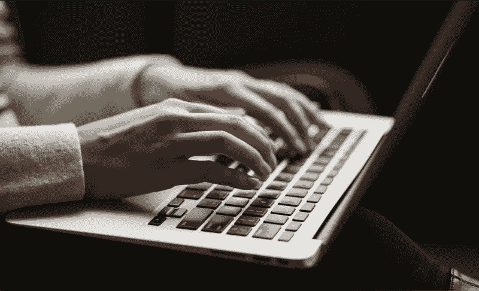

# 带有代码示例的 8 个 CSS 图像过滤器

> 原文：<https://medium.com/quick-code/8-css-image-filters-with-code-examples-6b29640b243c?source=collection_archive---------0----------------------->

[Duomly — programming online courses](https://www.duomly.com)

利用图像，我们可以创造一种气氛，唤起快乐、微笑、悲伤或任何不同的情感。有了图像，我们可以展示很多，也可以讲述很多；这就是图片在网站和应用程序中如此广泛使用的原因。

设计师关心的是用户会对网站有什么样的感受，会带来什么样的情绪。图形设计师可以使用高级软件编辑照片，并为它们添加滤镜、蒙版或其他决定最终外观的效果。

有时候，设计师创造的东西很难编码，作为开发人员，我们关注代码的性能，希望我们的网站加载速度快。这通常意味着我们必须缩小图像尺寸。这也是为什么我们更喜欢设计者用代码创造效果的原因。特别是当我们必须在悬停或点击时添加效果时，我们不想加载两个图像。

我们可以使用代码轻松地为图像添加滤镜，例如使用 CSS，在本文中，我将向您展示如何使用滤镜来创建令人惊叹的效果。

开始吧！

# CSS 中的过滤器

为了给 CSS 中的图像创建过滤器，我们使用 filter 属性，它使用一些不同的函数来定义视觉效果。每个功能可以给基本图像不同的结果。此外，还可以为一幅图像添加多个滤镜。

让我们一个一个地去看看我们可能得到的结果。

## 1.灰度(% |数字)

添加到图像中的最流行的滤镜是灰度。它允许创建一个黑白照片。灰度函数可以采用百分比或数字参数。0%表示什么都不会改变，100%表示图像将完全转换为灰度。如果您将该值留空，则默认情况下将取 100%。如果您想用数字来设置值，它接受从 0 到 1 的值。

在上面的例子中，你可以看到没有任何滤镜的原始照片，第二张是值为 0.5 的图像，最后一张是完全灰度的照片。

## 2.棕褐色(% |数字)

棕褐色滤镜创建红棕色照片。sepia()方法的工作原理类似于灰度；它也接受从 0%到 100%或从 0 到 1 的值。不允许负值。让我们看看例子:

在示例中，您可以看到棕褐色滤镜是如何工作的。如果你想让照片看起来有点老气，我觉得用它是个好主意。这是我看了棕褐色图像后首先想到的。

## 3.模糊(像素)

模糊效果通过应用高斯模糊效果使照片非常模糊。它适用于审查或不需要使照片非常清晰的背景图像。blur()方法也有一个参数，参数必须是一定数量的像素。模糊越大，值越大。默认情况下，该值为 0。

第一个例子是一个没有滤镜的基本图像，第二个例子有 2px 模糊，有点模糊，最后一个例子，几乎不可能识别照片上的内容。

## 4.亮度(% |数字)

另一个滤镜是 brightness()，它允许调整图片的亮度级别。它采用一个从 0%到 100%的百分比参数，上面的一切使图像更亮，或者作为一个从 0 到 1 或以上的数字使图像更亮。默认情况下，每幅图像的亮度都是 100%。让我们在代码示例中检查该过滤器的行为:

示例中的图像设置为 0.5%和 150%。你可以注意到越暗的照片数字越低，反之亦然。

## 5.对比度(% |数字)

对比度()滤镜允许调整图片的对比度。如果该值设置为 0%或 0 数字，它将完全黑暗，设置为 100%或 1，是默认的，这意味着照片将不会发生任何变化，高于 100%或 1 的值将提供较少的对比度。让我们看看这个例子:

在上面的例子中，我将第一张照片的对比度降低到 10%，将第二张照片的对比度提高到 200%。

## 6.饱和(% |数字)

饱和度描述颜色的强度，饱和度过滤器的值越大，颜色越鲜艳。图像的默认值是 100%或 1，0 表示图像是不饱和的，高于 100%和 1 的一切都会增加饱和度。让我们看看这个例子:

正如你在示例中看到的，第二个图像是不饱和的，设置为 20%的饱和度，第三个图像设置为 200%的饱和度，它明显更生动。

## 7.色调-旋转(度)

首先，我们先解释一下什么是 hue-rotate，因为它可能会引起混淆。是给我的。因此，色调旋转是一个函数，我们指定围绕色环的角度。输入可以是度或圈数。它也接受负值。最大值是 360 度，所以即使我们将设置更大的值，它也像在圆中一样工作，例如，如果您将设置 450 度，那么结果将是 90 度，如果我们设置-10 度，结果将像我们设置 350 度一样(所以 360 度-10 度)。让我们看一下代码示例:

在上面的例子中，你可以看到四个图像，第一个是原始的，没有任何色调旋转，但它也是 360 度色调旋转的样子。第二个图像设置为 90 度的色调旋转，可以看到绿色在这里非常强烈。第三个图像设置为 180 度，在这个例子中，图像更蓝，最后一个设置为-90 度(计算为 240 度)更红。

## 8.反转(% |数字)

另一个可以应用于 CSS 图像的过滤器是反向的。它用于反转图像上的样本。反转函数接受的值只是正的。让我们看看这个例子:

在上面的代码笔中，你可以看到三个图像。第一个是原来的，下一个反转到 75%，最后一个完全反转(值为 1)。

# 结论

为图像添加滤镜有时可能会非常方便，尤其是如果您想要实现惊人的视觉效果。

在上面的文章中，我介绍了 8 种过滤方法，并描述了它们可以接受的值，为您提供了一个过滤器的备忘单，您只需快速浏览一下，就可以知道应用什么过滤器来获得所需的结果。

我希望你觉得它有用，也在评论中分享你最喜欢的过滤方法，或者也许你创建了任何令人惊叹的自定义过滤器？让我知道！

好好编码！

[Duomly — programming online courses](https://www.duomly.com)