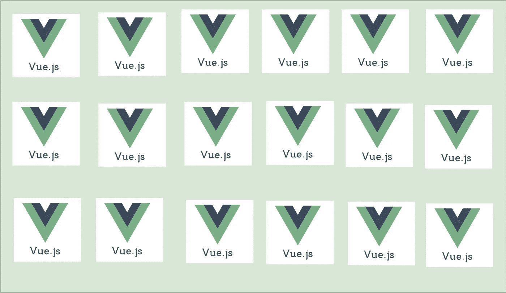

# 用 Vue.js 实现微前端的 8 种不同方式

> 原文：<https://medium.com/bb-tutorials-and-thoughts/8-different-ways-to-implement-micro-frontends-with-vue-js-308663f0d51c?source=collection_archive---------0----------------------->

## 检查哪种架构符合您的需求

我已经在微前端上工作和研究了一段时间，现在我有足够的信息与世界分享。随着项目变得越来越大，维护和协作这些项目变得非常困难。随着项目越来越大，它们的构建时间增加，单元测试增加…