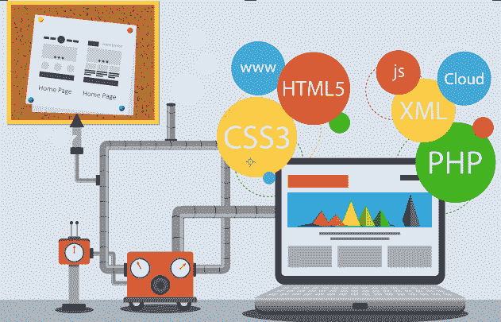
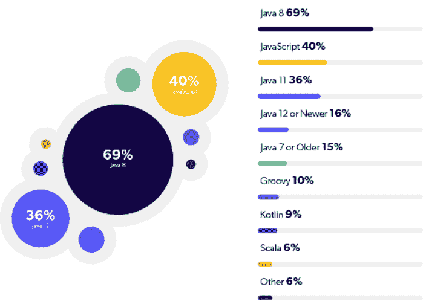
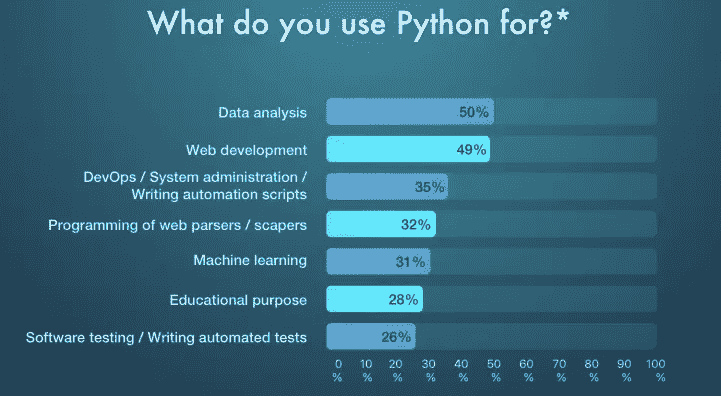
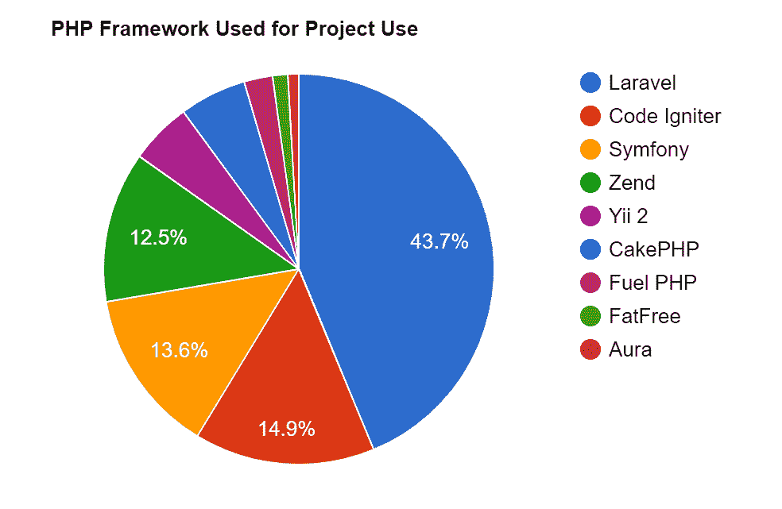

# 8+用于 Web 开发的完美编程语言

> 原文：<https://medium.com/quick-code/8-flawless-programming-languages-for-web-development-ea467074e6dd?source=collection_archive---------1----------------------->

图片来源:Haznos

每年都会推出新的编程语言和技术，这使得在专注于 web 开发时，很难确定要学习的最佳语言和要使用的最佳工具。

如果你对 web 开发感兴趣，了解有哪些语言是很重要的。并非所有的语言都是平等的，每种语言都有自己的目的和特点，可能比另一种语言更适合您的项目。

下面，我们将介绍用于 web 开发的前 10 种语言，以及它们的优缺点，这样你就可以知道哪种语言最适合你的需求。

# Web 开发的顶级编程语言

# 1.Java 语言(一种计算机语言，尤用于创建网站)

**流行的 Java 版本**(图片来源:JRebel)

Java 是一种通用的、基于类的、并发的、面向对象的计算机编程语言，它被特别设计成具有尽可能少的实现依赖性。

它旨在让应用程序开发人员编写一次就可以在任何地方运行(WORA)，这意味着在一个平台上运行的代码不需要重新编译就可以在另一个平台上运行。

Java 应用程序通常被编译成字节码(类文件),可以在任何 Java 虚拟机(JVM)上运行，与计算机架构无关。

而且，如果你对 Java 语言不了解，可以 [**聘请可靠的 web 开发公司的专门开发团队**](https://www.valuecoders.com/dedicated-development-teams?utm_source=dedi_dev_team&utm_medium=Guest_Blog&utm_campaign=medium&utm_id=NKY) 。这样做将能够为您的企业建立一个优秀的网站。

**使用 Java 的好处**

安全:使用 Java，你可以创建无病毒、无篡改的系统。Java 的认证技术基于公钥加密。

**可移植性:** Java 被设计成独立于平台的，这意味着用 Java 编写的应用程序可以在任何有 JVM 的系统上运行。

**架构无关:** Java 被设计成平台无关的，这意味着它不依赖于任何特定的硬件或操作系统。

**多线程:**线程是程序中可以并发运行的不同部分，Java 对多线程有极好的支持。这允许开发者更容易地创建可以同时做多件事情的程序。

**使用 Java 的缺点**

**性能:**高级语言比低级语言慢是因为要经过解释器或者虚拟机，而低级语言是编译成处理器能理解的机器码。

**内存管理:**在 Java 中，内存是由 JVM 通过一个叫做垃圾收集的过程自动管理的。然而，开发人员无法控制这个过程何时运行，有时它会导致程序执行暂停，这可能会让用户感到烦恼。

**不适合移动开发:** Java 不适合移动开发，因为它比 Objective-C 或 Swift 等语言更占用内存。

# 2.Java Script 语言

从本质上来说，JavaScript 是一种脚本语言，它允许你在 Web 浏览器甚至其他浏览器中编写行为。本质上，它使您能够扩展 HTML 并创建带有动画、表单、按钮和数据验证的交互式网站。

它特别有用，因为它在网站上无处不在——例如；几乎所有现代浏览器都可以在没有插件的情况下执行 JavaScript。这意味着，如果你学习了 JavaScript，你将能够从一个代码库创建跨许多不同类型设备的应用程序。

此外，微软已经创建了一个基于. NET 的变体，称为 TypeScript，它可以向下编译成 JavaScript，因此它可以在任何浏览器或平台上工作。

**使用 JavaScript 的好处**

丰富的界面: JavaScript 可以用来创建更具交互性和用户友好性的界面。这是因为 JavaScript 允许您创建下拉菜单和表单验证之类的东西。

**增加的功能:**通过使用 JavaScript，你可以给你的网站增加额外的功能，这是单独使用 HTML 无法实现的。例如，您可以利用它来创建地图、游戏和全新的用户体验。

**服务器加载:** JavaScript 可用于将新内容加载到页面上，而无需重新加载整个页面。这意味着你的网站会更快，使用更少的资源，这对用户和搜索引擎都很好。

**使用 JavaScript 的缺点**

**安全问题:**因为 JavaScript 是客户端脚本语言，所以意味着代码是在用户的电脑上执行的。这可能是一个安全风险，因为恶意代码可能会被注入网站以窃取信息或损坏计算机。

**浏览器兼容性问题:**和 CSS 一样，不同的浏览器可以对 JavaScript 做出不同的解释。这可能会导致网站如何显示或某些功能如何工作的问题。

# 3.超文本标记语言

超文本标记语言(HTML)可以说是 web 开发人员最基本的技能。无论你是构建一个简单的网页还是从头开始设计一个复杂的模板，HTML 都将是你的主要工具。

知道如何编写自己的页面可以让你定制它的每一部分——从字体大小和颜色到图像位置和大小，一切都在你的控制之下。

您还可以添加脚本元素，允许用户以独特的方式与您的内容进行交互。例如，添加 onclick=打开了各种可能性:如果有人在网上点击你的照片，它可以链接回你的专业网站或联系信息。

**使用 HTML 的好处**

**可被任何浏览器读取:**任何网络浏览器都可以读取 HTML 文件，并将其渲染成可视或可听的网页。这意味着一旦 HTML 文件被创建，它就可以在任何类型的有浏览器的计算机或设备上被浏览。

**轻量级:** HTML 文件非常小，这使得它们可以快速下载并易于处理。

**宽松语法:**HTML 的语法(文法)没有其他编程语言那么严格。这意味着用 HTML 编码时需要记住的规则更少，相对容易学习。

**使用 HTML 的缺点**

**特定于浏览器的代码:**虽然大多数浏览器可以读取 HTML，但不同的浏览器对某些代码的解释是不同的。这可能会导致网页在各种浏览器上的显示方式出现问题。

**标签使用不当:**如果标签使用不当，会导致网页无法正确显示。

# 4.计算机编程语言

图片来源:BoTree 技术公司

从金融到数据科学，Python 是当今最常用的语言之一。它结合了逻辑语法和动态类型，可以用于各种行业。

得益于它在程序运行时优化程序的独特能力，Python 除了适用于商业应用程序之外，还能运行一些当今最快的网站。

此外，它有一个非常大的预建库，任何需要的开发人员都可以随时使用。

**使用 Python 的好处**

**巨大的库支持:** Python 提供了大量的内置库，这些库提供了丰富的模块和函数，供程序员用来开发快速而健壮的应用程序。

**易学易编码:** Python 是最容易学习和编码的语言之一。它使用简单的英语关键字，与其他语言如 Java、C++等相比，容易记忆。

**可移植性:** Python 可以在多种硬件平台上运行，并且在所有平台上都有相同的接口。

**高级语言:**它被认为是一种高级语言，因为它抽象了代码实现细节，从而提供了对功能的更大关注。

使用 Python 的缺点

**不发达的数据库访问层:**与 JDBC 和 ODBC 等技术相比，Python 的数据库访问层仍然不发达。

字符串处理能力不足: Python 的字符串实现不如 Java 的强大或完整。这可能会使一些任务变得更加困难。

**速度慢:** Python 是一种解释型语言，因此，它比 C 和 C++等编译型语言要慢。

如果，对于 web 开发，你选择了 Python 技术，那么 [**雇佣 Python 开发者**](https://www.valuecoders.com/hire-developers/hire-python-developers?utm_source=Hire_python&utm_medium=Guest_Blog&utm_campaign=medium&utm_id=NKY) 。这将有助于你综合运用这一技术，最终你将能够形成一个独特的 web app。

# 5.半铸钢ˌ钢性铸铁(Cast Semi-Steel)

CSS 是一种用于给网站或任何其他 HTML 文档添加样式和布局的语言。它通常与 JavaScript 一起使用，通过处理所有需要的重复代码，可以更容易地创建漂亮的网站。

虽然 CSS 可以使你的网站有很大的不同，但由于其相当混乱的语法，一开始可能很难学习。但是一旦你开始越来越多地使用它，所有的事情都开始变得有条不紊，在你意识到这一点之前，你将会像专家一样写出令人敬畏的代码！

**使用 CSS 的好处**

**一致的设计:** CSS 可以用来为网站上的所有网页创建一致的设计。这意味着您只需要在一个地方进行更改，这些更改将反映在整个站点上。

**使页面加载更快:** CSS 通过将内容与表现分离，帮助减少 HTML 文件的大小。这意味着加载网页时应该下载更少的数据，这可以使页面加载更快。

**允许不同的媒体类型:** CSS 可以用来设计不同类型的媒体，比如图像和文本。这使您可以在任何设备上创建外观精美的网站，无论是电脑、手机还是平板电脑。

**使用 CSS 的弊端**

**难学:**CSS 的语法可能非常混乱，尤其是对于初学者。掌握它需要大量的练习，即使这样，你仍然可能犯错误。

**浏览器兼容性问题:**由于不同浏览器解释 CSS 的方式不同，网站在不同类型的浏览器上的显示方式可能会有问题。

# 6。SQL

如果你懂 SQL，那么使用数据库就很容易。无论该数据库是在您的桌面计算机上还是在像 Amazon Web Services (AWS)这样的云平台上，掌握 SQL 知识将使您能够以一种流畅而高效的方式与数据库进行交互。

要构建动态 web 应用程序，您需要能够将数据作为项目的一部分进行管理。谈到数据管理，SQL 是一种必不可少的语言。语法可能一开始看起来有点吓人，但是一旦你熟悉了，SQL 就会变得非常强大。

您可以使用 SQL 根据不同的条件(如 ID 号或日期范围)从数据库中检索特定的记录。您还可以使用它来更新表中的信息，甚至创建新表。可能性是无限的！

**使用 SQL 的好处**

**更快的查询处理:** SQL 可以帮助加快查询处理的过程，因为它可以用来从数据库中检索特定的数据。

**更简单的数据管理:** SQL 可以使数据管理任务变得更简单，因为它可以用来创建新表和更新现有表中的信息。

交互语言:SQL 的语法一开始可能看起来有点吓人，但是一旦你进入其中，SQL 就变成了一种非常强大的交互语言。

**使用 SQL 的缺点**

**安全问题:**与任何处理数据库的语言一样，如果使用不当，SQL 可能会带来安全风险。

**不可移植:** SQL 不是可移植语言，这意味着它只能在某些平台上使用。

**没有循环结构:** SQL 没有任何循环结构，这使得它很难编写。

# **7。PHP**

图片来源:卓越网络世界

PHP 是客户端和服务器端 web 应用程序中使用最广泛的开源语言，有着悠久的历史，目前由 Oracle 所有。PHP 最初由拉斯马斯·勒德尔夫于 1994 年创建，在 2003 年用于创建 Mambo 时开始流行。

它很简单，不需要复杂的配置，与 MySQL 等各种数据库集成得很好。它也很容易学习，因为它有宽松的语法规则，尽管它也很有挑战性，因为在您能够继续前进之前，有一些复杂的概念必须完全理解。

所以如果你想用 PHP 开发你的网站，联系印度 最好的 [**PHP 开发公司**](https://www.valuecoders.com/php-development-services-company?utm_source=php_dev_com&utm_medium=Guest_Blog&utm_campaign=medium&utm_id=NKY) **[**雇佣 PHP 开发人员**](https://www.valuecoders.com/hire-developers/hire-php-developers?utm_source=Hire_PHP&utm_medium=Guest_Blog&utm_campaign=medium&utm_id=NKY) 。**

**使用 PHP 的好处**

安全:在 PHP 的最新版本中，已经进行了大量的安全改进，使它成为一种更安全的语言。

**灵活性:** PHP 是一种灵活的语言，可以用于从小的个人项目到大的企业应用。

**良好的性能:** PHP 具有良好的性能，这得益于它高效的内存管理和利用服务器端缓存的能力。

**使用 PHP 的缺点**

**非类型安全:**与 C#不同，PHP 不是一种类型安全的语言，这意味着你不能用特定的数据类型来声明变量。如果您试图使用错误数据类型的变量，这可能会导致错误。

**糟糕的错误处理:**PHP 的另一个缺点是它有糟糕的错误处理，这会给调试代码带来困难。

# **8。C#**

尽管 C#的总体目标是成为一种可移植语言，但它仍然受到 Windows 用户的欢迎。这意味着，如果遇到任何问题，通常可以更容易地找到 C#并获得帮助，还可以访问一系列专门为 Windows 设计的库。

但它的主要优势是它与其他主要语言(Java 和 C++)足够相似，程序员可以轻松地从一种语言切换到另一种语言，而不必学习任何新的东西，这意味着它可以作为一般编码技能的坚实基础。

**使用 C#的好处**

**自动垃圾回收:** C#自动管理内存，这意味着你不用担心自己删除对象或者释放内存。

**类型安全:** C#是一种类型安全的语言，这意味着你可以用特定的数据类型声明变量，编译器会检查以确保你只使用那个数据类型。

异常处理: C#有内置的异常处理，这有助于防止错误导致程序崩溃。

**使用 C#的缺点**

x 平台 GUI 差:虽然 C#是一种可移植语言，但它没有一个很好的 x 平台 GUI。这意味着如果你想开发一个跨平台的应用程序，你可能需要为 GUI 使用另一种语言。

不太受欢迎:C#不像其他一些语言那样受欢迎，这使得你在遇到任何问题时更难找到帮助和资源。

# 9.去

Go 编程语言是一种开源软件程序，旨在帮助程序员更有效地开发程序。开发 go 的主要目的是帮助更容易地创建提供良好性能的工具。

它的努力取得了成功，这可以归功于许多因素，包括谷歌和其他几家技术公司的广泛支持，优雅的语法，强大的功能和快速的编译时间。

使用 Go 的另一个好处是它提供了三种交付代码的方式:作为独立的二进制文件，以及与另一个应用程序一起安装或捆绑。当您希望您的应用程序在不同的平台上或通过不同的方式提供时，这使得它非常灵活。

**使用 Go 的好处**

**执行速度更快:** Go 是一种编译语言，这意味着它的执行速度比解释语言更快。

**综合工具:** Go 附带了一个综合工具，可以用来开发、测试和部署你的代码。

高效的垃圾收集: Go 有一个高效的垃圾收集器，可以在不再需要内存时回收内存。

**使用 Go 的缺点**

**缺乏泛型:**使用 Go 的一个缺点是它没有泛型，这意味着你不能创建处理多种数据类型的函数。

**缺少 GUI 工具包:**Go 的另一个缺点是它没有任何 GUI 工具包，这使得创建图形用户界面变得很困难。

# 结尾词

所以这些是网络开发的最佳编程语言。PHP、Java 和 Go 是三种最流行的语言，而如果你正在寻找一些没有被广泛使用的语言，C#是一个很好的选择。

无论您选择哪种语言，在学习更复杂的概念之前，请确保您已经熟悉了基础知识。

如果你遇到了困难，不要犹豫，向有经验的开发人员寻求帮助，或者你可以简单地从可靠的网络开发公司雇佣开发人员。他们会帮助你理清事情，让你回到正轨。

编码快乐！:)