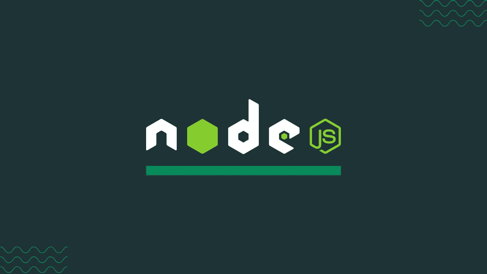
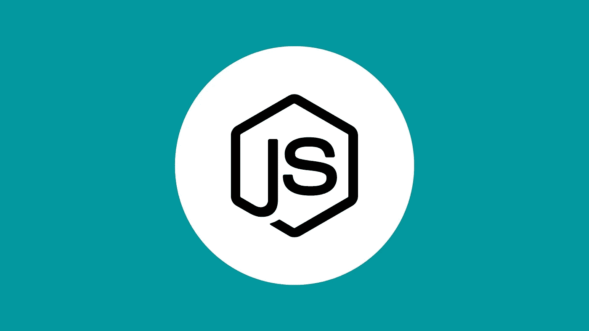
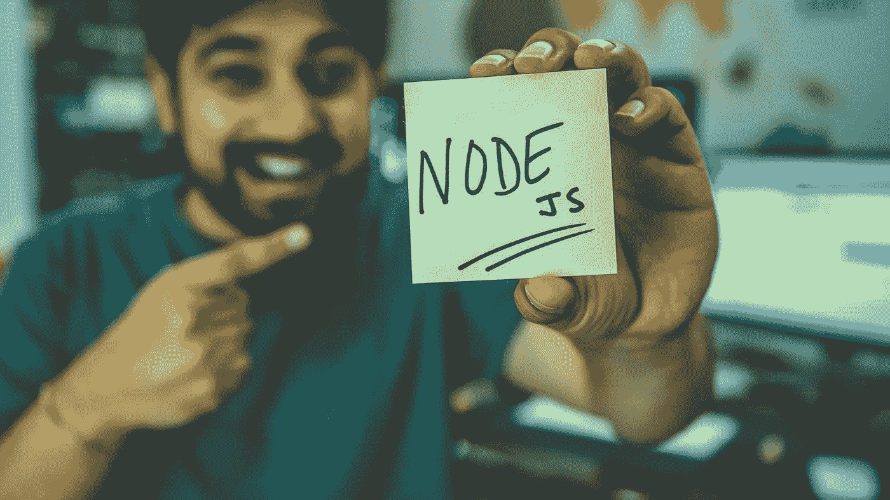

# 在线学习 Node.js 的 8 门免费课程

> 原文：<https://medium.com/quick-code/8-free-online-courses-to-learn-node-js-6dc7b63543c7?source=collection_archive---------0----------------------->

## 下面是我列出的供初学者学习 Node.js 的顶级免费 Node.js 课程

Learn Node.js

毫无疑问，Python 和 Java 是 web 开发最流行的两种编程语言。然而，任何有兴趣成为 web 开发人员的人也应该学习 Node.js。它提供了广泛的 JavaScript 模块，以简化使用该框架开发 web 应用程序。但是 Node.js 是什么呢？

Node.js 是一个基于 Chrome JavaScript 运行时环境的 web 应用程序框架，允许开发人员构建快速、可伸缩的 web 应用程序。它是开发人员构建后端 web 应用程序的流行框架，事件驱动的异步模型使它成为数据密集型应用程序的理想框架。此外，它运行 JavaScript，这是一种流行且易于使用的编程语言。web 推送通知、聊天和新闻提要等实时应用程序也使用 Node.js (Node)在浏览器和服务器之间建立持久连接。

# 初学者学习 Node.js 的顶级课程

现在，如果您已经学习了 Node.js 的基本知识，那么是时候通过免费课程继续学习 Node.js 了。或者，如果你想投资付费课程，我为初学者整理了一份[最佳 Node.js 教程](https://coursesity.com/blog/best-node-js-tutorials/)的列表，你可以稍后查看。那么，事不宜迟，让我们开始吧。

## 1. [Node JS API 开发初学者](https://click.linksynergy.com/deeplink?id=0F1O0otUXQc&mid=47901&u1=csMedium&murl=https%3A%2F%2Fwww.udemy.com%2Fcourse%2Fnode-js-api-tutorial%2F)

Node JS Fundamentals

对于绝对的初学者来说，这个课程会教你 Node JS 的基础知识，让你可以立刻开始构建 API。在整个课程中，您将学习现代 JavaScript、节点 JS 事件循环、异步编程、使用节点模块、构建您的模块、创建服务器、发送 json 响应、连接到数据库以及创建节点模块。

在本节点 JS 课程中，您将学习:

*   现代 JavaScript
*   Node.js 基础知识

这是 Udemy 上的顶级免费 Node JS 课程，5 门课程中有 4.4 门，时长 2 小时 47 分钟。此外，请记住，由于这是一门免费的 Udemy 课程，所以完成后您不会获得证书。

## 2.[使用 Node.js 和 Express 构建 RESTful APIs】](https://coursera.pxf.io/c/1137078/1213622/14726?u=https%3A%2F%2Fwww.coursera.org%2Flearn%2Fbuilding-restful-apis-using-nodejs-and-express&subId1=csMedium)

对于新兴技术，REST APIs 提供了一种简单灵活的集成应用程序的方法。因此，它们已经成为链接分布式组件的最流行的方法之一。构建 REST APIs 是后端开发人员的关键技能之一。

本节点 JS 课程的主题包括:

*   使用 Vanilla Node.js 记录和构建 REST APIs。
*   使用 ExpressJS 构建 REST APIs。
*   使用 JSON Web 令牌和 Oauth 保护 REST APIs。

本课程将教你如何使用框架和工具构建和记录 REST APIs。它主要用于创建 REST APIs，接受来自前端的请求并发送适当的响应。作为本课程的一部分，您还将学习如何使用 Swagger 记录 REST APIs。

这是 Coursera 上排名第一的免费 Node JS 课程，时长 17 小时。由于这是一门免费的 Coursera 课程，完成后您将获得一份证书。

## 3.[node . js 简介](https://www.awin1.com/cread.php?awinmid=6798&awinaffid=466009&clickref=csMedium&ued=https%3A%2F%2Fwww.edx.org%2Fcourse%2Fintroduction-to-nodejs-2)

本课程将教你如何构建命令行工具、模拟 JSON APIs 以及快速原型化实时服务。此外，您将发现和使用各种生态系统和 Node.js 核心库，并对如何使用 Node.js 有更好的理解

在本节点 JS 课程中，您将学习:

*   如何快速构建命令行工具？
*   如何快速模仿 RESTful JSON APIs？
*   如何快速原型化实时服务？
*   如何使用生态系统工具？

它通过让学生沉浸在全栈开发体验中，为他们构建不同类型的 Node.js 应用程序提供了实用的基础。此外，通过掌握本课程中介绍的原则和核心理解，学生可以进一步学习 OpenJS Node.js 应用程序开发人员(JSNAD)和 OpenJS Node.js 服务开发人员(JSNSD)认证。

这是 edX 上的顶级免费节点 JS 课程，持续时间为 7 周(每周 1-2 小时)。此外，请记住，由于这是一门免费的 edX 课程，所以完成后您不会获得证书。

## 4.[学习 Node.js](https://www.pjatr.com/t/TUJGR0lLR0JHR0pMSUtCR0ZISk1N?sid=csMedium&url=https%3A%2F%2Fwww.codecademy.com%2Flearn%2Flearn-node-js)

Node.js Tutorials

毫无疑问，JavaScript 是市场上最流行的编程语言之一。专业开发人员依赖 Node.js 作为他们最常用的运行时环境。与其他 JavaScript 运行时不同，Node.js 是事件驱动的。除了是开发网络应用程序的理想环境之外，Node 对于 JavaScript 开发还有无数的潜在用途。

本节点 JS 课程的主题包括:

*   欢迎学习 Node.js
*   后端是什么？
*   Node.js 简介
*   Node.js 基础
*   使用 HTTP 设置服务器

本课程将解释服务器端 web 开发的概念。该课程将教你网站或 web 应用程序的后端是如何工作的，以及 Node.js 是如何工作的。在本课程之后，您将探索像 Express.js 这样的流行节点框架来构建健壮的应用程序。有 HTML 和 JavaScript 的经验是有帮助的，但不是必需的。

这是 Codecademy 上的顶级免费 Node JS 课程，持续时间为 7 小时。此外，请记住，除非您拥有 Codecademy 的专业会员资格，否则您不会获得结业证书。

## 5.[node . js 初学者指南](https://click.linksynergy.com/deeplink?id=0F1O0otUXQc&mid=47901&u1=csMedium&murl=https%3A%2F%2Fwww.udemy.com%2Fcourse%2Fa-beginners-guide-to-nodejs%2F)

NodeJS 是一个跨平台、事件驱动的异步 JavaScript 运行时。超过 10 亿人下载了它，使它成为增长最快的开源项目。由于其轻量级和灵活的特性，它在构建可伸缩的 web 应用程序方面变得越来越流行。举几个例子，网飞、PayPal、LinkedIn 和优步在他们的网络应用中使用它。

在本节点 JS 课程中，您将学习:

*   后端开发
*   节点. js

本课程将教您如何使用 Node.js 构建您的应用程序。通过本课程，您将了解这一强大的工具，并学习如何构建 API，以便您可以立即开始构建后端 web 应用程序。

这是 Udemy 上的顶级免费 Node JS 课程，5 门课程中有 4.1 分，时长 2 小时。此外，请记住，由于这是一门免费的 Udemy 课程，所以完成后您不会获得证书。

## 6.[使用 NodeJS、Express 和 MongoDB 进行服务器端开发](https://coursera.pxf.io/c/1137078/1213622/14726?u=https%3A%2F%2Fwww.coursera.org%2Flearn%2Fserver-side-nodejs&subId1=csMedium)

该课程侧重于服务器端的一切。在整个课程中，我们将使用 NodeJS 平台作为基础。首先，我们将讨论 HTTP 和 HTTPS 这两种 Web 协议。同时，为了构建 web 服务器，我们将研究 NodeJS 和 NodeJS 模块:Express。此外，本课程中的数据库部分将涵盖基本的 CRUD 操作和 NoSQL 数据库，特别是用于与 MongoDB 交互的 MongoDB 和 Mongoose。

本节点 JS 课程的主题包括:

*   服务器端开发简介
*   数据，数据，你在哪里？
*   站住。谁
*   后端即服务(BaaS)

在本课程中，我们将了解 REST 的基础知识，并构建一个 RESTful API。您还将了解身份验证和安全性。最后，我们研究后端即服务(BaaS)方法，包括移动 BaaS 以及开源和商业 BaaS 解决方案。

这是 Coursera 上的顶级免费 Node JS 课程，持续时间为 48 小时。由于这是一门免费的 Coursera 课程，完成后您将获得一份证书。

## 7.[借助 Node.js 的力量开发 Web 应用](https://www.awin1.com/cread.php?awinmid=6798&awinaffid=466009&clickref=csMedium&ued=https%3A%2F%2Fwww.edx.org%2Fcourse%2Fweb-app-development-with-the-power-of-nodejs)

本课程向您介绍了用于开发 JavaScript web 和端到端应用程序的健壮的 Node.js 框架。本在线课程不需要 JavaScript 的先验知识。本课程从语言基础的介绍开始，在第二周转移到更高级的主题，如函数和对象。

这是一门完美的课程，适合任何考虑从事全栈 web 开发的人，考虑为他们的下一次创业开发移动应用程序的人，或者只是想为他们的工具箱添加一项非常受欢迎的技能的人。

这是 edX 上的顶级免费节点 JS 课程，持续时间为 4 周(每周 2-3 小时)。此外，请记住，由于这是一门免费的 edX 课程，所以完成后您不会获得证书。

## 8. [Learn Node.js —初学者全教程](https://coursesity.com/r/site/learn-nodejs---full-tutorial-for-beginners)

通过这门 freeCodeCamp 课程，您将了解 Node.js，这是一个在浏览器外执行 JavaScript 代码的开源 JavaScript 运行时环境。这是 YouTube 上的初学者友好教程，将帮助您轻松掌握 Node.js 概念。

感谢您阅读这篇关于免费 Node.js 课程的文章！如果你觉得这篇文章有帮助，请在评论中告诉我。还有，说说你刚开始学习 Node.js 时的体验如何？

 [## 学习 React.js 的十大免费课程

### 下面列出了 Udemy、Coursera、edX 等领先提供商提供的顶级免费 React 课程！

medium.com](/quick-code/top-10-free-courses-to-learn-react-cc6a40b9835)  [## 学习围棋编程的 5 门免费 Golang 课程

### 各位程序员和开发者好！您对免费 Golang 课程的搜索到此结束。在这篇文章中，我将分享…

medium.com](/quick-code/5-free-golang-courses-to-learn-go-programming-5dd95c4baddb)  [## 面向初学者的 10 门免费 Java 课程[2022 年 8 月]——在线学习 Java

### 这里有一些免费的 java 课程，可以帮助你开始成为 Java 开发人员的旅程。

medium.com](/quick-code/10-free-java-courses-for-beginners-2022-aug-learn-java-online-e8bd09f923eb)