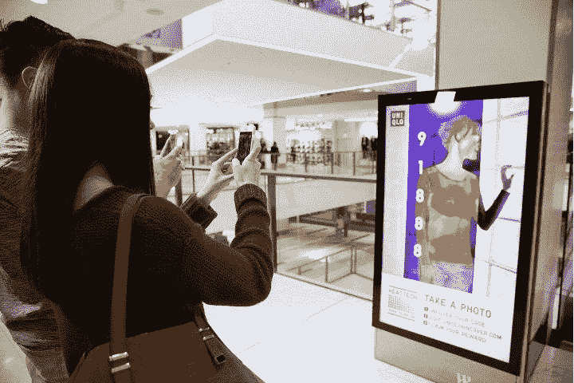
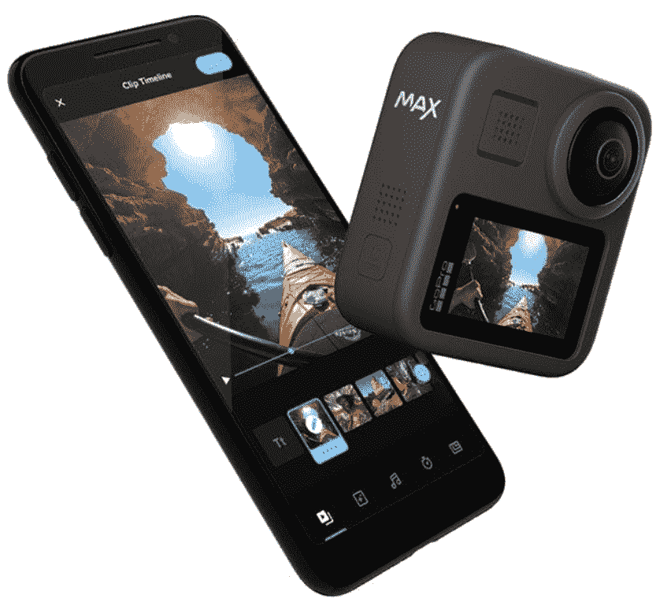
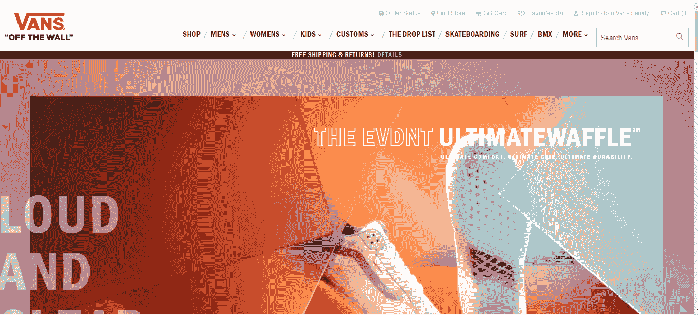
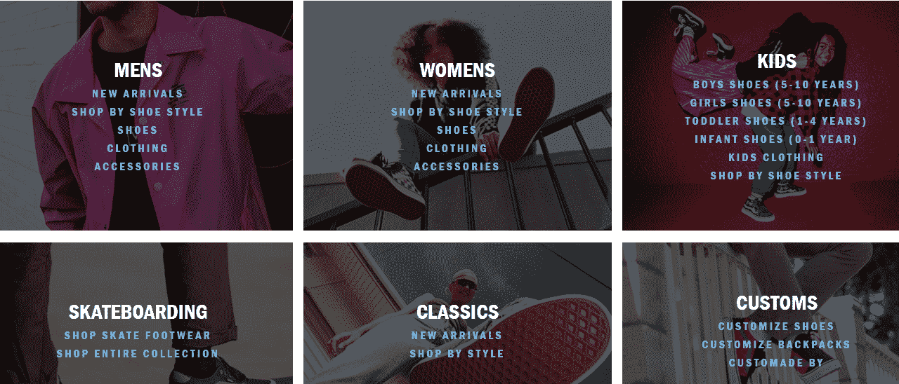
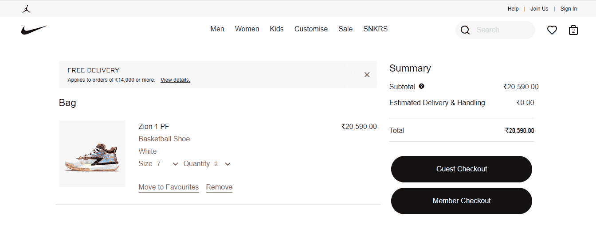

# 强化你的直销业务模式的 8 个想法

> 原文：<https://medium.com/globant/8-ideas-to-strengthen-your-direct-sales-business-model-f2feaf86b770?source=collection_archive---------3----------------------->

你有没有想过为什么市场网站如此受欢迎？为什么买家不直接从品牌网站购买，而不是使用亚马逊、Flipkart、阿里巴巴等零售网站？

主要原因是，买家会选择多样化，这将为他们提供巨大的折扣，而市场是一个在一个地方提供这些折扣的平台。

还有许多其他因素需要考虑。那么，我们如何帮助商业品牌加强他们鼓励直销的策略呢？

## 创新的数字营销策略

对于商业品牌网站来说，重要的是要有创新的数字营销策略，以最大化销售线索和销售额。

优衣库是一家创新的日本服装公司，它敦促全世界穿休闲服装。他们的使命是提供简单的服装，让你的生活更美好。他们希望建立在优衣库总裁兼首席执行官柳井正的声明之上，他说，“我们(优衣库)不是一家时尚公司。我们是一家科技公司。”

为了实现这一目标，他们创建了一个有效的数字营销活动。优衣库创建了世界上第一个“快速移动”的形象活动，并在 100 个地点和网上启动。

这一经历可以在社交媒体上分享，并鼓励人们通过类似的 YouTube 和脸书视频发现自己独特的代码。结果非常好。在线视频被观看了 130 万次，超过 25，000 人注册接收优衣库简讯。该活动总共覆盖了 400 多万人，产生了 35，000 名新客户。

## 培养忠诚的客户

提高品牌投资回报率的最有效策略之一就是投资忠诚度项目。

双赢的局面是，向购买的顾客提供优惠券和折扣，关注社交媒体账户，并向他们的家人和朋友推广商店。

在线芳香蜡烛零售商 Coal and Canary 正在建立强大的消费者基础。虽然看起来不是一家大公司，但 Coal and Canary 是一家收入超过 200 万英镑的大公司。回头客几乎占了公司销售额的一半。

这并不是消费者忠诚度的终结。他们还有一个“燃烧和返回”选项，鼓励消费者将蜡烛罐返回商店，以换取下次购买的折扣。

## 执行

完美执行订单至关重要。应根据客户的需求选择产品。选择之后，品牌有责任利用全球分销渠道快速交付订单。

考虑一下:当客户与市场上的优秀品牌互动时——这些品牌与我们的感官联系在一起，增强我们的互动，通过出色的用户界面/UX 建立无缝体验，或者只是通过他们的内容真实地表达他们的目的——这就是品牌成为现实的时候。

GoPro 就是一个很好的例子。GoPro 鼓励消费者与其品牌通过活动、竞赛和挑战以及平台和商品进行前所未有的互动。在这个过程中，它创造了世界上最强大的品牌社区之一。虽然大多数 GoPro 所有者不是精英运动员，但他们拥有与专业人士相同的热情。

## 出色的用户体验

良好的用户体验可以让网上购物者找到他们想要的东西，从而提高销售额。由于良好的用户体验，客户可以更轻松地导航。

这就是阿根廷一家专门从事电子商务和在线拍卖的公司 MercadoLibre 有一个专门团队处理从用户研究到交互设计到网络开发的一切事务的原因。这些专业人员与 MercadoLibre 工程师、产品经理和高管一起开发新的创新产品。

## 内容策略

内容策略是定义适当的平衡和内容组合的机会，以实现营销和业务目标。这可以通过使用研究、数据和见解来实现，以了解客户在整个旅程中想要和需要什么，并确定需要制作哪些具体内容来满足她的需求，而不管意图如何。

重点是内容如何有助于漏斗的每一步，并吸引和吸引受众参与持续相关、个性化和可衡量的对话。

Overstock 就是这样一个专注于内容策略的组织。Overstock 的工作原则是“以转换为中心，以客户为中心”。

积压品牌:

*   品牌声音

充实如何将促销力度与高质量的产品和体验结合起来。

*   品牌受众

对于一个聪明、独特、精明的购物者来说，她专注于寻找保持自己风格的高品质商品。她有一个蒸蒸日上的家庭或者一个强大的精英家庭。

*   品牌价值

1.  价格:报价低于其他零售商

2.分类:精选适合您家居的顶级品牌和流行款式。

3.便利:提供获取创意和灵感的技术，以及查找、订购和接收您想要的东西的技术。

*   品牌承诺

根据你的分析，思考下一步该怎么做。

## 轻松导航

当谈到网站设计中的导航时，一个像样的用户界面(UI)的价值怎么强调都不为过。你的顾客找到他们想要的东西的能力对你的品牌的成功至关重要。

页眉、导航菜单、产品类别页面、现场搜索和页脚都是客户用来引导他们完成购买过程的工具。

例如，Vans，一家生产滑板鞋和相关服装的美国制造商，将它的一个父类别标记为“性别”,这导致了水平导航类别，如所选父类别的鞋、服装、配件。

有一个按性别分类的瓷砖设计，包含所有子类别，便于顾客浏览。

## 轻松结账选项

提供多种支付方式可以实现更加以客户为中心的结账流程，从而增加收入并留住客户。

根据 Baymard 的研究，平均弃车率徘徊在 70%左右。到 2020 年底，每 5 个购物者中就有 1 个因为“过长/复杂的结账流程”而放弃购物车。

耐克让结账过程保持简短，让用户不会不知所措。它遵循客人结账的理想结账流程规则。清晰的信息显示使用户知道请求某一特定信息的原因。

“最终订单审核”按钮让他们可以在下订单前自由拨打电话。

## 购物车页面设计

放弃购物车和其他激励措施以顾客为目标，为他们提供稍后返回商店购买他们想要的东西的选择。

迪士尼是一个知名的全球品牌。尽管他们的商店大多使用标准的方法来实现“添加到购物车”功能和购物车页面，但它还是有一两个好主意。

例如，当您将产品添加到购物车时(在此上下文中称为“袋子”)，确认信息不会显示在弹出层或标题中。

在“添加到包”按钮的正上方，会出现确认信息，除了告诉您该商品已添加到您的购物车之外，通知还包括一个按钮，允许您立即进行结帐！

太棒了！如果这是你想买的最后一件产品，或者如果你只想买那一件，这就特别有用。只需点击“添加到包”按钮，旁边就会出现“结帐”按钮。这是一个聪明的方法，可以让买家轻松完成交易。

## **结论**

本文讨论的想法是一个品牌重建其存在并与现有或新客户展开新对话的起点。

很明显，要获得新客户或留住现有客户，品牌需要在每个领域发挥出最佳水平，无论是用户体验还是交付。

品牌需要创新和部署最新的技术，以获得千禧一代客户的关注，并帮助他们利用自己的品牌实现自己的愿望。