# 关于 Kotlin 编程语言的 8 分钟速成课程。

> 原文：<https://blog.kotlin-academy.com/8-minute-crash-course-on-kotlin-programming-language-e8a804ed3d8a?source=collection_archive---------0----------------------->

让我们了解一下 Kotlin 编程语言的基础知识。


Credits: [Fossbytes](https://fossbytes.com/complete-android-oreo-kotlin-course/)

# Kotlin 是什么，用在什么地方？

Kotlin 是一种跨平台、静态类型和通用的编程语言。我知道我用了一些模糊的术语，让我澄清一下。

**跨平台:**是指系统或产品可以跨多个平台或操作系统环境工作。例如，微软的 Excel、Word、Powerpoint 可以在 Windows 和 Macintosh 操作系统上运行。

**静态类型:**静态类型意味着程序中使用的变量必须和它们的类型(数据类型)一起显式声明。比如 C，Java，Kotlin 等等很多都是静态类型的。考虑下面的静态类型编程的 C 编程代码。

```
**// C programming code**# include <stdio.h>
void main()
{ int num;    **// Explicitly declaring the type of the variable**
  num = 10;
  print(num);}
```

静态类型化的逆过程是动态类型化，在这里您不必显式地指定数据的类型。python 是最好的动态类型编程语言之一。考虑下面的 python 代码:

```
**# Python Code**num = 10   **# No explicit declaration**print(num)
```

**通用编程:**顾名思义，它广泛适用于所有领域。比如 Java，Python，C，C++等等很多都是通用编程语言。

回到定义，我想现在你已经理解了 Kotlin 的定义，下一步是它在哪里使用？Kotlin 用于 android 开发，以便创建 Android 应用程序。以前 Java 被用来创建 android 应用程序，但几年前 Kotlin 刚刚取代了 Java 的位置，目前正统治着编程世界。

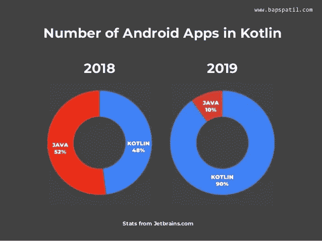

Credits: [Bapusaheb Patil](https://www.slideshare.net/BapusahebPatil/kotlin-vs-java-bapusaheb-patil-techieaid-talk)

如上所述，Kotlin 在 2019 年占据主导地位，现在几乎所有的 android 应用程序都是使用 Kotlin 构建的。

## 让我们开始编码。

首先，我已经使用 IntelliJ IDEA 编写了我的代码。IntelliJ IDEA 是一个用于开发计算机软件的 Java 集成开发环境。它是由 JetBrains 开发的。


Credits: [IntelliJ](https://www.jetbrains.com/idea/)

要下载 IntelliJ，请点击[此处](https://www.jetbrains.com/idea/download/#section=windows)。下载与您的笔记本电脑兼容的任何版本并开始使用。

下面列出了一些主要概念，您需要了解这些概念才能开始。

# 1)主要功能

在 Kotlin 中，就像其他编程语言一样，main 函数是必须的。这是编译器开始编译程序的地方。在 Kotlin 中，主函数可以写成如下形式:

```
fun main() {
    *println*("Hello Kotlin")   //Printing "Hello Kotlin"
}
```

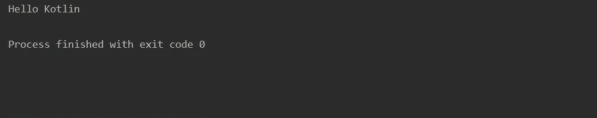

我在 main 函数中包含了一个 print 语句，使它更容易理解。在执行 main 函数时，我得到了“Hello Kotlin”作为输出。

# 2)变量声明

在 Kotlin 中，变量可以使用两个关键字声明，即 **val** 和 **var** 。

```
**val: It is used for variables whose value never changes. 
var: It is used for variable whose value can change.**
```

在 **val** 中，您不能重新赋值，而在 **var** 中，您可以重新赋值。

**在 Kotlin 中声明变量的语法是:**

```
**keyword variable_name: data_type = value**
```

## a)下面是为关键字 val 声明截取的代码:

```
val *number*: Int = 10

fun main() {
    *println*(*number*)    // 10
}
```

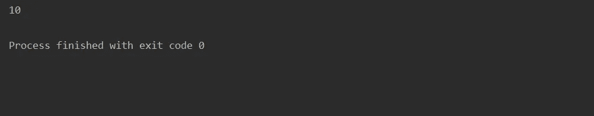

此外，当我试图重新分配变量值时，我会得到一个错误，指示变量值不能被重新分配，因为我使用了 val 关键字。

```
val *number*: Int = 10

fun main() {
    number = 20      
    *println*(*number*)   // Error
}
```

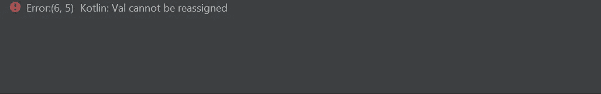

## b)下面是为关键字 var 声明截取的代码:

```
var *number*: Int = 10

fun main() {

    *println*(*number*)  // 10
}
```

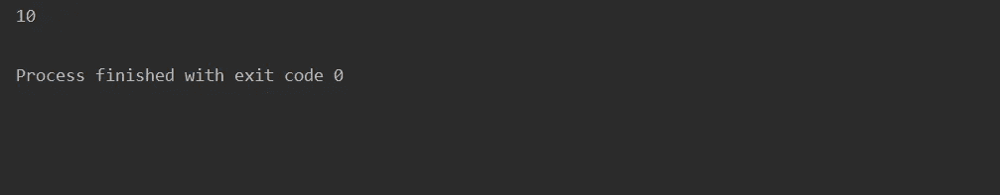

另外，当我试图重新分配变量值时，这次我不会得到错误，因为变量值可以被重新分配，因为我使用了 var 关键字。

```
var *number*: Int = 10

fun main() {
    *number* = 20
    *println*(*number*)   //20
}
```

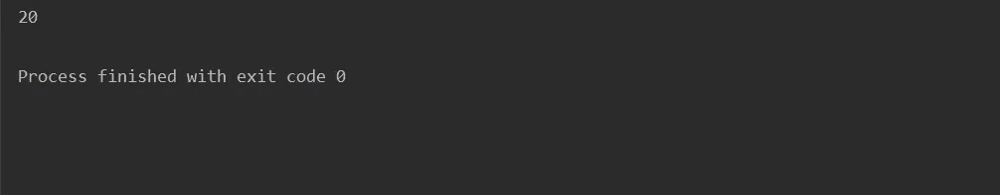

同样，您可以声明 Strings、Boolean、Float 和许多其他数据类型。

一般来说，var 称为读写引用，val 称为只读引用。我们不能重新赋值，但可以修改属性。

```
fun main() {
    val list = *mutableListOf*<Sring>("a", "b", "c", "d")
    *println*(list)
    list = mutableListOf("d", "e)"    **// Error**

    list.remove("a")
    *println*(list)
}
```

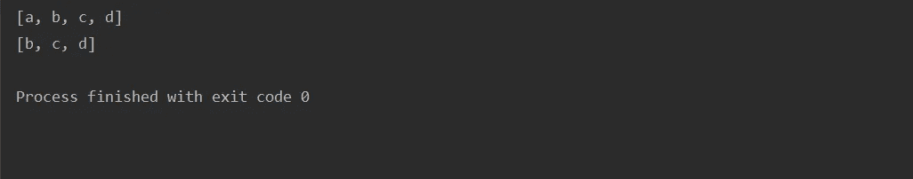

**类型推断**

类型推断是指在编译时自动检测变量的数据类型。在 Kotlin 中，类型是在变量名之后定义的:

```
var title: String
```

例如，如果您为一个变量分配了一个类型，那么您不能为同一个变量重新分配不同的类型，这样做会导致错误:

```
fun main() {
    var name: String = "Tanu"
    name= 12
    *println*(name)     // Error
}
```


然而，使用关键字 **"Any"** ，你可以将一个 Int 赋值给一个 String，反之亦然，如下所示:

```
fun main() {
    var name: Any = "Tanu"
    name = 12
    *println*(name)      //12
}
```

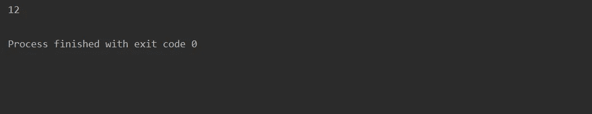

# 3)零安全

默认情况下，Kotlin 变量不能保存空变量，所以为了保存空变量，你必须使用如下所示的不同语法，你所要做的就是添加一个“**？”**在变量声明前。

```
var *number*: Int? = nullfun main() {

    *println*(*number*)   // null
}
```


如果您没有这样做，您将得到一个错误消息**“Null 不能是非 Null 类型 int 的值”。**

# 4)条件语句

像许多编程语言一样，Kotlin 也有几种条件语句机制。最常见的条件语句是 if-else 语句。如果条件为真，则执行 If 部分，如果条件为假，则执行 else 部分。

```
var *num*: Int = 10

fun main() {

    if(*num* == 10)
    {
        *num* = *num* + 10
        *println*(*num*)   //20
    }

    else
    {
        *num* = 10
        *println*(*num*)
    }

}
```

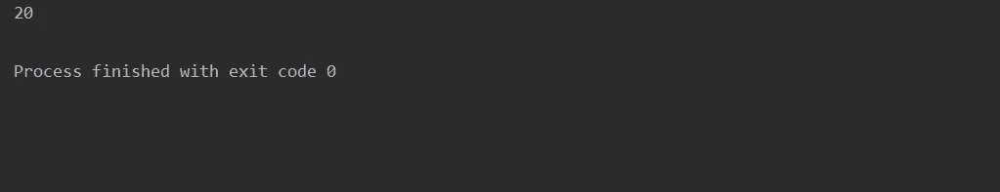

还可以一起使用多个 if-else 和 else if 语句，如下所示:

```
var *num*: Int = 30

fun main() {

    if(*num* == 10)
    {
        *num* = *num* + 10
        *println*(*num*)
    }

    else if (*num* >= 10)
    {
        *num* = *num* + 20
        *println*(*num*)     //50
    } else if(*num* >= 20)
    {
        *num* = *num* + 30
        *println*(*num*)
    } else
    {
        *print*(*num*)
    }
}
```

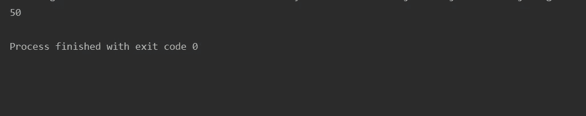

我想我不必解释代码的工作原理，你所要做的就是拿起一支铅笔，开始描摹代码，最终你会得到输出。在 kotlin 中，您还可以使用一个 ***when*** 表达式来替换多个 if-else，如下所示:

```
val *number*: Int = 100
val *answer* = when {
    *number* == 42 -> "Best"
    *number* > 35 -> "Good"
    else -> "Worst"
}

fun main() {
    *println*(*answer*)    //Good
}
```

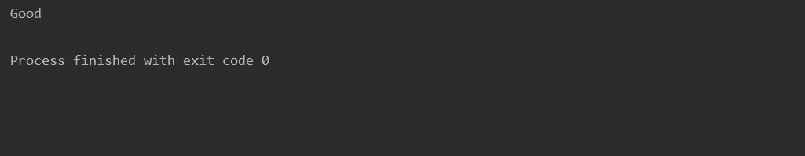

# 5)功能

函数是一组有组织的、可重用的代码，用于执行一项任务。在 Kotlin 中，为了创建一个函数，你必须使用 ***fun*** 关键字，然后定义函数输入的数据类型，最后你必须返回函数的输出。该函数的语法如下所示:

```
fun function_name(): data_type{
statement 1
statement 2
-
-
-
statement nreturn function_name
}
```

语句 1、2 和 n 只是可执行语句，也称为函数体，必须放在函数中。考虑一个例子:

```
fun add_two_numbers(): Int{
    val num1: Int = 10
    val num2: Int = 20
    val num3: Int = num1 + num2

    return num3
}

fun main() {
    *println*(*add_two_numbers*())
}
```


**以两个参数为输入的函数**

在这种情况下，您只需向函数传递两个参数或自变量，然后声明它们的类型，然后您就可以通过将值作为输入来调用该函数:

```
fun add_two_numbers(num1: Int, num2: Int ): Int{

    val num3: Int = num1 + num2

    return num3
}

fun main() {
    *println*(*add_two_numbers*(10, 20))    // 30
}
```


# 6)类别及其属性

在 Kotlin 中，为了声明一个类，你需要使用关键字*然后是它的属性。该类的语法及其属性如下所示:*

```
*class class_name{ properties of a class}*
```

*类使用属性表示状态。属性是一个类级变量，可以包含一个 getter、一个 setter 和一个 backing 字段。对象是一个类的实例，在对象的帮助下，我们可以访问类的变量。例如:*

```
*class dog {
    var name: String = "Danny"
    var breed: String = "Boxer"
    var color: String = "White"
}

fun main() {
    var d = dog()
    *println*(d.name)      //Danny
    *println*(d.breed)     //Boxer
    *println*(d.color)     //White
}*
```

*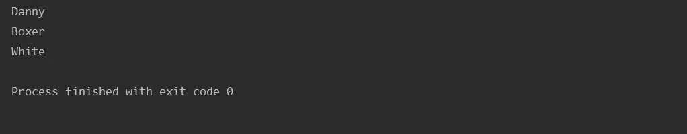*

# *7)获得用户的输入*

*为了从用户那里获得输入，Kotlin 提供了一个名为 ***readline*** 的特殊方法来读取用户输入的行。例如:*

```
*fun main() {
    var name: String? = null
    *println*("Enter your name")

    name = *readLine*()
    *println*("Your name is: $name")  // Tanu Nanda Prabhu
}*
```

*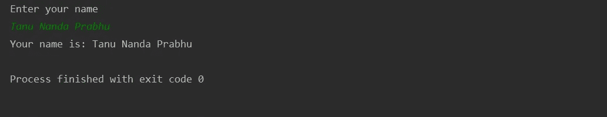*

*以上是你需要知道的一些 Kotlin 编程的基本重要概念。然而，这并不是科特林的结束，这只是开始。我会试着上传更多关于 Kotlin 编程的教程，帮助你们掌握这门语言。想要了解更多关于 Kotlin 的细节，推荐你去查阅官方 [Kotlin 文档](https://kotlinlang.org/docs/reference/)，并尝试进一步了解。不管怎样，祝你们练习科特林语好运。敬请关注。*

# *单击👏说“谢谢！”并帮助他人找到这篇文章。*

*了解卡帕头最新的重大新闻。学院，[订阅时事通讯](https://kotlin-academy.us17.list-manage.com/subscribe?u=5d3a48e1893758cb5be5c2919&id=d2ba84960a)，[观察 Twitter](https://twitter.com/ktdotacademy) 并在媒体上关注我们。*

*如果您需要 Kotlin 工作室，请查看我们如何帮助您: [kt.academy](https://www.kt.academy/) 。*

*[](https://kotlin-academy.us17.list-manage.com/subscribe?u=5d3a48e1893758cb5be5c2919&id=d2ba84960a)*