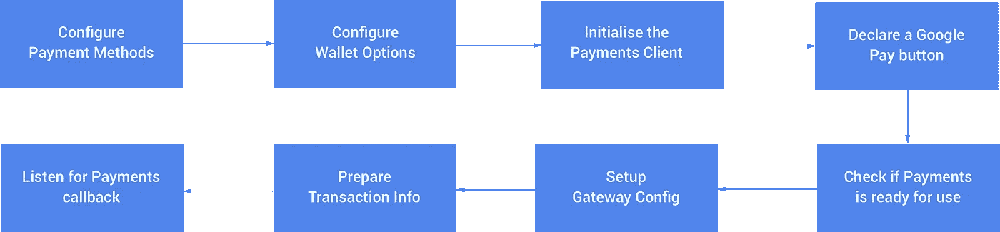
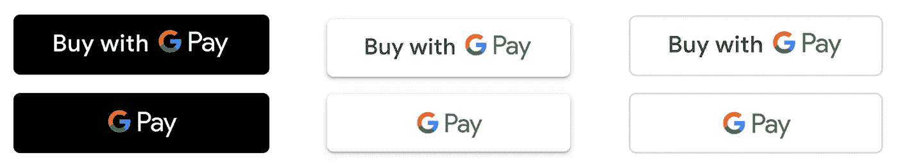

# Android 上 Google Pay 的 8 个步骤

> 原文：<https://medium.com/google-developer-experts/8-steps-to-google-pay-on-android-9fb899bfbfcb?source=collection_archive---------0----------------------->


在我们的 Android 应用程序中，我们可以使用 Google Pay API 为我们的用户在我们的应用程序中结账提供一种便捷的方式，而无需他们输入任何支付信息(在初始设置后)。这为用户带来了一系列优势，例如:

*   一个集中的地方来完成他们在你的应用程序中的所有支付，就像他们能够在网上或商店中做的那样
*   在您的应用内完成购物结账阶段的简化流程
*   由于 Google pay 支付信息的安全存储，支付时有一种安全感

android 的 Google Pay API 允许开发人员轻松集成一种支付方式，为我们的用户提供这种简化、安全和熟悉的体验。

我们都想让事情变得更简单，对用户来说更好，所以在这篇文章中，我想告诉你，你可以通过 8 个步骤将 Google Pay 集成到你的 Android 应用程序中。



## 配置付款方式

在我们开始配置用于在应用程序中处理支付的类之前，我们需要声明一些在我们将要执行的请求中使用的基本数据。

我们首先定义一个接受卡的列表，这个集合目前可以包括 Amex、Discover、Mastercard、JCB 和 Visa 卡。

```
private val allowedCardNetworks = JSONArray().apply {
    put("AMEX")
    put("MASTERCARD")
    put("VISA")
}
```

接下来，我们需要定义可用于交易的公认认证方法。给定的选择可以包括以下选项:

*   **PAN_ONLY** —与当前用户的 Google 帐户旁边存储的卡相关联。返回的数据包括对应的账号以及到期月份和年份。
*   **CRYPTOGRAM_3DS** —与存储为 Android 设备令牌的卡相关联。返回的数据包括在给定设备上生成的 3DS 密码。

```
private val allowedCardAuthMethods = JSONArray().apply {
    put("PAN_ONLY")
    put("CRYPTOGRAM_3DS")
}
```

既然我们已经定义了上面的细节，我们就可以继续准备这些数据用于 Google Pay API 了。这些需要归入以下属性:

*   **allowedAuthMethods** —采用可在提出支付请求时使用的公认认证方法
*   **allowedCardNetworks** —接受可用于支付的已声明接受的卡

```
private val paymentMethodParameters = JSONObject().apply {
    put("allowedAuthMethods", allowedCardAuthMethods)
    put("allowedCardNetworks", allowedCardNetworks)
}
```

除上述内容外，我们还可以选择声明:

*   **allowprepaycards**—说明在提出支付请求时是否可以使用预付卡
*   **需要帐单地址** —说明完成交易是否需要帐单地址
*   **billing address parameters**—以[billing address parameters](https://developers.google.com/pay/api/android/reference/object#BillingAddressParameters)类的格式获取数据

最后，我们将所有这些放在一起，将接受的支付类型声明为一个**卡**，并传递我们在上面声明的支付**参数**:

```
val baseCardPaymentMethod = JSONObject().apply {
    put("type", "CARD")
    put("parameters", paymentMethodParameters)
}
```

## 配置钱包选项

在我们实例化我们的支付客户端来处理我们的支付请求之前，我们需要创建这个客户端使用的选项的实例——这是以 [WalletOptions](https://developers.google.com/android/reference/com/google/android/gms/wallet/Wallet.WalletOptions) 类的形式。

```
val options = Wallet.WalletOptions.Builder()
    .setEnvironment(WalletConstants.*ENVIRONMENT_TEST*)
    .setTheme(*THEME_LIGHT*)
    .build()
```

使用构建器，我们可以配置支付客户端使用的两个属性:

*   [环境](https://developers.google.com/android/reference/com/google/android/gms/wallet/Wallet.WalletOptions.html#environment)—进行交易时使用的环境。这将被设置为环境 _ 生产或[环境 _ 测试](https://developers.google.com/android/reference/com/google/android/gms/wallet/WalletConstants#ENVIRONMENT_TEST)。
*   [主题](https://developers.google.com/android/reference/com/google/android/gms/wallet/Wallet.WalletOptions.html#theme) —用于支付小部件的主题。这将被设置为[主题 _ 亮](https://developers.google.com/android/reference/com/google/android/gms/wallet/WalletConstants#THEME_LIGHT)或[主题 _ 暗](https://developers.google.com/android/reference/com/google/android/gms/wallet/WalletConstants#THEME_DARK)。

## 初始化支付客户端

现在我们已经为我们的支付客户端配置了选项，我们可以实例化一个新的客户端实例以供使用。

```
private val paymentsClient = Wallet.getPaymentsClient(this, options)
```

这里，我们传入当前上下文和在上一步中构建的 WalletOptions 实例。此时，我们的应用程序中现在有了一个支付客户端引用，当用户请求支付时可以触发该引用。

## 声明一个 Google Play 按钮

使用 Google Pay 品牌指南中提供的[资产，您需要首先向您的应用程序添加一个使用所提供资产之一的按钮。这为用户提供了一种识别 Google Pay 支付方式的方法。选择此按钮将触发付款流程，我们将在接下来的几个部分中了解这一流程。](https://developers.google.com/pay/api/android/guides/brand-guidelines#payment-buttons)



## 检查付款是否可以使用

现在我们有了一个支付客户端，我们想检查用户是否能够使用 Google Pay API 进行支付——否则我们在尝试访问 API 时可能会遇到错误。所以这里我们要确保 Google Pay 的按钮**在 Google Pay API 准备好使用之前**是不可见的。

我们首先构建为我们的 **isReadyToPay** 调用发送的请求。我们经过这里:

*   **apiVersion** —要使用的主要 API 版本(整数)
*   **apiVersionMinor** —要使用的 API 次要版本(整数)
*   **allowedPaymentMethods** —声明客户端支持的支付方式的 [PaymentMethod](https://developers.google.com/pay/api/android/reference/object#PaymentMethod) 实例的集合。

我们还可以选择提供一个**existingpaymentmethodrequestd**(boolean)属性——将该属性设置为 **true** 将导致 **isReadyToPay()** 返回 true，如果用户准备好使用至少一种指定的支付方式进行支付。

现在我们已经构建了这些属性，我们可以继续将它们传递给我们的 **isReadyToPay()** 调用:

## 设置网关配置

接下来，我们需要设置相关的网关细节——这个网关将接收加密的用户信息来处理给定的事务。

*   **网关** —识别谷歌支持的网关
*   **gatewayMerchantId** —将商家链接到给定网关的唯一 Id

你会注意到下面我们将所有这些捆绑在一起(用 PAYMENT_GATEWAY 标识符标记)作为 Google Pay API 使用的**tokenization specification**参数。

## 准备交易信息

此时，我们需要定义将由 Google Pay 小部件呈现的交易数据。我们从[交易信息](https://developers.google.com/pay/api/android/reference/object#TransactionInfo)开始，其中包含如下详细信息:

*   **货币代码** —交易使用的货币
*   **总价状态** —总价的状态。这将是**当前未知的**、**估计的**(价格可能会根据运费或税费计算而变化)或**最终的**(价格永远不会从当前显示给用户的价格发生变化)
*   **总价** —交易的总价
*   **checkoutOption** —决定 google pay sheet 的 checkout 按钮中使用的行为和显示的文本。这可以是**默认**(标准行为，用户将需要确认交易细节)或**完成 _ 立即 _ 购买**(当总价格状态为最终时，用户将完成购买，无需进一步操作)。

然后，我们需要使用刚刚准备好的交易信息来构建支付请求。为此，我们构建了一个 [PaymentDataRequest](https://developers.google.com/pay/api/android/reference/object#PaymentDataRequest) 实例，并填充所需的数据:

*   **apiVersion** —要使用的主要 API 版本(整数)
*   **apiVersionMinor** —要使用的 API 次要版本(整数)
*   **merchantInfo**——以 [MerchantInfo](https://developers.google.com/pay/api/android/reference/object#MerchantInfo) 类的形式出现的关于商家的信息
*   **allowedPaymentMethods**—声明客户端支持的支付方式的 [PaymentMethod](https://developers.google.com/pay/api/android/reference/object#PaymentMethod) 实例的集合。
*   **transaction info**——以 [TransactionInfo](https://developers.google.com/pay/api/android/reference/object#TransactionInfo) 类的形式的交易信息
*   **emailRequired** —说明完成交易是否需要电子邮件地址
*   **shipping address required**—说明完成交易是否需要送货地址
*   **shipping address parameters**—[shipping address parameters](https://developers.google.com/pay/api/android/reference/object#ShippingAddressParameters)类形式的关于送货地址的信息

## 收听付款回拨

现在付款请求已经发出，我们需要听结果。这个请求的结果通过 **onActivityResult** 方法返回给调用源，resultCode 最初与请求一起传递。

一旦我们从请求中获得数据，我们就可以利用来自 Google Pay API 的 [PaymentData](https://developers.google.com/android/reference/com/google/android/gms/wallet/PaymentData) 类来解析 intent 的结果——返回这个 [PaymentData](https://developers.google.com/android/reference/com/google/android/gms/wallet/PaymentData) 类的一个实例，它包含交易的账单信息。

在这里，这些数据然后被转换成 JSON 格式，以便可以传递到我们的支付处理器。此时，我们已经执行了所有必需的步骤，我们的交易准备完成。

# 结论

希望从这篇快速的帖子中，你可以看到将 Google Pay 集成到你的 Android 应用程序中只需要很少的步骤。这样做可以让我们实现安全的简化体验，并给用户一种熟悉感。为什么不立即在您自己的 Android 应用程序中使用 Google Pay 呢？

[](https://twitter.com/hitherejoe) [## 乔·伯奇(@hitherejoe) |推特

### 乔伯奇的最新推文(@hitherejoe)。Android Lead @Buffer。谷歌开发专家为@Android，@GooglePay &…

twitter.com](https://twitter.com/hitherejoe)