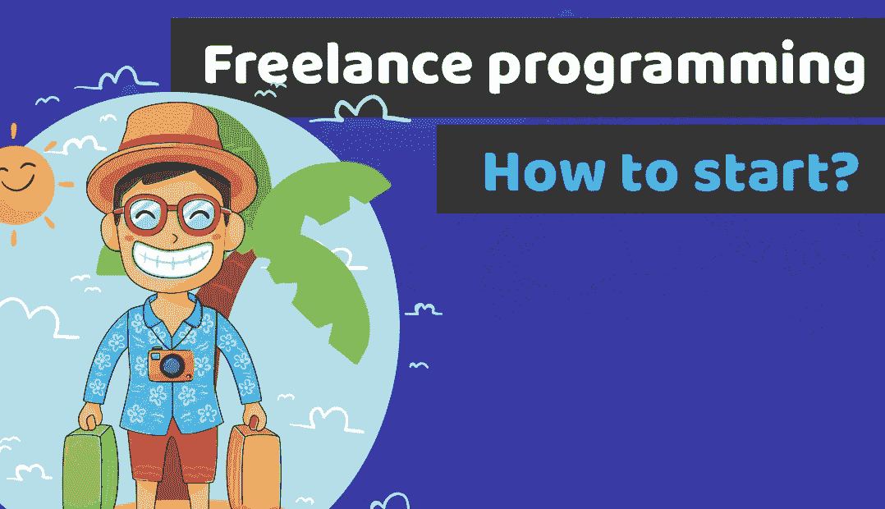

# 开始自由编程并获得第一批付费客户的 8 个步骤

> 原文：<https://medium.com/duomly-blockchain-online-courses/8-steps-to-start-freelance-programming-and-land-your-first-paying-clients-fac2f9d6e179?source=collection_archive---------0----------------------->

[Duomly — Freelance programming: How to start?](https://www.blog.duomly.com)

本文最初发表于[https://www . blog . duomly . com/freelance-programming-how-to-start](https://www.blog.duomly.com/freelance-programming-how-to-start)

开始自由编程生涯在前几年变得非常流行，当然，它有很多优势。因此，人们对这种工作方式越来越感兴趣。