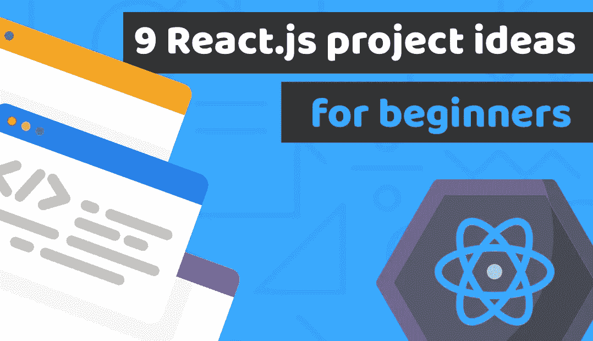

# 9 个适合初学者的惊人的 React.js 项目，将帮助你创建一个令人惊叹的投资组合，并很快被录用

> 原文：<https://medium.com/duomly-blockchain-online-courses/9-amazing-react-js-f49bf3050993?source=collection_archive---------0----------------------->

[Duomly — Programming Online Courses](https://www.duomly.com)

这篇文章最初发表在[https://www . blog . duomly . com/9-react-js-projects-for-beginners-that-will-help-you-build-a-amazing-portfolio-and-get-employee](https://www.blog.duomly.com/9-react-js-projects-for-beginners-that-will-help-you-to-build-an-amazing-portfolio-and-get-hired)

在之前的几周，我已经发表了两篇关于前端开发人员的项目想法的文章…