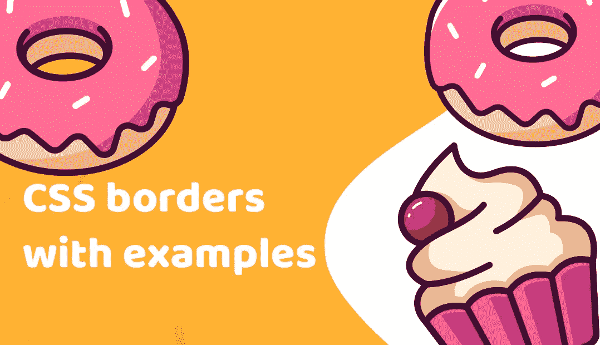

# 9 个很棒的 CSS 边框技巧，对你的造型有很大的帮助

> 原文：<https://medium.com/duomly-blockchain-online-courses/9-awesome-css-border-tricks-that-will-critically-help-you-with-styling-db4307e158e7?source=collection_archive---------2----------------------->

[Programming online courses](https://www.duomly.com)

**CSS 边框介绍**

嗨，伙计们，今天我们将谈论…边界！

CSS 边框是你几乎每天都会用到的东西，当然，如果你是前端开发者的话。

我发现了一些有用的(有些更多，有些更少，有些只是有趣的)提示和技巧，你可以在你的项目中使用。

开始吧！

如果你喜欢视频，这里有 youtube 的版本。

**1。动画 CSS 边框**

当我们想让我们的商品更显眼时，该怎么做？

让我们来制作动画吧！

即使不改变元素的大小，我们也可以让我们的边框有动画效果，这非常简单。

为此，我们只需要为动画创建一个自定义的关键帧，并在元素的 CSS 代码中的动画参数中使用它。

让我们来看看这个例子。

**2。CSS 边框图片**

你曾经想象过油炸圈饼围绕着你的元素吗？

现在不需要太多的努力就可以通过纯 CSS 来添加它们。

为此，您需要在元素的 CSS 代码中使用 border-image 属性。

让我们来看看这个例子。

**3。蛇形 CSS 边框**

如果我们需要双色超可见边框怎么办？

我们可以穿蛇皮制服，想怎么涂就怎么涂。

让我们试试示例中的代码。

**4。楼梯样式 CSS 边框**

你曾经尝试过在你的 div 周围添加 3d 风格的边框吗？

在我们的元素中添加一些多色深度是非常容易的。我们只需要 CSS 中的一些盒子阴影。

让我们测试我们的例子！

**5。仅阴影 CSS 边框**

有时我们需要给现成的设计添加一个边框，但是多添加几个像素会有点问题。它可以改变元素的位置。

不再是了！

现在我们可以在我们的元素周围使用框阴影作为边界，看看代码。

**6。带有阴影和轮廓的 CSS 边框**

我们可以用几种方法达到类似蛇的效果。

接下来，其中一个是在元素的 CSS 中混合框阴影和轮廓参数。

让我们来看看。

**7。几个阴影和轮廓**

我们甚至可以在边框中创建一些颜色和元素。

要做到这一点，我们需要混合框阴影和轮廓，如下例所示。

让我们对此做一点实验。

**8。带方框阴影的双 CSS 边框**

我们也可以混合一些框阴影和轮廓的边界。

这将创建一个可爱的效果线与尖峰，就像在下面的例子。

让我们检查代码！

**9。多色 CSS 边框**

如果我们想给我们的边框涂上比前几个例子更多的颜色呢？

我们甚至可以将元素的每面墙设置成不同的颜色。

为了实现这一点，我们将需要一些自定义背景与梯度内。

看看下面的例子。

**结论**

好吧，这是最后一个想法了。

希望你喜欢，那几个对你有用。

请随意测试它们，进行实验，并在评论中展示你发现的让边框与众不同的想法。

恭喜你，你现在是边界专家了！

[Programming courses online](https://www.duomly.com)

感谢阅读，

Duomly 的 Radek