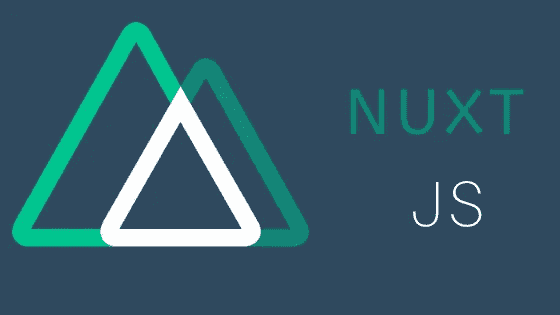

# 9 个最佳 Nuxt Js 课程和教程—在线学习 Nuxt Js-(2020 年更新)

> 原文：<https://medium.com/quick-code/9-best-nuxt-js-courses-tutorials-learn-nuxt-js-online-updated-2020-af9663af3649?source=collection_archive---------0----------------------->

Best Nuxt Js Courses and Tutorials

Nuxt.js 是基于 Node.js、Webpack、Babel.js 和 Vue.js 的免费开源框架，Nuxt.js 框架主要被称为所有应用的元框架。此外，在 Nuxt.js 的帮助下，你的应用程序将会得到极大的优化。它帮助您以最佳方式构建 Vue js 应用程序。Nuxt 自带路由和服务器端渲染。使用 Nuxt，您可以构建单页面应用程序(SPA)、静态站点和完全服务器端呈现(SSR)的 web 应用程序。这些应用程序速度极快，性能卓越

# 1. [Nuxt.js — Vue.js 服用类固醇](https://click.linksynergy.com/deeplink?id=Fh5UMknfYAU&mid=39197&u1=quickcode&murl=https%3A%2F%2Fwww.udemy.com%2Fcourse%2Fnuxtjs-vuejs-on-steroids%2F)

使用 Nuxt.js 构建极具吸引力的 Vue JS 应用程序。Nuxt 添加了简单的服务器端渲染和基于文件夹的配置方法。

***课程评分:4.7 分满分 5.0 分(3037 分)***

在本课程中，您将学习以下内容:

*   构建服务器端呈现的单页面应用程序(spa)。
*   用最少的努力建立正常的，优化的水疗中心。
*   从 Vuejs 代码生成一个静态网页。

在本课程中，您将了解到所有细节，但最重要的一点是，Nuxt.js 使创建更好、更优化和更强大的 Vue 应用程序变得更加容易——所有这些都不会增加太多开销。

在本课程中，您将学习如何从头开始创建 Nuxt/ Vue 应用程序。您将构建一个完整的课程项目，并深入研究 Nuxt.js 提供的核心功能。

课程结束时，你将拥有一个完整的 Vue app，用 Nuxt.js 构建，可以在服务器上渲染(或者作为静态网站！)并且是高度优化的。

本课程将教会你:

*   Nuxt.js 到底是什么，和 Vue.js 有什么联系。
*   如何使用 Nuxt.js 构建更好的 Vue 应用。
*   关于“通过文件夹和文件配置”您需要知道的一切
*   不同的构建可能性，如 SSR 应用程序、spa 或静态网页
*   如何构建整个项目，包括通过 Nuxt.js 进行身份验证
*   还有更多！

# 2.[使用 Laravel API 的 Nuxt JS 构建 SSR Vue JS 应用](https://click.linksynergy.com/deeplink?id=Fh5UMknfYAU&mid=39197&u1=quickcode&murl=https%3A%2F%2Fwww.udemy.com%2Fcourse%2Flaravel-nuxt-vue%2F)

学习 Laravel API 开发。从零开始学习 Nuxt JS，用 Vuex 构建 SPA、Static 和 SSR Vue JS Web Apps。

***课程评分:4.7 分满分 5.0 分(140 分)***

在本课程中，您将学习:

*   能够构建现代 web 应用程序(SPA、静态和 SSR)
*   能够使用 Laravel PHP 框架构建强大的可扩展的 API。
*   用 Laravel 学习 API 开发。
*   用 Nuxt Js 学习前端 Web 开发。
*   精通后端和前端 web 开发。
*   使用 JWT 进行身份验证。
*   全球验证。
*   中间件。
*   实现 CRUD(创建、读取、更新、删除)。
*   Laravel API 资源。
*   主题/帖子关系(例如帖子/评论)。
*   喜欢——多态关系。
*   全球混合。
*   学会用邮差。
*   部署。

这个课程将带你从零到英雄，使用 Nuxt JS 构建一个完整的 web 应用程序前端。

本课程从 Nuxt JS 的绝对基础开始。然后再贯穿 Nuxt JS 的所有基础知识。您还将在学习 Nuxt 的同时构建一个项目，并部署到 firebase 主机。使用 Laravel，您将学会构建一个强大的后端，包含您希望包含的所有内容，如身份验证、CRUD、喜欢、关系、API 资源等等。

这门课程是你通向现代 web 开发的现在和未来的大门，在现代 web 开发中，后端与前端是分离的。总的来说，这个课程包含了让你成为一名真正的全栈 Web 开发者的所有要素。

本课程还有一个期末项目。你将与 Laravel 建立一个完整的 API，它将有认证，CRUD，关系，包括喜欢的多态关系。您还将学习在构建 API 时使用 postman 进行测试。

最后，您将开始您的下一个大项目，使用 Laravel backend 作为您的 API，使用 Nuxt JS 为您的 Web 应用程序构建一个前端客户端。

# 3.[完整的 Nuxt.js & Vue.js 教程](https://click.linksynergy.com/deeplink?id=Fh5UMknfYAU&mid=39197&u1=quickcode&murl=https%3A%2F%2Fwww.udemy.com%2Fcourse%2Fthe-complete-nuxtjs-vuejs-course-self-promo-app%2F)

涵盖 Vue.js 和 Nuxt.js basic 的完整开发人员指南，以推进概念。获得真正的项目。

***课程评分:4.7 分满分 5.0 分(34 分)***

在本课程中，您将学习:

*   开发强大、现代、真实的 web 应用程序。
*   完全理解 Nuxt JS & Vue JS 2 的流程和概念。
*   使用获得的知识创建自己的 Web 应用程序。
*   熟悉 SSR、Vuex、Vuelidate 等概念和工具。

在本课程中，你将参与三个不同的项目。

*项目 1 — Todo 应用:*该项目涵盖了每个开发人员都应该知道的基本概念。您将在“todo”应用程序上学习 Vue JS 相关概念。这一节还包括了 html 和 css 的解释。

*   获取编程基础知识。
*   知道如何创建存储数据到我们的浏览器本地存储。
*   完全理解 Vue JS 的概念，如数据绑定、数据操作、事件处理、状态管理等等。

*项目 2——后申请:*在这个项目中，学生将熟悉 Nuxt.js/ vue . js 的相关主题。在这个项目中，学生将使用应用程序来创建和管理帖子。

*   获取 Nuxt.js 的基础知识。
*   了解 SSR 的工作原理。
*   熟悉 Vuex。
*   了解如何在服务器上保存数据。

*项目 3——自我推销应用程序:*在这个项目中，你将学习如何创建漂亮的自我推销应用程序，包括管理仪表板、身份验证、REST 功能和其他有趣的东西。

在第一部分，您将学习身份验证，包括注册和登录功能。您还可以找到关于 Vuelidate 包的表单验证的解释。

之后，您将开始开发创建和管理产品的功能。您将学习如何创建新的自定义输入，以及如何管理表单中的数据流。您将集成一个包含不同格式选项和功能的博客编辑器来编辑和发布博客。您将致力于显示已发布和特色博客的功能，他们稍后将学习如何创建分页功能。

在最后一节中，您将了解如何在应用程序中实现 SEO 改进。最后，您将把应用程序部署到 Heroku。

# 4. [Vue.js 使用 Nuxt.js & Firebase](https://click.linksynergy.com/deeplink?id=Fh5UMknfYAU&mid=39197&u1=quickcode&murl=https%3A%2F%2Fwww.udemy.com%2Fcourse%2Fvuejs-jump-start-with-nuxtjs-firebase%2F) 快速启动

了解如何使用 Vue & Nuxt 构建搜索引擎友好的网络应用

***课程评分:4.6 分满分 5.0 分(49 分)***

在本课程中，您将学习:

*   通过本课程的技能和应用程序锅炉板，您将能够快速启动他们的新 Vue/Nuxt 项目。
*   掌握好 Vuex，VueRouter，Nuxt。
*   正确构建和保护 Firebase 数据库，并进行合理复杂的 Firebase 查询。
*   安装和集成 Vue 插件和 Nuxt 模块，并创建 Vue 过滤器。
*   对成熟的应用程序有大致的了解，包括用户管理和基于角色的访问。
*   使用 Vue/Nuxt 搜索引擎创建友好页面的技巧。
*   对使用 PM2 在生产模式下将 Vue/Nuxt 应用程序部署为服务器有基本的了解。

在本课程中，您将学习如何使用 Vue.js 和 Nuxt.js 构建一个搜索引擎友好的网站或应用程序。通过使用 Vue 框架 Nuxt.js，你将拥有搜索引擎友好的特性和改进的性能。

课程的另一个主要部分是 Firebase。您将使用 firebase 作为数据库。您将学习如何构建数据库，它的安全规则，文件存储，当然还有处理数据的查询。本课程将帮助您学习简单到相当复杂的 Firebase 查询。

在本课程中，您将通过构建一个应用程序来学习。您将构建一个简单的电子商务应用程序，具有产品和用户管理以及基于角色的访问。然后前端是产品目录和购物车。在课程结束时，您将拥有一个可用于自己项目的应用程序锅炉板。

# 5.[完成 Nuxt.js 2.4+课程](https://click.linksynergy.com/deeplink?id=Fh5UMknfYAU&mid=39197&u1=quickcode&murl=https%3A%2F%2Fwww.udemy.com%2Fcourse%2Fcomplete-nuxtjs-course%2F)

让你的 Vue JS 技能更上一层楼！

***课程评分:4.4 分满分 5.0 分(52 分)***

在本课程中，您将学习如何使用 Nuxt 创建应用程序。在第一部分中，您将使用 Vue CLI 3 创建一个 Vue 应用程序。您将使用 Nuxt 重新创建相同的应用程序，并展示 Vue 和 Nuxt 之间的相似之处。

本课程包括五个部分。

*   Nuxt 基础
*   Nuxt 插件和模块
*   Nuxt 路由系统
*   Nuxt 上下文
*   与后端程序的数据交换(Express.js)

在这个过程中你还会学到很多新的技能，包括如何处理 cookies 和创建会员体系。

# 6. [Nuxt:增压 Vue JS](https://click.linksynergy.com/deeplink?id=Fh5UMknfYAU&mid=39197&u1=quickcode&murl=https%3A%2F%2Fwww.udemy.com%2Fcourse%2Fnuxt-supercharged-vuejs%2F)

关于 Vuejs 的框架。让你的 Vue.js 技能更上一层楼！

***课程评分:5.0 分中的 4.4 分(36 分)***

在本课程中，您将:

*   使用 Nuxt 开发项目。
*   能够使用 Nuxt 创建通用应用程序。

本课程由两部分组成:在 60 分钟内学习 Nuxt 基础知识，并通过创建应用程序掌握 Nuxt。第一部分旨在帮助你尽快理解 Nuxt 的基本概念。在第二部分中，您将组合所有内容并创建一个应用程序。你将练习你所学的一切，最重要的是，学会如何将它们结合在一起。

# 7.[通过构建项目掌握 nuxt . js—vue js 框架](https://click.linksynergy.com/deeplink?id=Fh5UMknfYAU&mid=39197&u1=quickcode&murl=https%3A%2F%2Fwww.udemy.com%2Fcourse%2Fmaster-nuxtjs-a-vuejs-framework-by-building-projects-and-deploy%2F)

用 Nuxt & Deploy 构建两个项目，包括在 Nuxt 中通过 vuex 进行状态管理，firebase 作为数据库管理

***课程评分:5.0 分中的 4.8 分(6 分)***

在本课程中，您将学习:

*   如何启动 Nuxt js？
*   在 nuxt 中构建服务器端呈现的单页面应用程序(spa)。
*   使用 Nuxtjs 中的 API 构建一个天气应用程序。
*   在 nuxt 中用 firebase 构建测验应用程序。
*   nuxtjs 中使用 firebase 的认证。
*   在数字海洋服务器上部署 Nuxtjs。
*   使 Nuxtjs 成为一个 SEO 友好的应用程序。
*   包括外部库。
*   编写有效、可重用和可管理的 vuejs/javascript 代码。

您将详细了解 Nuxt.js，并参与两个真正的 vue.js nuxt.js 项目。在本课程中，您将学习 Nuxt.js 的核心概念，以及它在幕后究竟是如何工作的。您将深入呈现的 nuxt 目录，查看 nuxt 从哪里为每个页面提供服务，以及它们是如何配置的。

本课程将教会你:

*   构建服务器端呈现的单页应用程序(spa)
*   如何使用 vuetify 框架
*   使 Nuxtjs 成为一个 SEO 友好的应用程序
*   包括外部库
*   编写有效、可重用和可管理的 vuejs/javascript 代码
*   在数字海洋服务器上部署 Nuxtjs
*   在 nuxtjs 中使用 firebase 进行身份验证

# 8.[使用 Nuxt 2 和 Firestore 构建新闻订阅源](https://click.linksynergy.com/deeplink?id=Fh5UMknfYAU&mid=39197&u1=quickcode&murl=https%3A%2F%2Fwww.udemy.com%2Fcourse%2Fbuild-a-news-feed-with-nuxt-2-and-firestore%2F)

使用 Nuxt 2、Firestore 和 Vue 材料创建一个完整的全栈新闻聚合器

***课程评分:4.3 分满分 5.0 分(62 分)***

在本课程中，您将学习:

*   使用核心 Nuxt 概念构建您自己的令人惊叹的服务器渲染应用程序。
*   学习在构建一个专业的、完整的应用程序的背景下使用各种 Nuxt / Vue 特性的实践方面。
*   使用本课程涵盖的材料来激发你自己的想法，制作酷的、功能性的 web 应用程序。

在本课程中，您将学习:

*   使用 Nuxt 2、Firestore 和 Vue 材料创建一个完整的新闻提要/聚合器，从第一行代码到部署到 web 上
*   全新实时 NoSQL Firestore 数据库的完整 CRUD 功能(创建、读取、更新、删除)
*   与新闻 API 的综合工作，以动态获取世界各地的头条新闻(按新闻类别，按国家，按新闻来源等)。)
*   增加搜索功能，根据搜索词、日期和各种标准查询所有标题
*   让用户能够将标题添加到自己的个人订阅源中
*   将实时新闻标题转化为我们应用程序中的独立页面，用户可以在上面发表评论
*   广泛覆盖了使用 axios 进行 HTTP 请求(Nuxt 模块、代理、设置头)
*   使用 asyncData 和 fetch 方法的内置 Nuxt 数据提取
*   使用 Nuxt 插件将第三方库整合到我们的 Nuxt 应用程序中
*   实现对新闻文章的喜欢/向上投票用户评论
*   使用 JSON Web 令牌进行身份验证，使用 Cookies 和 LocalStorage 进行会话管理
*   使用 Firebase Auth REST API 进行用户身份验证
*   使用 Vuelidate 对我们的登录和注册表单进行表单验证
*   使用 Vuex 进行状态管理，借助简单明了的模式
*   使用材料设计库 Vue 材料创建有吸引力的、反应灵敏的、功能丰富的用户界面
*   Vue 路由器的基本特性(相对于 Nuxt)
*   构建 Nuxt 中间件功能作为认证检查和导航保护
*   使用 Vue 过滤器将日期/时间值格式化为流行的包日期-fns
*   ES6 / 7 的大量工作，尤其是异步/等待功能
*   有用的浏览器工具，如 Vue / Nuxt 开发工具
*   使用 create-nuxt-app CLI 引导新的 Nuxt 2 项目
*   使用 Heroku 实现无缝应用部署

# 9.[使用 VueJs、Vuex、VueRouter 和 Nuxt 构建应用](https://click.linksynergy.com/deeplink?id=Fh5UMknfYAU&mid=39197&u1=quickcode&murl=https%3A%2F%2Fwww.udemy.com%2Fcourse%2Fbuilding-applications-with-vuejs%2F)

通过构建单页面和服务器渲染应用程序(包括 Vuex、VueRouter、Nuxt)掌握 VueJs 基础知识

***课程评分:5.0 分中的 4.5 分(37 分)***

在本课程中，您将学习:

*   了解如何在 Vue 上创建 web 应用。
*   用 Vuex 管理状态。
*   使用 VueRouter 路由。
*   用 Vuejs 和 Vuex 消费 Restful APIS。
*   用 NuxtJs 和 Vuex 构建服务器渲染的应用程序。
*   学习 VueJs 中的表格。

在本课程中，您将学习:

*   设置开发环境和工作流。
*   基础知识(包括基本语法、理解模板等等。
*   与 DOM 交互(呈现列表，有条件地附加/分离元素)。
*   使用组件。
*   绑定到表单输入。
*   使用 VueJs 进行状态管理。
*   如何创建一个强大的带路由的单页应用程序(SPA)。
*   用 NuxtJs 构建服务器渲染的应用程序。

在本课程中，您将使用 Vue.js、Vuex 和 Nuxt 构建 6 个小型 web 应用程序

*   *投票应用* —通过构建投票应用了解 Vue 基础知识。
*   *Todo 应用* —在本模块中，您将使用 VueJs 构建一个基本的 Todo 应用。
*   *看板应用* —在本模块中，您将使用 Vue 组件构建一个基本的项目管理应用。
*   *带 Vuex 的购物车服务器* —在本课程中，您将通过构建购物车功能掌握 Vuex 基础知识。
*   *构建会议表单* —在本模块中，您将掌握 VueJs 的表单基础知识。
*   *博客应用* —您将学习如何使用 Vuex 和 NuxtJs 构建服务器渲染应用。

*原载于 2019 年 12 月 13 日* [*最佳 Nuxt Js 教程及课程*](https://blog.coursesity.com/best-nuxt-js-tutorials/) *。*

披露:我们与本文中提到的一些资源有关联。如果你通过本页的链接购买课程，我们可能会得到一小笔佣金。谢谢你。