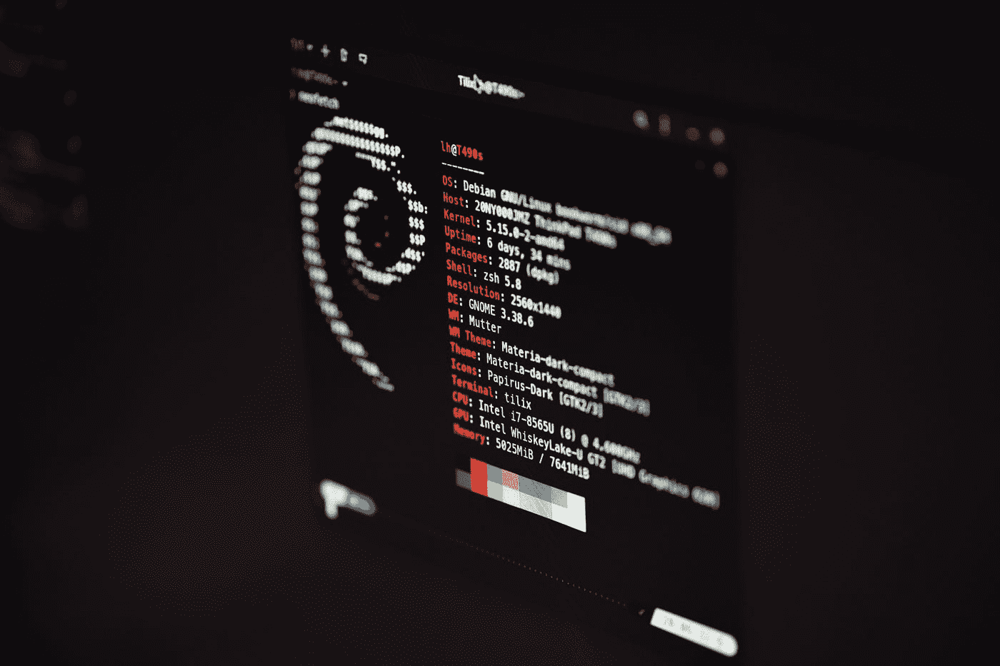

# 面向初学者和专家的 9 门免费 Linux 课程和教程

> 原文：<https://medium.com/quick-code/9-free-linux-courses-tutorials-for-beginners-experts-5705dd53ba07?source=collection_archive---------0----------------------->

Photo by [Lukas](https://unsplash.com/@lukash?utm_source=medium&utm_medium=referral) on [Unsplash](https://unsplash.com?utm_source=medium&utm_medium=referral)

如果你是一名程序员，并且不了解 Linux，那么你在你的职业生涯中错过了一些巨大的东西。Linux 是有史以来最强大、最可靠的操作系统之一。该平台运行许多互联网服务器，并且是免费和开源的。我喜欢 Linux 的主要原因是它使用了很多开源软件。许多大公司使用 Linux 作为他们的服务器操作系统。对于开发人员来说，Linux 知识是必不可少的。

然而，并不是每个人都有资源投资付费课程。因此，我为开发人员或任何想探索和学习 Linux 的人编制了这个免费 Linux 课程和教程列表。此外，如果你想投资于[付费 Linux 教程](https://coursesity.com/best-tutorials-learn/linux)，你也可以这样做。

## 最佳免费 Linux 在线教程和课程

请记住，这些免费的 Linux 课程将来可能会再次变成付费课程，所以把它们放在你的清单上，以避免以后为它们付费。事不宜迟，我们走吧！

## 1. [Linux 初学者速成班](https://click.linksynergy.com/deeplink?id=0F1O0otUXQc&mid=47901&u1=csMedium&murl=https%3A%2F%2Fwww.udemy.com%2Fcourse%2Flinux-for-beginners-crash-course%2F)——【免费 Udemy 课程】

Linux for Beginners

大家应该知道，Linux 不是通过教程学的，而是通过经验学的。因此，该课程将教人们如何日常使用 Linux，并让他们开始自己的方式。Linux 机器只使用了 80%的基本工具，其余的来自经验和重复。通过本课程，您将学习这些基本知识，并可以立即开始使用 Linux。

在本 Linux 课程中，您将学习以下内容:

*   基本 Linux 概念
*   使用 Linux 作为你的主要桌面操作系统
*   了解命令行
*   编写 bash 脚本

在本课程中，您将学习 Linux 基础知识，安装和管理软件，使用终端，Linux 文件系统，Shell 变量，编写基本的 Linux 脚本等。

这是 Udemy 上最好的免费 Linux 课程，在 5 门课程中得到 4.5 分，时长 1 小时 23 分钟。请记住，由于这是一门免费的 Udemy 课程，完成后您不会获得证书。

## 2. [Linux 基础](https://coursera.pxf.io/c/1137078/1213622/14726?u=https%3A%2F%2Fwww.coursera.org%2Flearn%2Flinux-fundamentals&subId1=csMedium)——【Coursera】

在本课程中，您将学习在 IT 领域为职业生涯做准备的基础知识。您将了解 Linux、许可模型和几个 Linux 发行版。

本 Linux 课程将涵盖以下主题:

*   Linux 操作系统
*   Linux 服务
*   查看、创建、复制、移动和删除文件
*   搜索和分析文本

在本课程中，我们将了解一些 Linux 服务。本课程最后将概述如何使用操作系统命令行工具搜索和分析文本。

这是 Coursera 上最好的免费 Linux 课程，在 5 门课程中得到 4.5 分，时长 18 小时。旁听这个课程是免费的，但是付费会给你更多的好处。

## 3.[配置 Linux 网络服务器](https://imp.i115008.net/c/1137078/788805/11298?u=https%3A%2F%2Fwww.udacity.com%2Fcourse%2Fconfiguring-linux-web-servers--ud299&subId1=csMedium)—【uda city】

Linux Tutorial

每个 web 开发人员都应该对 Linux 基础有很好的理解，以便与世界分享他们的 web 应用程序。在本课程中，您将学习 Linux 基础的基础知识。本课程将向您展示如何设置一个基本的 Python WSGI 应用程序，该应用程序使用一个浮动虚拟机来查询 PostgreSQL 数据库。

本 Linux 课程将涵盖以下主题:

*   Linux 简介
*   Linux 安全性
*   Web 应用服务器

首先，您将探索和学习几个 Linux 发行版。接下来，您将了解 Linux 与您可能已经知道的其他操作系统有何不同。一旦掌握了这些基本知识，您就可以继续学习 Linux 安全主题，比如文件权限、用户管理、包管理和防火墙配置。

最后，您将在一个基线服务器上安装和配置 Apache HTTP Server 和 PostgreSQL 数据库服务器，以将其转换为 web 应用服务器。

这是 Udacity 上最好的免费 Linux 课程，为期一周。请记住，由于这是一门免费的 Udacity 课程，您在完成后不会获得证书。

## 4. [Linux — Shell Bash 命令从头开始](https://click.linksynergy.com/deeplink?id=0F1O0otUXQc&mid=47901&u1=csMedium&murl=https%3A%2F%2Fwww.udemy.com%2Fcourse%2Fbash-linux-command-from-scratch%2F)—【Udemy】

本课程向您介绍 Linux 命令解释器。该课程从一开始就教给你所有你需要的概念，因此你将有一个良好的基础来培养你使用这个强大的操作系统的技能。在这门课程中，你会找到适合任何人的解释和练习，不管有没有先前的经验。

在本 Linux 课程中，您将学习以下内容:

*   理解 Linux 命令的结构和语法。
*   从任何系统命令获得快速帮助。
*   快速有效地管理您的文件和文件夹。
*   使用命令解释器提供的所有工具，以便更有效地使用 Linux。
*   理解和管理文件系统路径等概念，包括相对路径和滥用路径。
*   创建用户并为他们分配权限和密码。
*   安装和配置 Linux 提供的大量免费软件。
*   修改系统存储库。
*   使用通配符和文件系统快捷方式。
*   了解系统提示提供的信息。

最后，你将学习如何从官方服务器或兼容文件安装软件。有了这个课程，在短短几秒钟内，你将能够下载各种各样的免费程序。

这是 Udemy 上的一门免费 Linux 课程，5 门课程中的 4.1 分，时长 2 小时 30 分钟。请记住，由于这是一门免费的 Udemy 课程，完成后您不会获得证书。

## 5.Linux 命令和 Shell 脚本的实践介绍

Linux Commands and Shell Scripting

本课程提供了 Linux 的实用介绍以及 Linux 和 UNIX shells 的常用命令。您将学习如何使用 Bash shell 脚本自动化各种任务。本课程将向您介绍 Linux 终端，如何执行命令、导航目录、编辑文件以及安装和更新软件。

在本 Linux 课程中，您将学习以下内容:

*   描述 Linux 体系结构和常见的 Linux 发行版，并在 Linux 系统上更新和安装软件。
*   在 Bash shell 中执行常见的信息、文件、内容、导航、压缩和网络命令。
*   使用 Linux 命令、环境变量、管道和过滤器开发 shell 脚本。
*   使用 crontab 调度 Linux 中的 cron 作业，并解释 cron 语法。

在实验中，您可以通过 web 浏览器免费访问虚拟 Linux 服务器，因此您不必下载或安装任何东西。

这是 Coursera 上的免费 Linux 课程，5 门课程中有 4.6 分，时长 13 小时。旁听这个课程是免费的，但是付费会给你更多的好处。

## 6.[用 Ubuntu 和 CentOS 学习 Linux:简单的方法](https://click.linksynergy.com/deeplink?id=0F1O0otUXQc&mid=47901&u1=csMedium&murl=https%3A%2F%2Fwww.udemy.com%2Fcourse%2Flearning-linux-with-ubuntu-and-centos-the-easy-way%2F)——【Udemy】

本课程向你介绍了 Linux 的两个主要版本，Ubuntu 和 CentOS。您将学习如何有效地安装和操作 Ubuntu 和 CentOS。此外，您将学习更新您的系统，使用日常应用程序，并在几个小时内成为 NIX 用户。

这是 Udemy 上的一门免费 Linux 课程，5 门课程中的 4.3 分，时长 2 小时。请记住，由于这是一门免费的 Udemy 课程，完成后您不会获得证书。

## 7.[面向开发者的 Linux](https://coursera.pxf.io/c/1137078/1213622/14726?u=https%3A%2F%2Fwww.coursera.org%2Flearn%2Flinux-for-developers&subId1=csMedium)——【Coursera】

Learn Linux

在本课程中，您将学习 Linux 系统，并熟悉命令行界面。本课程将使您能够很好地理解在 Linux 系统上工作的感觉，以及日常使用 Linux 系统所需的基本技能。

本 Linux 课程将涵盖以下主题:

*   什么是 Linux
*   Linux 历史
*   如何将内核从整个操作系统中分离出来
*   为内核做贡献
*   图形系统，以及它是如何工作的
*   使用命令行文件系统布局，分区
*   监控实用程序

这是 Coursera 上排名最高的免费 Linux 课程，5 门课程中有 4.5 门，时长 19 小时。旁听这个课程是免费的，但是付费会给你更多的好处。

## 8.Linux 教程和项目—【Udemy】

该课程将教你如何在开发新的 Linux 技能的同时完成几个 Linux 项目。它包括在 CentOS Linux 和 Apache 上安装 SSL 证书，在 Nginx 上平衡 HTTP 和 web 流量，以及在 Ubuntu Linux 上配置 MySQL 主从复制。

这是 Udemy 上的一门免费 Linux 课程，5 门课程中的 4.5 分，时长 41 分钟。请记住，由于这是一门免费的 Udemy 课程，完成后您不会获得证书。

## 9.[完全初学者的 Linux](https://www.eduonix.com/courses/system-programming/linux-for-absolute-beginners/UHJvZHVjdC0zMjMyMDA=)——【Eduonix】

Linux for Absolute Beginners

这个 Linux 初学者教程教你如何使用 Linux，市场上最热门的操作系统。它将教您 Linux，并向您介绍围绕它的环境和技术。这个课程非常适合没有任何 Linux 或其他操作系统经验的人。

在本 Linux 课程中，您将学习以下内容:

*   关于操作系统的细节
*   什么是开源和开源软件？
*   什么是 Linux，为什么要选择 Linux？
*   各种不同的 Linux 发行版
*   如何安装 Linux？
*   如何熟悉你的 Linux 环境？
*   理解 Linux 的硬件方面
*   熟悉命令行
*   了解 Linux 文件系统
*   Linux 症结及其外壳。

这是 Eduonix 上的免费 Linux 课程，5 门课程中有 4.5 门，时长 12 小时。

感谢您阅读这篇关于免费 Linux 课程的文章。如果你觉得这篇文章有帮助，请在评论中告诉我。此外，这里还有一些你可能会觉得有用的帖子: