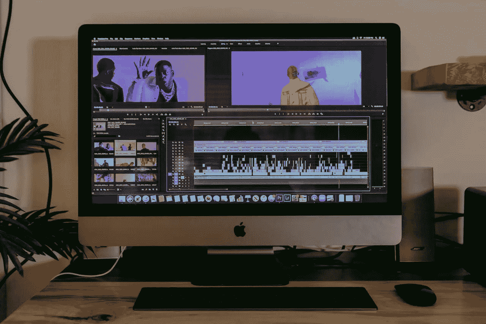

# 如何获得视频编辑的免费音乐并让它变得很棒的 9 个想法

> 原文：<https://medium.com/duomly-blockchain-online-courses/9-ideas-how-to-get-free-music-for-video-editing-and-make-it-awesome-b2bb7b0b2196?source=collection_archive---------2----------------------->

[9 Ideas How to Get Free Music for Video Editing](https://www.blog.duomly.com/how-to-get-free-music-for-video-editing/)

本文最初发表于[https://www . blog . duomly . com/how-to-get-free-music-for-video-editing/](https://www.blog.duomly.com/how-to-get-free-music-for-video-editing/)

**目录:**

*   [如何为视频编辑获得免费音乐的 9 个点子简介](https://www.blog.duomly.com/how-to-get-free-music-for-video-editing/#9-ideas-how-to-get-free-music-for-video-editing-intro)
*   [YouTube 音频库](https://www.blog.duomly.com/how-to-get-free-music-for-video-editing/#youtube-audio-library)
*   [亚马逊音乐](https://www.blog.duomly.com/how-to-get-free-music-for-video-editing/#amazon-music)
*   [CCMixter](https://www.blog.duomly.com/how-to-get-free-music-for-video-editing/#ccmixter)