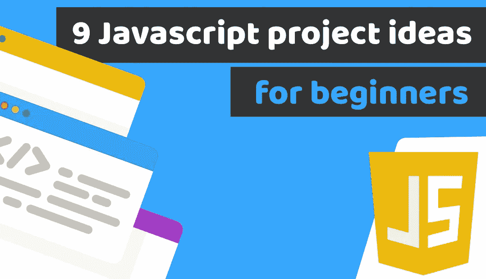

# 9 个 Javascript 项目创意，供初学者练习并构建一个令人惊叹的作品集

> 原文：<https://medium.com/duomly-blockchain-online-courses/9-javascript-project-ideas-for-beginners-to-practice-and-build-an-amazing-portfolio-372c31ee3db?source=collection_archive---------0----------------------->

[Duomly — Programming Online Courses](https://www.duomly.com)

这篇文章最初发表在[https://www . blog . duomly . com/9-JavaScript-project-ideas-for-beginners-that-help-you-build-a-amazing-coding-portfolio](https://www.blog.duomly.com/9-javascript-project-ideas-for-beginners-that-help-you-to-build-an-amazing-coding-portfolio)

一周前，我写了一篇关于 [HTML & CSS 项目](https://www.blog.duomly.com/html-project-ideas-for-beginners/)的文章，你可以这样做来练习你的技能，并开始建立你的编码组合。然后我也答应了…