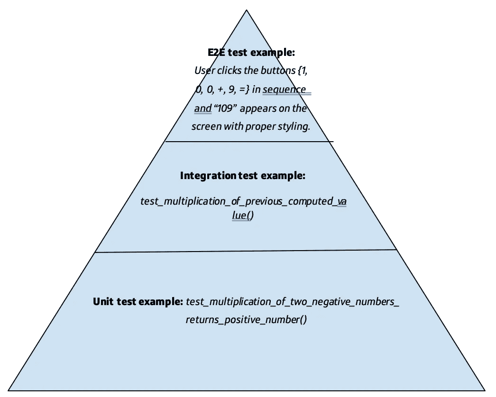

# 在我开始职业生涯之前，我希望了解自动化软件测试的 9 件事

> 原文：<https://medium.com/capital-one-tech/9-things-i-wish-i-knew-about-automated-software-testing-before-i-started-my-career-69d2301d6b92?source=collection_archive---------0----------------------->

职场成功的很大一部分取决于你的工作质量。在软件工程中有很多方法可以做到这一点，但是一个简单的方法是从强大开始并熟悉测试，因为产生质量**的**代码比产生大量不可维护的和破碎的代码重要得多。因此，尽管测试本身是高质量代码的关键，测试 ***自动化*** 是快速高效软件开发中的一场革命。

我作为一名软件工程师已经工作了四年多，从第一天开始，我就使用测试自动化来以各种形式伴随我的功能开发。一路走来，我获得了很多经验，我希望在进入行业工作之前就知道这些经验，因此，我想与刚刚进入技术领域的其他人分享我的 9 大经验。

# 1.练习编写单元测试

首先，**通过阅读博客和查看**编写良好的软件**中的单元测试示例，真正理解[单元测试](https://docs.microsoft.com/en-us/dotnet/core/testing/unit-testing-best-practices)的定义。作为参考，单元测试描述了对软件的最小构建块的测试，通常是方法或功能。下面是一些开始单元测试的提示:**

*   尽管经常被遗忘，但请记住单元测试记录了您的代码。因此，请确保您的方法是描述性的，以便未来的工程师能够理解底层的业务逻辑和您的思维过程。
*   此外，确保在测试中检查期望值和预期的代码流。不要在没有验证预期行为是否发生的情况下就调用函数。
*   单元测试框架的一些常见例子是 Java 的 [JUnit](https://junit.org/junit5/) ，Angular 的 [Jasmine](https://jasmine.github.io/1.3/introduction.html) ，React 的 [Jest](https://jestjs.io/docs/en/tutorial-react) 。

The importance of making your test names descriptive is demonstrated in the code snippet above. The method “calculate_value” is extremely vague, but the final test gives you a better understanding of its expected behavior. If you’re ever tasked with working on a legacy codebase, you might come across this situation often.

# 2.了解测试金字塔

有许多方法来执行测试(通过单元测试、集成测试、端到端测试等。)而且每个公司或者团队都会用不同的形容词来描述类似的概念。通过熟悉行业中常见的不同类型的测试策略，并了解每种策略在软件周期中的位置，您将会省去许多困惑。然后，了解它们在你的公司和团队中是如何使用的。你也许能说服其他工程师使用更标准化的测试形式。

The image above demonstrates one version of the testing pyramid. While you’ll see many differing “testing pyramid” philosophies, the main idea is the same. For instance, the base of the pyramid represents having the most test coverage: this will always be the *unit tests*. These tests should be designed to run fast and cover every scenario within your functions so developers can have more confidence when they make changes or add new code. In the middle is *integration testing* which allows your small components to be tested when they are used together. This helps validate that your code has adhered to the proper API contract and allows you to see if you missed handling valid inputs. At the top of your pyramid, you have *end-to-end testing* (E2E testing). Typically for customer-facing applications, these tests are run through some GUI like a web browser or a mobile phone simulator. These tests tend to be slower and more brittle, so in this round of testing you want to avoid testing scenarios that can be easily handled in a unit test. This will ensure proper test coverage, but it will also prevent you from having to rework large portions of your framework when the GUI or user-facing application layer changes.

A concrete example of the testing period for a simple calculator might look something like the diagram above. Here, the *unit tests* are covering the mathematical functionality, such as the multiplication of different input values. Next, the *integration tests* cover the interaction between classes, assuming that there is a class that holds the memory of the previous calculation and you’re validating that the correct value is sent across to the mathematical processing class. You won’t need to re-check that two negative numbers being multiplied together equals a positive number, but you will need to validate that the correct number is being passed correctly between components. Lastly, the *end-to-end tests* cover the specific overarching GUI flows, such as the user entering different values on the screen and receiving a valid response styled appropriately.

# 3.如果您修复了一个 Bug，编写一个自动化测试来在下一次捕捉它

这是关键！当您修复一个 bug 时，请确保编写一个自动化测试，如果该 bug 再次出现，该测试将会失败。这可以防止 bug 再次出现。有时候开发人员会修复一个 bug，并认为他们的工作已经完成了，但是下一个工程师如何避免犯同样的错误呢？如果你为它写了一个测试，你永远不会有另一个工程师为同样的问题哭泣。

In the above images, it looks like there’s a bug in our code: “calculate_value” doesn’t handle decimal values correctly *(top)*. Let’s write a test *(middle)* that catches this mistake to make sure it doesn’t happen again and validate that it now runs successfully *(bottom)*.

# 4.为你移除测试的理由辩护

重构测试是工作的一部分，也是增强测试质量信心的好方法。许多平台最终会有冗余的、模糊的、无意义的测试，所有这些都会拖慢开发时间。如果您遇到了其中的一些，请大胆重构，使测试套件比您发现的更好。然而，如果您删除测试，请确保那些场景在测试套件的其他地方被覆盖。此外，最佳实践是始终与您的工程师同行一起检查代码，以确保您没有遗漏任何东西。

# 5.在单元测试中使用模拟数据

测试中的模拟数据被指定为具有特定属性的对象，因此您可以测试各种场景，否则您将无法直接访问这些场景。事实上，你可以使用模拟数据编写大量的测试，所以不要仅仅停留在“断言-快乐-路径-按预期工作”的路线上。尝试其他场景，比如验证一个方法是(还是不是！)调用或引发特定异常。对于这些情况，您需要确保正确地处理模拟数据，以便触发各种边缘和异常情况。

# 6.模拟集成测试数据(有时)

有时，当下游系统遇到稳定性问题并且不可用时，您将编写代码。其他时候，您可能会等待您计划使用的 API 由另一个团队或开发人员完成构建。更常见的情况是，可能有一个 API 响应几乎不可能生成，但必须由系统的一部分负责。不管是什么情况，不要让 API 不可用阻碍你的进步！使用模拟框架来模拟 API 调用，这样您就可以继续开发，就像真正的 API 已经存在一样。 [Wiremock](http://wiremock.org/) 是一个很棒的工具，可以模仿你的系统所依赖的 API 请求，这样你就可以继续在系统中开发你的作品。

# 7.不要嘲笑集成测试数据(有时)

虽然有时候你会想要使用你的模拟数据，但模拟数据永远不能代替真实数据！API 契约会改变，会发生沟通错误，真实系统会提供模拟系统可能不知道的额外细节。当您进入生产就绪代码时，不要让这使您措手不及，所以考虑用真实数据对系统的集成进行现场测试；并且，在你签署你的初始开发之前，一定要使用真实的数据。

# 8.自动化一切

任何没有被自动化测试覆盖的代码都是遗留代码。为了正确地确保预期的行为，您需要有人手动测试您的非自动化特性。这极大地消耗了资源，而且，让我们现实一点:增加测试覆盖几乎总是让位于产品意图或其他技术计划，所以通过预先自动化功能测试，使可维护性和可伸缩性更容易。甚至更好——自动化您的自动测试！

# 9.线覆盖只讲述了故事的一面。

“测试测试”有很多方法和度量标准大多数工程师都熟悉线路覆盖。行覆盖测试确保软件套件中的测试覆盖代码中特定的行阈值。但是，线覆盖容易作弊！我可以编写一个没有任何形式断言的测试，通过一个方法的快乐路径，并可能生成超过 80%的行覆盖率。但是这是一个有效的测试吗？当然不是；我们没有验证该方法中的任何行为——我们只知道我的输入没有生成异常。此外，由于只关心行覆盖率，我可能会忘记为边缘情况添加一个关键的单元测试，这只会最低限度地提高覆盖率。这两种情况都会导致错误。因此，不要仅仅利用行覆盖率，要花费额外的时间来尝试覆盖测试中的各种分支场景——即使它们仅仅提高了行覆盖率的百分之几。

*提示，提示:熟读突变测试，甚至试用 Java 的***。**

*总之，你不一定要成为质量保证工程师才能写出有影响力的测试。事实上，当你理解并应用测试基础到你交付的特性和系统时，你会成为一个更好的软件工程师。试试这 9 个技巧，看看效果如何——你可能最终会爱上测试，并成为团队中的测试 SME。*

**披露声明:2020 资本一。观点是作者个人的观点。除非本帖中另有说明，否则 Capital One 不隶属于所提及的任何公司，也不被这些公司认可。使用或展示的所有商标和其他知识产权是其各自所有者的财产。**