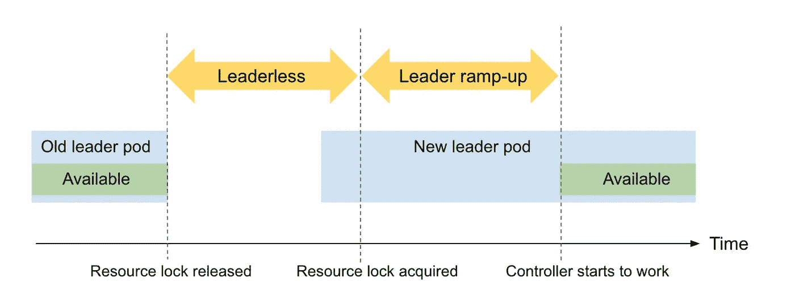

# 99%到 99.9% SLO:Pinterest 的高性能 Kubernetes 控制平面

> 原文：<https://medium.com/pinterest-engineering/99-to-99-9-slo-high-performance-kubernetes-control-plane-at-pinterest-894bc8a964f9?source=collection_archive---------0----------------------->

李舜尧|软件工程师，云运行时

在过去的三年里，云运行时团队的旅程已经从"[为什么是 Kubernetes？](/pinterest-engineering/building-a-kubernetes-platform-at-pinterest-fb3d9571c948)【到】[如何规模化？](/pinterest-engineering/scaling-kubernetes-with-assurance-at-pinterest-a23f821168da)”。毫无疑问，基于 Kubernetes 的计算平台在 Pinterest 取得了巨大的成功。我们一直在支持大数据处理、机器学习、分布式培训、工作流引擎、CI/CD、内部工具——支持 Pinterest 的每一位工程师。

# 为什么控制平面延迟很重要

随着 Kubernetes 上的业务关键型工作负载越来越多，拥有一个高效协调每个工作负载的高性能控制平面变得越来越重要。如果将用户工作负载转化为 Kubernetes native pods 所需的时间过长，内容模型培训和广告报告渠道等关键工作负载将会延迟。

为了衡量控制平面性能，我们在 2021 年初通过服务水平指标和目标(SLI/SLO)引入了顶线业务指标。我们通过**协调延迟**来测量控制平面 SLI，协调延迟被定义为**从接收到用户变更到它传播出控制平面**的时间。例如，批处理作业的协调延迟度量之一是工作负载创建和 Pod 创建之间的延迟。

初始 SLO 设置为 99%。在写这篇文章的时候，我们很自豪地服务于 **99.9%** 的控制平面 SLO。这篇文章是关于我们如何改进控制平面以获得高性能的。

# 简而言之，控制平面

控制平面是 Kubernetes 平台的神经中枢，负责工作负载协调。它监听来自 Kubernetes API 的更改，将资源的期望状态与它们的实际状态进行比较，并采取措施确保实际资源状态与期望状态相匹配(协调)。工作负载协调还包括做出关于将工作负载放置在何处的调度决策。

Kubernetes 控制平面由一组资源控制器组成。我们的资源控制器是在[控制器框架](https://github.com/operator-framework)中编写的，它有一个[通知器-反射器-缓存](https://pkg.go.dev/k8s.io/client-go/informers)架构。**告密者**使用[列表监视](https://pkg.go.dev/k8s.io/client-go/tools/cache#ListerWatcher)机制从 Kubernetes API 获取并监视资源变化。 **Reflector** 用资源变化更新缓存，并调度事件进行处理。**缓存**存储资源对象，服务 List 和 Get 调用。控制器框架遵循**生产者-消费者**模式。事件处理程序是生产者，负责对协调请求进行排队，而控制器工作池是消费者，从工作队列中提取项目来运行协调逻辑。

Figure 1: Kubernetes Controller Framework

# 挑战 1:工人池效率

控制器工作池是实际状态到期望状态协调发生的地方。我们利用[工作队列包](https://pkg.go.dev/k8s.io/client-go/util/workqueue)提供的指标来深入了解工人池的效率。这些指标是:

*   工作持续时间:处理工作队列中的项目所需的时间
*   队列持续时间:项目在被处理之前在工作队列中停留的时间
*   入队率:项目入队的频率
*   重试率:项目重试的频率
*   队列深度:工作队列的当前深度

在这些指标中，队列深度引起了我们的注意，因为它的峰值与控制平面性能下降高度相关。队列深度的峰值表示**队列头阻塞**。当大量不相关的项目在短时间内排队时，通常会出现这种情况。对于那些真正需要协调的项目，它们最终会在队列中等待更长的时间，并导致 SLI 下降。

Figure 2: Correlation between control plane queue depth spikes and control plane instant SLI dips.

为了解决行首阻塞，我们对通知者事件进行分类，并以不同的优先级处理它们。用户触发的事件具有高优先级，需要立即协调，例如，由用户创建工作负载触发的创建事件或由用户更新工作负载标签触发的更新事件。另一方面，一些系统触发的事件是低优先级的，例如，在信息程序初始化期间的创建事件，或者在信息程序周期性再同步期间的更新事件。它们不会影响我们的 SLI，也不像用户触发事件那样对时间敏感。它们可以被延迟，这样它们就不会堆积在队列中，阻塞紧急事件。下一节是关于如何识别和延迟这些系统触发的事件。

## 在 Informer 初始化期间创建事件

每次我们更新控制器时，informer 通过向 API 服务器发出一个 List 调用来初始化它的 List-Watch 机制。然后，它将返回的结果存储在其缓存中，并为每个结果触发一个 Create 事件。这导致队列深度出现峰值。解决方案是延迟现有对象的任何后续创建事件；用户不能创建一个对象两次，任何后续的创建事件必须来自 informer 初始化。

Figure 3: Control plane queue depth spikes to 10k during an informer initialization, resulting in a dip in control plane instant SLI.

## Informer 定期重新同步期间更新事件

informer 定期检查其缓存中剩余的所有项目，为每个项目触发一个更新事件。这些事件同时排队，并导致队列深度峰值。如图 2 所示，队列深度峰值与我们配置的 informer 定期重同步间隔一致。

由周期性再同步触发的更新事件很容易识别，其中旧对象和新对象总是相同的，因为它们都来自 informer 缓存。解决方案是延迟新旧对象深度相等的更新事件。延迟是随机的，因此可以通过将再同步请求分散在一段时间内来消除队列深度尖峰。

## 结果

上述优化解决了效率低下的工作池导致的队列头阻塞问题。因此，控制平面队列深度不会再出现峰值。informer 定期重新同步期间的平均队列深度**减少了 97%，从 1k 减少到 30。** **由控制平面队列深度尖峰引起的瞬间 SLI 低凹处已经消除。**

Figure 4: Improvement on workqueue efficiency

# 挑战 2:领导权的转换

只有控制器群中的领导者执行实际的协调工作，并且在部署或控制器盒驱逐期间，领导者切换经常发生。长时间的领导切换会对控制平面的即时 SLI 产生相当大的负面影响。

图 5:控制平面领导切换导致 SLI 瞬时下降。

## 领导人选举机制

Kubernetes 控制平面有两种常见的领导者选举机制。

*   **Leader-with-lease**:Leader pod 定期更新租约，当它不能更新租约时放弃领导权。Kubernetes 本地组件包括[集群自动缩放器](https://pkg.go.dev/k8s.io/autoscaler/cluster-autoscaler)、 [kube 控制器管理器](https://pkg.go.dev/k8s.io/kubernetes/cmd/kube-controller-manager)和 [kube 调度器](https://pkg.go.dev/k8s.io/kubernetes/cmd/kube-scheduler)在[客户端运行](https://pkg.go.dev/k8s.io/client-go/tools/leaderelection)中使用 leader-with-lease。
*   **Leader-for-life**:Leader pod 只有在被删除且其依赖的 configmap 被垃圾收集时才会放弃领导权。配置图被用作领导的真理来源，因此不可能同时有两个领导(又名裂脑)。我们控制平面中的所有资源控制器都使用来自[操作符框架](https://pkg.go.dev/github.com/operator-framework/operator-lib/leader)的终身领导者选举机制，以确保我们一次最多有一个领导者。

在本帖中，我们将重点关注终身领导方法的优化，以减少控制平面领导切换时间并提高控制平面性能。

## 监视

为了监控领导权交接时间，我们实施了细粒度的领导权交接指标，包括以下阶段:

*   **无领导**:无领导时
*   **Leader ramp-up** :从一个控制器盒成为 Leader 到其第一次协调的时间。新的领导者圆荚体不能一成为领导者就开始调和；相反，它必须等到所有相关的通知者都同步。

Figure 6: Diagram of the leadership switch procedure

Figure 7: Control plane leadership switch monitored by the proposed leadership switch metrics

如图 7 所示，控制平面领导切换通常需要一分多钟才能完成，这对于高性能控制平面来说是不可接受的。我们提出了以下解决方案来减少领导层切换时间。

## 减少无领导时间

终身领导者套餐硬编码了尝试成为领导者之间的指数后退间隔，从 1 秒到最大 16 秒。当一个容器需要一些时间来初始化时，它总是达到最大值 16 秒。我们使退避间隔可配置，并减少它以适应我们的情况。我们还向运营商框架社区反馈了我们的解决方案。

## 减少领导者的上升时间

在 leader ramp-up 期间，每个集群中的每个资源通知器向 API 服务器发起一个 List 调用，并将其缓存与返回的结果同步。只有当所有告密者缓存同步时，领导者才会开始协调。

**预载信息缓存**

缩短 leader 上升时间的一种方法是让备用控制器 pod 预加载其 informer 缓存。换句话说，informer 缓存的初始化不再是 leader 独有的，而是在创建时应用于每个控制器 pod。注意，注册事件处理程序仍然是领导的专属，否则我们会患裂脑症。

**使用就绪探测器确保平稳滚动升级**

informer 缓存预加载程序在后台运行，不会阻止备用 pod 成为主 pod。为了实施阻塞，我们通过 HTTP GET 请求定义了一个就绪探测器，以定期检查所有的通知器缓存是否同步。通过滚动升级策略，旧的主 pod 在新的备用 pod 准备好之后被杀死，这确保了新的 pod 在成为主 pod 时总是被预热。

## 结果

Table 1: Improvement on control plane leadership switch monitored by the proposed leadership switch metrics (4 observations before and after)

表 1 显示了控制平面领导开关的改进。**平均控制平面领导切换时间从 64 秒减少到 10 秒，提高了 85%。**

# 下一步是什么

通过这些努力，我们改进了控制平面的性能，并将其 SLO 从 99%重新定义为 99.9%。对于基于 Kubernetes 的计算平台来说，这是一个巨大的里程碑，展示了前所未有的可靠性和可用性。我们正在努力实现更高的 SLO，并确定了以下可以进一步提高控制平面性能的领域。

*   **主动的领导权交接**:终身领导中的领导权交接是被动的，因为它依赖于外部组件的观察来释放资源锁。花在垃圾收集上的时间占我们目前领导权交接时间的 50%。当领导者接收到 SIGTERM 并在退出前有意释放其锁时，由领导者执行主动领导移交。这将大大减少领导层转换的时间。
*   **协调服务质量(QoS)** :在本文中，我们将从延迟入队和立即入队两个方面展示我们对工作池效率的优化。对于未来的工作，我们希望引入协调 QoS 和工作队列分层(例如，为不同的工作负载层创建不同的队列，以确保高层不会受到干扰和阻塞)。

# 确认

向 Suli Xu 和致敬，感谢他们在构建高性能控制平台以支持业务需求方面做出的巨大贡献。特别感谢 June Liu、Anson Qian、Haniel Martino、、Quentin Miao、Robson Braga 和 Martin Stankard 的反馈和支持。

*要在 Pinterest 了解更多工程知识，请查看我们的* [*工程博客*](https://medium.com/pinterest-engineering) *，并访问我们的*[*Pinterest Labs*](https://www.pinterestlabs.com/?utm_source=medium&utm_medium=blog-link&utm_campaign=li-march-22-2022)*网站。要查看和申请空缺职位，请访问我们的* [*招聘*](https://www.pinterestcareers.com/?utm_source=medium&utm_medium=blog-link&utm_campaign=li-march-22-2022) *页面*