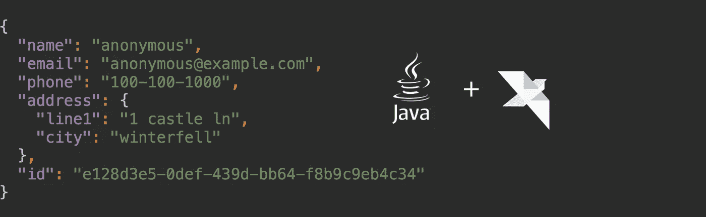

# 使用 Helidon 运行基于 REST 的微服务的 30MB 原生映像

> 原文：<https://medium.com/oracledevs/a-30mb-native-image-with-helidon-to-run-rest-based-microservices-19c481fdda3c?source=collection_archive---------0----------------------->



你一定听说过甲骨文公司的新成员——[**海利登**](https://helidon.io/) 。它是一个开源的 Java 框架，使人们能够使用函数式和反应式编程范式编写轻量级的微服务。人们可以使用 Helidon 简单而强大的核心反应式 web 服务器来快速构建云原生微服务。如果你喜欢用 12 个因素的方法写申请，Helidon 可以满足你。Helidon 的配置组件提供了多个选项来加载和配置您的应用程序——从加载属性或 YAML 文件到从 Git 等外部源加载。开箱即用的指标和跟踪，你问…你得到了！

在本文中，我将带着 Helidon 兜一圈，构建一个样例 CRUD 微服务，它将作为 JSON REST API 公开。然后，我们将使用 [jlink](https://docs.oracle.com/javase/10/tools/jlink.htm) 创建一个可以运行我们的微服务的定制本地映像。本机映像消除了对完整 JRE 的需求。削减运行时的规模和减少攻击面是云部署中的重要因素。当然，这种方法有一些缺点，但是让我们改天再讨论。

我们将使用 JPMS 和格雷尔来建立我们的项目。下面是相关的 gradle 构建文件，用于将 Helidon 库添加为我们的项目依赖项:

```
plugins {
    id "java"
    id "com.zyxist.chainsaw" version "0.3.1"
}sourceCompatibility = "10"dependencies {
    compile "io.helidon.webserver:helidon-webserver:0.9.1"
    compile "io.helidon.webserver:helidon-webserver-netty:0.9.1"
    compile "io.helidon.webserver:helidon-webserver-json:0.9.1"
}
```

您可以根据您的应用需求从 Helidon 提供的库列表中挑选。对于我们的示例 CRUD 服务，我们只需要 Netty 支持的反应式 web 服务器和 JSON 支持。因为我们正在使用 JPMS 创建一个模块化 jar，所以让我们创建一个“module-info”类，并指定我们的应用程序所需的模块:

```
module example.api {
    requires io.helidon.webserver;
    requires io.helidon.webserver.json;
    requires org.glassfish.java.json;
}
```

注意，虽然 Helidon 使用 JPMS 完全模块化，但一些底层库如 Netty 却不是。这种库依赖于自动模块解析。

有了这个设置，让我们创建一个启动器类来托管 main 方法:

```
import io.helidon.webserver.Http;
import io.helidon.webserver.Routing;
import io.helidon.webserver.WebServer;
...public class Launcher {

    public static void main(String[] args) {
        WebServer
                .*create*(*createRouting*())
                .start()
                .thenAccept(ws -> 
                        *logger*.info("Service running at: http://localhost:" + ws.port()));
    }

    private static Routing createRouting() {
        return Routing.*builder*()
                // Add JSON support to all end-points
                .register(JsonSupport.*get*())
                .register("/api", new UserService())
                // Global exception handler
                .error(Exception.class, (req, res, ex) -> {
                    res.status(Http.Status.*BAD_REQUEST_400*).send();
                })
                .build();
    }
}
```

这就是使用 Helidon 启动 web 服务器所需的全部内容。不需要应用程序容器，不需要部署 war，也不需要调整 XML 文件。

请注意我们是如何使用 fluent routing builder 类来注册 JSON 支持并在基本路径“/api”下添加子路由的。在 Helidon 世界中，可以使用“服务”创建子路线它们提供了一种组织端点和相关逻辑的方法。还可以使用处理程序来响应传入的请求。你可以在这里阅读更多关于路由和 Helidon 提供的各种 APIs】。

要运行这个微服务，我们只需要运行 main 方法。如您所知，这可以通过多种方式实现——通过使用 IDE 进行快速开发和测试，通过使用 maven 或 gradle 等构建工具，或者通过手动打包 jar 并自己运行 java 命令。一旦您启动了微服务，您就可以使用 curl 或您最喜欢的 REST 客户端来执行 GET、POST、PUT 和 DELETE 操作，这些操作是在我们的示例用户服务端点上定义的。例如，如果您第一次执行 GET，您将得到一个空列表:

```
curl -X GET [http://localhost:8080/api/users/](http://localhost:8080/api/users/)
{"items":[]}
```

如你所见，Helidon 使得开发 REST APIs 和微服务变得非常容易。我们仅仅触及了表面。

有了这个工作原型，让我们构建一个可以运行原型的定制 JRE 映像。JDK 9 引入了一个叫做“jlink”的工具，可以用来构建定制的本地映像。但是有一个问题——应用程序使用的所有 jar 都应该使用 JPMS 进行模块化。它们不能依赖自动模块名。在现实世界中，这将是一个挑战。例如，正如我之前提到的，Netty jars 不是 JPMS 意义上的模块化。然而，我们可以使用“jdeps”工具来找出 JDK 中的哪些模块正在被我们的应用程序 jar 使用，包括它们的依赖项(=运行时 jar)，并且基于这些知识，我们可以构建一个定制的本地 JRE 映像。

假设您将所有运行时 jar 放在当前工作目录中。您可以运行 jdeps 命令来打印特定 jar 使用的模块的概要:

```
*jdeps --module-path . -s* user-crud-microservice.jar
```

输出应该是这样的:

```
example.user.api -> io.helidon.webserver
example.user.api -> io.helidon.webserver.json
example.user.api -> java.base
example.user.api -> java.logging
example.user.api -> org.glassfish.java.json
```

我们可以递归地执行所有运行时 jar 的 jdeps，并找到 JDK 的公共模块，它们显然是以“java”开头的。事实上，我们可以使用 unix 工具，如 find、sed、sort 和 grep 来半自动化这个过程。您可以在这里参考用于我们的示例服务[的完整脚本。一旦我们获得了 Java 模块的最终列表，我们就可以使用 jlink 命令创建一个定制的本地映像:](https://github.com/udaychandra/user-crud-microservice/blob/master/build.sh)

```
# Add jdk.unsupported to allow netty to access internal classes
jlink --module-path "${JAVA_HOME}/jmods" \
    --add-modules jdk.unsupported"${JAVA_BASE_MODS}" \
    --strip-debug \
    --compress 2 \
    --no-header-files \
    --no-man-pages \
    --output myimage
```

从上面的命令中生成的本机映像的大小大约为 25 MB(根据平台的不同，可能会略有不同)。我们可以使用这个本地映像运行我们的示例微服务。我们需要向 java 命令传递一些额外的选项，让它知道在哪里寻找我们的运行时模块，并指定主类:

```
myimage/bin/java --upgrade-module-path ${DEPLOY_DIR}/mods -m example.user.api/example.user.api.Launcher
```

我们的示例微服务的运行时 jar 的大小大约是 5 MB。因此，借助总计 30 MB 的内存，我们能够创建一个自包含的本地映像，该映像可以使用 Helidon 运行基于 REST 的微服务。相当酷！

当然，像我们所做的那样执行几个手动步骤对于现实世界的项目来说是不可行的。我希望围绕 jdeps 和 jlink 的工具变得更好。更好的是，如果所有开源库都提供 jar 的模块化版本，那么创建原生映像将轻而易举。

您可以前往 [Github](https://github.com/udaychandra/user-crud-microservice) 来克隆和使用示例项目。编码快乐！