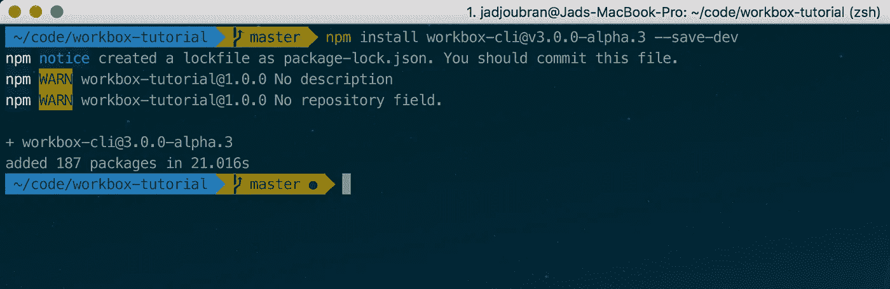
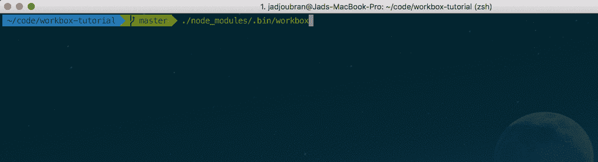
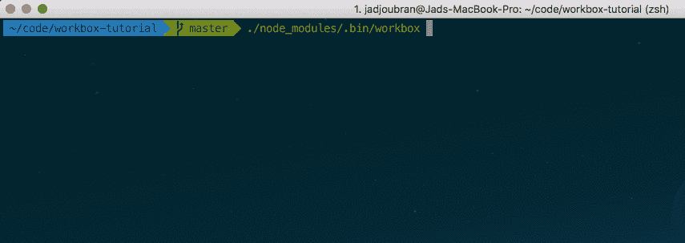
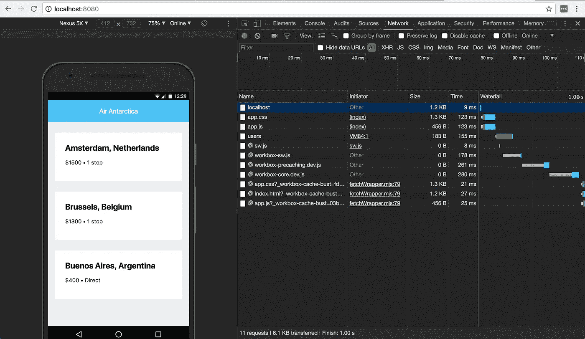
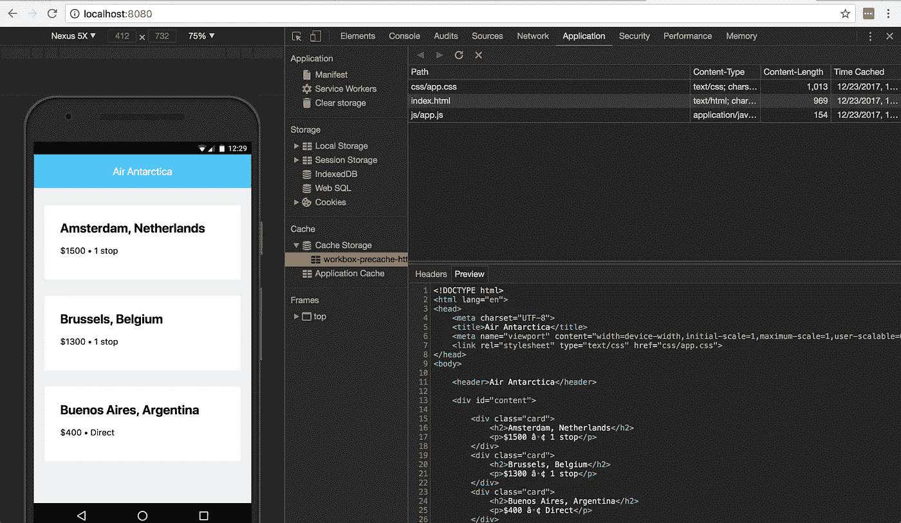
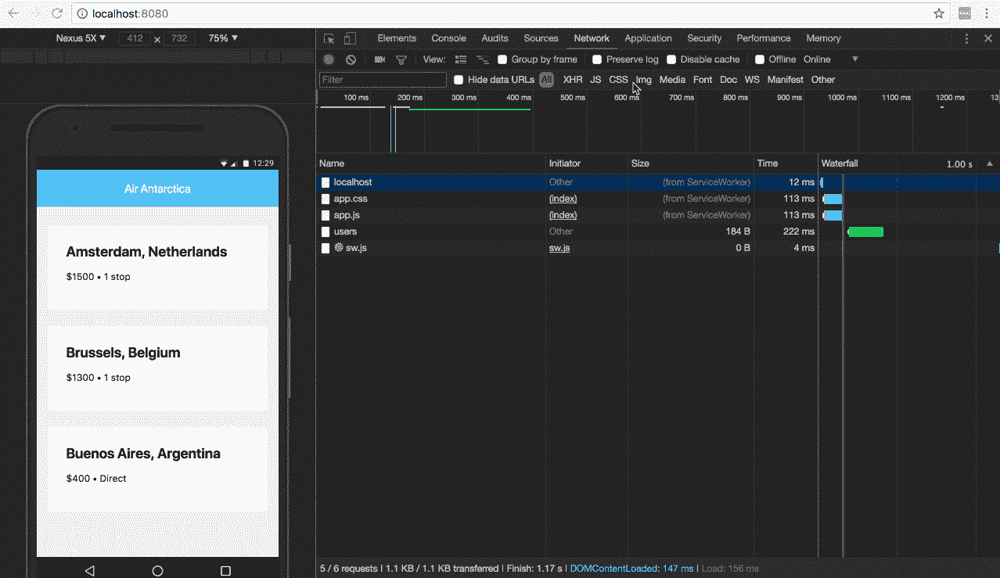
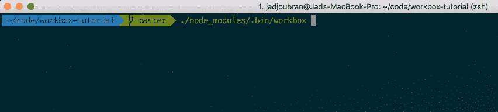
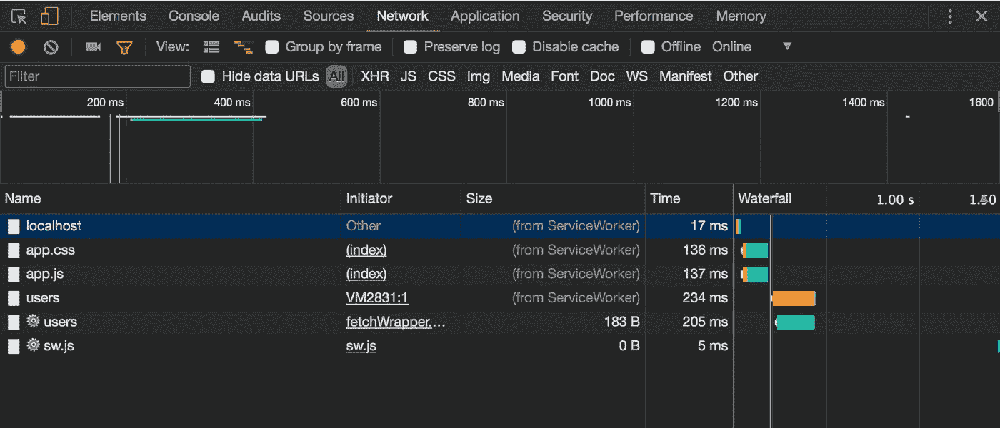

# 对 Workbox 3.0 的 5 分钟介绍

> 原文：<https://medium.com/google-developer-experts/a-5-minute-intro-to-workbox-3-0-156803952b3e?source=collection_archive---------0----------------------->

Workbox 是一个 JavaScript 库的集合，当你构建[渐进式网络应用](https://developers.google.com/web/progressive-web-apps/)时，它可以帮助你使用[服务工作者](https://developers.google.com/web/fundamentals/primers/service-workers/)相关的功能。

在本文中，我将只关注使用 workbox 为您的应用程序生成服务工作者文件。

*w̵o̵r̵k̵b̵o̵x̵̵j̵s̵̵i̵s̵̵c̵u̵r̵r̵e̵n̵t̵l̵y̵̵i̵n̵̵a̵l̵p̵h̵a̵.̵̵i̵̵w̵i̵l̵l̵̵k̵e̵e̵p̵̵t̵h̵i̵s̵̵a̵r̵t̵i̵c̵l̵e̵̵u̵p̵̵t̵o̵̵d̵a̵t̵e̵̵a̵s̵̵w̵o̵r̵k̵b̵o̵x̵̵3̵̵r̵e̵a̵c̵h̵e̵s̵̵a̵̵s̵t̵a̵b̵l̵e̵̵r̵e̵l̵e̵a̵s̵e̵.̵*

3 月 14 日发布了 Workbox 3.0.0🎉

# 🤔为什么选择 workbox？

我以前在处理渐进式网络应用程序时使用过[SW-pre cache](https://github.com/GoogleChromeLabs/sw-precache)&[SW-toolbox](https://github.com/GoogleChromeLabs/sw-toolbox)。然而，在上次 Chrome Dev 峰会上听到这个消息后，现在我已经看到了 Workbox 3，我很高兴能够切换到 Workbox 3，因为 work box 3 专注于提供更好的模块化、强大的调试支持，同时保持库大小较小😍。

# 💻跟着走

在教授新技术时，我采用的方法是在隔离概念的同时降低一点级别。

这也是我和妮可·赛迪在私人公司会议上介绍 PWAworkshop.com 时采用的方法。这就是为什么我准备的存储库有一个 **build** 文件夹来模拟构建工具的结果。

我们在这里省略了**构建步骤**，以确保你理解**工具箱**是如何工作的。

因此，要遵循本教程，首先要克隆这个存储库并安装它的依赖项:

我们正在安装的唯一依赖项是 **http-server** ，它将让您在浏览器中为您的应用程序提供服务。

这是我们目前的文件夹结构:

```
.
├── build
│   ├── css
│   │   └── app.css
│   ├── index.html
│   └── js
│       └── app.js
└── package.json
```

# 🔗安装工具箱

让我们从安装最新的预发布版本 **Workbox-cli** 开始

```
npm install workbox-cli --save-dev
```



Install workbox

我更喜欢在本地安装库，而不是全局安装，以避免在处理多个项目时出现意外问题。

因为我们在本地安装了 workbox，所以现在可以使用 npx 来调用它

`npx workbox`(而不仅仅是`workbox`)。

# 🎩工具箱向导

我们要经历的第一个工具箱命令是`wizard`。

`workbox wizard`扫描您的目录并询问您一系列问题，以便生成一个**工具箱-config.js** ，该工具箱将在以后您调用**工具箱**时使用。

```
npx workbox wizard
```

现在 workbox 会问你一系列问题。

用 **yes** 回答所有的问题，因为所有的缺省值都是有意义的，如果你需要的话，你可以简单地编辑这个文件。



Workbox wizard

您现在将在根目录下有一个`workbox-config.js`，包含以下配置:

# 🏋️‍工具箱生成

这个 workbox 命令将读取您的 **workbox-config.js** 并生成一个服务工作者文件，该文件基于我们从 workbox 向导`**/*.{css,html,js}`获得的 **globPatterns** 预先缓存文件。

```
npx workbox generateSW workbox-config.js
```



Workbox generateSW

## 登记服务人员

既然服务工作者文件已经生成，我们必须注册它。

因此，让我们进入**index.html**并在主体的结束标记前添加以下代码:

## 上菜

现在运行`npm run serve`服务你的应用，在你的浏览器中进入 [http://localhost:8080/](http://localhost:8080/) 。

瞧啊。在 [Chrome dev tools](https://developers.google.com/web/tools/chrome-devtools/) 的**网络**标签中，你可以看到由服务人员提出的请求，这些请求的前缀是⚙️图标。当您在本地开发时，Workbox 将只加载 **.dev.js** 助手。

Workbox 还将请求带有特定`workbox-cache-buest`参数的**index.html**、 **app.css** &、 app.js ，以确保您获得最新版本的资产。



Workbox pre-caching assets

您还可以通过进入**应用>缓存存储**来检查这些预先缓存的资产(您可能需要右键单击&刷新) **>工作箱-预先缓存**。

在这个改进的开发工具页面中，您可以看到缓存的资产及其内容，显示在**预览**选项卡中。



Preview pre-cached assets

## 下线！

回到**网络**标签，让自己离线。

重新加载页面，你会看到你仍然得到对 index.html**，app.js** & **app.css** 的响应。这是因为它们已经被预先缓存，即使在离线时也能被提供。



Works offline!

# 💉工具箱注入清单

如您所见，整个服务工作者文件现在是由 Workbox 生成的。但是如果你想改变一件事呢？如果要加一行呢？添加离线分析？

您不能更改生成的文件，因为您所做的任何更改都将在您重新生成服务工作者文件后被覆盖。

这就是为什么每当您想要控制您的服务工作者文件并让 Workbox 生成它的一部分时，您必须使用 **injectManifest** 的原因。

所以我们需要有一个`source service worker` 文件，它将用于生成最终的服务工人。

让我们创建 **src-sw** 。 **js** 文件放在项目的根目录下，并在其中写入以下代码:

所以我们从 CDN 导入了 workbox，添加了一些自定义代码(目前它只是一个控制台日志)，然后添加了一个占位符:`workbox.precaching.precacheAndRoute([]);`。

Workbox 将生成预缓存数组，并将其注入到这行代码中:`workbox.precaching.precacheAndRoute([]);`，同时保持其余代码的完整性。

现在在 **workbox-config.js** 中，添加下面一行:

```
"swSrc": "src-sw.js"
```

您应该在您的 **workbox-config.js** 中完成这个配置:

现在只需运行:`npx workbox injectManifest`



Workbox injectManifest

这是您将得到的生成的服务工人:

# 🛣工具箱路由

到目前为止，我们已经完成了预缓存，我们指示**工作箱**向缓存中添加一些资源，因为我们稍后会用到它们。

但是动态资源呢？如果您调用一个特定的 API，并希望缓存它的响应，该怎么办？

工作箱路由的工作来了，它允许你定义一个正则表达式，用一个**策略**匹配一个特定的请求。

您可以定义自己的策略，但大多数情况下，您会使用以下三种已经存在的策略之一:

你可以在[工具箱策略文档](https://developers.google.com/web/tools/workbox/modules/workbox-strategies)中找到更多关于它们如何工作的解释。

如果你看一下`build/js/app.js`，我们有一个`fetch`对[https://jsonplaceholder.typicode.com/users](https://jsonplaceholder.typicode.com/users)的请求，所以为了缓存这个链接的结果，我将使用 **cacheFirst** 策略，并使用一个匹配 url 的正则表达式注册路由，它是:

`new RegExp('https://jsonplaceholder.typicode.com/users')`。

现在只需在 **src-sw.js** 文件中将路线注册在`console.log('this is my custom service worker');`下。

让我们通过运行`npx workbox injectManifest`来重新生成服务工作者文件。

我鼓励你看一看`build/sw.js`中新产生的服务人员，以确保你在头脑中强化这些概念。

## 上菜

如果您停止提供您的应用程序，您可以通过运行`npm run serve`再次提供。

然后重新加载页面一次，以获得新的服务工作者，然后再次重新加载，以在缓存中缓存`/users`的响应(使用新的服务工作者代码)，然后离线。



/users is served from ServiceWorker

检查对`/users`的`fetch`请求是如何从缓存中得到服务的。

# 🚀搞定了。

这样，您就可以更深入地研究 workbox 并构建令人敬畏的 pwa 了。

非常感谢 [Workbox 核心团队](https://github.com/GoogleChrome/workbox#core-team)构建了一个非常棒的库。

[杰弗里·波斯尼克](https://medium.com/u/3fb739097395?source=post_page-----156803952b3e--------------------------------)，[马特·冈特](https://medium.com/u/17196521ef2d?source=post_page-----156803952b3e--------------------------------)，[艾迪·奥斯马尼](https://medium.com/u/2508e4c7a8ec?source=post_page-----156803952b3e--------------------------------)，菲利普·沃顿[普拉蒂克·巴特纳加尔](https://medium.com/u/d5243409b984?source=post_page-----156803952b3e--------------------------------) & [凯茜·巴斯奎斯](https://medium.com/u/c8187519a8ef?source=post_page-----156803952b3e--------------------------------)

查看我的互动课程:

*   [**学编程**](https://learnprogramming.online)
*   [**学习 JavaScript**](http://learnjavascript.online/)
*   [**反应过来教程**](https://react-tutorial.app/)

在开始使用 Workbox 之前，您是否正在寻找渐进式 Web 应用程序的介绍？那就来看看下面的视频系列吧！