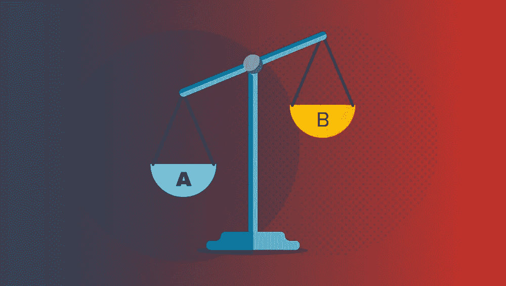
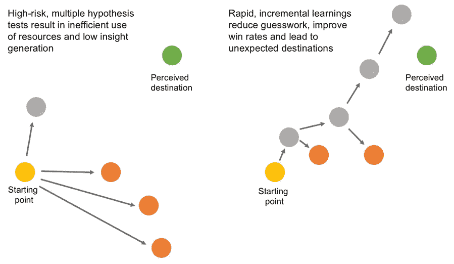
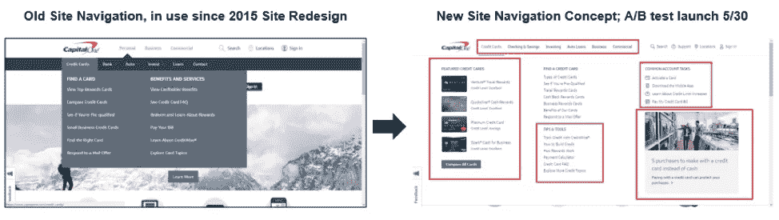
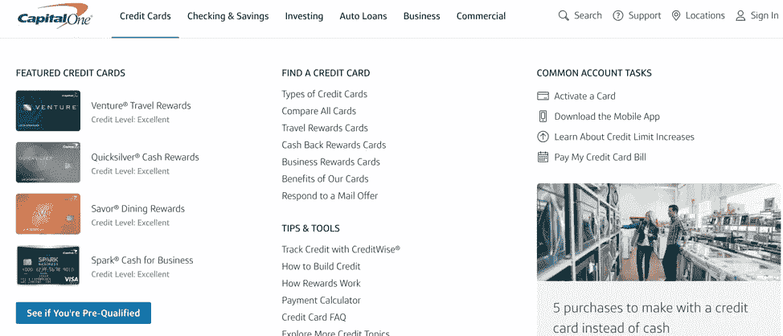

# A/B 测试——在没有大爆炸的情况下创造大变化

> 原文：<https://medium.com/capital-one-tech/a-b-testing-big-change-not-big-bang-c20e547400c?source=collection_archive---------5----------------------->

即使在数字实验的时代，大爆炸的重新设计继续在世界各地的品牌中找到牵引力，尽管有足够的证据表明有更好的方法来创造积极的变化。我们可以使用 A/B 测试来带来显著的 UX 变化吗？或者它只是一个增量优化的工具？这就是我们今天要讨论的问题。

## 重新设计与优化

优化者面临的挑战之一是如何平衡优化你当前的用户体验和实现重新设计的体验。转向重新设计的体验是一个很大的未知数:新的体验可能解决观察到的客户需求，但也可能扰乱你的业务漏斗中的关键流程。那么，如何在不打乱这些路径的情况下自信地进入一种新的体验呢？通过迭代和顺序的 A/B 测试。

## A/B 测试不限于小规模的变化

A/B 测试与重新设计并不对立——相反，它是成功重新设计的必要条件。有一种普遍的误解，认为 A/B 测试不足以做出大的改变，它最好是在你已经生活的世界中进行优化。

这是不正确的——A/B 测试会告诉你你正在测试的假设——在你现有的框架之内或之外——在经验上是否比你的控制更好。如果处理得当，你将有数据来说明“为什么”，而不仅仅是“是什么”。

## 大爆炸式的重新设计往往行不通

虽然通常是善意的，并以研究为基础，但事实是，大多数经过测试的用户体验更改都会失败。网络上充斥着大量未经测试的大规模重新设计失败的例子。您可以通过测试更改来保护自己免受这种风险！

需要注意的是，A/B 一次测试所有的变化并不比大爆炸式的重新设计更好。将一个以上的假设放入一个单一的测试中是糟糕的科学，因为这使得从变化中理清结果变得不可行。你从这里学到的唯一一件事是所有变化的总和是否超过了控制——你不知道是什么变化在驱动性能，为什么。

## A/B 测试是重新设计的正确方法

达到重新设计的愿景的科学方法是在连续测试中一次一个地 A/B 测试你的假设。有先进的方法可以进行更高程度的变异实验，但它们很少是必要的，并且需要数据和实验设计的更高精度。

如上所示，你可能会发现一个单独的测试相对于控制是一个失败者。了解这一点是一个好的结果，因为你能够回到你之前的最佳状态。在一个受控的环境中学习这一点可以让你在表现不佳的领域减少损失，并重新获得成功的经验。

当这种情况发生时，大的重新设计会受到影响，因为你的选择要么是回滚，尝试在不确定的领域进行迭代，要么是承受巨大的损失。从复杂的重新设计实验中解析数据通常会导致进一步的假设，从而降低对下一个变化的信心。

那么，如何在实践中运用迭代 A/B 测试来驱动重新设计(并从错误中学习)？

## 首都一号主页导航重新设计示例

在 Capital One，我们在重新设计网站导航时遇到了这个挑战，如下所示。如果我们在一次测试中简单地测试了几十个提议的变更，我们将会得到一个没有明确解释原因的结果，并且没有更深层次优化的途径。

通过大爆炸测试将完整的概念推向市场会留下许多问题没有答案，也没有为未来的测试指明方向。我们决定将设计分解成中间测试，以了解中间变化的影响，并确定需要进一步优化的领域，而不是作为一个单独的重新设计工作向前推进。

当然，最理想的情况是，根据对北极星用户体验的观察，而不是预先包装好的目的地，来构建迭代实验。随着这些测试的结束，我们的团队现在正专注于在未来进行更仔细和迭代的测试。

着眼于重新设计的体验，我们的技术、设计和产品团队首先注意到重新设计提出的每一个变化(有很多！)并将这些变化分成我们可以用现有设计框架测试的假设。我们添加了新的工具来更好地跟踪变化和用户流量，以进一步提高我们的阅读量。

在这些测试结束时，我们有了一些可操作的见解，但在很大程度上看到了与我们现有导航一致的性能。这建立了较大概念不是重大风险的信心。当测试完整的概念和我们的对照时，我们得到了一个不确定的结果。

后续测试目前正在进行中，我们的后续测试旨在改善部分卡产品的用户资格预审页面路径。根据我们的见解，我们假设提高链接的可见性会导致我们核心指标的提高，包括提高访问者的满意度。为了快速测试这个假设，我们构建并发布了一个测试，在行动号召中突出显示*“看看你是否通过资格预审】*。这项测试的结果仍然悬而未决。

## 运用洞察力

那么，如何在实践中运用迭代 A/B 测试来驱动重新设计(并从错误中学习)？具体来说，您如何从您的实验中获得数据洞察力，并迅速将它们转化为强大的后续测试？

*   从以前的测试中收集 KPI、匿名页面交互数据。
*   确定控制和测试发生变化的领域和相互作用。
*   评估缩小或超过差距的机会——这值得做吗？
*   阐明一个假设。
*   弄清楚如何快速、廉价地检验假设，以了解假设是否有效。
*   算出有多少人需要看测试。
*   建造和运输测试。(ABS — *始终发货*)
*   收集数据并进行分析。
*   迭代继续。

我想给你们留下一个强有力的提醒，数据是你们实验项目的催化剂和基础。观察、衡量、假设、取胜。

> “在掌握数据之前就进行理论化是一个严重的错误。不知不觉中，人们开始扭曲事实以适应理论，而不是让理论适应事实。”——[福尔摩斯](https://en.wikiquote.org/wiki/Sherlock_Holmes)

*声明:这些观点仅代表作者个人观点。除非本帖中另有说明，否则 Capital One 不属于所提及的任何公司，也不被其认可。使用或展示的所有商标和其他知识产权均为其各自所有者所有。本文为 2018 首都一。*