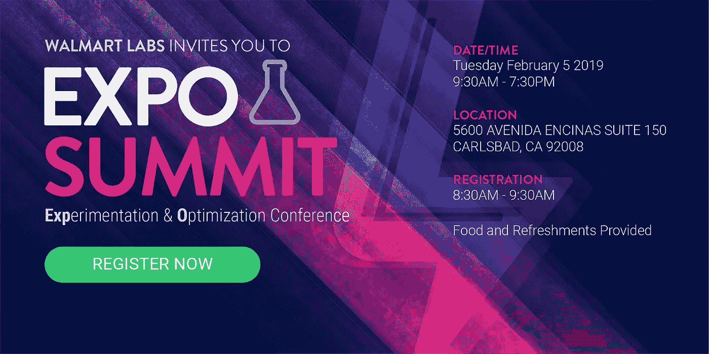

# 加利福尼亚州卡尔斯巴德的 A/B 测试会议

> 原文：<https://medium.com/walmartglobaltech/a-b-testing-conference-coming-to-carlsbad-ca-ddbd489f9e73?source=collection_archive---------4----------------------->

# 现在更新了幻灯片和视频！

## 博览会峰会提供了了解 A/B 测试流程、分析和技术的机会

2019 年 2 月 5 日，加利福尼亚州卡尔斯巴德的沃尔玛实验室举办了一场免费的 A/B 测试会议，来自 Intuit、LinkedIn、State Farm 和沃尔玛实验室的发言者参加了会议。

我们回顾了实验和优化是如何完成的，以及背后的技术，从实验平台和过程到执行的报告和分析。与会者会见了其他行业专家，提出了问题并分享了他们的经验。

如果你不能参加，或者只是想回顾一下演讲，幻灯片和视频可以在下面找到。

# 开幕主题演讲

## Claude Jones，沃尔玛实验室高级工程总监

Claude Jones 是一位经验丰富的技术领导者，拥有超过 15 年的工作经验。他在 WalmartLabs 工作了 6 年，负责管理一个由 60 多名产品、用户体验、项目管理、架构师和工程师组成的分布式团队，专注于构建定制工具，以改善沃尔玛通过网络、本地应用程序和商店开发和提供电子商务体验的方式。

克劳德热衷于激发他人的潜能，并相信通过努力工作和奉献，一切皆有可能。在业余时间，他经营着 Elevate Foundation，这是一个致力于帮助需要帮助的人和回馈社区的组织。

[**视频可用**](https://photos.google.com/share/AF1QipNr24PhHysJ6na84c5qdVsBrLv_ZUP4LIAx7KQOIcHqXE17YUTuHAGOop_vjizXEQ/photo/AF1QipMlf9ycoxtYx0y6WCRLU4JO9QV4J3iwDDJIHIKn?key=VVl2Mk9zcDhXTElGbURJaWF2by1abGFhRzU1R2FR)

# 扬声器

## **Anthony Tang，沃尔玛实验室高级工程经理**

Anthony Tang 领导 A/B 测试平台团队，负责构建和维护 EXPO，这是沃尔玛的实验和优化平台。他的团队与产品分析和产品管理部门密切合作，在沃尔玛网站和移动应用程序中实现和推广 A/B 测试。安东尼在雅虎工作后于 2012 年加入沃尔玛实验室。，并获得了加州大学圣迭戈分校的计算机科学硕士学位。

**世博平台的演变**

设计和构建新的 A/B 测试平台是一项具有挑战性的任务。在本次演讲中，Anthony 将讨论沃尔玛实验室自己的内部 A/B 测试平台“Expo”在开发、内部销售以及最终赢得组织认可方面的挑战和关键经验，不仅包括技术方面，还包括组织和文化方面。

[**幻灯片可用**](https://drive.google.com/open?id=1J8nRhPlKvOo1NGfIOL7Sr1v1tYDccLg2)
[**视频可用**](https://photos.google.com/share/AF1QipNr24PhHysJ6na84c5qdVsBrLv_ZUP4LIAx7KQOIcHqXE17YUTuHAGOop_vjizXEQ/photo/AF1QipMzjbQsHXBRn6GwAhf1OlFtITBFLchO8Srw38eI?key=VVl2Mk9zcDhXTElGbURJaWF2by1abGFhRzU1R2FR)

## 段，领英实验科学经理

陶伟·段管理着领英应用研究团队的一个数据科学家团队。他的团队通过研究和工程努力推动实验创新，并与数据科学和应用/基础设施工程领域的多个团队合作。他在解决复杂的因果推理应用研究问题方面有 5 年的经验。陶伟拥有西北大学工业工程博士学位。

**大规模试验 LinkedIn 经济图表:故事和经验教训**

许多网络公司利用 A/B 测试来做出数据驱动的决策。统计一直是 A/B 测试的中坚力量，在大数据时代，其作用更是至关重要。一般的 A/B 测试框架和方法在实践中有其挑战和缺陷。在本次演讲中，我们将讨论几个具有挑战性的 A/B 测试场景，例如解决一个用户的行为会影响另一个用户的网络效应，以及我们如何大规模解决这些问题。

[**幻灯片可用**](https://drive.google.com/open?id=12ajPl5iDZsSGN_afjkb2DRhZfSaWgXlV) [**视频可用**](https://photos.google.com/share/AF1QipNr24PhHysJ6na84c5qdVsBrLv_ZUP4LIAx7KQOIcHqXE17YUTuHAGOop_vjizXEQ/photo/AF1QipP7fE9ClYkey-TN5tVWPObNnnYSH5T67ksP7OCD?key=VVl2Mk9zcDhXTElGbURJaWF2by1abGFhRzU1R2FR)

## Intuit 公司实验平台负责人 Dylan Lewis

Dylan Lewis 是 Intuit 实验平台的产品管理负责人。他推动产品路线图，以确保数据驱动的决策得到可靠实验实践的支持。最近，他是一名分析布道者，专注于帮助数据工作者能够做他们一生中最好的工作。他为 Intuit 使用的分析工具、系统和流程带来了 C 级可见性。在此之前，迪伦是 TurboTax.com 的实验主任，领导了 12 个纳税季的测试项目。Dylan 在视觉科学公司工作后于 2005 年加入 Intuit。他在 SDSU 大学获得了输入输出心理学硕士学位。

**经验教训@ Intuit**

Dylan 将介绍 Intuit 十多年来优化测试项目的经验教训。在他的演讲中，了解持续反思如何影响 TurboTax 测试项目的绩效，以及如何将学到的经验应用到您的组织中。

[**幻灯片可用**](https://drive.google.com/open?id=1rsgY9SgGJpqNNvnMHu5NTWFQdxk48gHS)

## **Mark Russell，国营农场 A/B 测试小组首席分析师**

马克·拉塞尔是州立农场 A/B 测试小组的首席分析师。马克拥有威奇托州立大学人类因素心理学博士学位，并在州立农场工作了 14 年。他在可用性实验室开始了他的州立农场生涯，后来转移到数字分析，在那里他分析了在线用户行为，并开始了他们的在线调查项目。目前，他负责协调 State Farm 在线资产的 A/B 测试，并在全公司宣传数字实验的价值。

**风险与回报:采用 A/B 测试的挑战**

Mark 将讨论在将 A/B 测试的广泛应用添加到具有近一个世纪历史的企业文化中所面临的挑战和吸取的教训。在这次演讲中，他将涉及一些问题，如对利益相关者进行实验基础教育，获得业务合作伙伴的认可，将 A/B 测试视为一种解决方案，而不是额外的(可选)工作，以及协调 A/B 测试影响的下游分析。

## Jessica Huang，沃尔玛实验室在线杂货产品分析师

Jessica Huang 是在线杂货团队的产品分析师。她帮助产品经理开展新客户入职培训和其他活动，如肉类称重和 ADA 合规性 A/B 测试以及其他站点分析请求。在加入沃尔玛之前，她在埃森哲担任电子邮件营销分析和 A/B 测试等项目的顾问。杰西卡是加州大学伯克利分校的骄傲校友——加油熊队！

## 沃尔玛实验室在线杂货产品经理 Sonali Sheel

Sonali Sheel 领导沃尔玛的在线杂货新用户体验。作为密歇根大学的毕业生，Sonali 之前在 clear cost Health and Practice Fusion 从事产品工作。工作之余，她喜欢打篮球，让她的空气植物 Shawty 存活。

**沃尔玛实验室在线杂货店如何使用 A/B 测试**

网上食品杂货店为顾客提供了在旅途中购买食品杂货的能力，并能在他们繁忙的日程安排中选择时间去商店提货或送货上门。在本次演讲中，我们将分享沃尔玛实验室如何使用 A/B 测试来衡量新功能对端到端客户体验的影响，并快速迭代以在全渠道环境中优化我们的网站和移动应用。

[**幻灯片可用**](https://drive.google.com/open?id=11jtYk-2b8fNKn0WJOfqzmLNBLLAgUQmJ)
[**视频可用**](https://photos.google.com/share/AF1QipNr24PhHysJ6na84c5qdVsBrLv_ZUP4LIAx7KQOIcHqXE17YUTuHAGOop_vjizXEQ/photo/AF1QipMeRLaJIwDdUj5jIyFIhHtI2DSqDl5SMmy22gAj?key=VVl2Mk9zcDhXTElGbURJaWF2by1abGFhRzU1R2FR)

# 突围

## **沃尔玛实验室高级产品经理 Omar Jabbar**

Omar 已经在实验和优化领域工作了 10 多年。目前，他在沃尔玛的测试和优化团队支持其新的在线杂货实验项目。此前，他是 PayPal 的实验主管，领导团队过渡到基于联邦的实验 COE 模型，并帮助塑造新的内部实验平台。在加入 PayPal 之前，Omar 在易贝的实验团队工作了近 9 年。他在那里管理实验测试管理和数据质量团队。在易贝团队的帮助下，他领导并建立了一种欣欣向荣的实验文化，每年可以进行 1000 次测试。

**A/B 测试流程**

有许多不同的方法来运行 A/B 测试程序。我们将在本次分组讨论中分享我们使用的不同流程、难点和成功案例。

## 刘淑玲，沃尔玛实验室测试优化与分析总监

Shuling 是沃尔玛实验室的测试优化和分析主管。她管理着一个由测试经理、数据科学家和统计学家组成的团队。在加入沃尔玛之前，她是易贝的营销分析总监，在 CRM、社交和忠诚度领域拥有丰富的经验，这些领域严重依赖于 AB 测试和优化。此外，她还为好事达研究和规划中心、美国管理系统和大通银行等其他几家公司工作过。她拥有伦斯勒理工学院的运筹学和统计学硕士学位，以及上海交通大学的经济学学士学位和机械工程学士学位。

**A/B 测试分析**

您已经运行了测试，并且收集了大量数据，但是这些数据告诉了您什么呢？在本次分组讨论中，分享您如何解读结果，并了解其他人如何分析数据，以充分利用您的 A/B 测试。

## 沃尔玛实验室 Expo 产品经理 Steve Bitondo

Steve Bitondo 是 Walmart labs A/B 测试平台的产品经理。他在计算机软件工程方面拥有 30 多年的经验，包括为惠普编写 I/O 驱动程序和网络软件，以及为 walmart.com 进行前端 web 开发。Steve 是 walmart.com 内部 A/B 测试平台的原始开发者之一。他申请了 3 项专利，喜欢专注于 web 技术和商业决策的交叉领域。Steve 拥有加州理工学院的学士学位和加州大学洛杉矶分校的工商管理硕士学位。

**A/B 测试技术和平台**

第三方还是内部，哪些功能很重要？您遇到了哪些挑战，该平台或其使用可以提供哪些帮助？在本次会议中，我们将讨论 A/B 测试平台的问题，并分享哪些可行，哪些不可行。

# 日程安排

**上午 8:30—9:30**—登记/早餐
**上午 9:30—10:00**—欢迎主题演讲—克劳德·琼斯
**上午 10:00—10:40**—安东尼·唐，一个平台的演变，内博会
**上午 10:40—10:50**—休息
**上午 10:50—11:30**

**中午 12:20—下午 1:30—午餐**

**下午 1:30—2:10—**Mark Russell，风险与回报:采用 A/B 测试的挑战
**下午 2:10—2:20**—休息
2**:20—下午 3:00**—Sonali Sheel 和 Jessica Huang，沃尔玛杂货 A/B 测试
**下午 3:00—下午 3:15**—休息

**下午 5:30—7:30**—网络/欢乐时光