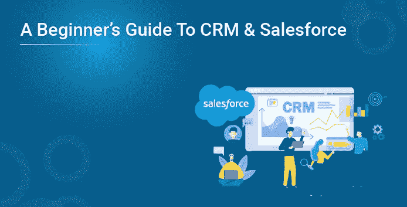

# CRM 和 Salesforce 初学者指南

> 原文：<https://medium.com/edureka/a-beginners-guide-to-crm-salesforce-4127bbe43abf?source=collection_archive---------3----------------------->

没有好的 CRM(客户关系管理)营销算什么？事实上，一些管理大师可能会认为 CRM 是市场营销及其所有相关活动的基础。CRM 处理管理与客户的关系——当前的和潜在的。

每当销售主管或经理与客户面对面、通过电话甚至在线交流时，都会获得有价值的见解。这些见解通常隐藏在电子邮件、个人文件甚至员工的头脑中。CRM 处理如何将这些信息片段转化为关于客户群的有价值的知识。

在为你的公司进行客户关系管理练习之前，制定一个客户关系管理策略是必要的。如果你开始的时候没有考虑到结果，你可能会在前进的道路上迷失，而不能完成你想要达到的目标。这就是为什么，设定明确的目标，定义衡量成功的标准，写下实现目标的计划，并概述风险缓解战略是 CRM 战略的关键组成部分。

适应现代知情客户的要求是这个时代任何企业的基本先决条件。归结起来就是一家公司如何让他们的客户成为他们存在的中心，并围绕他们制定策略。选择正确的 CRM 软件可以为您提供巨大的项目管理帮助，这可能是成功的正确秘诀。你将不得不进行一次诊断练习，以了解你在链条中缺少了哪个环节，然后做出相应的选择。

Salesforce 是一款 CRM 软件，可以实现上述功能以及更多功能。这款软件简化了从产生销售线索到达成交易的整个过程。让我们尝试理解这个过程的主要步骤:

## #1 将销售线索输入 Salesforce

这是识别销售线索的阶段。营销人员做广告、参加交易会、通过各种平台从事在线营销，以及执行许多其他营销活动。所有这些都是为了获得可以转化为销售线索的联系。销售线索是一种不合格的销售前景，表现出对营销人员提供的产品或服务的兴趣，并提供他/她的联系信息，以便日后联系。

在 Salesforce 上，您可以输入关于各种潜在客户、其来源以及通过它们可能存在的机会的信息。一家公司如何创建数据视图、将销售线索分配给不同的员工以及从源调查或表格中获取信息，都取决于他们。

## #2 销售线索的资格

第二阶段是销售线索的资格认定。当决定追踪销售线索时，该线索将成为联系人。此时，系统创建三个对象:一个帐户、一个联系人和一个机会。

联系人是一个存储特定个人的所有相关数据的字段，包括他/她的职务、联系方式、地址、在销售过程中的角色等。

为了将潜在客户转换为联系人，Salesforce 提供了“转换”选项。将潜在客户链接到现有客户名称，或根据需要添加新的客户名称。有一个用于描述现有“机会”的默认字段。任何后续任务也可以列出来，这减少了人的依赖性。您还可以添加与您的内部流程相关的任务。

## #3 创建账户

在 Salesforce 中，客户代表一个实体，可以是当前或潜在的客户、供应商、合作伙伴，甚至可能是竞争对手。您与某个实体的所有沟通——无论是过去达成的交易记录、决策者的详细联系信息，甚至是当前交易的进展——都会记录在系统中该实体的账户下。这是一个一站式商店，可以知道与某个特定实体交换了什么。

## #4 分配销售线索

每次转换新的销售线索时，您可能会有一个内部工作流程，例如向团队发送电子邮件或将销售线索分配给销售团队中的特定成员。销售线索的分配可以根据您设计的某些参数进行。如果您想覆盖系统中记录的内容，也可以手动输入。还可能有一个事件导致需要转移销售线索的所有权，从而需要重新分配。所有这些以及更多在 Salesforce 中都是可能的。

## #5 创造机会

Salesforce 中的 opportunities 部分捕获与销售、尚未完成的交易、谈判细节、预计完成日期等相关的数据。还需要提及您向潜在客户提供的产品和报价的详细信息。

机会领域是销售流程的核心，为公司赢得越来越多的销售。如果系统的这一部分及时更新精确的数据，它还可以提供对销售渠道的洞察。有关机会所有人、机会名称、指示性金额、预期结束日期、交易周期阶段和赢得交易概率的详细信息是构成此对象字段的一部分。

在销售过程的不同阶段，您会以不同的方式与客户互动，无论是在线、电话还是向他们发送特定的宣传材料和文档。这些被称为系统中的活动，并被记录为呼叫/任务日志。

## #6 管道管理

合格的销售线索转化为机会，成为公司销售渠道的一部分。经理可以对交易进行分析，以了解到目前为止已经执行了哪些相关活动，识别约束条件(如果有)，并在需要时分配新的机会所有人。使用此功能，可以查看仪表板，其中包含交易完成所需时间、销售趋势、实现总体销售目标、表现优异和表现不佳的团队成员以及其他指标的报告。

Salesforce 支持预测，因为它允许您使用计划中的预算来衡量实际绩效。在任何时候，你也可以根据自己的判断来调整同事的预期绩效水平，从而了解整体情况。这使得确定需要立即改进的领域变得更加容易。此外，Salesforce 支持在销售团队成员之间划分目标。

## #7 管理和跟踪客户订单

客户可能会更改他们的订单，并且在不同的数据输入点维护的记录可能会造成信息差异。Salesforce 的这一功能有助于简化订单管理。使用此功能可以准确处理跨地理区域和定价结构的较大数量。

有效使用 Salesforce，及时将信息输入系统，优先处理关键组件，确实有助于提高整体销售额。Edureka 提供的“CRM Salesforce for 初学者”课程可以帮助您掌握 CRM 的主要概念及其对销售和业务的影响。特别关注云计算以及技术如何影响当今的客户参与。

随着产品和服务的整体交付以令人难以置信的价格和质量水平提供，市场营销人员几乎无法吸引那些现在选择过多的顾客。在一个与客户产品没有明显区别的市场中，可以通过与客户建立有价值的关系来赢得客户。CRM 就是这么重要。

如果你想查看更多关于人工智能、DevOps、道德黑客等市场最热门技术的文章，你可以参考 Edureka 的官方网站。

请留意本系列中解释 Salesforce 各个方面的其他文章。

> *1。* [*Salesforce 教程*](/edureka/salesforce-tutorial-5bac7659e0c5)
> 
> *2。* [*Salesforce 开发者教程*](/edureka/salesforce-developer-1051ba8ce733)
> 
> *3。* [*Salesforce 服务云*](/edureka/salesforce-service-cloud-b8b8dbdae9f9)
> 
> *4。* [*Salesforce 营销云*](/edureka/salesforce-marketing-cloud-d057c266d87f)

*原载于 2015 年 8 月 31 日 https://www.edureka.co**[*。*](https://www.edureka.co/blog/a-beginners-guide-to-crm-and-salesforce)*