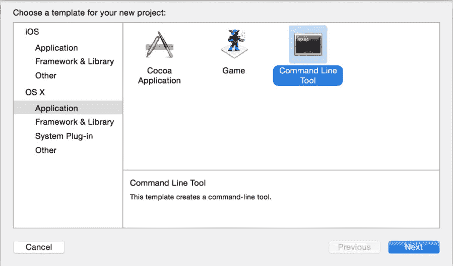

# Swift 脚本初学者指南

> 原文：<https://medium.com/capital-one-tech/a-beginners-guide-to-scripting-in-swift-aeda4dd3e67?source=collection_archive---------0----------------------->


自从苹果在 2014 年推出 Swift 以来，大多数程序员都专注于使用它来编写 iOS/Mac OS X 应用程序。这是我们许多人学习语言时的第一本能。事实上，这是斯威夫特第一次出柜那天我唯一的直觉。直到七个月后，我才意识到它比看起来更强大，而且用 Swift 编写脚本不仅是可能的，而且相当容易！

# 故事…

2015 年从 Swift 1.1 到 Swift 1.2 的迁移是一件大事。这次更新改变了语言的语法，在新的 Xcode 测试版中运行时，项目似乎出现了上千个错误。值得这么做的是 Swift 编译器的增强。特别是，我说的是每次开始构建时，将每个 Swift 文件*的*重新编译更改为增量编译的增强功能。**

当时，我正在进行一个大型的成熟项目，编译时间快让我们受不了了。我们看到平均 15 分钟的编译时间，即使唯一的变化是一个注释。相比之下，Swift 1.2 中的新 Swift 编译器平均每次编译时间为 1-3 分钟。


*Compiling Swift Source Files.*

长话短说，我们想使用测试版来开发(因为编译时间)，但如果我们用 Swift 1.2 编写代码，由于测试版的限制，我们不能发布到应用商店。解决方案是什么？嗯，我们决定同时编写 Swift 1.2 代码和 Swift 1.1 代码。它看起来像这样:

```
//====================Swift 1.2 Code===================="        
//let kraken = mythicalBeast as! Kraken        
//====================Old Swift Code====================" //       
let kraken = mythicalBeast as Kraken
//==========================End========================="
```

对于发布时间，我们需要编写一个脚本，为开发周期注释掉 Swift 1.2 代码并取消旧的 Swift 1.1 代码的注释(反之亦然)。当时，我唯一知道的脚本语言是 Python。在谷歌上快速搜索其他脚本语言给了我[这个](http://www.tutorialspoint.com/python/python_basic_syntax.htm)。

如果你注意一下那个页面上的内容，你会注意到它提到了一个交互模式，并在顶部创建了一个带有一行 [Shebang](https://en.wikipedia.org/wiki/Shebang_(Unix)) 的 Python 文件。这种交互模式启动了所谓的 Python REPL(读取-评估-打印-循环)。等等，那是什么？REPL 吗？

***斯威夫特有一个！！！***

事实证明，您可以使用 Swift REPL 来做同样的事情！所以让我们开始…

# 实际上在 SWIFT 中编写脚本

首先，我们需要一个易于编码的环境。创建一个 Swift 文件是一项简单的任务，但是当你写你的脚本时，记住你需要语法高亮、快速类查找、文档等等。您总是可以在终端中触摸 MyScript.swift，然后使用 Vim 从那里开始，但是，这个示例适合于不太精通编程的人。

所以让我们开始吧。首先，您需要从一个新的 Xcode OS X 命令行工具应用程序开始:



要明白重命名文件并不理想，但是 Xcode 在除了 *main.swift* 文件之外的任何其他文件中都不识别 Shebang。将它放在任何其他未命名为“ *main.swift* 的文件的顶部，会给出以下警告:


现在，当你的脚本准备好运行的时候，让我们把重命名你的 *main.swift* 文件留到最后。现在，在您的 *main.swift* 文件中，删除任何生成的代码和注释，并将这行代码添加到 swift 文件的第一行:

```
#!/usr/bin/swift
```

这一行实际上首先启动 Swift REPL，因此文件的其余部分实际上在 Swift 环境中编译。

下一步是使您的 *main.swift* 文件可执行。打开终端，导航到您的 *main.swift* 文件的目录，并执行以下命令:

```
$ chmod +x main.swift
```

从这里，回到 Xcode，开始工作。文件的其余部分可以像任何常规的 Swift 文件一样处理。这里最酷的部分是你甚至可以导入像 [Foundation](http://foundation.zurb.com/) 这样的框架。使用 Foundation 可以做的任何事情都可以放到脚本中——这包括文件 I/O、字符串操作等等。唯一需要记住的“问题”是，Swift 中的脚本遵循与 C 语言中的程序或 Xcode 游乐场中的项目相同的原则——任何函数、类或声明都需要高于它们的用法，如下所示:

```
#!/usr/bin/swift 

import Foundation 
class MythicalBeast { 
    func whatsMyName() { 
        println("I don't know what I am, but I'm the stuff of legends.") 
    } 
} 

class Kraken: MythicalBeast { 
    override func whatsMyName() { 
        println("I'm the Kraken, yo!") 
    } 
} 

//can't use the Kraken class until after the declaration 
let kraken = Kraken() kraken.whatsMyName()
```

一旦您准备好脚本，运行它就是一件简单的事情，导航到您的 Swift 脚本并在终端中执行它，如下所示:

```
$./main.swift 
I'm the Kraken, yo!
```

您的脚本甚至可以接受参数。只需在执行命令后添加您想要的任何内容，就像常规脚本一样添加您的参数:

```
$ ./main.swift firstArgument secondArgument thirdArgument
```

要在脚本中读取这些参数，您可以使用 Swift 标准库中的 enum 流程，如下所示:

```
dump(Process.arguments)
```

使用我们刚刚编写的终端命令，上面的代码将在新的行上将每个参数打印到终端，如下所示:

```
$ ./main.swift firstArgument secondArgument thirdArgument 
▿ 4 elements
    - [0]: ./main.swift   
    - [1]: firstArgument   
    - [2]: secondArgument   
    - [3]: thirdArgument
```

这就对了。这应该是你需要知道的一切。现在小心点-


*With great power comes great responsibility.*

注:如果你想看我的第一个 Swift 脚本的非更新版本，请查看[这个回购](https://github.com/hectormatos2011/SwiftOnePointTwoConverter)。那个回购包含我在这篇文章顶部的故事中写的脚本。

# 使用 SWIFTC 让事情变得更简单

我收到了一条来自 [@eneko](https://twitter.com/eneko) 的推文，说你也可以在终端中使用 Swift 编译器， *swiftc* (仅限于 Xcode 6.1 和 Yosemite)，将你的 Swift 文件编译成可执行的二进制文件。这跳过了 chmod +x 调用，直接使用我们熟悉和喜爱的工具:

```
$ swiftc main.swift -o kraken //The parameter after -o is the name you really want your script to be called other than "main".
```

使用 swiftc 的唯一问题是，根据您的环境，如果您试图将 Foundation 之类的框架导入到您的 Swift 脚本中，您可能需要在终端命令之前运行 *xcrun sdk macosx swiftc* :

```
$ xcrun -sdk macosx swiftc kraken.swift -o kraken
```

只有当您的控制台中出现如下所示的错误时，才需要这样做:

```
<unknown>:0: error: cannot load underlying module for 'CoreGraphics'
<unknown>:0: note: did you forget to set an SDK using -sdk or SDKROOT?
<unknown>:0: note: use "xcrun -sdk macosx swift" to select the default OS X SDK installed with Xcode
```

如果代码看起来很难看并且很难记住，您可以通过将这一行放入您的*中来为 xcrun 行起别名。bash_profile* :

```
alias swiftc='xcrun -sdk macosx swiftc'
```

保存您的。 *bash_profile* ，打开一个新的终端窗口，瞧！这个漂亮的命令现在应该可以正常工作了:

```
$ swiftc main.swift -o kraken
```

成功编译后，您应该能够像这样执行您的可执行二进制文件:

```
$ ./kraken
```

# 专业建议#1

使用该命令还可以让您一起编译多个 Swift 文件。如果您的 Swift 脚本变得有点太长，并且您想要在几个文件之间分割功能，您可能需要这个。只要在 *-o* 参数前加上你要一起编译的文件就应该设置好了！

```
$ swiftc one.swift two.swift three.swift -o combined.swift
```

# 专业建议#2

如果你想变得更有趣，并且如果你有 sudo 权限，将你的二进制文件移动到 */usr/bin* 文件夹会使你的脚本通用，并且可以在终端的任何目录中使用。它还消除了用*调用脚本的需要。/* 。你可以这样移动你的可执行文件:

```
$ sudo cp kraken /usr/bin
```

通过使该脚本的未来命令如下所示，这进一步简化了脚本的执行:

```
$ kraken firstArgument secondArgument etc
```

# 卡托——一个整洁的图书馆

我也鼓励你去看看[Cocoapods](https://github.com/neonichu/cato)的 Boris 的这颗大红宝石。这是一个使您的脚本版本化的好方法，它让您能够指定您的脚本是用哪个版本的 Swift 编写的，等等！

# 结论

脚本是一种强大的资产，是任何程序员工具箱中的有用工具。对于很多 iOS 开发者来说，Swift 或者 Objective-C 是他们唯一知道的语言。如果他们知道 Swift，那么在为任何自动化流程编写简单的脚本时，就没有必要学习 Python 或另一种脚本语言。这甚至包括持续集成。在自动部署应用程序时，我甚至和 Jenkins 一起使用过它。希望有了这个指南，你可以在自动化列车上走得更远。编码快乐！

***改编自最初出现在***[***krakendev . io***](http://krakendev.io/)上的一篇博文

要了解更多关于 Capital One 的 API、开源、社区活动和开发人员文化的信息，请访问我们的一站式开发人员门户网站 DevExchange。[](https://developer.capitalone.com/)