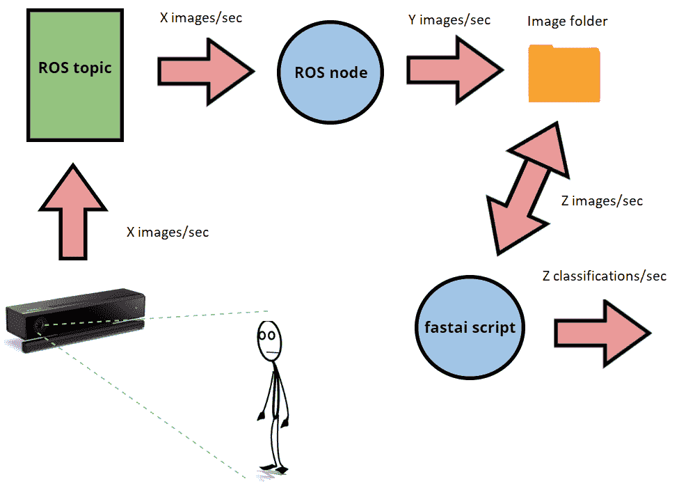
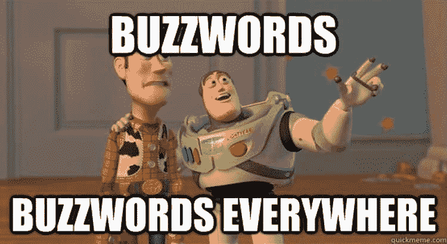
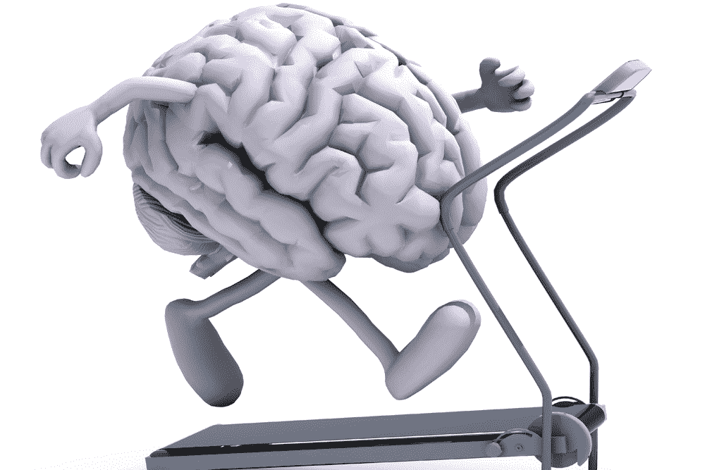
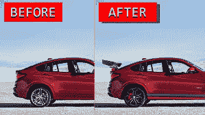

# 第一个计算机视觉项目的初学者故事

> 原文：<https://medium.com/compendium/a-beginners-tale-of-a-first-computer-vision-project-bf4180a18c1a?source=collection_archive---------1----------------------->

让机器人能够看见——第一部分

# 介绍

本文将是两部分系列的第一部分，描述一个结合了深度学习(DL)，更具体地说是计算机视觉和机器人操作系统(ROS)这一极其热门的现象的项目。这种结合产生了模型训练和来自相机流的物体分类的流水线，如下图所示。这第一篇文章将描述模型训练部分，更具体地说是在图像中的“fast.ai”脚本人物中使用的模型的训练。第二部分将描述系统的 ROS 部分，更具体地说是它的发布/订阅特性的初始化，以及映像中其余的设置。



Highly sophisticated drawing of the components used in the project, and how they interact.

该项目的文档可以在 GitHub 上找到。查看自述文件，了解如何复制该模型培训。此外，本文将使用代码和输出的图片。任何愿意的人都可以克隆这个库，并亲自试用。需要注意的是，“fast.ai”模块是一个[子模块](https://git-scm.com/book/en/v2/Git-Tools-Submodules)——需要自己更新。



[Make a Meme](https://makeameme.org/meme/buzzwords-buzzwords-everywhere-5af7a9)

至于任何关于 DL 的文章，我们将不得不使用一些技术术语。这些将不详细解释，并且将努力使这一数量最小化，因为目的是给出项目和所使用的技术的简要和简单的概述。但是，我们为感兴趣的读者提供了链接。

这个项目和来自硅谷的[【非热狗】](https://hub.packtpub.com/the-software-behind-silicon-valley-emmy-nominated-not-hotdog-app/)的“艾美奖”提名软件有很多相似之处(除了这个模型可以分类多个标签，而不仅仅是二进制)，客观上很酷。另一个类似的项目，作为灵感，可以在这里找到。

# 数据集

那么，训练这样一个模型从哪里开始呢？首先要做的是定义一个数据集，包含图像及其各自的标签，描述图像的正确分类，使用所谓的监督学习。有几种方法可以定义这样的数据集；你可以手动下载相关的图片，并把它们放在一个以图片标签命名的文件夹中，或者你可以找到/制作一个脚本来完成这项工作。后一种选择工作量更少，更有趣，也更具可伸缩性。下面是一个这样的[脚本](https://github.com/hardikvasa/google-images-download)被实现的例子，它指定了 data/‘label _ name’的文件夹结构。

```
def download_images(searchword, form="jpg", lim=100, directory= "data"):
    if not os.path.isdir(directory):
        ! mkdir $directory
    ! googleimagesdownload --keywords $searchword --format $form --limit $lim --output_directory $directory 
    src_path = os.path.join(directory, searchword)
    if not os.path.isdir(src_path):
        ! mkdir $src_path
```

完整的方法请参见前面提到的 GitHub 项目，该项目也将集合分为[训练和验证集合](https://stats.stackexchange.com/questions/19048/what-is-the-difference-between-test-set-and-validation-set)，比例分别为 70/30。

今天的 DL 模型能够用小数据集获得相当好的结果，在这种情况下，大约 600 幅图像用于训练集，200 幅图像用于验证集。然而，我们使用了[迁移学习](https://searchcio.techtarget.com/definition/transfer-learning)，显著提高了结果，同时也减少了培训时间。此外，所使用的 DL 框架 [fast.ai](http://www.fast.ai/) 提供了一种内置的数据增强方法，它基本上可以改变图像的方向，水平、垂直翻转等。，同时保持内容不变。这导致数据集增加了大约 4 倍(在运行时)。

# 路径和数据清理

前面提到的 DL 框架 fast.ai 就是建立在 [PyTorch](https://pytorch.org/) 之上的框架。它实现了训练和验证集的相同默认路径，更具体地说是“数据/训练”和“数据/验证”，这就是为什么“图像下载”单元也将此作为默认路径，同时在*训练*和*验证*文件夹中为每个搜索字符串创建一个文件夹。通过遵循这些规则，可以很容易地告诉图像分类器对象在哪里寻找数据。


[How Much is Dirty Data Costing You?](https://www.business2community.com/marketing/much-dirty-data-costing-01241847)

很多情感类的电影，广告等。提出问题*“如果你可以告诉年轻时的自己任何事情，你会说什么？*“经过大约六个月的 DL 实践，可以有把握地说，许多人与 DL 相关联的部分，即模型的训练，确实是容易的部分，而困难的部分是首先获得数据，然后验证和清理数据。

对于这个项目，这表现为下载的图像不是 JPEG 图像——这很奇怪，因为下载时需要指定图像的文件类型。当然有很多方法可以转换成 jpeg 格式，但是由于时间的原因，一个简单的解决方法是删除所有不相关类型的数据，也就是任何扩展名不是. JPEG 的数据。

```
for path in file_paths:
    for files in os.listdir(path):
        file_path = os.path.join(path, files)
        if imghdr.what(file_path != 'jpeg':
            os.remove(file_path);
```

# 培养



[“Brain-training” Games Ineffective for ADHD](https://adhdrollercoaster.org/tools-and-strategies/brain-training-games-deemed-ineffective/)

既然数据集已经被定义、分离和清理，那么实际的模型训练就可以开始了。使用 fast.ai 框架使这变得非常容易:只需要 4 行代码:

```
tfms = tfms_from_model(arch, sz, aug_tfms=augmentation, max_zoom=1.1)
data = ImageClassifierData.from_paths(PATH, tfms=tfms, bs=bs, num_workers=1)
learn = ConvLearner.pretrained(arch, data, ps=0.4)
learn.fit(1e-3, 1)
```

解释这些参数的功能需要一整篇[新文章](https://becominghuman.ai/3-lines-of-code-deciphering-fast-ai-658e79151af8)，然而，在高层次上，它是这样做的:

1.  定义一个 transforms 对象，如前所述，它会在运行时增加数据集
2.  定义一个图像分类器对象，它保存数据集并应用数据转换
3.  定义一个学习对象，如前所述，它使用迁移学习
4.  通过模型运行数据，即训练模型。

就这样——完成，终结，完成！模型现在已经训练好了，可以使用了。然而，如果你想接近这个框架和模型的潜力，下一步就是超参数调整和更多的训练。

# 超参数调整(和更多培训)



[Car Photo Tuning — Professional Virtual Tuning 2.2 APK](https://apk-dl.com/car-photo-tuning-professional-virtual-tuning/com.Andrey.Pimpmyride)

有相当多的可能的超参数需要优化，但是对于本文来说，焦点主要集中在[学习率](https://techburst.io/improving-the-way-we-work-with-learning-rate-5e99554f163b)和[辍学率](/@amarbudhiraja/https-medium-com-amarbudhiraja-learning-less-to-learn-better-dropout-in-deep-machine-learning-74334da4bfc5)上。批次和图像大小也进行了调整，但是，这主要是因为 Cuda-内存不足错误(最大 GPU 内存)。

为了找到最佳学习率，fast.ai 框架提供了一个巧妙的技巧:

```
learn.lr_find()
learn.sched.plot()
```

它基本上描绘了不同的学习速度和它们导致的损失之间的关系。这里需要注意的一点是，对于像这个项目这样的有限数据集来说，这变得很棘手——学习率查找器绘制了一条非常不稳定的曲线。然而，一般的经验法则是*1e–2*是一个很好的起点，然后人们可以尝试用不同的值来训练模型，但是使用前面提到的值作为参考点。

此外，当在 fast.ai 中使用预训练模型时，它将冻结网络中三分之二的层，这实质上意味着它们在训练期间不会更新。人们可以解冻这些，以便将模型专门化到自己的数据集，并可能获得更好的学习率曲线。

```
learn.unfreeze()
```

这也可能导致过度拟合，本质上是*训练损失* < *验证损失*，这就是辍学的原因。经验法则:当一个模型过度拟合时，增加辍学率，甚至尝试差分辍学(与[差分学习率](https://towardsdatascience.com/transfer-learning-using-differential-learning-rates-638455797f00)原理相同)。

最后，保存模型，以便可用于简介中图像的 fast.ai 脚本:

```
learn.save("Resnet34_multiclass")
```

# 结论

来自 MultiClassClassification 的第一个模型 Resnet34 获得了大约 82.7%的准确度(在大约 1000 张图像上)。标签)。这是一个公平的结果，考虑到数据(你试过在谷歌图片上转到第 20 页以上吗？)、数据量以及超参数调整是手动完成的事实。在一个完美的世界中，每个类将有超过 10k 个图像，而不必删除它们中的任何一个并通过网格搜索或随机搜索来调整超参数。

也就是说，为了让机器人“能够看见”，82.7%是一个令人满意的数字，这也是第二部分将重点关注的内容——使用训练和保存的模型对网络摄像头传输的图像进行分类。