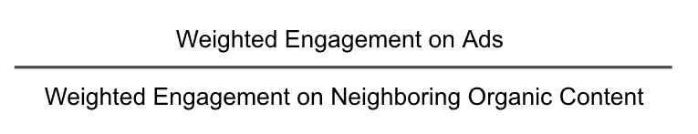
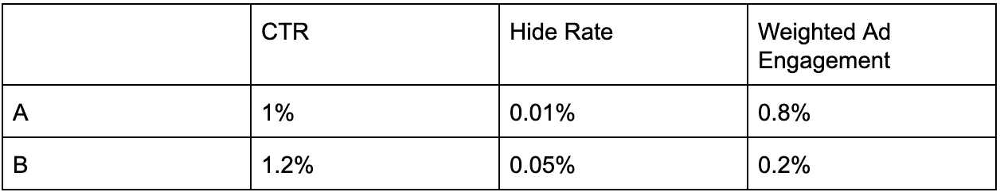
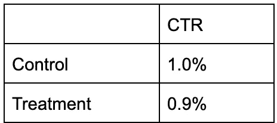
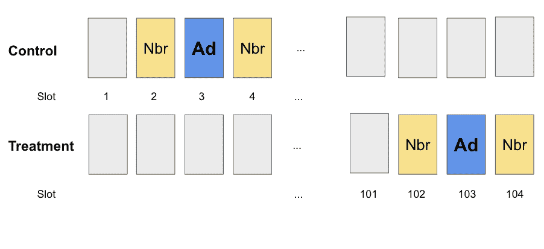
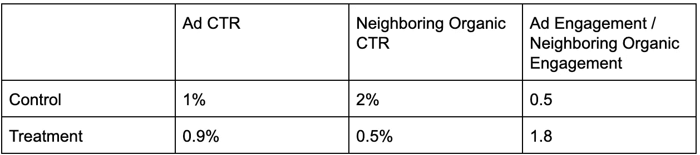
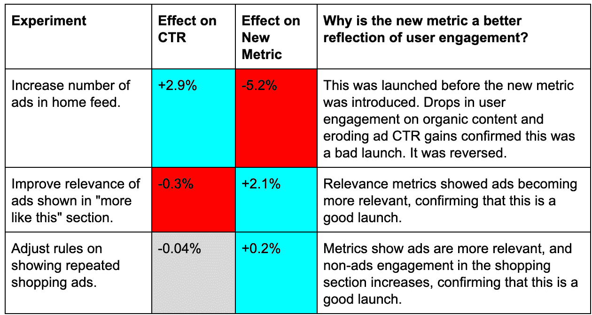

# 更好的点击率:Pinterest 如何升级每个人最喜欢的参与度指标

> 原文：<https://medium.com/pinterest-engineering/a-better-clickthrough-rate-how-pinterest-upgraded-everyones-favorite-engagement-metric-27f6fa6cba14?source=collection_archive---------0----------------------->

菲利普应用|广告质量数据科学家

点击率受制于对点击诱饵的优化，忽略了其他信号和位置偏差。更好的衡量标准有利于看到广告的 Pinners 和创建广告的广告商。

# 介绍

## "简单的调整可以让 CTR 变得更加有用."

我们如何衡量在线平台的用户参与度？点击率(CTR)是每个人想到的第一个指标，但它有一些严重的缺点。许多公司已经做了调整，使这一指标更加有用——我们将讨论我们在 Pinterest 做了什么。

这篇文章将是一系列检查用户、广告商和公司指标的第一篇，这是在线平台需要满足的三个利益相关者。我们将重点关注 Pinterest 的广告市场，但这些原则也可以应用于许多其他在线设置。

# 我们为什么要在意用户的想法？

## “如果产品不适合人们，它们就不适合我们。”

我们可以通过人们如何与网站互动来衡量用户参与度，例如通过点击。但在深入探讨之前，让我们先回答一个更基本的问题——我们为什么要在乎用户的想法？为什么不建立我们的系统来尽可能多的赚钱呢？

在 Pinterest 的例子中，“把 Pinners 放在第一位”是一个核心价值观。如果产品对 Pinners 不起作用，对我们也不起作用。

此外，你可以在不关心用户参与度的情况下获得最大的短期收益(许多不太知名的网站都是这样！)但是，正如林肯(也许)所说，“你不可能一直愚弄所有的人”。因此，任何严肃的在线平台都需要人们回来长期使用它，并致力于确保用户有良好的体验。这意味着我们需要一个指标来跟踪用户参与度。

但是什么标准呢？如何才能聚合 4 亿月活跃 Pinterest 用户的偏好，并在每年数千次 A/B 测试中看到他们的变化？

# CTR 简介

## “如果人们点击了某样东西，那么他们一定喜欢它，对吗？”

想象一下，你必须衡量一个在线平台的用户参与度，比如一个拥有搜索引擎和付费广告的电子商务商店。你的第一个尝试可能是点击率(CTR)——一个广告的点击率除以它被观看的次数。毕竟，如果人们点击了某个东西，那么他们一定会喜欢它，对吗？

这有许多优点:

*   CTR 数据很容易获得，因此这将很容易计算、跟踪和分析。
*   CTR 是业内广为人知和广泛使用的指标，因此很容易在内部被接受
*   另外，很多广告商也希望有高点击率。所以你已经把你的广告商和用户的利益结合起来了！

所以，只要把大量先进的机器学习扔向问题，预测并最大化 CTR，就大功告成了，对吧？没那么快！

# CTR 的问题是

## “点击率不是用户参与度的关键。”

有一个关于一个醉汉的笑话，他把钥匙掉在了黑暗的人行道上，然后走到街灯旁去找钥匙，因为那里的光线更好。类似地，CTR 揭示了很多事情，但它不是用户参与的关键。

以下是 CTR 的四大问题——第二个会让你大吃一惊！

## 问题# 1:位置偏差

页面上方的广告更容易被点击，但这并不意味着用户觉得它们更有用。这不是在线互动所独有的；研究表明，人们更有可能投票给选票顶端的候选人，所以顺序通常是随机的。如果你不考虑这一点，那么你可能最终会认为用户更喜欢页面顶部的广告，而实际上他们更倾向于关注它们。

## 问题 2:关注点击率会导致点击诱饵

点击率高的项目可能是“点击诱饵”——它们鼓励用户点击，但不能给他们任何有用的东西，而是将他们引向加载广告的幻灯片，这些幻灯片为广告商赚钱，但只会惹恼用户。

## 问题# 3: CTR 忽略其他信号

## “每个平台都应该有表达不喜欢的方式。”

除了点击之外，用户还可以通过多种方式参与 Pinterest 上的内容。他们可以将内容保存到他们的某个板上，以备将来灵感之用，或者将其隐藏，以表明他们不想看到此类内容。这些事件比点击更罕见，但它们给出了用户对广告感兴趣或不喜欢的强烈信号。

事实上，每个平台都应该有一种方式来表达不喜欢，因为这是区分缺乏兴趣和主动烦恼的一个非常有用的信号。如果你的平台确实有表达不喜欢的方式，你必须密切关注它，这样用户才不会感到被忽视。

## 问题# 4:有些东西不应该被点击

在网络广告的早期，广告商只是想让用户点击他们的广告。随着基于搜索的点击付费广告的兴起，这一趋势得以延续。但今天的广告客户可能会使用不同的、点击量较少的形式，比如视频，或者对建立品牌知名度更感兴趣。我们可以使用的一些其他信号包括观看时间或转盘广告的侧滑。

看起来仅仅依靠 CTR 打开了一个蠕虫的罐子。我们如何解决这些问题？

# 超越 CTR

我们整合了这些问题，以创建一个新的指标，该指标结合了多个参与度(保存正面权重，隐藏负面权重)，并通过将其与附近有机(非广告)内容的参与度进行比较来说明位置偏差。

例如，位置较高的广告可能具有较高的参与度，但会占用具有类似高参与度的有机内容的空间，因此我们在指标中考虑了这一点。

## 定义用户指标

我们将用户指标定义为:

先说分子。

## 广告加权参与度

我们不是只看点击率，而是看广告上不同行为的加权平均值——点击、隐藏、保存等等。

举个简单的虚构例子，假设我们用= CTR-20 *隐藏率来衡量广告的用户参与度。

这里，隐藏率乘以一个大的负数:“负”是因为隐藏代表用户不满意，“大”是因为这是强烈的不满意。

考虑两个广告:B 比 A 被点击得更频繁，但是它被更多的人隐藏了。

如果我们只看点击率，那么我们可能会认为 B 比 A 更好。但一旦我们考虑到隐藏，我们的指标就整体用户参与度而言，A 更好。

如果我们仔细选择动作和权重，我们可以用 CTR 解决问题 2、3 和 4。作为第一步，我们可以结合行动的频率，对行动的重要性进行商业判断。通过更复杂的分析，我们可以调查行动对长期收入和用户保留的因果影响。

这仍然让我们担心 1:位置偏差。我们将通过一个简单的例子来说明如何解决这个问题。

## 寻址位置偏差

为了简单起见，假设我们只是用点击率来衡量用户参与度。

假设我们用控制组和治疗组进行 A/B 实验，我们得到下面的 CTR。哪个对用户参与度更好(假设差异有统计学意义)？

只有这些信息，看起来控制组更好。

但是现在假设我告诉你，在对照组，广告只出现在第一页，而在治疗组，广告只出现在第十页或更后面。

让我们假设当用户浏览 Pinterest 时，点击率会下降到广告和有机内容。然后，治疗组开始变得更好——它的 CTR 只比对照组低一点点，而我们预期它会低很多。

我们如何形式化这一点？

我们将广告的平均参与度与广告前后的有机内容进行了比较。这就是分母发挥作用的地方。

如果对照组和治疗组的广告通常是这样提供的:

Placement of ads in Control and Treatment

那么我们可能会得到这样的结果:

因此，根据有机参与度进行调整后，治疗组的整体用户参与度现在看起来比对照组好得多，因为我们没有减少太多的有机参与度。这种广告与有机内容的比较减少了 CTR 的位置偏差。还要注意，我们实际上不需要对位置偏差的形状做任何假设——即使没有影响，这种方法仍然有效。

# 从理论到实践的大规模学习

## “我们保持了一个对点击率不利但对用户有利的发布。”

这是很多额外的机器。值得吗？

是啊！尤其是当我们的指标给 CTR 不同的结果时。下面是一些指标不一致的例子，我们的新指标更好地反映了用户参与度。(蓝色为有统计学意义的阳性，红色为有统计学意义的阴性，灰色为中性。)

因此，这个新的指标肯定是有用的，但值得注意的是，参与度不能告诉你用户体验的一切。广告相关性、平台内调查和用户访谈也可以发挥作用。

# 摘要

我们已经展示了如何开发一个比 CTR 更好的用户参与度指标，我们一直在寻找有才华的人来更进一步。如果你点击了这篇文章，那么[点击进入我们的职业页面](https://www.pinterestcareers.com/homepage):)

# 感谢

感谢许多同事在撰写本文和开发指标方面的帮助，包括约书亚·切里、帕梅拉·克莱文格、艾丹·克鲁克、阿西姆·达塔、布莱恩·卡芬克尔、凯丽·奥托博尼、奥兹贝、亚历山大林·波佩斯库和罗洛夫·范·兹沃尔。非常感谢您的贡献！