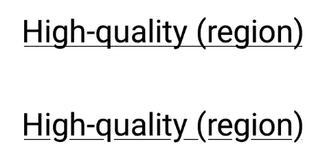
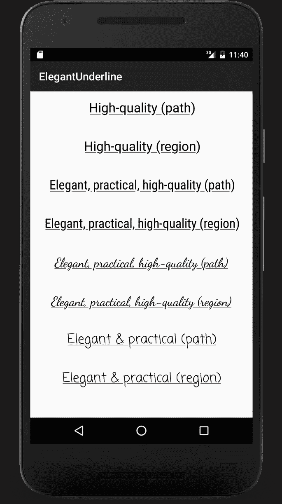
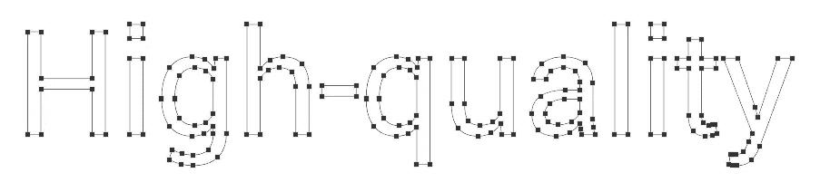
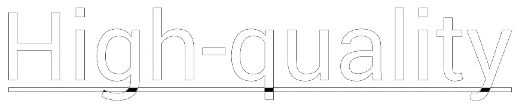
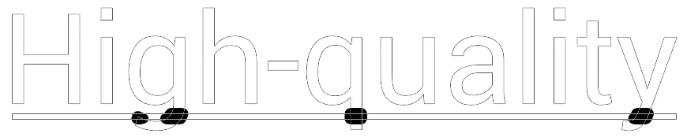
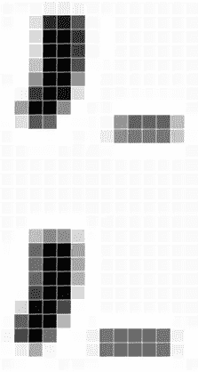

# 更好的 Android 下划线

> 原文：<https://medium.com/androiddevelopers/a-better-underline-for-android-90ba3a2e4fb?source=collection_archive---------3----------------------->

在过去的两年里，我经常看到试图改善下划线文本装饰在网页上呈现方式的文章和 T2 图书馆。同样的问题也存在于 Android 上:下划线文本装饰跨越了下行线。比较 Android 如何绘制下划线文本(上图)和如何绘制下划线文本(下图):



Which do you prefer?

虽然我完全赞同这些努力，但我从来没有喜欢过公开的解决方案。目前的技术水平——不可否认是 CSS 的局限性迫使开发人员——似乎依赖于绘制线性渐变和多重阴影(我见过多达 12 个！).这些解决方案具有不可否认的工作质量，但绘制如此多的阴影，甚至没有模糊它们的想法，让我的图形程序员畏缩。他们也只能在纯色背景下工作。

今天下午，我突发奇想，着手寻找其他解决方案，以满足以下要求:

*   在旧版本的 Android 上工作
*   仅使用标准视图和画布 API
*   不需要过度绘制或昂贵的阴影
*   在任何背景下工作，不仅仅是纯色
*   不要依赖渲染管道中的操作顺序(下划线前/后绘制的文本无关紧要)

我确实有两个解决方案，并且我已经在 GitHub 上发布了[。一种解决方案适用于](https://github.com/romainguy/elegant-underline) [API 等级 19](https://www.android.com/versions/kit-kat-4-4/) 及以上，另一种适用于 [API 等级 1](http://arstechnica.com/gadgets/2014/06/building-android-a-40000-word-history-of-googles-mobile-os/6/) 及以上。或者至少它*应该*在 API 级别 1 和以上工作，我还没有完全尝试过。我相信文件。

在下面的截图中，您可以观察和比较这两种方法，称为*路径*和*区域*:



Two possible implementations for better underline text decorations on Android

# 它是如何工作的？

这些实现背后的思想与前面提到的 CSS 方法惊人地相似。我们有一条由一条直线代表的下划线，我们需要做的就是为下行线腾出空间…

## 使用路径

API level 19(更好地称为 KitKat)引入了一个奇妙的新 API，用于路径操作调用[路径操作](https://developer.android.com/reference/android/graphics/Path.html#op(android.graphics.Path, android.graphics.Path.Op))。这个 API 允许你建立两条路径的交集或者从另一条路径中减去一条路径。

使用这个 API，制作下划线变得很简单。第一步是[得到我们文本的大纲](https://developer.android.com/reference/android/graphics/Paint.html#getTextPath(java.lang.String, int, int, float, float, android.graphics.Path)):

```
mPaint.getTextPath(mText, 0, mText.length(), 0.0f, 0.0f, mOutline);
```

请注意，生成的路径可用于使用填充样式呈现原始文本。相反，我们将把它用于进一步的操作。



Text outline

下一步是用代表下划线的矩形裁剪轮廓。这一步不是完全必要的，但是可以避免在下一步中可能出现的假象和其他近似。为此，我们只需使用相交路径操作:

```
mOutline.op(mUnderline, Path.Op.INTERSECT);
```

轮廓路径现在只包含穿过下划线的下行位:



Only the black regions are part of the path, the rest is drawn for visualization purpose only

剩下要做的就是从下划线中减去下行位。在这样做之前，我们必须扩大原始文本的大小，以便在下行线和下划线之间创建间隙。这可以通过描边我们裁剪的轮廓并创建一个新的填充路径来实现:

```
mStroke.setStyle(Paint.Style.FILL_AND_STROKE);        mStroke.setStrokeWidth(UNDERLINE_CLEAR_GAP);
mStroke.getFillPath(mOutline, strokedOutline);
```

笔画宽度决定了下行线和下划线之间的间距。



Stroking the clipped outline

最后一步是使用另一个路径操作，从下划线矩形中减去描边、剪切的轮廓:

```
mUnderline.op(strokedOutline, Path.Op.DIFFERENCE);
```

最终的下划线路径可以使用填充颜料绘制:

```
canvas.drawPath(mUnderline, mPaint);
```

## 使用区域

[区域](https://developer.android.com/reference/android/graphics/Region.html)是表示屏幕非矩形区域的有效方式。您可以将区域想象为与渲染缓冲区的像素边界对齐的矩形集合。区域可以用作路径的*栅格化*表示。这意味着，如果我们将一个路径转换成一个区域，我们将获得像素坐标的集合，如果绘制路径，这些坐标将受到路径的影响。

让区域特别有趣的是，它们[提供了类似于路径操作](https://developer.android.com/reference/android/graphics/Region.html#op(android.graphics.Region, android.graphics.Region.Op))的操作。两个区域可以相交、相减等。更重要的是，从第一个版本开始，区域就是 Android API 的一部分。

区域实现几乎与路径实现完全相同。主要区别在于何时以及如何裁剪轮廓路径。

```
Region underlineRegion = new Region(underlineRect);// Create a region for the text outline and clip
// it with the underline
Region outlineRegion = new Region();
outlineRegion.setPath(mOutline, underlineRegion);// Extract the resulting region's path, we now have a clipped
// copy of the text outline
mOutline.rewind();
outlineRegion.getBoundaryPath(mOutline);// Stroke the clipped text and get the result as a fill path
mStroke.getFillPath(mOutline, strokedOutline);// Create a region from the clipped stroked outline
outlineRegion = new Region();
outlineRegion.setPath(strokedOutline, new Region(mBounds));// Subtracts the clipped, stroked outline region from the underline
underlineRegion.op(outlineRegion, Region.Op.DIFFERENCE);// Create a path from the underline region
underlineRegion.getBoundaryPath(mUnderline);
```

## 两种方法之间的差异

由于路径和区域的性质，这两种实现之间存在细微的差异。因为路径操作只对曲线起作用，所以当我们从下划线中减去下行线时，它们保持下行线的倾斜度。这会产生平行于曲线坡度的间隙。这可能是也可能不是想要的效果。

另一方面，区域在整个像素上操作，并且将通过下划线创建干净的垂直切割(只要你的下划线足够细)。下面是两种实现之间的比较:



Top: paths. Bottom: regions. Notice the slant? If not, you should. Look harder.

# 我应该在生产中使用这个吗？

在您尝试在您的应用程序中使用这些技术之前，请注意我目前还没有进行任何性能测量。请记住，这个练习主要是一个有趣的编程挑战。所提供的代码并不试图根据字体大小来正确定位下划线文本修饰。它也不会根据字体大小改变间隙的宽度。也可能存在字体相关的问题，因为我只在 Android 的一些默认字体上尝试过这种效果。让我们称这些问题为留给读者的练习。

如果您尝试在您的应用程序中使用这些代码，我必须承认我很乐意看到 [spans](http://flavienlaurent.com/blog/2014/01/31/spans/) 的实现，我会鼓励您至少缓存最终的填充路径。由于缓存只依赖于字体、字体大小和字符串，所以实现起来应该很简单。

此外，本文中描述的两个实现受到公共 SDK APIs 的限制，这是可以理解的。如果将这种效果直接实现到 Android 框架中，我对如何更有效地实现这种效果有一些想法。

例如，*区域*变体可以通过渲染区域本身来优化，而无需返回到*路径*(这会导致软件光栅化和 GPU 纹理更新)。区域在内部被表示为矩形的集合，并且对于渲染管道来说，绘制一系列线或矩形而不是光栅化路径是微不足道的。

你想知道更多关于 Android 上的文本吗？了解 Android 的硬件加速字体渲染器如何工作。

在 GitHub 上获取演示的[源。](https://github.com/romainguy/elegant-underline)