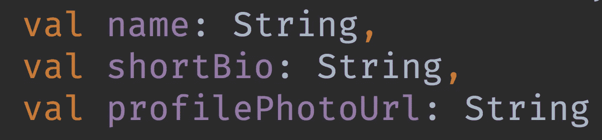
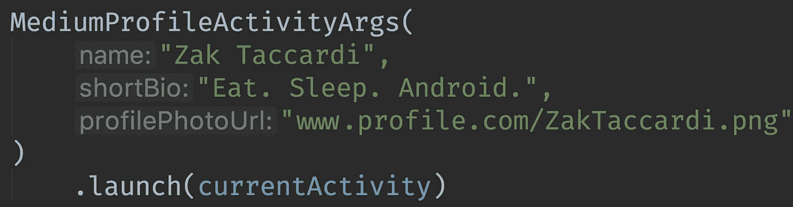
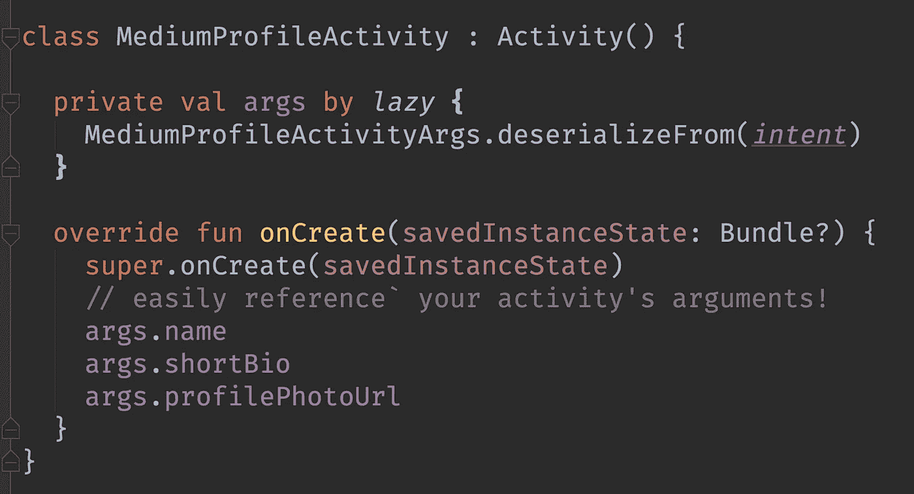
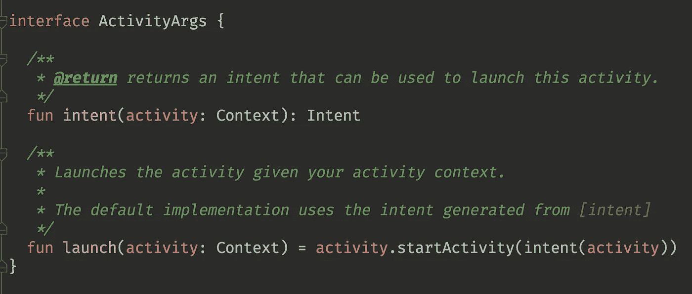
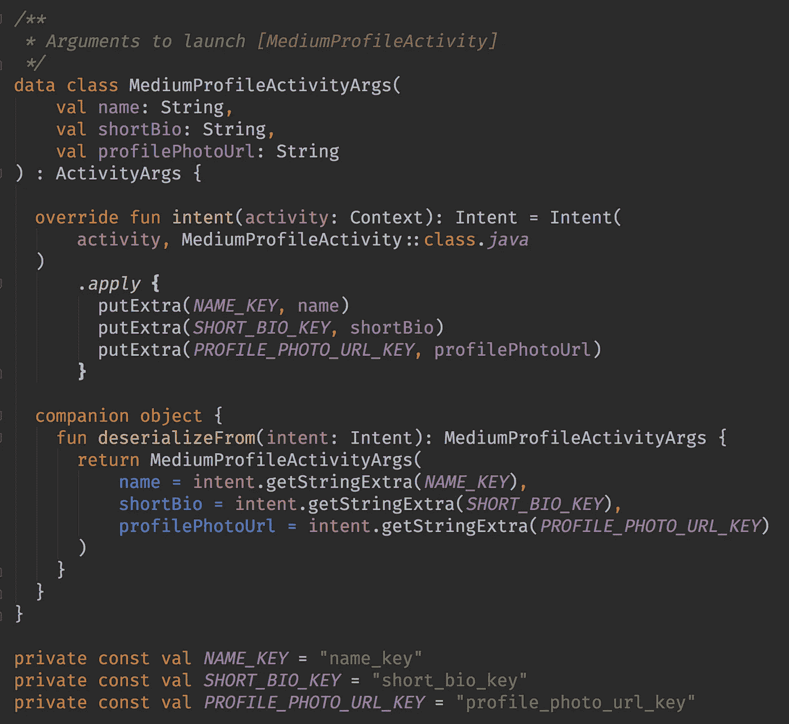
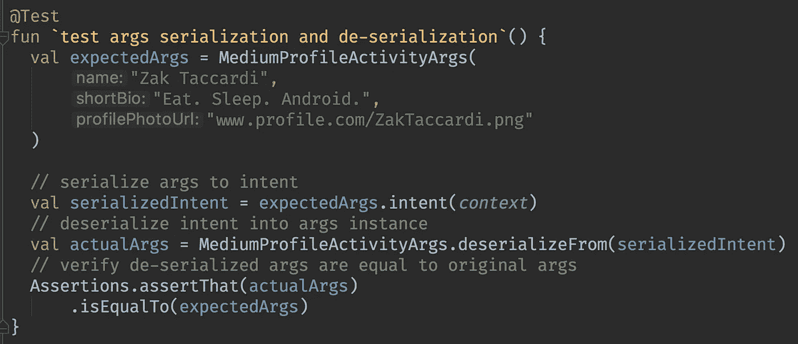

# 在 Android 上开展活动的更好方式

> 原文：<https://medium.com/capital-one-tech/a-better-way-to-launch-activities-on-android-8a1045181b16?source=collection_archive---------0----------------------->

## 单一责任+科特林！

用`Intent`参数启动`Activity`对开发者来说不是一种友好的体验。主要的难点是:

*   论点连载:`intent.putExtra(key, value)`
*   参数反序列化:`intent.getStringExtra(key)`
*   类型安全性、可维护性和测试

如果有更好的方法呢？像 Android 框架的许多问题一样，我们可以通过结合**单一责任**和依赖注入来解决这个问题。给定下面的场景，让我们创建一个理想的 API 来说明。

## 方案

构建一个 API 来启动一个显示以下信息的`MediumProfileActivity`:

呈现上面的用户界面需要三条信息:

## 创建 API

现在，让我们想象一个理想的、开发人员友好的 API 来序列化我们的参数并启动一个`MediumProfileActivity`。它可能看起来像这样:

Serializing activity arguments and launching them

在一个`MediumProfileActivity`中，我们将需要反序列化我们的参数以便以后访问它们。

deserializing arguments from intent, and accessing them within our Activity

注意没有杂乱的`intent.putExtra(key, value)`或`intent.getStringExtra(key)`代码污染。Kotlin 的`lazy`委托让这变得更加清晰。

我们将使用一个`ActivityArgs`接口为我们所有的实现提供通用的功能。

这使我们能够直接将`.launch()`转换成`Activity`，或者使用`args.intent()`来传递那个`Activity`的意图。

灵活！

Interface to give common functionality to all our implementations.

接下来，我们必须在一个`MediumProfileActivityArgs`中实现`ActivityArgs`。这将需要一个序列化策略(`intent.putExtra()`)和一个反序列化策略(`intent.getExtra()`)。

Kotlin data class that owns argument serialization and deserialization

嘣！我们有一个易于维护的解决方案——有一个类处理`MediumProfileActivity`的序列化和反序列化参数。

## 测试呢？

超级简单。四个步骤。

1.  创建您的`MediumProfileActivityArgs`实例。
2.  将实例序列化为一个`Intent`。
3.  反序列化那个`intent`。
4.  验证反序列化的`Args`是否等于原始的`Args`。

请参见下面的示例:

A kotlin data class allows easy assertions on equality

## 结论

我坚信以上是比传统的`YourActivity.launch(param1, param2)`方法更好的启动`Activity`的方法，传统的`YourActivity.launch(param1, param2)`方法有三个缺点:

1.  **无反序列化**。需要`onCreate()`中的额外代码来反序列化(`intent.getStringExtra()`)。
2.  **不灵活**。如果您想要一个`intent`实例呢？您需要添加一个重载方法— `YourActivity.intent(param1, param2)`。有了`ActivityArgs`，就叫`args.intent()`了。
3.  **更难测试**。您必须启动一个活动来测试反序列化

希望`ActivityArgs`提升你的开发体验！

*完整代码上*[*GitHub*](https://gist.github.com/ZakTaccardi/ca8bdbbc48d724f47d596072fb4b68d1)*。在推特上关注我！*[*@ zaktacardi*](https://twitter.com/ZakTaccardi) *在* [*reddit*](https://www.reddit.com/r/androiddev/comments/837dgg/a_better_way_to_launch_activities/) 上捕捉对话

***披露声明:以上观点为作者个人观点。除非本帖中另有说明，否则 Capital One 不属于所提及的任何公司，也不被其认可。使用或展示的所有商标和其他知识产权都是其各自所有者的所有权。本文为 2018 首都一。***