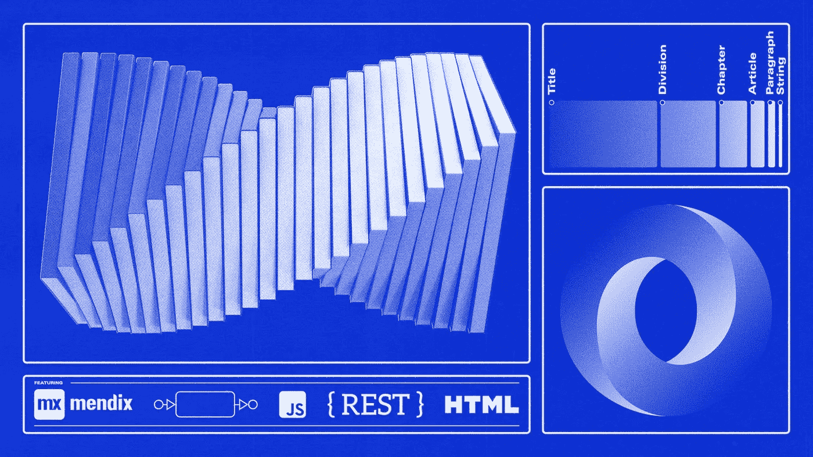
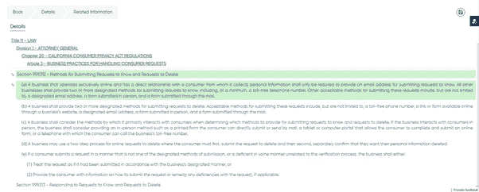

# 将 JavaScript 与 Mendix 相结合以增强您的应用程序

> 原文：<https://medium.com/mendix/a-blend-of-javascript-with-mendix-components-to-enhance-our-mendix-application-54dd97d2c048?source=collection_archive---------2----------------------->

## 一个 Mendix 开发人员的大脑会根据对象/实体来看待他们应用程序的所有主要组件，但是这总是正确的吗？有时，我们仅仅把应用程序的特性看作属性、关联或实体，难道不会使它们复杂化吗？



Blending JavaScript With Mendix to Enhance your App

## 有人可能会说，不把视觉组件也看作对象，我们不是偏离了 Mendix 的基本原则吗？

## 我最近有一个问题陈述，如果只使用我们的基本原理来解决，就不会像现在这样有效。我们的解决方案缓慢且过于复杂……直到我们从不同的角度看待问题。

# 一个有趣的问题陈述

首先，我们有一个书单，并要求在打开一本书时，读者应该看到词汇表和关于这本书的一些细节。读者还应该能够通过点击一个词汇表条目来浏览这本书，并能够根据这本书的内容做笔记。

这听起来很简单，但提出了一个复杂的问题。这些书来自一个以 HTML 格式交付的 API。问题很快变成了当用户点击某些元素时，我们如何在 HTML 字符串之间传递数据？

当我们试图用我们传统的 Mendix 方法(使用实体等)实现这个用例时。，在微流中)我们的第一个想法是“也许这是不可能的……”但后来我们做到了。然而，我们的解决方案过于复杂——从我们的页面设计到对性能的显著影响。通过使用传统的 Mendix 方法创建东西，我们创建了太多的微流程，页面设计变得复杂。

通过更多的头脑风暴，我们用一个可重用的插件解决了这个问题，这个插件是由 HTML 结构和 Mendix 客户端 API 驱动的 JavaScript、Nanoflows 和 JavaScript 动作**的组合创建的。**

# 我们是这样解决的

虽然我不能分享完整的代码，但我想从高层次上分析我们解决问题的方法。

1.我们从 Rest API 中获得了字符串形式的图书内容**，图书列表**作为 HTML 字符串**返回。**

2.然后，我们使用了 **HTML 片段小部件**(带有上下文)，来显示图书列表。当一本书(或术语表项目)被点击时，必须进一步调用来检索术语表的细节。

 [## HTML/JavaScript 代码片段

### 介绍 HTML/JavaScript 代码片段小部件的配置和用法，该小部件可在 Mendix…

docs.mendix.com](https://docs.mendix.com/appstore/widgets/html-javascript-snippet/) 

3.接下来，我们在 HTML 代码片段上启用了点击事件。该事件获取被点击的术语表项的元素细节，以及要突出显示的书籍章节。然而，一旦单击了术语表项，我们就必须通过 API 检索其余的数据。

4.因此，我们必须将元素细节传递给 REST API，以获取术语表的细节。在这一点上，事情可能听起来简单明了，但实际上并不那么容易。为了进行 REST 调用，我们需要调用一个微流——我们如何从字符串中完成呢？

5.点击事件再次拯救了我们。使用称为纳米流的点击事件。在 nanoflow **中，我们通过定制的 JavaScript 动作创建了一个 Mendix 对象。**Javascript 动作**使用了 Mendix 客户端 API** 函数 [**mx.data.create()**](https://apidocs.rnd.mendix.com/8/client/mx.data.html) 来创建我们的上下文实体。**然后** **通过传递之前创建的对象，我们还在函数**中执行了一个微流。

```
mx.data.action({params: {
apply to: “selection”,
action name: “Bookmark.MyMicroflow“,
guids: [obj.getGuid()],
}
```

6.接下来是书签和从页面内容中做笔记——从这里和那里的几个段落，组合在一起做你自己的笔记。同样，我们编写了**一个点击事件来启用书签**，这个事件突出显示了书的内容。为了将书签数据传递到用户的笔记中，**我们需要一个保存功能**。

7.为此，我们再次调用**一个 nanoflow，它反过来调用一个 JavaScript 动作**。在 JavaScript 动作中，**我们将书签数据转换成 JSON** **结构**。

8.现在，通过导入 JSON 结构，我们可以轻松地将书签保存到我们的笔记中。



## 跳出框框思考

我想说在 Mendix 没有什么是不可能创造的。你只是被自己的想象力所限制。

我们知道您可以将页面的可视组件视为实体本身。我们只需要超越可能的范围，并决定采用另一种方法与静态数据进行交互。我们最初的方法使事情变得复杂，混淆了设计。转向 JavaScript 使我们能够优化流程并交付相同的结果。

我很乐意听到更好的方法来实现这一点，请留下您对更好实现的建议的评论:)

## **阅读更多**

 [## JavaScript 操作

### 本参考指南详细介绍了 JavaScript 操作扩展 Mendix 应用功能的方式。

docs.mendix.com](https://docs.mendix.com/refguide/javascript-actions/)  [## 实现 JavaScript 操作的最佳实践

### 描述如何创建高质量的 JavaScript 动作，使用通用的实现模式，设计更好的 API，以及…

docs.mendix.com](https://docs.mendix.com/howto/extensibility/best-practices-javascript-actions/) 

*来自发布者-*

如果你喜欢这篇文章，你可以在我们的 [*中页*](https://medium.com/mendix) *找到更多喜欢的。对于精彩的视频和直播会话，您可以前往*[*MxLive*](https://www.mendix.com/live/)*或我们的社区*[*Youtube PAG*](https://www.youtube.com/c/MendixCommunity/community)*e .*

*希望入门的创客，可以注册一个* [*免费账号*](https://signup.mendix.com/link/signup/?source=direct) *，通过我们的* [*学苑*](https://academy.mendix.com/link/home) *即时获取学习。*

有兴趣更多地参与我们的社区吗？加入我们的 [*Slack 社区频道*](https://join.slack.com/t/mendixcommunity/shared_invite/zt-hwhwkcxu-~59ywyjqHlUHXmrw5heqpQ) *。*