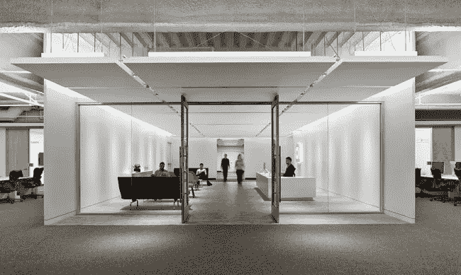

# Square 产品经理实习生项目简介

> 原文：<https://medium.com/square-corner-blog/a-brief-guide-to-squares-product-manager-intern-program-2992753c12c8?source=collection_archive---------1----------------------->

> 注意，我们已经行动了！如果您想继续了解 Square 的最新技术内容，请访问我们的新家[https://developer.squareup.com/blog](https://developer.squareup.com/blog)

Square Headquarters in San Francisco

两周前是我在 Square 做产品经理实习生的最后一天。夏天很快就过去了，我想分享一些想法，希望对其他希望进入产品管理领域的人有用。不久，我将回到凯洛格管理学院完成我的研究生学业，看到杰克·多西穿着他标志性的黑色衬衫和牛仔裤在走廊里漫步的记忆将开始褪色。

*快速免责声明:以下仅是我的观点，基于一个样本的大小，因此你的里程可能会有所不同。现在向前！*

# 基础# 1:PM 实习

此前，Square 专注于软件工程实习。但今年，他们首次提供产品经理实习机会。我们一共被雇佣了四个人，三个在旧金山市中心的 Square 总部，第四个在纽约。一个来自麻省理工学院斯隆管理学院，另一个来自达特茅斯塔克商学院，第三个来自沃顿商学院，而我来自凯洛格商学院。虽然我们中的一些人过去有科技或金融方面的经验，但**我们中有四分之三的人以前没有做过产品经理。所以不要让这阻止你申请。**

# 基础知识#2:面试过程

面试过程简单明了，与其他高科技公司相似。它包括一个电话屏幕，然后是与现任 PM 和工程经理的对话。到那时，你会被考虑参加由两到三次现场面试组成的现场面试。我通读了刘易斯·林的书*解码&征服*，这本书很有帮助，但总的来说，希望问题基于分析性思维、产品策略和技术能力问题。Square 重视文化契合度，所以不要害怕以自己的身份来分享你所热爱的东西。**实践*:目前，Square 免费提供其磁条阅读器。提供免费阅读器和收费阅读器的区别是什么？**

*(*注意:不是真题)*

# 基础知识#3:选择项目

在我的第一周，我的经理与我分享了一份入职指南，概述了我可能会考虑参与的几个不同项目。有各种不同规模和范围的项目，每个项目都有不同程度的业务影响。我在这里的主要建议是**找到至少一个你可以全力以赴管理的实质性项目。这不仅会让你更好地了解经前综合症需要什么，而且开始和完成一些实质性的事情会更令人满意。确定它的范围，这样你就可以在截止日期前完成它，并且不要忘记在最后留出时间来分析和分享结果。**

# 基础知识#4:实习生的生活(工作之外)

作为 PM 实习生的第一届，我和我的同事不太确定会期待什么(*除了美味的免费食物*，但我们受到了每个人的热烈欢迎。早期，一位高级项目经理设立了一个导师项目，让我们有机会与全公司的项目经理聊天。你可以想象，它们非常有价值。我们还欣赏了由 Caviar Gokul Rajaram 的活跃负责人主持的月度产品 All-Hands，并邀请了全公司的演讲嘉宾。我们还与首席执行官杰克·多西和同样出色的首席财务官萨拉·弗莱尔举行了特别问答会。每隔一周的周五下午是 Town Square，这是一个全公司范围的全员大会，不同的团队将展示他们一直在做的工作，Squares 可以就任何数量的公司问题向 Jack live 提问。**提示:作为实习生(*或全职员工！*)，外挂到贵公司并参加。你会遇到很棒的人，感觉更接近公司和它的使命。**

# 基础#5:强势收尾

快进到你的夏天结束。至此，您已经分析了产品使用情况，编写了一些产品需求文档(prd ),在发布当天遇到了您在测试时没有看到的错误，并且通过您纯粹的坚持(以及无数其他人的帮助),您已经发布了您的新功能。现在是时候记录结果并对人们进行跟进了。

在 Square，我们以透明度为荣，我们有一个公司范围的电子邮件别名，员工可以通过它发送任何新产品公告或功能变化的消息。你的新功能是否自动化了一些现有的流程，改善了商户体验，或者加快了入驻流程？写下来，定量描述改进。

最后，因为任何功能的发布都离不开很多人的帮助，所以要感谢那些与你一起工作的人——不管是在喝咖啡聊天时给你建议的人，还是你的主要工程合作伙伴是你产品发布的真正原因，一定要感谢他们花时间帮助你。除了这样做是正确的以外，硅谷是一个非常小的地方，你的声誉很重要。

# 结语:为了正确的理由成为首相

任何探索产品管理的人可能都听过这样一句话:“项目经理是他们产品的迷你 CEO。”这在理论上听起来很棒，我也曾经相信这一点。现在，作为一名首相，我认为这个比喻会因为错误的原因吸引人们。CEO ( *mini 或其他*)这个头衔意味着权力、权威和远见。事实是，作为项目经理，你的权力很小，权力有限，尽管产品愿景很重要，但除非你能坚持不懈地执行，否则它没有多大意义。所以在你申请之前，确保你是出于正确的原因。

也就是说，没有什么比看到你的团队构建的功能在产品中上线更令人满意的了。我很高兴有这个机会，并感谢 Square 启动了希望成为一个强大的 PM 实习生项目。在 Square 构建新产品确实是一次令人兴奋、身临其境、亲身体验的经历，我期待看到明年的 PM 实习生团队将会取得什么样的成就！