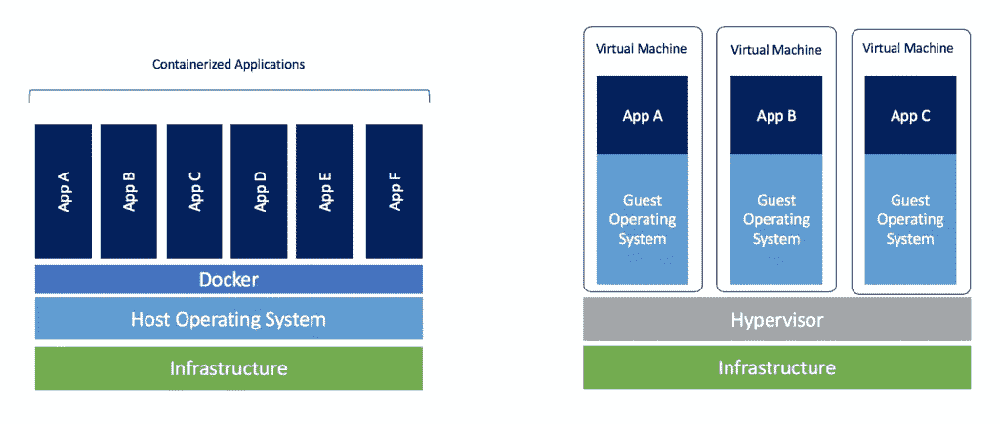
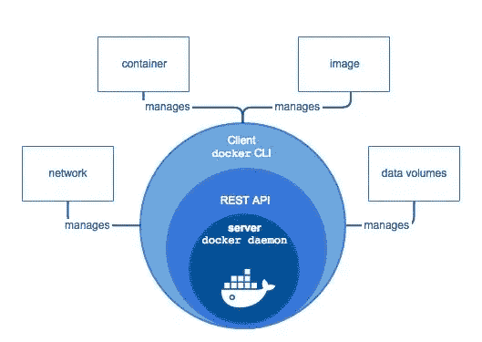
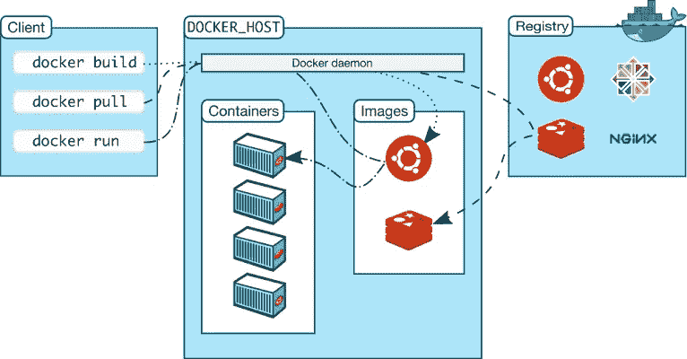

# 关于 Docker 的简要信息

> 原文：<https://medium.com/quick-code/a-brief-information-about-docker-3b34446590cd?source=collection_archive---------7----------------------->

如果你在软件相关领域工作💻最近，你可能听说过码头工人 T2。有了 Docker，你可以在 Linux、Windows 和 MacOSX 上运行 Linux 和 Windows 虚拟容器(机器)。有了这个平台，您可以轻松地安装、测试和部署 web 系统。也许最重要的特性是“它在我的电脑上工作，为什么在服务器上不工作？”正在解决问题。

在这篇文章中，我将分四个部分解释 Docker。

*   Docker 是什么？
*   码头工人的主要部件
*   安装 Docker
*   Docker 命令

Photo by [chuttersnap](https://unsplash.com/@chuttersnap?utm_source=medium&utm_medium=referral) on [Unsplash](https://unsplash.com?utm_source=medium&utm_medium=referral)

# Docker 是什么？

[Docker](https://www.docker.com/) 是一个为软件开发人员和系统开发人员开发的开源虚拟化平台。Docker 提供了一个在任何地方构建、打包和运行应用程序的便利环境。

很高兴听到“任何地方”，对吗？😄

Photo by [Guillaume Bolduc](https://unsplash.com/@guibolduc?utm_source=medium&utm_medium=referral) on [Unsplash](https://unsplash.com?utm_source=medium&utm_medium=referral)

但是，Docker 是怎么做到的呢？😲

*   当然是用集装箱。

Docker 为您的应用程序使用容器，所以您不需要担心您正在工作的环境。

Containers vs Virtual Machines on Docker.com

与服务器和虚拟机的虚拟化不同，容器不集成操作系统，它直接与部署它的服务器的操作系统通信。

# 码头工人的主要部件

Docker 引擎是一个基于客户端-服务器的应用程序，有几个主要组件。这些组件如下所列:

Docker Engine on Docker.com

*   **服务器**是一个守护进程(Docker 守护进程，即`dockerd`命令)，负责创建和管理 Docker 映像、容器、网络和卷。
*   REST API 提供了应用程序和服务器之间的通信，并指示它完成工作。
*   **客户端**是一个命令行界面(CLI)，允许用户使用命令与 Docker 交互。

Docker Architecture on Docker.com

我在*Docker.com*上找到了关于 Docker 架构的解释。我直接复制粘贴在下面了，因为是这么好的解释。你可以阅读下面的解释，也可以点击了解更多信息。

[Docker 采用客户端-服务器架构。Docker *客户端*与 Docker *守护进程*对话，守护进程负责构建、运行和分发 Docker 容器。Docker 客户端和守护进程*可以*在同一个系统上运行，或者您可以将 Docker 客户端连接到远程 Docker 守护进程。Docker 客户机和守护程序使用 REST API 通过 UNIX 套接字或网络接口进行通信。](https://docs.docker.com/engine/docker-overview/)”

# 安装 Docker

在我们开始使用 Docker 之前，我们必须在我们的机器上安装它。😎为此，您可以单击下面与您的操作系统相关的链接。

*   [用于 MacOS](https://docs.docker.com/docker-for-mac/install/)
*   [对于 Windows](https://docs.docker.com/docker-for-windows/install/)
*   [用于百分位](https://docs.docker.com/install/linux/docker-ce/centos/)
*   [对于 Debian](https://docs.docker.com/install/linux/docker-ce/debian/)
*   [适合 Fedora](https://docs.docker.com/install/linux/docker-ce/fedora/)
*   [为 Ubuntu](https://docs.docker.com/install/linux/docker-ce/ubuntu/)

安装完成后，你可以使用 Docker 做任何你想做的事情。**毫不留情**😡。

# Docker 命令

在这个阶段，我将简要描述 Docker 的基本命令🐑。我没有给出这些命令的任何快照。您可以在许多网站上找到这些命令的详细描述。

Photo by [Mael BALLAND](https://unsplash.com/@mael_bld?utm_source=medium&utm_medium=referral) on [Unsplash](https://unsplash.com?utm_source=medium&utm_medium=referral)

*   我们可以创建一个新的容器。
*   `docker ps`:这个命令允许我们列出 Docker 主机上所有正在运行的容器。
*   `docker start`:我们可以启动任何停止的集装箱。
*   `docker stop`:我们可以像`docker start`命令一样，用前几个独特的字符停止任何已启动的容器。
*   `docker run`:该命令是`docker create`和`docker start`命令的组合。它创建一个容器，然后启动该容器。
*   `docker rm`:如果我们想删除一个容器，我们可以使用它。
*   `docker images`:该命令列出了 Docker 主机上显示的所有图像。
*   `docker rmi`:我们可以用这个命令删除一个图像。

你可以点击这个[链接](https://docs.docker.com/engine/reference/commandline/docker/)来获得更多关于 Docker 命令的信息。

# **结论**

如果你想在任何地方运行你的应用程序而不考虑你的工作环境，你应该给 Docker 一个机会。

本文包含每个开发人员都应该知道的关于 Docker 的简要信息。然后，我将解释如何对 Spring Boot 应用程序进行 dockerize。😃

# 资源

*   [https://docs.docker.com/engine/docker-overview/](https://docs.docker.com/engine/docker-overview/)

# 感谢您的阅读！🙏你的想法对我很有价值。请随意分享。😄