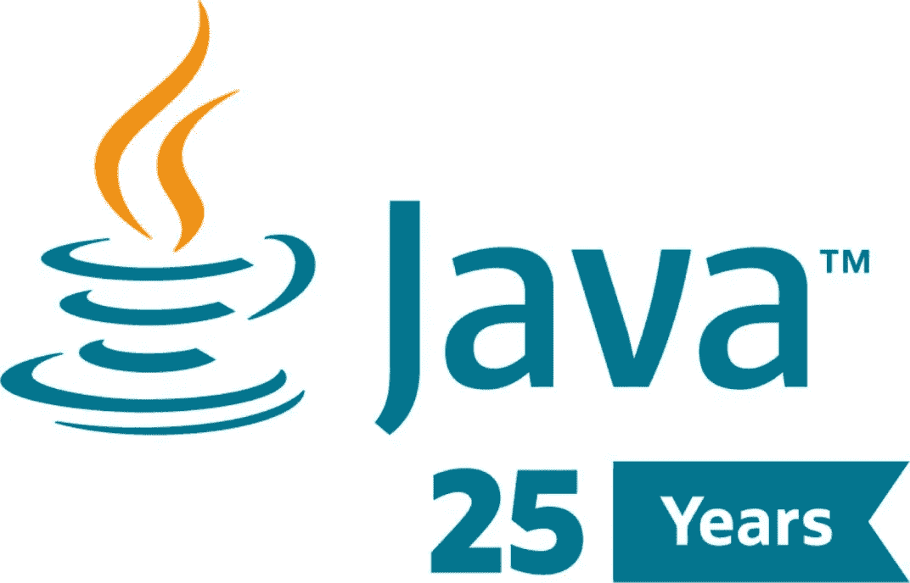
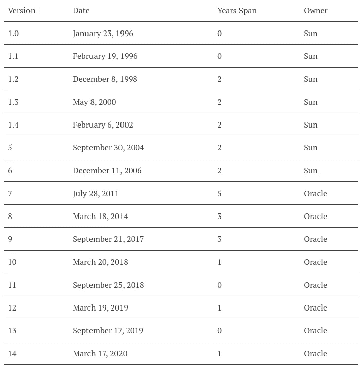
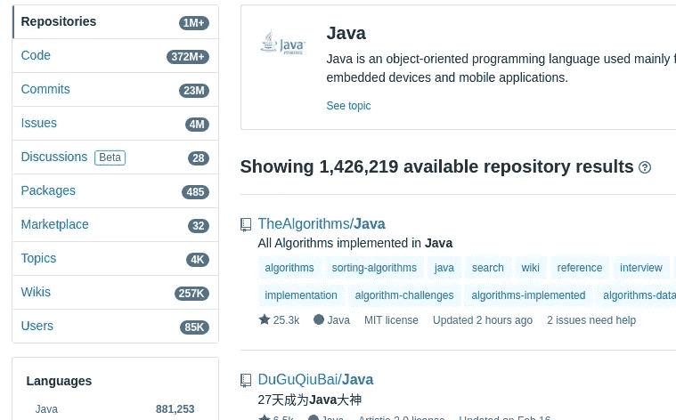
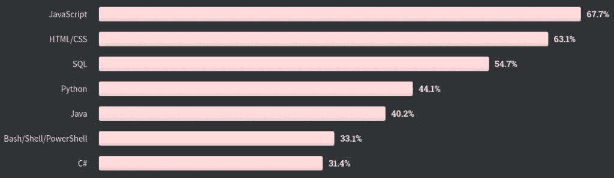
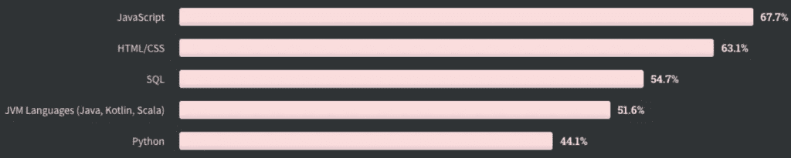

# Java 和 JVM 的光明未来

> 原文：<https://medium.com/globant/a-bright-future-for-java-and-the-jvm-3e7a59584491?source=collection_archive---------0----------------------->

Java 已经有 25 年的历史了，从嵌入式语言到像电视这样的数字设备，再到支持全球大公司的业务核心，它的成就令人印象深刻。

Java 25 years

Java 在技术行业引起了很多复杂的感觉，从学习它有多“难”到高吞吐量系统中的一些性能限制。

在这篇文章中，我将向你展示 Java 的过去、现在和未来，以及为什么 Java 将在未来几十年保持相关性，并试图回答以下问题:

*   Java 对新环境的改变和改进是否缓慢？
*   甲骨文 10 年前收购 Java 后对 Java 有影响吗？Java 生态圈被甲骨文商标封闭了吗？
*   Java 对于高吞吐量和高要求的业务有好的表现吗？

让我们开始吧。

# Java 比以往发展得更快

在科技行业，快速发展非常重要。每天都有新的问题和解决方案出现，如果你的语言/框架发展不快，就会被取代。

在撰写本文时，Java 有 14 个版本，发布如下:

*JVM history*

如你所见，Java 从最初的 6 个版本发展得相当快，每两年发布一个新版本，那时 Sun Microsystems 是它的所有者。但是从第 6 版到第 7 版，用了 5 年时间(对于科技行业来说是很多时间)。

在这两个版本之间，发生了重大(和令人关注的)事件:

*   2006 年，Sun Microsystems 开源了 Java 虚拟机(JVM)规范，创建了 OpenJDK 社区，这是 JVM 的一个免费实现。这向世界开放了 Java，为全世界的开源项目和开发者创造了一个完整的生态系统。(这个我们后面会详细讨论)。
*   2009 年，Oracle 收购了 Sun Microsystems，这引起了技术行业对 Java 未来的许多担忧，这减缓了 Java 的发展。一些开发者认为 Oracle 会对 Java 的使用收费，这将永远扼杀 Java。

Oracle 发布 Java 比较慢，每 3 年一次，从第 7 版到第 9 版。然而，第八版和第九版改变了游戏规则。在 Java 8 的例子中，它包括了业界认为 Java 永远不会有的东西，比如函数接口、Lambda 表达式、流和一个新的 Java 时间 API。

此外，Java 9 带来了 Java 模块，允许用户轻松地在 JDK 中插入和播放新功能。例如，OpenJDK 团队创建了预览功能，因此开发人员可以在 JDK 中默认包含这些功能之前，在真实环境中使用它们并给出反馈。模块推动 Java 比以前发展得更快。

在 Java 9 之后，您会看到 Java 发展得有多快，发布周期为 6 个月，增加了新的特性、预览和核心改进。Java 9 打开了新版本节奏策略的大门，允许社区提出新的 JDK 特性，使用 JEP (JDK 增强提案)过程，创建一个每天都在发展的创新生态系统。

现在，它不仅是关于 Java 的新特性和演变，它也是关于一个技术生态系统的 25 年，正如我们讨论的那样。

# 大型 Java 生态系统

甲骨文拥有 Java 商标，然而，围绕 Java 的生态系统是巨大的，正如一些 Github 统计数据所示:

*Java Ecosystem*

世界各地成千上万的开发人员创建了成千上万的存储库、提交和发布，他们的工作集中在几个领域，从数据科学和大数据到高吞吐量应用程序。开发人员表明，Java 对于解决任何问题都是有用的，无论是上下文、性能要求还是业务复杂性。

此外,《2020 年堆栈溢出 survey⁴》讲述了全球开发人员最常用的技术，展示了 Java 本身是如何成为最常用的技术之一:

*Stack Overflow survey*

如你所见，Java 是世界上第四流行的语言，然而，这里有一个技巧，JVM languages⁵呢？让我们对它们进行总结:

*JVM Stack Overflow survey*

Java 和 JVM 的影响不仅仅是作为一种语言，也是作为新语言的推动者。

开发者用 Java，公司呢？嗯，世界各地的公司都信任 JVM 的关键系统，比如 Twitter，它已经将平台的一部分转移到 Java，表明使用 JDK⁶.创建高可伸缩性和高性能的系统是可能的 Twitter 每天有 1.26 亿 users⁷.

此外，另一家大量使用 Java 的公司网飞使用 Java，从运行时容器、库和服务，到自动化的可扩展多媒体摄取和编码，所有这些都面向在云环境和微服务 architecture⁸.上工作

这不仅是大公司如何使用 Java，也是他们如何合作来改进 Java 及其生态系统。例如，Twitter，因为他们非常依赖 Java，他们开始通过 OpenJDK 进行合作。

此外，网飞开源发布了基于 Java 的云计算和微服务架构的核心框架，包括:Hystrix、Eureka、Ribbon 和 Archaius。那些后来被收录在《春云伞》里。

此外，令世界惊讶的是，微软宣布他们也将开始在 OpenJDK 上合作，此外，为 Azure 创建工具来运行 Java 云原生应用程序，并向 Java toolset⁹.添加 Java 微软可视代码

此外，微软收购 Github.com 是为了从核心上支持开源行业，你猜怎么着？Java 源代码将从 OpenJDK 仓库转移到 Github.com⁰，Java 和微软的关系将更加持久。

公司和开发者，加上开源，是创造一个美丽生态系统的完美组合。现在，生态系统接下来会给我们带来哪些功能？让我们来看一些关于性能和高吞吐量要求的改变游戏规则的因素。

# 高通量系统的性能

“Java 很慢”，“Java 不适用于高吞吐量系统”，“我无法在云 Lambda 基础架构中使用 Java，启动太慢”。这些只是这些年来我们听到的对 Java 的一些批评。有些不完全正确，像 Twitter 和网飞这样的公司比我更能说明问题，但是，当然，你总能找到改进的空间，Java 就是这样。

让我们来谈谈 Java 性能的两个游戏改变者，Project Loom 和 Graal。

## 项目织机

对于 Java 应用程序来说，可伸缩性和对线程等资源的良好利用是一个众所周知的问题。

Java 中的线程是一个执行对象，它们允许你的程序以并发的方式处理请求，所以，一个应用程序有多少线程，它就能处理多少并发任务。

当您使用 Java 启动一个 web 项目时，您通常会选择一个 web 服务器来部署该项目，例如，Tomcat 就是一个非常著名的服务器。默认情况下，Tomcat 启动一个最多 200 个线程的线程池，这意味着您的应用程序在理想情况下每秒能够处理 200 个请求。对于一般的业务应用程序来说，这已经足够了。

但是，如果我的业务应用程序需要每秒处理 10000 个请求，该怎么办呢？我们只是把线程池从 200 个增加到 10000 个，对吗？可悲的是，在 Java 中，这并不像听起来那么简单。

Java 将每个线程对象包装成底层操作系统上的一个实际线程，操作系统可以创建的实际线程是有限的，这意味着 Java 应用程序不能增长超过固定数量的线程。

考虑到这个问题，Java 社区找到了一种用很少的线程处理大量并发请求的方法。这些是“反应式”库。

反应式库基于这样的想法，即如果线程不阻塞，很少的线程可以处理大量的并发请求，例如，当调用数据库、访问文件系统或执行 HTTP 请求时。如果它们不阻塞，它们可以被反复重用。

但是，这种方法带来了后果:

*   程序模型从命令式编程转变为函数式编程。从一开始，Java 就是一种命令式(“枯燥”)语言，因此，改变编程模型会对语言和开发人员产生影响。
*   Java 的可观察性特性减少了，因为调试和跟踪反应式模型比命令式模型更难。我们需要添加更多的东西来让 Java 在这个模型上工作，同时不丢失错误观察和检测。
*   Java 生态系统天生使用阻塞，这意味着您需要使生态系统适应新的模型。过去几年，Java 生态系统增加了反应库的数量，但是 25 年的阻塞库不能在 5 年内重建，所以，你需要在你的非阻塞反应应用中与阻塞库共存。

Spring Webflux、Project Reactor、Eclipse Vert.x 和 Akka 是反应式框架的一些例子，此外，围绕它们的生态系统，如反应式数据库驱动程序和网络。

你可能会想:“这听起来不错，但是，织机项目呢？”

嗯，Project Loom“旨在大幅减少编写、维护和观察高吞吐量并发应用程序的工作，充分利用可用的硬件”，其中一项就是如何提高 Java 线程在高吞吐量并发应用程序中的性能。

在写这篇文章的时候，Project Loom 定义了虚拟线程的概念，其中:“虚拟线程只是线程，但是**创建和阻塞它们是廉价的**。它们由 Java 运行时管理，与现有的平台线程不同，它们不是操作系统线程的一对一包装器，而是在 JDK 的用户空间中实现的”。

似乎又对了，那又怎样？这里的关键是“创建和阻塞它们是廉价的”，也就是说，你不仅可以创建数千个线程，而且可以创建数百万个线程，所以创建和阻塞它们是廉价的。

这就引出了一些问题:

*   你能想象当你设计一个系统的时候，把线程从表格中去掉吗？你会有数百万个。
*   如果可以创建很多线程，还会再费心去用反应式库吗？
*   反应式框架将如何利用这个机会？任何变化都会带来机遇，我希望看到反应式库如何适应这种新的环境。
*   我们会再次为了命令式而放弃 Java 函数式编程吗？当然，命令式编程比函数式编程容易，但是我们应该放弃函数式吗？

我不知道这些问题的答案，但是，我对这些机会感到兴奋。

## 格拉尔·⁴

Java 从一开始就被设计成可以在不同的计算机体系结构和操作系统上互操作，这意味着“编写一次，在任何地方运行”。为了实现互操作性，Java 代码被编译成字节码，这是 Java 和二进制可执行⁵.之间的一个中间步骤

当您在 JVM 中部署 Java 应用程序时，会发生从字节码到二进制可执行文件的第二次转换，从而允许应用程序在底层机器上运行。这个过程是由实时编译器(JIT) ⁶.完成的

然而，JIT 并没有最大限度地优化二进制可执行文件，相反，JIT 只是创建了足够的优化二进制文件来启动。

这意味着，当您启动一个 Java 程序时，该程序只使用足够优化的代码来执行。但这还不是全部，当我们开始使用应用程序时，JIT 会优化 Java 程序，这意味着，无论何时您在程序中调用或使用 Java 代码，作为一个客户端，JIT 都会学习并优化最常用的字节码，即热点，从而在 Java 程序运行时即时提高性能。

正在学习的编译器是一个很棒的概念，但是它有一个缺点:当你的 Java 应用程序停止时，JIT 优化就消失了，所以，JIT 需要重新学习一切。这是因为它在互操作性和性能之间建立了平衡。

如果一开始就想要整个优化的权力呢？如果您确切知道您的 Java 程序将在哪个底层平台上运行呢？Graal 使用这些假设来提高 Java 应用程序的性能。

GraalVM 允许您从 Java 代码跳转到二进制可执行文件，使用针对本机映像的提前编译器。与即时编译器相比，提前编译器直接将程序从 Java 代码编译成二进制可执行文件，这意味着您从一开始就拥有底层系统的全部能力。

你可能会想:“等等，你说过 Java 的主要目标是可互操作的，所以，要创建一个二进制可执行文件，你需要知道你的 Java 应用程序将在哪个底层系统上运行，这可不好”。你是对的，但是，我们现在处于 Docker 这样的容器世界中，所以，当你在 Docker 映像上部署 Java 应用程序时，你已经知道将使用哪个底层操作系统。

但是为什么这很重要呢？嗯，您将得到以下内容:

*   Java 运行速度更快，允许高吞吐量。由于 Java 应用程序不需要编译热点，这些资源现在由程序本身使用，此外，二进制可执行文件完全是本机的，因此它使用了底层操作系统的全部能力。
*   Java 启动速度更快，第一次启动时可以快速提升。如果您的 Java 程序在无服务器的基础设施中，这是非常有用的。
*   更少的内存占用。你不再需要追踪热点，所以那些资源被释放了。

Graal 为 Java 生态系统增加了一整套机会，我希望看到这些机会。

# 最后的想法:Java 开发者，骄傲吧

Java 已死，Java 万岁。今天，Java 比以往任何时候都更加重要，发展速度更快，考虑到用户的需求而不断发展，并得到了大型开源社区的支持，其中包括 Twitter、网飞和微软等大型组织。

Java 就在这里，并且会停留很长一段时间，享受这一刻，为今天成为 Java 开发者而骄傲。

# 参考

1.  [https://blogs . Oracle . com/Java-platform-group/update-and-FAQ-on-the-Java-se-release-cadence](https://blogs.oracle.com/java-platform-group/update-and-faq-on-the-java-se-release-cadence)
2.  [https://github.com/search?q=java&类型=储存库](https://github.com/search?q=java&type=Repositories)
3.  [https://blogs . Oracle . com/Java magazine/the-top-25-great-Java-apps-ever-written](https://blogs.oracle.com/javamagazine/the-top-25-greatest-java-apps-ever-written)
4.  [https://insights . stack overflow . com/survey/2020 #技术-编程-脚本-标记语言](https://insights.stackoverflow.com/survey/2020#technology-programming-scripting-and-markup-languages)
5.  [https://Twitter . com/Bruno Borges/status/1266063739574382592/photo/1](https://twitter.com/brunoborges/status/1266063739574382592/photo/1)
6.  [https://go.java/twitter.html](https://go.java/twitter.html)
7.  [https://www . vox . com/2019/2/7/18215204/Twitter-daily-active-users-dau-snapchat-Q4-earnings](https://www.vox.com/2019/2/7/18215204/twitter-daily-active-users-dau-snapchat-q4-earnings)
8.  [https://netflix.github.io/](https://netflix.github.io/)
9.  [https://dev blogs . Microsoft . com/Java/Java-at-Microsoft-from-open JDK-to-azure-spring-cloud/](https://devblogs.microsoft.com/java/java-at-microsoft-from-openjdk-to-azure-spring-cloud/)
10.  [https://openjdk.java.net/jeps/369](https://openjdk.java.net/jeps/369)
11.  [https://wiki.openjdk.java.net/display/loom/Main](https://wiki.openjdk.java.net/display/loom/Main)
12.  [https://Tomcat . Apache . org/Tomcat-7.0-doc/config/executor . html](https://tomcat.apache.org/tomcat-7.0-doc/config/executor.html)
13.  [http://Cr . open JDK . Java . net/~ rpressler/loom/loom/sol 1 _ part 1 . html](http://cr.openjdk.java.net/~rpressler/loom/loom/sol1_part1.html)
14.  [https://www.graalvm.org/](https://www.graalvm.org/)
15.  [https://www.infoq.com/news/2020/05/java-leyden/](https://www.infoq.com/news/2020/05/java-leyden/)
16.  [https://www . IBM . com/support/knowledge center/es/ssy ke 2 _ 8 . 0 . 0/com . IBM . Java . VM . 80 . doc/docs/JIT _ overview . html](https://www.ibm.com/support/knowledgecenter/es/SSYKE2_8.0.0/com.ibm.java.vm.80.doc/docs/jit_overview.html)