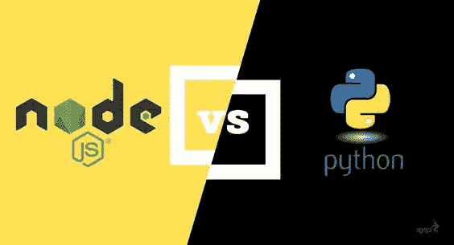

# Python vs Node JS 的选择难题

> 原文：<https://medium.com/walmartglobaltech/a-choice-conundrum-python-vs-node-js-283dc3e11ba0?source=collection_archive---------1----------------------->

[source](https://in.pinterest.com/pin/303570831124841377/)

作为开发人员，我们不仅需要让自己跟上最新的技术；但是也必须让我们自己了解任何技术的三个“W ”(我刚刚想到的)。

> 这里的三个 w 指的是:
> 
> 为什么——我们应该使用它吗？
> 
> 什么时候——我们应该使用它？
> 
> 谁应该使用它？

因此，在这里，我将介绍两种最常用的后端技术，Python(我最近认识的)和 Node JS(我的老朋友)。

# 概述:

Python 是在 1991 年引入的，而 Node JS(本文的对比)是在 2009 年作为 JavaScript 运行时环境引入的。

在 2018 年和 2019 年，Python 被宣布为头号后端语言([源](https://spectrum.ieee.org/the-2018-top-programming-languages))，根据 [Stack Overflow 2019](https://insights.stackoverflow.com/survey/2019#technology-_-most-loved-dreaded-and-wanted-languages) 调查，Python 是第二大最受“喜爱”的编程语言。

另一方面，Node JS 被认为是几乎所有按受欢迎程度排名的网站类别中使用最多的工具。在同一个 [Stack Overflow 2019](https://insights.stackoverflow.com/survey/2019#technology-_-other-frameworks-libraries-and-tools) 调查中，Node JS 是职业程序员最喜欢的工具。

# 可扩展性:

对于任何应用程序，可伸缩性都是需要考虑的最重要的方面之一。

基于全局解释器锁构建的 Python 是顺序的，它不允许同时操作多个线程，这是伸缩性方面的一个主要缺点。

而 Node JS，假设它可以解决我们所有的可伸缩性问题，因为它可以以高吞吐量处理大量的并发连接。

现在你可能会问，它是怎么做到的？

让我告诉你，你知道这个问题的答案。在所有关于 Node JS 的文章中我们都读过多次。它使用非阻塞、事件驱动的 I/O 作为其机制。而不是每个连接产生一个新线程的传统方法；Node JS 在单线程上运行，使用非阻塞 I/O 调用，这允许它服务于数千个并发请求。它可以服务超过 [1M 的并发连接](http://blog.caustik.com/2012/08/19/node-js-w1m-concurrent-connections/)

> Node.js 是为构建具有许多节点的分布式应用程序而设计的。这就是它被命名为 Node.js 的原因。可伸缩性已经融入了平台，而不是您在应用程序生命周期的后期才开始考虑的东西。
> 
> —陈卿(@amazingandyyyer)

# 学习曲线和调试:

*   Python 最伟大的 USP 被认为是它易于书写和阅读的语法。这也便于代码的调试和维护。来自 JS 背景，我个人对语法的可读性感到惊讶。
*   JavaScript 代码往往更长、分支更多，这让我想起了我们大多数人都会面临的一个问题——回调地狱。这确实使 Node JS 中的调试有点乏味

# 速度和性能:

我们已经讨论了 Node JS 的非阻塞架构，这使得它的执行过程更加简单和快速。有了 Node.js，JavaScript 不再仅限于 web 浏览器。Node.js 是一个运行时环境，这意味着——它允许 JavaScript 在 web 浏览器之外的任何平台上运行。

通过这种方式，在网络浏览器上运行的应用程序处理速度更快，因此在效率指标上表现更好。这也使应用程序能够利用 TCP 套接字等功能，否则这些功能在浏览器中是不可用的。

与 Node JS 相比，Python 确实落后了。Python 有内置功能，允许我们构建并发程序并并行运行它们，这基本上是多线程和多处理。但是，Python 的基础，即 GIL(全局解释器锁)阻止多个线程访问同一个 Python 对象。假设，如果一个代码片段创建了两个线程，并且它们应该在多线程系统上并行运行；一次只有一个线程可以持有 GIL，并且只有在释放它(GIL)后，另一个线程才能使用它。这使得处理速度明显变慢。

点击阅读更多关于 Python 中的 GIL、多线程和多重处理的内容。

# 开发支持:

Python 的包集非常丰富，尤其是在 web 开发方面，Django 和 Flask 是最流行的框架。Python 配备了专用于数据分析(Panda)、图像处理(OpenCV)、数据可视化(matplotlib 或 NumPy)或机器学习(如 TensorFlow、Scikit-Learn 或 PyTorch)的库。在过去的几年里，随着 web 框架的蓬勃发展，

谈到社区支持和库的范围，Node.js 一点也不落后于 Python。节点包管理器是最丰富的软件库之一。2019 年 6 月，NPM 的可用套餐数量达到了 100 万个！

# 使用案例:

我们已经讨论了 Node JS 的架构，以及它如何一次处理多个并发请求，它最适合需要实时数据传输的应用程序，如聊天机器人、在线游戏、视频会议等。由于其事件驱动的 I/O 机制，客户端可以发出几个请求来获取所需的数据，因此它也是最适合 spa 的。

但是，节点 JS 不应用于 CPU 密集型或需要大量计算的应用程序，因为节点 JS 的 USP(即事件驱动的非阻塞 I/O)将会失效。

这就是 Python 最适合的地方。Python 可以处理繁重的计算，因此 Python 广泛应用的最有趣的领域是人工智能、机器学习、游戏开发等等。

# 结论:

Python Vs Node Js 是一场艰难而棘手的战斗，但是处理这种情况的理想方法是理解应用程序和最终用户的需求。